# コンテキスト内宛先アラートを購読

[!DNL Adobe Experience Platform]では、[!DNL Adobe Experience Platform]件のアクティビティに関するイベントベースのアラートを購読できます。 アラートにより、[[!DNL Observability Insights] API](../../observability/api/overview.md)をポーリングして、ジョブが完了したか、ワークフロー内の特定のマイルストーンに達したか、エラーが発生したかどうかを確認する必要がなくなります。

データフローを作成する際にアラートを購読すると、フロー実行のステータス、成功、失敗に関するアラートメッセージを受け取ることができます。

このドキュメントでは、宛先データフローのアラートメッセージを購読する手順を説明します。

## はじめに {#getting-started}

このドキュメントでは、[!DNL Adobe Experience Platform]の次のコンポーネントに関する実務的な理解が必要です。

* [宛先](../home.md)：宛先プラットフォームとの事前定義済みの統合により、[!DNL Adobe Experience Platform]からのデータをシームレスにアクティベートできます。 宛先を使用して、クロスチャネルマーケティングキャンペーン、メールキャンペーン、ターゲット広告、その他多くの使用事例に関する既知および不明なデータをアクティブ化できます。
* [ オブザーバビリティ ](../../observability/home.md): [!DNL Observability Insights]を使用すると、統計指標とイベント通知を使用してExperience Platform アクティビティを監視できます。
   * [ アラート ](../../observability/alerts/overview.md): Experience Platformの操作で特定の条件に達した場合（システムのしきい値に達した場合に発生する可能性がある問題など）、Experience Platformは、それらを購読した組織内のユーザーに対してアラートメッセージを配信できます。

## UI でのアラートの登録 {#subscribe-destination-alerts}

>[!CONTEXTUALHELP]
>id="platform_destination_alerts_subscribe"
>title="宛先アラートの登録"
>abstract="アラートを使用すると、宛先データフローのステータスに基づいて、通知を受け取ることができます。アラート通知を設定すると、データフローが開始された場合、成功した場合、失敗した場合、宛先にデータが送信されなかった場合に、更新情報をを受け取ることができます。"
>text="Learn more in documentation"

>[!IMPORTANT]
>
>データフローのメールベースのアラート通知を受け取るには、Experience Platform アカウントのメールのインスタント通知を有効にする必要があります。

[!UICONTROL Configure new destination]宛先接続[ ワークフローの](connect-destination.md) ステップで、データフローのアラートを有効にできます。

宛先アラートセクションを示す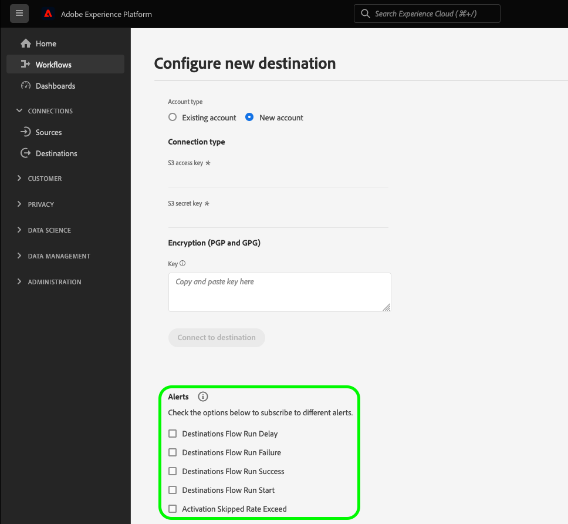

購読するアラートを選択し、**[!UICONTROL Next]**&#x200B;を選択してデータフローをレビューし、完了します。

宛先データフローで使用できるアラートについて、次の表で説明します。

* ストリーミング宛先の場合、[!DNL Activation Skipped Rate Exceeded] アラートのみが使用できます。
* ファイルベースの宛先の場合、すべてのアラートを使用できます。

| アラート | 説明 |
| --- | --- |
| 宛先フロー実行遅延 | このアラートは、宛先フローの実行がオーディエンスのアクティブ化に150分以上かかる場合に通知します。 |
| 宛先フロー実行の失敗 | このアラートは、オーディエンスを宛先に対してアクティブ化する際にエラーが発生したときに通知します。 |
| 宛先フロー実行の成功 | このアラートは、オーディエンスが宛先に対して正常にアクティブ化されたときに通知します。 |
| 宛先フロー実行開始 | このアラートは、宛先フロー実行がオーディエンスのアクティブ化を開始したときに通知します。 |
| アクティベーション スキップ率が超過しました | このアラートは、アクティベーションのスキップ率がアクティベーション全体の1%を超えた場合に通知します。 IDに属性が欠落している場合や同意違反がある場合、アクティブ化中にIDがスキップされます。 |

{style="table-layout:auto"}

## アラートの受信 {#receiving-alerts}

宛先データフローを実行すると、UIまたは電子メールでアラートを受け取ることができます。

### UIでのアラートの受信 {#receiving-alerts-in-ui}

アラートは、UIのExperience Platform UIの上部ヘッダーに通知アイコンで表示されます。 通知アイコンを選択して、データフローに関する特定のアラートメッセージを表示します。

Experience Platformの通知アイコンを表示する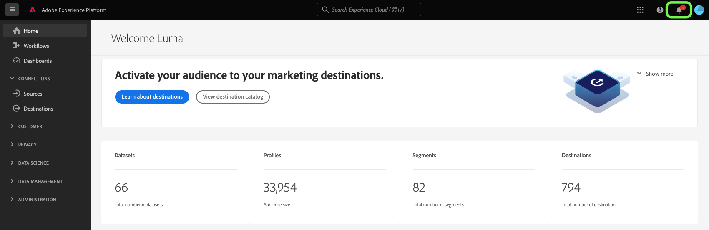

通知パネルが表示され、作成したデータフローのステータス更新のリストが表示されます。

通知パネルを表示する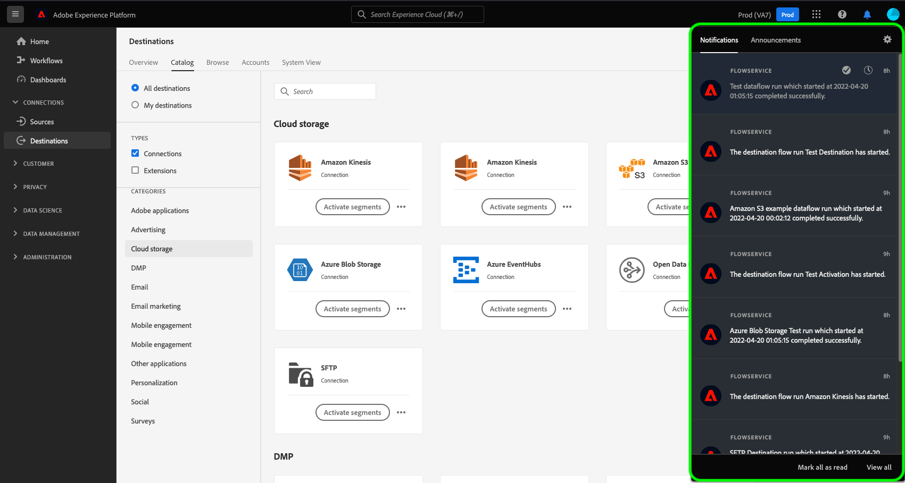

アラートメッセージにカーソルを合わせて読み取り済みとしてマークしたり、時計アイコンを選択して、データフローのステータスに今後のリマインダーを設定したりできます。

通知リマインダーオプションを表示する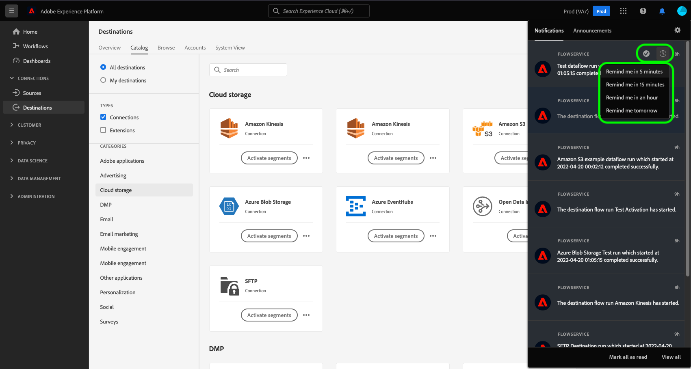

データフローに関する特定の情報を表示するには、アラートメッセージを選択します。

通知の選択方法を示す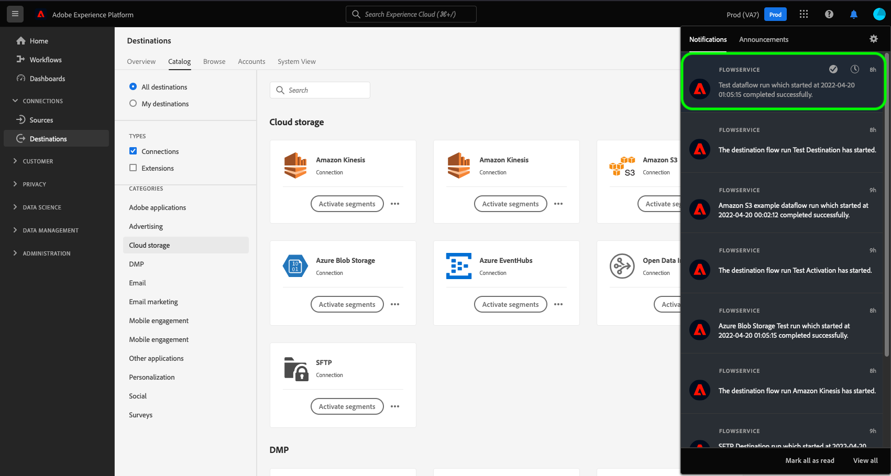

[!UICONTROL Dataflow run details] ページが表示されます。 画面の上半分には、データフローの属性、対応するデータフロー実行ID、高レベルのエラー概要など、データフローの概要が表示されます。

データフロー実行の詳細ページを示す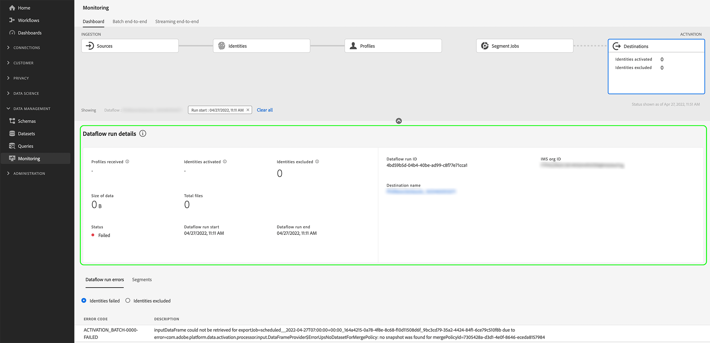

ページの下半分には、データフロー実行ステージ中に発生した[!UICONTROL Dataflow run errors]が表示されます。 ここから、エラー診断をプレビューするか、[[!DNL Data Access] API](https://www.adobe.io/experience-platform-apis/references/data-access/)を使用して、エラー診断またはデータフローに対応するファイルマニフェストをダウンロードできます。

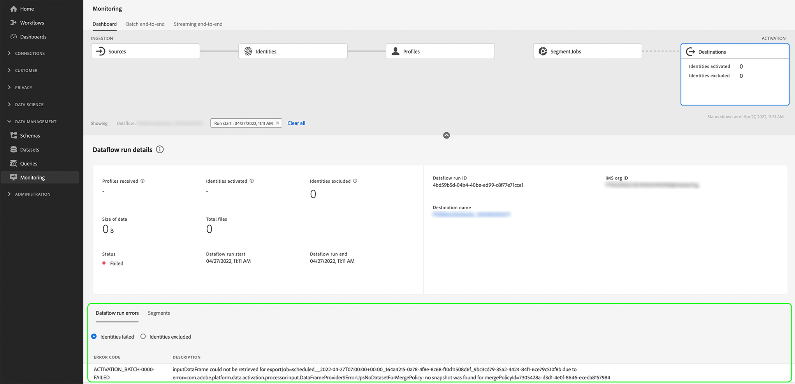

データフローエラーの処理について詳しくは、[UIでの宛先データフローの監視](../../dataflows/ui/monitor-destinations.md)に関するガイドを参照してください。

### 電子メールによるアラートの受信 {#receiving-alerts-by-email}

データフローのアラートも電子メールで配信されます。 メール本文でデータフロー名を選択すると、データフローに関する詳細情報が表示されます。

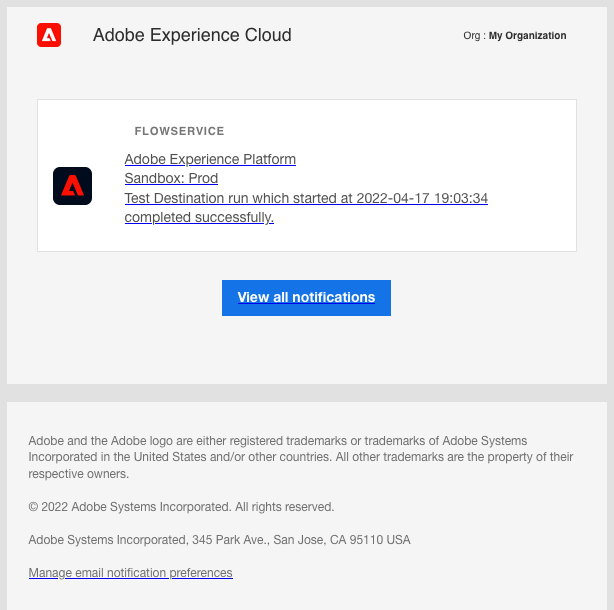

UI アラートと同様に、[!UICONTROL Dataflow run overview] ページが表示され、データフローに関連するエラーを調査するためのインターフェイスが提供されます。

## アラートの購読と登録解除 {#subscribe-and-unsubscribe}

宛先[!UICONTROL Browse] ページの既存の宛先データフローに対して、さらにアラートを購読するか、確立されたアラートから購読を解除できます。

宛先の参照ページを表示する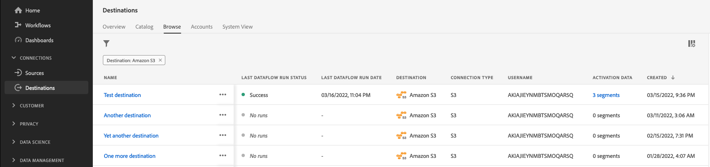

アラートを受け取る宛先接続を見つけ、省略記号（`...`）を選択して、オプションのドロップダウンメニューを表示します。 次に、**[!UICONTROL Subscribe to alerts]**&#x200B;を選択して、宛先データフローのアラート設定を変更します。

宛先オプションを示す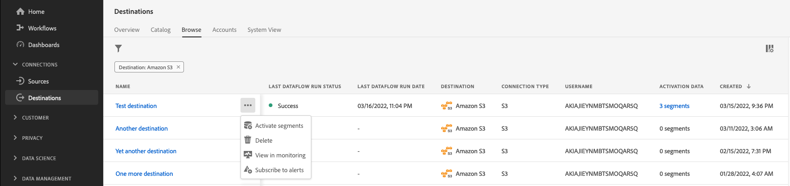

ポップアップウィンドウが表示され、宛先アラートのリストが表示されます。 購読するアラートを選択するか、購読解除するアラートを選択解除します。 終了したら「**[!UICONTROL Save]**」を選択します。

宛先アラートのサブスクリプション ページを表示する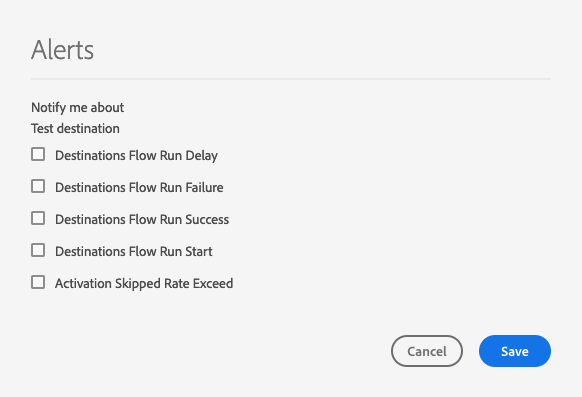

## 次の手順 {#next-steps}

このドキュメントでは、宛先データフローのインコンテキストアラートを購読する方法に関するステップバイステップガイドを提供しました。 詳しくは、[ アラート UI ガイド ](../../observability/alerts/ui.md)を参照してください。
