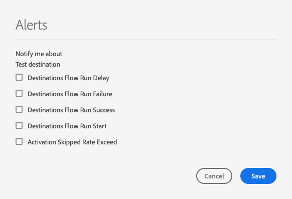

# コンテキスト内宛先アラートを購読

Adobe Experience Platform では、Adobe Experience Platform アクティビティに関するイベントベースのアラートを登録できます。 アラートにより、ジョブが完了したか、ワークフロー内の特定のマイルストーンに達したか、何らかのエラーが発生したかを確認するために、[[!DNL Observability Insights] API](../../observability/api/overview.md) をポーリングする必要が低減される、またはなくなります。

データフローを作成する際にアラートの配信を登録して、フロー実行のステータス、成功または失敗に関するアラートメッセージを受信できます。

このドキュメントでは、宛先データフローのアラートメッセージを受信する方法をサブスクライブする手順を説明します。

## はじめに

このドキュメントでは、Adobe Experience Platformの次のコンポーネントに関する十分な知識が必要です。

* [宛先](../home.md):Adobe Experience Platformからのデータのシームレスなアクティベーションを可能にする、宛先プラットフォームとの事前定義済みの統合。 宛先を使用して、クロスチャネルマーケティングキャンペーン、電子メールキャンペーン、ターゲット広告、その他多くの使用事例に関する既知および不明なデータをアクティブ化できます。
* [Observability では、統計的な指標とイベント通知を使用して Platform アクティビティを監視できます。](../../observability/home.md)[!DNL Observability Insights]
   * [アラート](../../observability/alerts/overview.md):Platform 操作で特定の条件セットに達すると（システムがしきい値に達した場合に問題が発生する可能性があるなど）、Platform は、組織内でその条件を購読したユーザーにアラートメッセージを配信できます。

## UI でアラートを購読 {#subscribe-destination-alerts}

>[!CONTEXTUALHELP]
>id="platform_destination_alerts_subscribe"
>title="宛先アラートの登録"
>abstract="アラートを使用すると、宛先データフローのステータスに基づいて、通知を受け取ることができます。アラート通知を設定すると、データフローが開始された場合、成功した場合、失敗した場合、宛先にデータが送信されなかった場合に、更新情報をを受け取ることができます。"
>text="Learn more in documentation"

>[!IMPORTANT]
>
>データフローの電子メールベースのアラート通知を受け取るには、Platform アカウント用の電子メールのインスタント通知を有効にする必要があります。

データフローに関するアラートは、 [!UICONTROL 新しい宛先の設定] 手順 [宛先接続](connect-destination.md) ワークフロー。

購読するアラートを選択し、「 」を選択します。 **[!UICONTROL 次へ]** をクリックし、データフローを確認して終了します。

宛先データフローで使用可能なアラートを、次の表で説明します。

* ストリーミング先の場合は、 [!DNL Activation Skipped Rate Exceeded] アラートを使用できます。
* ファイルベースの宛先の場合、すべてのアラートを使用できます。

| アラート | 説明 |
| --- | --- |
| 宛先フロー実行遅延 | このアラートは、宛先フローの実行がセグメントのアクティブ化に 150 分を超える時間がかかった場合に通知します。 |
| 宛先フロー実行の失敗 | このアラートは、宛先へのセグメントのアクティブ化中にエラーが発生した場合に通知します。 |
| 宛先フロー実行の成功 | このアラートは、宛先に対してセグメントが正常にアクティブ化されたことを通知します。 |
| 宛先フロー実行開始 | このアラートは、宛先フローの実行がセグメントのアクティブ化を開始した際に通知します。 |
| アクティベーションスキップ率を超えました | このアラートは、アクティベーションスキップ率が合計アクティベーション数の 1%を超えた場合に通知します。 属性がない場合や同意違反がある場合、ID はアクティベーション中にスキップされます。 |

## アラートの受信 {#receiving-alerts}

宛先のデータフローを実行すると、UI または電子メールを通じてアラートを受け取ることができます。

### UI でのアラートの受信 {#receiving-alerts-in-ui}

アラートは、UI 内で、Platform UI の上部のヘッダーに通知アイコンで表されます。 通知アイコンを選択して、データフローに関する特定のアラートメッセージを表示します。

通知パネルが表示され、作成したデータフローのステータス更新のリストが表示されます。

アラートメッセージにマウスポインターを置いて読み取りとマークしたり、時計アイコンを選択して、データフローのステータスに関する将来のリマインダーを設定したりできます。

アラートメッセージを選択して、データフローの特定の情報を表示します。

この [!UICONTROL データフロー実行の詳細] ページが表示されます。 画面の上半分には、属性に関する情報、対応するデータフロー実行 ID、エラー概要など、データフローの概要が表示されます。

ページの下半分には、 [!UICONTROL データフロー実行エラー] データフローの実行ステージで発生した問題を修正しました。 ここから、エラー診断をプレビューするか、 [[!DNL Data Access] API](https://www.adobe.io/experience-platform-apis/references/data-access/) ：データフローに対応するエラー診断またはファイルマニフェストをダウンロードする場合。

データフローエラーの処理について詳しくは、 [UI での宛先データフローの監視](../../dataflows/ui/monitor-destinations.md).

### E メールによるアラートの受信 {#receiving-alerts-by-email}

また、データフローのアラートは E メールで配信されます。 データフローの詳細を確認するには、E メールの本文でデータフロー名を選択します。

UI アラートと同様に、 [!UICONTROL データフロー実行の概要] ページが表示され、データフローに関連するエラーを調査するためのインターフェイスが提供されます。

## アラートを購読および購読解除 {#subscribe-and-unsubscribe}

宛先内の既存の宛先データフローに関して、さらにアラートをサブスクライブしたり、確立されたアラートから購読解除したりできます [!UICONTROL 参照] ページ。

アラートを受け取る宛先接続を見つけ、省略記号 (`...`) をクリックして、オプションのドロップダウンメニューを表示します。 次に、 **[!UICONTROL アラートを購読]** をクリックして、宛先データフローのアラート設定を変更します。

ポップアップウィンドウが開き、宛先アラートのリストが表示されます。 購読するアラートを選択するか、購読を解除するアラートの選択を解除します。 完了したら「**[!UICONTROL 保存]**」を選択します。

## 次の手順 {#next-steps}

このドキュメントでは、宛先データフローのコンテキスト内アラートをサブスクライブする方法に関する手順を説明しました。 詳しくは、 [alerts UI ガイド](../../observability/alerts/ui.md).
