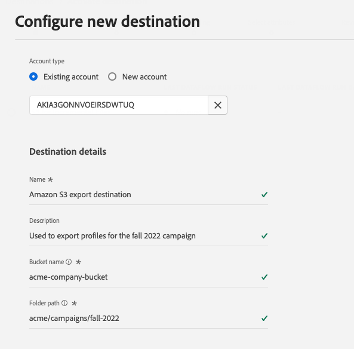

# 新しい宛先接続の作成

>[!IMPORTANT]
> 
>* 宛先に接続するには、 **[!UICONTROL 宛先の管理]** [アクセス制御権限](/help/access-control/home.md#permissions). 詳しくは、[アクセス制御の概要](/help/access-control/ui/overview.md)または製品管理者に問い合わせて、必要な権限を取得してください。
>* データセットの書き出しをサポートする宛先に接続するには、 **[!UICONTROL データセットの宛先の管理とアクティブ化]** [アクセス制御権限](/help/access-control/home.md#permissions). 詳しくは、[アクセス制御の概要](/help/access-control/ui/overview.md)または製品管理者に問い合わせて、必要な権限を取得してください。

## 概要 {#overview}

オーディエンスデータを宛先に送信する前に、宛先プラットフォームへの接続を設定する必要があります。 この記事では、新しい宛先接続を設定し、Adobe Experience Platformユーザーインターフェイスを使用してセグメントをアクティブ化したりデータセットを書き出したりする方法について説明します。

## カタログで目的の宛先を検索します。 {#setup}

1. に移動します。 **[!UICONTROL 接続]** > **[!UICONTROL 宛先]**&#x200B;をクリックし、 **[!UICONTROL カタログ]** タブをクリックします。

   

2. カタログ内の宛先カードには、宛先への既存の接続があるかどうか、および宛先がセグメントのアクティブ化、データセットの書き出し、またはその両方をサポートしているかどうかに応じて、異なるアクション制御が含まれる場合があります。 宛先カードには、次のいずれかのコントロールが表示されます。

   * **[!UICONTROL 設定]**. セグメントをアクティブ化したりデータセットを書き出したりする前に、まず接続をこの宛先に設定する必要があります。
   * **[!UICONTROL アクティブ化]**. この宛先への接続は既に設定されています。 この宛先は、セグメントのアクティベーションとデータセットの書き出しをサポートします。
   * **[!UICONTROL セグメントのアクティブ化]**. この宛先への接続は既に設定されています。 この宛先では、セグメントのアクティベーションのみがサポートされます。

   これらのコントロールの違いについて詳しくは、 [カタログ](../ui/destinations-workspace.md#catalog) の節を参照してください。

   次のいずれかを選択 **[!UICONTROL 設定]**, **[!UICONTROL 有効化]**&#x200B;または **[!UICONTROL セグメントのアクティブ化]**&#x200B;を使用できます。

   

   

3. 選択した場合 **[!UICONTROL 設定]**、次の手順 ( [認証](#authenticate) を宛先に追加します。

   選択した場合 **[!UICONTROL 有効化]**, **[!UICONTROL セグメントのアクティブ化]**&#x200B;または **[!UICONTROL データセットを書き出し]**&#x200B;に設定すると、既存の宛先接続のリストが表示されるようになります。

   選択 **[!UICONTROL 新しい宛先の設定]** をクリックして、宛先への新しい接続を確立します。

   

## 宛先に対する認証 {#authenticate}

宛先に接続する最初の手順は、宛先プラットフォームへの認証です。

接続先に応じて、認証する宛先パートナーのページに移動したり、Platform ワークフローで直接認証資格情報を入力するように求められたりする場合があります。 以下は、 [!DNL Amazon S3] 宛先。 必要な入力に関する詳細な手順は、各宛先ドキュメントページに記載されています ( 例えば、 [[!DNL Amazon S3]](/help/destinations/catalog/cloud-storage/amazon-s3.md#authenticate) および [[!DNL Facebook]](/help/destinations/catalog/social/facebook.md#authenticate)) をクリックします。

**[!DNL Amazon S3]必須およびオプションの認証パラメーター**

## 接続パラメータの設定 {#set-up-connection-parameters}

宛先への認証を既に設定している場合は、既存のアカウントを引き続き使用するか、新しいアカウントを設定できます。

接続先に応じて、異なる種類の接続パラメータを入力するように求められる場合があります。 例えば、 [!DNL Amazon S3] 宛先に関する詳細を指定するよう求められます。 [!DNL Amazon S3] ファイルを配置するバケット名とフォルダーパス。 以下に、 [!DNL Amazon S3] 宛先と [!DNL Trade Desk] 宛先。 必要な入力に関する詳細な手順は、各宛先ドキュメントページで説明しています。

>[!IMPORTANT]
>
>以下の画像は説明用にのみ使用されています。 宛先の接続の詳細は、宛先間で異なります。 宛先の接続の詳細について詳しくは、 **宛先に接続** 各 [宛先カタログ](../catalog/overview.md) ページ ( 例： [[!DNL Google Customer Match]](../catalog/advertising/google-customer-match.md#connect), [[!DNL Trade Desk]](/help/destinations/catalog/advertising/tradedesk.md#connect)または [[!DNL Amazon S3]](/help/destinations/catalog/cloud-storage/amazon-s3.md#destination-details)) をクリックします。

**[!DNL Amazon S3]必須およびオプションの入力パラメーター**

**[!DNL The Trade Desk]必須およびオプションの入力パラメーター**

### 書き出すファイルのファイル形式設定オプションを設定する {#file-formatting-and-compression-options}

ファイルベースの宛先の場合は、書き出したファイルの形式設定と圧縮の方法に関する様々な設定を指定できます。 使用可能なすべてのフォーマットおよび圧縮オプションの詳細については、 [ファイルベースの宛先に関するファイル形式オプションの設定に関するチュートリアル](/help/destinations/ui/batch-destinations-file-formatting-options.md).

### セグメントのアクティベーションまたはデータセットの書き出しの宛先接続を設定する {#segment-activation-or-dataset-exports}

一部のファイルベースの宛先は、セグメントのアクティブ化とデータセットの書き出しをサポートしています。 これらの宛先では、セグメントのアクティブ化とデータセットの書き出しを可能にする接続を作成するかどうかを選択できます。

### 宛先アラートを有効にする {#enable-alerts}

1. （オプション）サブスクライブする宛先データフローアラートを選択します。 データフローを作成する際にアラートをサブスクライブして、フロー実行のステータス、成功または失敗に関するアラートメッセージを受け取ることができます。 使用可能なアラートは、接続先のタイプ（ファイルベースまたはストリーミング）に応じて異なります。 読み取り [コンテキスト内宛先アラートを購読](alerts.md) 宛先のデータフローアラートの詳細を参照してください。

   

2. 「**[!UICONTROL Next]**」を選択します。

   

## マーケティングアクションを選択 {#select-marketing-actions}

1. 宛先に書き出すデータに適用できるマーケティングアクションを選択します。 マーケティングアクションは、宛先にデータを書き出す意図を示します。 Adobe定義のマーケティングアクションから選択することも、独自のマーケティングアクションを作成することもできます。 マーケティングアクションについて詳しくは、 [データ使用ポリシーの概要](../../data-governance/policies/overview.md) ページ。

   

2. 選択 **[!UICONTROL 保存して終了]** 宛先の設定を保存するには、「 」を選択します。 **[!UICONTROL 次へ]** オーディエンスデータに進むには [活性化フロー](activation-overview.md).

## 次の手順 {#next-steps}

このドキュメントでは、Experience PlatformUI を使用して宛先への接続を確立する方法を学びました。 使用可能な接続パラメーターと必要な接続パラメーターは、宛先によって異なります。 また、 [宛先カタログ](/help/destinations/catalog/overview.md) を参照してください。

次に、 [セグメントのアクティブ化](/help/destinations/ui/activation-overview.md) または [データセットの書き出し](/help/destinations/ui/export-datasets.md) を宛先に追加します。