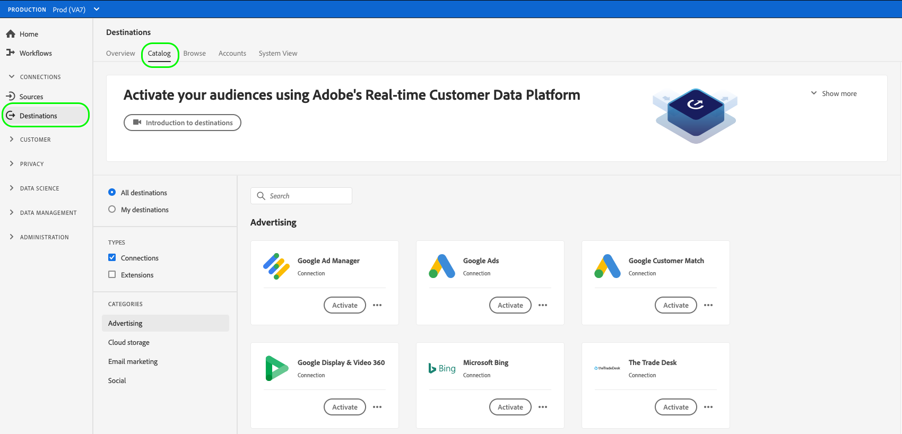
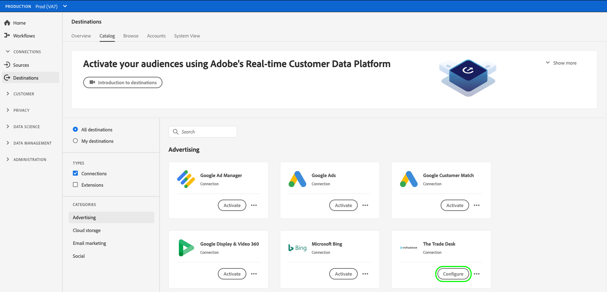
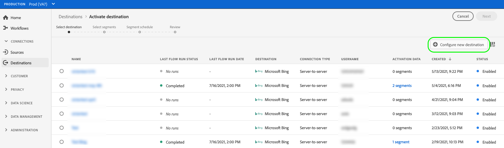
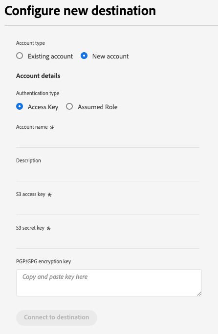
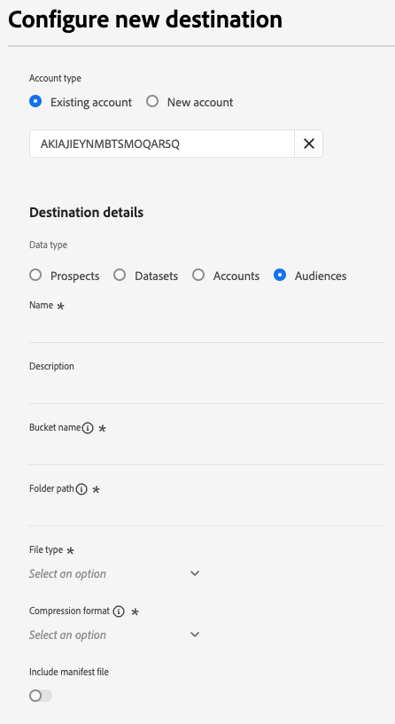
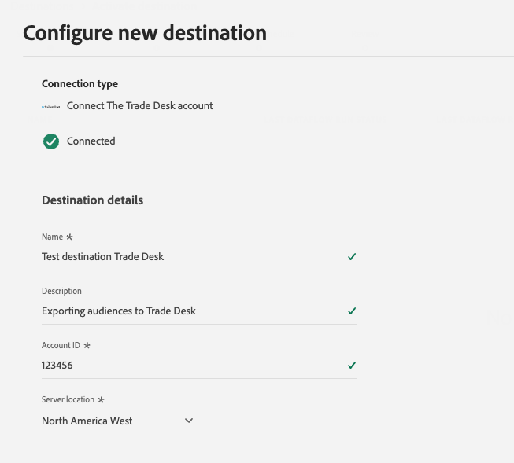
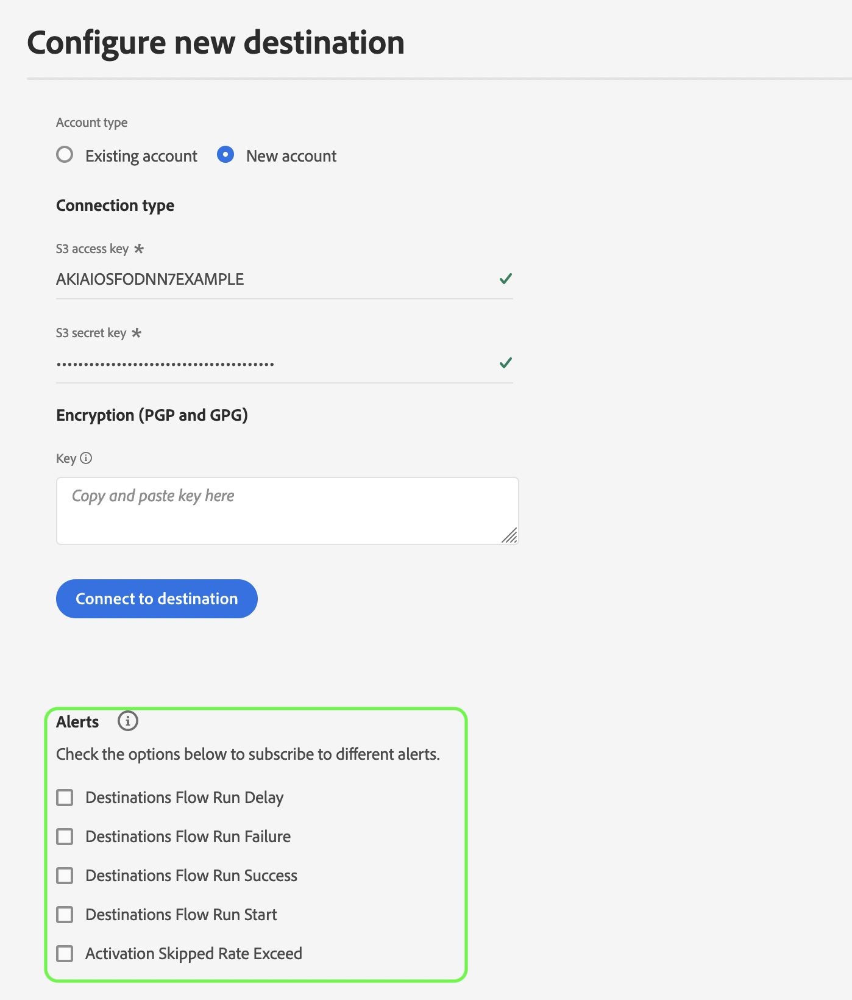
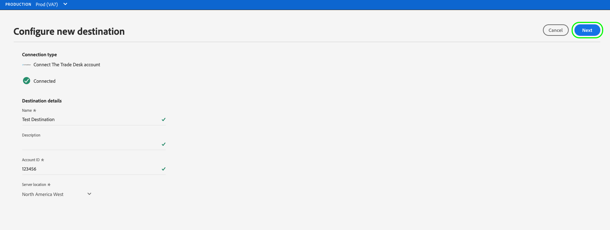
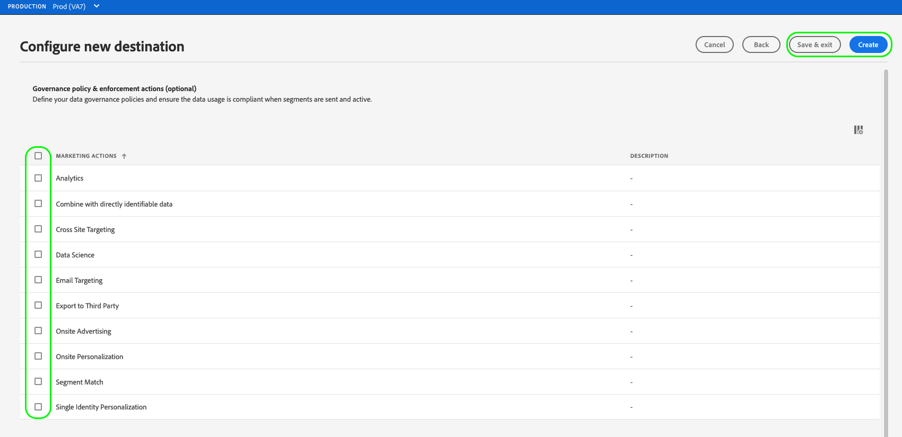

# 新しい宛先接続の作成

>[!IMPORTANT]
>
>* 宛先に接続するには、**[!UICONTROL View Destinations]**&#x200B;および&#x200B;**[!UICONTROL Manage Destinations]** [ アクセス制御権限](/help/access-control/home.md#permissions)が必要です。 [アクセス制御の概要](/help/access-control/ui/overview.md)を参照するか、製品管理者に問い合わせて必要な権限を取得してください。
>* データセットの書き出しをサポートする宛先に接続するには、**[!UICONTROL View Destinations]**&#x200B;および&#x200B;**[!UICONTROL Manage and Activate Dataset Destinations]** [ アクセス制御権限](/help/access-control/home.md#permissions)が必要です。 詳しくは、[アクセス制御の概要](/help/access-control/ui/overview.md)または製品管理者に問い合わせて、必要な権限を取得してください。

## 概要 {#overview}

オーディエンスデータを宛先に送信する前に、宛先プラットフォームへの接続を設定する必要があります。 この記事では、新しい宛先接続を設定する方法について説明します。この接続に対して、[!DNL Adobe Experience Platform] ユーザーインターフェイスを使用してオーディエンスをアクティブ化したり、データセットを書き出したりすることができます。

## カタログで目的の宛先を検索します。 {#setup}

1. **[!UICONTROL Connections]** > **[!UICONTROL Destinations]**&#x200B;に移動し、「**[!UICONTROL Catalog]**」タブを選択します。

   

2. カタログ内の宛先カードには、宛先への既存の接続があるかどうか、および宛先がオーディエンスのアクティブ化、データセットの書き出し、またはその両方をサポートしているかどうかに応じて、異なるアクションコントロールが設定される場合があります。 宛先カードには、次のいずれかのコントロールが表示されます。

   * **[!UICONTROL Set up]**&#x200B;をインストールします。オーディエンスをアクティブ化したり、データセットを書き出したりするには、まず、この宛先に接続を設定する必要があります。
   * **[!UICONTROL Activate]**&#x200B;をインストールします。この宛先への接続は既に設定されています。 この宛先は、オーディエンスのアクティベーションとデータセットの書き出しをサポートしています。
   * **[!UICONTROL Activate audiences]**&#x200B;をインストールします。この宛先への接続は既に設定されています。 この宛先は、オーディエンスのアクティブ化のみをサポートしています。

   これらのコントロールの違いについて詳しくは、宛先ワークスペースのドキュメントの[ カタログ ](../ui/destinations-workspace.md#catalog) セクションを参照してください。

   利用できるコントロールに応じて、**[!UICONTROL Set up]**、**[!UICONTROL Activate]**&#x200B;または&#x200B;**[!UICONTROL Activate audiences]**&#x200B;のいずれかを選択します。

   

   オーディエンスの有効化コントロールがハイライト表示された宛先カタログページを示すExperience Platform UIの

3. **[!UICONTROL Set up]**&#x200B;を選択した場合は、次の手順にスキップして、宛先に[認証](#authenticate)します。

   **[!UICONTROL Activate]**、**[!UICONTROL Activate audiences]**&#x200B;または&#x200B;**[!UICONTROL Export datasets]**&#x200B;を選択した場合、既存の宛先接続のリストが表示されるようになりました。

   宛先への新しい接続を確立するには、**[!UICONTROL Configure new destination]**&#x200B;を選択します。

   

## 宛先に対する認証 {#authenticate}

>[!CONTEXTUALHELP]
>id="platform_destinations_account_name"
>title="アカウント名"
>abstract="今後この宛先アカウントを簡単に識別するのに役立つ名前を入力します。これは、同じ宛先に複数の接続がある場合に特に便利です。"

宛先に接続する最初の手順は、宛先プラットフォームへの認証です。

接続先の宛先に応じて、認証先のパートナーのページに移動して認証を行ったり、Experience Platform ワークフローで認証情報を直接入力するように求められたりします。

新しい宛先接続を設定する場合は、**[!UICONTROL Account name]**&#x200B;と、オプションで&#x200B;**[!UICONTROL Description]**&#x200B;を指定する必要があります。 これらのフィールドは、すべての宛先で使用できます。

* **[!UICONTROL Account name]**：今後この宛先アカウントを簡単に識別するのに役立つ名前を入力します。 これは、同じ宛先に複数の接続がある場合に特に便利です。
* **[!UICONTROL Description]** （オプション）：接続の目的や関連するビジネスコンテキストなど、アカウント間の区別に役立つ追加の詳細を追加します。

これらのフィールドに明確で記述的な情報を含めることで、オーディエンスをアクティベートする際に、適切な宛先アカウントを容易に管理および選択できます。

以下は、[!DNL Amazon S3] 宛先への認証に必要な入力の例です。 必要な入力に関する詳細な手順は、各宛先ドキュメントページに記載されています（例えば、[[!DNL Amazon S3]](/help/destinations/catalog/cloud-storage/amazon-s3.md#authenticate) と [[!DNL Facebook]](/help/destinations/catalog/social/facebook.md#authenticate) の認証セクションを参照）。

**[!DNL Amazon S3]の必須およびオプションの認証パラメーター**

## 接続パラメーターの設定 {#set-up-connection-parameters}

宛先への認証を既に設定している場合は、既存のアカウントを引き続き使用するか、新しいアカウントを設定できます。

接続先に応じて、異なる種類の接続パラメーターを入力するように求められる場合があります。 例えば、[!DNL Amazon S3] の宛先に接続する場合、[!DNL Amazon S3] バケット名とファイルを保存するフォルダーパスに関する詳細を指定するよう求められます。 以下は、[!DNL Amazon S3] 宛先と [!DNL Trade Desk] 宛先に必要な入力の 2 つの例です。 必要な入力に関する詳細な手順は、各宛先ドキュメントページで説明しています。

>[!IMPORTANT]
>
>以下の画像は説明用にのみ使用されています。 宛先の接続詳細は、宛先間で異なります。 宛先の接続詳細について詳しくは、各[宛先カタログ](../catalog/overview.md)ページ（[[!DNL Google Customer Match]](../catalog/advertising/google-customer-match.md#connect)、[[!DNL Trade Desk]](/help/destinations/catalog/advertising/tradedesk.md#connect) または [[!DNL Amazon S3]](/help/destinations/catalog/cloud-storage/amazon-s3.md#destination-details) など）の&#x200B;**宛先に接続**&#x200B;の節を参照してください。

**[!DNL Amazon S3]の必須およびオプションの入力パラメーター**

**[!DNL The Trade Desk]の必須およびオプションの入力パラメーター**

### 書き出されたファイルのファイル形式オプションの設定 {#file-formatting-and-compression-options}

ファイルベースの宛先の場合は、書き出されたファイルの形式と圧縮の方法に関する様々な設定を指定できます。 使用可能なすべての形式および圧縮のオプションについて詳しくは、[ファイルベース宛先のファイル形式オプションの設定に関するチュートリアル](/help/destinations/ui/batch-destinations-file-formatting-options.md)を参照してください。

### オーディエンスのアクティベーション、アカウントのアクティベーション、見込み顧客のアクティベーション、データセットの書き出しを行うための宛先接続を設定できます {#segment-activation-or-dataset-exports}

ファイルベースの宛先の中には、データセットの書き出しだけでなく、既知の顧客、アカウント顧客、見込み顧客へのオーディエンスのアクティベーションもサポートしているものもあります。 これらの宛先に対して、[ オーディエンスをアクティブ化](/help/destinations/ui/activate-batch-profile-destinations.md)、[ アカウント ](/help/destinations/ui/activate-account-audiences.md)、[見込み客](/help/destinations/ui/activate-prospect-audiences.md)または[ データセットを書き出す](/help/destinations/ui/export-datasets.md)を可能にする接続を作成するかどうかを選択できます。

>[!WARNING]
>
>データセットを書き出す場合、JSON ファイルへの書き出しは圧縮モードでのみサポートされることに注意してください。 [!DNL Parquet]個のファイルへの書き出しは、圧縮モードと非圧縮モードでサポートされています。

### 宛先アラートの有効化 {#enable-alerts}

1. （オプション）購読する宛先データフローアラートを選択します。 データフローを作成する際にアラートを購読して、フロー実行のステータス、成功、失敗に関するアラートメッセージを受信します。 使用可能なアラートは、接続先の宛先タイプ（ファイルベースまたはストリーミング）によって異なります。宛先データフローアラートについて詳しくは、[コンテキスト内宛先アラートの配信登録](alerts.md)を参照してください。

   

2. **[!UICONTROL Next]** を選択します。

   

## マーケティングアクションの選択 {#select-marketing-actions}

1. 宛先に書き出すデータに適用できるマーケティングアクションを選択します。マーケティングアクションは、宛先にデータを書き出す目的を示します。 アドビが定義したマーケティングアクションから選択することも、独自のマーケティングアクションを作成することもできます。マーケティングアクションについて詳しくは、[データ使用ポリシーの概要](../../data-governance/policies/overview.md)ページを参照してください。

   

2. 宛先設定を保存するには&#x200B;**[!UICONTROL Save & Exit]**&#x200B;を選択するか、**[!UICONTROL Next]**&#x200B;を選択してオーディエンスデータ [ アクティベーションフロー](activation-overview.md)に進みます。

## 次の手順 {#next-steps}

これで、Experience Platform UIを使用して宛先への接続を確立する方法を理解できました。 使用可能な接続パラメーターと必要な接続パラメーターは、宛先によって異なります。 宛先タイプごとに必要な入力と使用可能なオプションについて詳しくは、[宛先カタログ ](/help/destinations/catalog/overview.md)の宛先ドキュメントページを参照してください。

次に、[ オーディエンスのアクティブ化](/help/destinations/ui/activation-overview.md)または[ データセットの書き出し](/help/destinations/ui/export-datasets.md)に進みます。