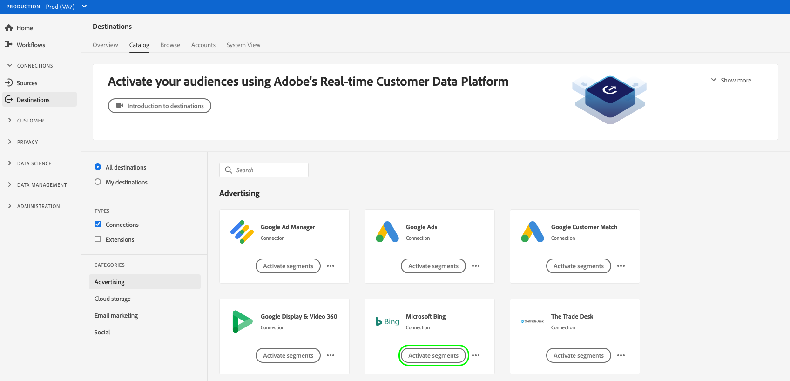

# 新しい宛先接続の作成

>[!IMPORTANT]
> 
>* 宛先に接続するには、**[!UICONTROL 宛先の管理]**[アクセス制御権限](/help/access-control/home.md#permissions)が必要です。[アクセス制御の概要](/help/access-control/ui/overview.md)を読むか、製品管理者に問い合わせて、必要な権限を取得してください。
>* データセットの書き出しをサポートする宛先に接続するには、**[!UICONTROL データセットの宛先の管理とアクティブ化]**[アクセス制御権限](/help/access-control/home.md#permissions)が必要です。詳しくは、[アクセス制御の概要](/help/access-control/ui/overview.md)または製品管理者に問い合わせて、必要な権限を取得してください。

## 概要 {#overview}

オーディエンスデータを宛先に送信する前に、宛先プラットフォームへの接続を設定する必要があります。 この記事では、新しい宛先接続を設定し、Adobe Experience Platformユーザーインターフェイスを使用してオーディエンスをアクティブ化したりデータセットを書き出したりする方法について説明します。

## カタログで目的の宛先を検索します。 {#setup}

1. **[!UICONTROL 接続]**／**[!UICONTROL 宛先]**&#x200B;に移動し、「**[!UICONTROL カタログ]**」タブを選択します。

   

2. カタログ内の宛先カードには、宛先への既存の接続があるかどうか、および宛先がオーディエンスのアクティブ化、データセットの書き出し、またはその両方をサポートしているかどうかに応じて、異なるアクション制御が含まれる場合があります。 宛先カードには、次のいずれかのコントロールが表示されます。

   * **[!UICONTROL 設定]**. オーディエンスをアクティブ化またはデータセットを書き出す前に、まず接続をこの宛先に設定する必要があります。
   * **[!UICONTROL アクティブ化]**. この宛先への接続は既に設定されています。 この宛先では、オーディエンスのアクティベーションとデータセットの書き出しがサポートされます。
   * **[!UICONTROL オーディエンスをアクティブ化]**. この宛先への接続は既に設定されています。 この宛先では、オーディエンスのアクティベーションのみサポートされます。

   これらのコントロールの違いについて詳しくは、宛先ワークスペードキュメントの[カタログ](../ui/destinations-workspace.md#catalog)の節を参照してください。

   次のいずれかを選択 **[!UICONTROL 設定]**, **[!UICONTROL 有効化]**&#x200B;または **[!UICONTROL オーディエンスをアクティブ化]**&#x200B;を使用できます。

   

   

3. 「**[!UICONTROL 設定]**」を選択した場合、次の手順にスキップして、宛先に対して「[認証](#authenticate)」を行います。

   次を選択した場合： **[!UICONTROL 有効化]**, **[!UICONTROL オーディエンスをアクティブ化]**&#x200B;または **[!UICONTROL データセットを書き出し]**&#x200B;に設定すると、既存の宛先接続のリストが表示されるようになります。

   「**[!UICONTROL 新しい宛先を設定]**」を選択すると、宛先への新しい接続を確立します。

   

## 宛先に対する認証 {#authenticate}

宛先に接続する最初の手順は、宛先プラットフォームへの認証です。

接続先に応じて、認証する宛先パートナーのページに移動したり、Platform ワークフローで直接認証資格情報を入力するように求められたりする場合があります。 以下は、[!DNL Amazon S3] 宛先への認証に必要な入力の例です。 必要な入力に関する詳細な手順は、各宛先ドキュメントページに記載されています（例えば、[[!DNL Amazon S3]](/help/destinations/catalog/cloud-storage/amazon-s3.md#authenticate) と [[!DNL Facebook]](/help/destinations/catalog/social/facebook.md#authenticate) の認証セクションを参照）。

**[!DNL Amazon S3]の必須およびオプションの認証パラメーター**

## 接続パラメーターの設定 {#set-up-connection-parameters}

宛先への認証を既に設定している場合は、既存のアカウントを引き続き使用するか、新しいアカウントを設定できます。

接続先に応じて、異なる種類の接続パラメーターを入力するように求められる場合があります。 例えば、[!DNL Amazon S3] の宛先に接続する場合、[!DNL Amazon S3] バケット名とファイルを保存するフォルダーパスに関する詳細を指定するよう求められます。 以下は、[!DNL Amazon S3] 宛先と [!DNL Trade Desk] 宛先に必要な入力の 2 つの例です。 必要な入力に関する詳細な手順は、各宛先ドキュメントページで説明しています。

>[!IMPORTANT]
>
>以下の画像は説明用にのみ使用されています。 宛先の接続詳細は、宛先間で異なります。 宛先の接続詳細について詳しくは、各[宛先カタログ](../catalog/overview.md)ページ（[[!DNL Google Customer Match]](../catalog/advertising/google-customer-match.md#connect)、[[!DNL Trade Desk]](/help/destinations/catalog/advertising/tradedesk.md#connect) または [[!DNL Amazon S3]](/help/destinations/catalog/cloud-storage/amazon-s3.md#destination-details) など）の&#x200B;**宛先に接続**&#x200B;の節を参照してください。

**[!DNL Amazon S3]の必須およびオプションの入力パラメーター**

**[!DNL The Trade Desk]の必須およびオプションの入力パラメーター**

### 書き出されたファイルのファイル形式オプションの設定 {#file-formatting-and-compression-options}

ファイルベースの宛先の場合は、書き出されたファイルの形式と圧縮の方法に関する様々な設定を指定できます。 使用可能なすべての形式および圧縮のオプションについて詳しくは、[ファイルベース宛先のファイル形式オプションの設定に関するチュートリアル](/help/destinations/ui/batch-destinations-file-formatting-options.md)を参照してください。

### オーディエンスのアクティベーション、アカウントのアクティブ化、見込み客のアクティブ化、データセットのエクスポートの宛先接続を設定します {#segment-activation-or-dataset-exports}

一部のファイルベースの宛先は、既知の顧客、アカウントの顧客、見込み客に対するオーディエンスのアクティブ化や、データセットの書き出しをサポートしています。 これらの宛先について、次のことを可能にする接続を作成するかどうかを選択できます。 [オーディエンスをアクティブ化](/help/destinations/ui/activate-batch-profile-destinations.md), [アカウント](/help/destinations/ui/activate-account-audiences.md), [見込み客](/help/destinations/ui/activate-prospect-audiences.md)または [データセットを書き出し](/help/destinations/ui/export-datasets.md).

>[!WARNING]
>
>データセットを書き出す場合、JSON ファイルへの書き出しは圧縮モードでのみサポートされることに注意してください。 への書き出し先 [!DNL Parquet] ファイルは、圧縮モードと非圧縮モードでサポートされます。

### 宛先アラートの有効化 {#enable-alerts}

1. （オプション）購読する宛先データフローアラートを選択します。 データフローを作成する際にアラートの配信を登録して、フロー実行のステータス、成功または失敗に関するアラートメッセージを受信できます。使用可能なアラートは、接続先の宛先タイプ（ファイルベースまたはストリーミング）によって異なります。宛先データフローアラートについて詳しくは、[コンテキスト内宛先アラートの配信登録](alerts.md)を参照してください。

   

2. 「**[!UICONTROL 次へ]**」を選択します。

   

## マーケティングアクションの選択 {#select-marketing-actions}

1. 宛先に書き出すデータに適用できるマーケティングアクションを選択します。マーケティングアクションは、宛先にデータを書き出す目的を示します。 アドビが定義したマーケティングアクションから選択することも、独自のマーケティングアクションを作成することもできます。マーケティングアクションについて詳しくは、[データ使用ポリシーの概要](../../data-governance/policies/overview.md)ページを参照してください。

   

2. 「**[!UICONTROL 保存して終了]**」を選択して宛先設定を保存するか、「**[!UICONTROL 次へ]**」を選択してオーディエンスデータの[アクティベーションフロー](activation-overview.md)に進みます。

## 次の手順 {#next-steps}

このドキュメントでは、Experience Platform UI を使用して宛先への接続を確立する方法について説明しました。使用可能な接続パラメーターと必要な接続パラメーターは、宛先によって異なります。宛先タイプごとに必要な入力と使用可能なオプションについて詳しくは、[宛先カタログ](/help/destinations/catalog/overview.md)の宛先ドキュメントページも参照してください。

次に、 [オーディエンスのアクティブ化](/help/destinations/ui/activation-overview.md) または [データセットの書き出し](/help/destinations/ui/export-datasets.md) を宛先に追加します。