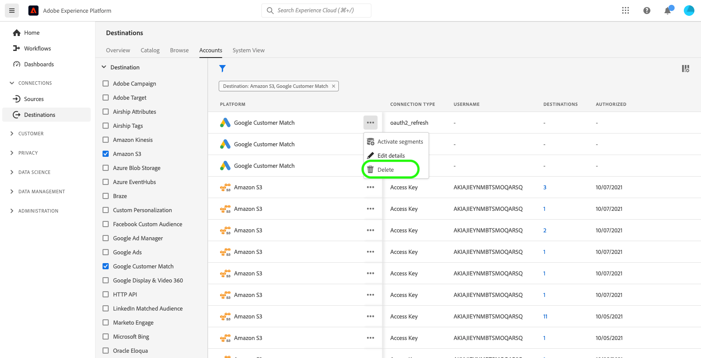

# 宛先アカウントの削除

## 概要 {#overview}

この **[!UICONTROL アカウント]** 「 」タブには、様々な宛先との接続を確立した場合の詳細が表示されます。 詳しくは、 [アカウントの概要](../ui/destinations-workspace.md#accounts) を参照してください。

このチュートリアルでは、Experience PlatformUI を使用して、不要になった宛先アカウントを削除する手順を説明します。

## アカウントの削除 {#delete}

>[!TIP]
>
>宛先アカウントを削除する前に、まず宛先アカウントに関連付けられた既存のデータフローを削除する必要があります。 既存の宛先データフローを削除するには、次のチュートリアルを参照してください： [UI での宛先データフローの削除](./delete-destinations.md).

既存の宛先アカウントを削除するには、以下の手順に従います。

1. にログインします。 [Experience PlatformUI](https://platform.adobe.com/) を選択し、 **[!UICONTROL 宛先]** をクリックします。 選択 **[!UICONTROL アカウント]** 上部のヘッダーから既存のアカウントを表示します。

   

2. フィルターアイコンを選択します。  をクリックして、並べ替えパネルを起動します。 並べ替えパネルには、すべての宛先のリストが表示されます。 リストから複数の宛先を選択すると、選択した宛先に関連付けられたアカウントのフィルターされた選択を表示できます。

   

3. 省略記号 (`...`) をクリックします。 ポップアップパネルが表示され、次のオプションが表示されます。 **[!UICONTROL セグメントのアクティブ化]**, **[!UICONTROL 詳細を編集]**、および **[!UICONTROL 削除]** アカウント を選択します。  **[!UICONTROL 削除]** ボタンをクリックして、目的のアカウントを削除します。

   

4. 最終確認ダイアログボックスが表示されます。次の項目を選択します。 **[!UICONTROL 削除]** をクリックしてプロセスを完了します。

## 次の手順

このチュートリアルでは、宛先ワークスペースを使用して既存のアカウントを削除しました。

を使用してこれらの操作をプログラムで実行する手順については、 [!DNL Flow Service] API( [フローサービス API を使用した接続の削除](../api/delete-destination-account.md)
