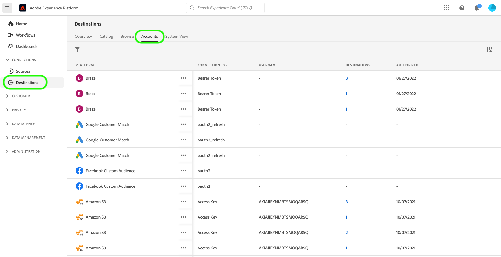
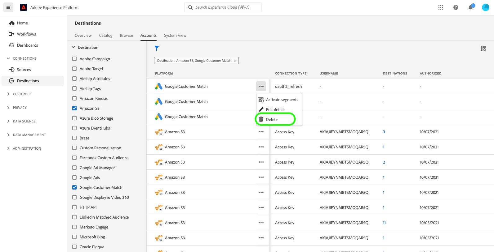
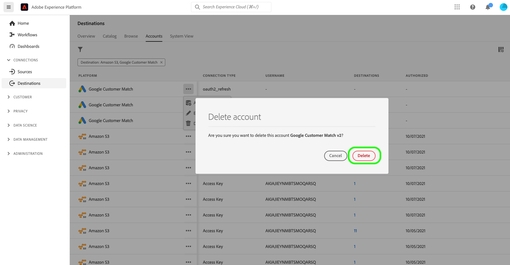

# 宛先アカウントの削除

## 概要 {#overview}

「**[!UICONTROL Accounts]**」タブには、様々な宛先で確立した接続に関する詳細が表示されます。 各宛先アカウントで使用可能なすべての情報については、[ アカウントの概要](../ui/destinations-workspace.md#accounts)を参照してください。

このチュートリアルでは、Experience Platform UIを使用して、不要になった宛先アカウントを削除する手順について説明します。

## アカウントの削除 {#delete}

>[!TIP]
>
>宛先アカウントを削除する前に、まず、宛先アカウントに関連付けられている既存のデータフローを削除する必要があります。 既存の宛先データフローを削除するには、[UIでの宛先データフローの削除](./delete-destinations.md)に関するチュートリアルを参照してください。

既存の宛先アカウントを削除するには、次の手順に従います。

1. [Experience Platform UI](https://platform.adobe.com/)に移動し、左側のナビゲーションバーから&#x200B;**[!UICONTROL Destinations]**&#x200B;を選択します。 上部ヘッダーから&#x200B;**[!UICONTROL Accounts]**&#x200B;を選択して、既存のアカウントを表示します。

   

2. 左上のフィルターアイコン  を選択して、並べ替えパネルを開きます。並べ替えパネルには、すべての宛先のリストが表示されます。 リストから複数の宛先を選択すると、選択した宛先に関連付けられているアカウントのフィルタリングされた選択を表示できます。

   

3. 削除するアカウントの名前の横にある省略記号（`...`）を選択します。 ポップアップパネルが表示され、アカウントの&#x200B;**[!UICONTROL Activate audiences]**、**[!UICONTROL Edit details]**&#x200B;および&#x200B;**[!UICONTROL Delete]**&#x200B;にオプションが表示されます。 目的のアカウントを削除するには、 **[!UICONTROL Delete]** ボタンを選択します。

   

4. 最終確認ダイアログボックスが表示され、**[!UICONTROL Delete]**&#x200B;を選択してプロセスを完了します。

## 次の手順 {#next-steps}

宛先ワークスペースを使用して既存のアカウントを削除しました。

[!DNL Flow Service] APIを使用してこれらの操作をプログラムで実行する手順については、[Flow Service APIを使用した接続の削除](../api/delete-destination-account.md)に関するチュートリアルを参照してください
