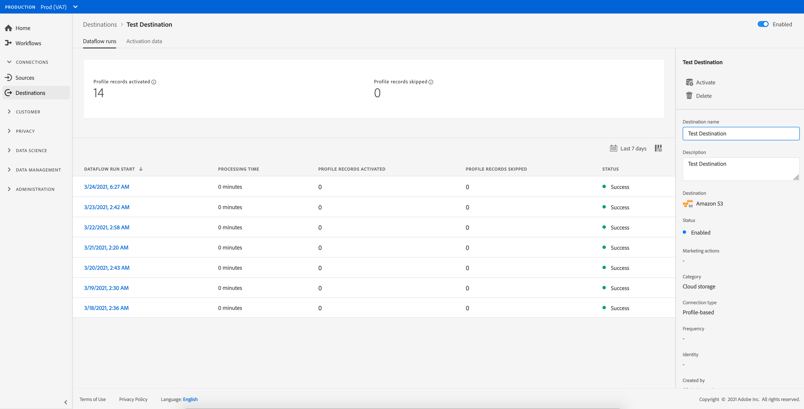

# 宛先を削除{#delete-destinations}

## 概要 {#overview}

Adobe Experience Platformユーザーインターフェイスでは、宛先への既存の接続を削除できます。

宛先を削除すると、その宛先への既存のデータ・フローがすべて削除されます。 削除する宛先に対してアクティブ化されたすべてのセグメントは、データフローが削除される前にマップ解除されます。

[!DNL Platform] [!DNL UI]から宛先を削除する方法は2つあります。 次のことができます。

* [「ブラウ  ズ」タブからのリンク先の削除](#delete-browse-tab)
* [宛先の詳細ページからの宛先の削除](#delete-destination-details-page)

## 「Browse」タブから宛先を削除{#delete-browse-tab}

[!UICONTROL 「参照]」タブから宛先を削除するには、次の手順に従います。

1. [Experience PlatformUI](https://platform.adobe.com/)にログインし、左のナビゲーションバーで「**[!UICONTROL 宛先]**」を選択します。 既存のリンク先を表示するには、上部のヘッダーから「**[!UICONTROL 参照]**」を選択します。

   

2. 左上のフィルターアイコンを選択して、並べ替えパネルを起動します。 並べ替えパネルには、すべての宛先のリストが表示されます。 リストから複数の宛先を選択して、選択した宛先に関連付けられたデータ・フローのフィルタ選択を表示できます。

   

3. 既存の削除先を削除するには、 **[!UICONTROL プラットフォーム]**&#x200B;列の&#x200B;**[!UICONTROL 削除ボタン削除]**を選択します。
   

4. [**[!UICONTROL 削除]**]を選択して、削除先の削除を確認します。

   

## 宛先の詳細ページから宛先を削除{#delete-destination-details-page}

宛先の詳細ページから宛先を削除するには、次の手順に従います。

1. [Experience PlatformUI](https://platform.adobe.com/)にログインし、左のナビゲーションバーで「**[!UICONTROL 宛先]**」を選択します。 既存のリンク先を表示するには、上部のヘッダーから「**[!UICONTROL 参照]**」を選択します。

   

2. 左上のフィルターアイコンを選択して、並べ替えパネルを起動します。 並べ替えパネルには、すべての宛先のリストが表示されます。 リストから複数の宛先を選択して、選択した宛先に関連付けられたデータ・フローのフィルタ選択を表示できます。

   

3. 削除するリンク先の名前を選択します。

   

   * 宛先に既存のデータフローがある場合は、[!UICONTROL Dataflow runs]タブに移動します。

      

   * 宛先に既存のデータフローがない場合は、オーディエンスのアクティブ化を開始できる空のページが表示されます。

      

4. 右側のレールで「**[!UICONTROL 削除]**」を選択します。

   

5. 確認ダイアログで「**[!UICONTROL 削除]**」を選択して、削除先を削除します。

   

   >[!NOTE]
   >
   >サーバの負荷に応じて、[!DNL Platform]が宛先を削除するまで数分かかる場合があります。
