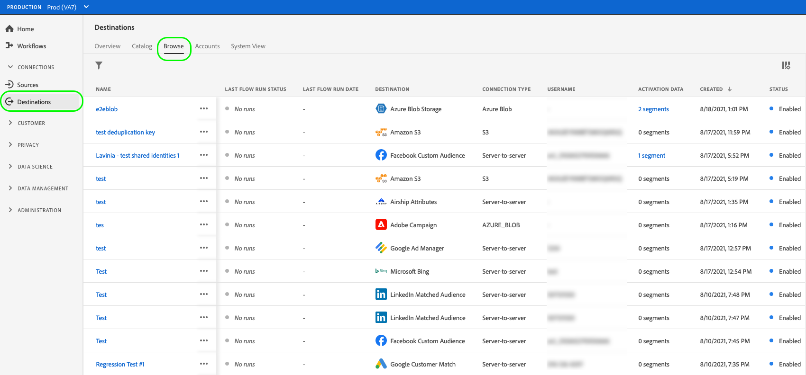
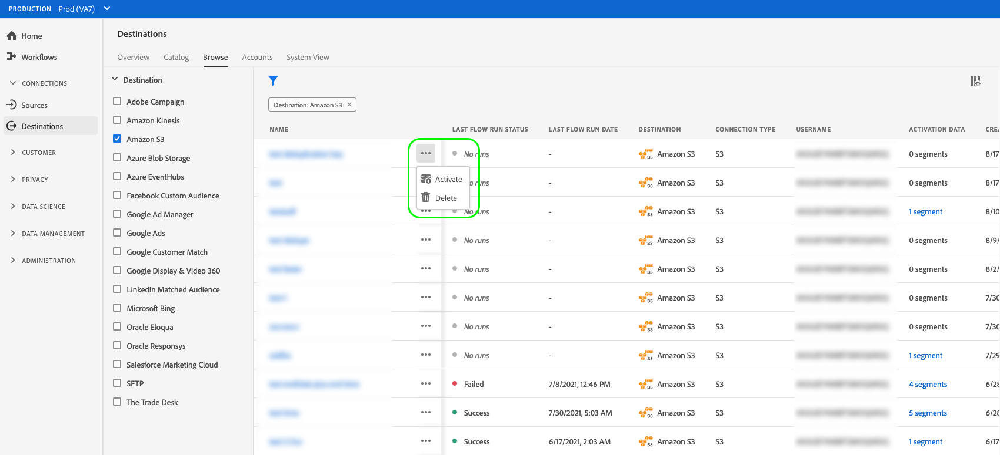
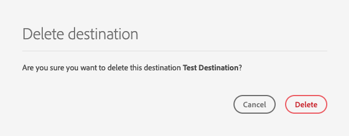
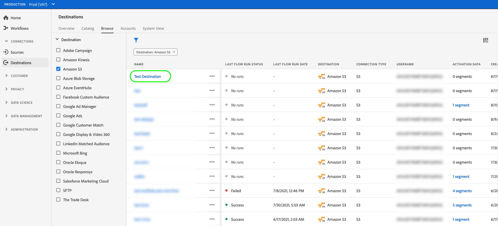
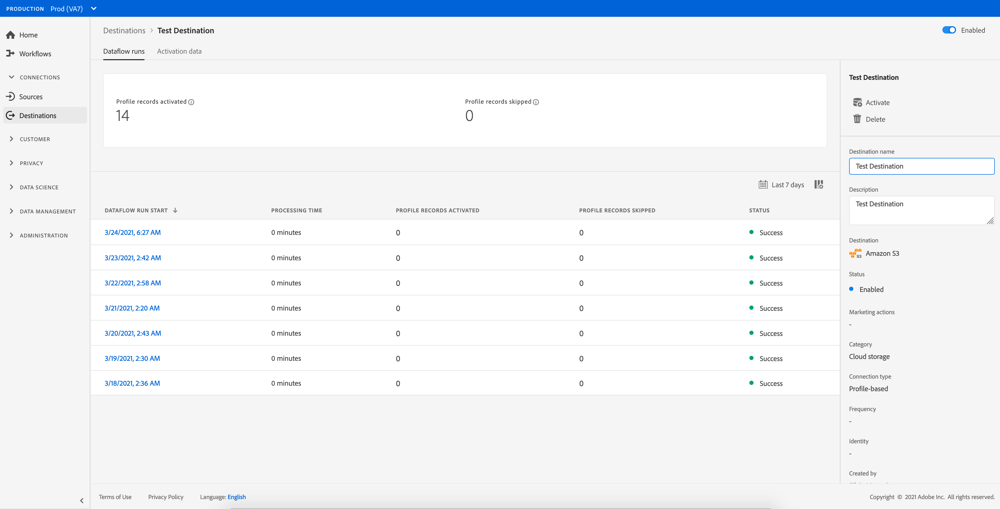
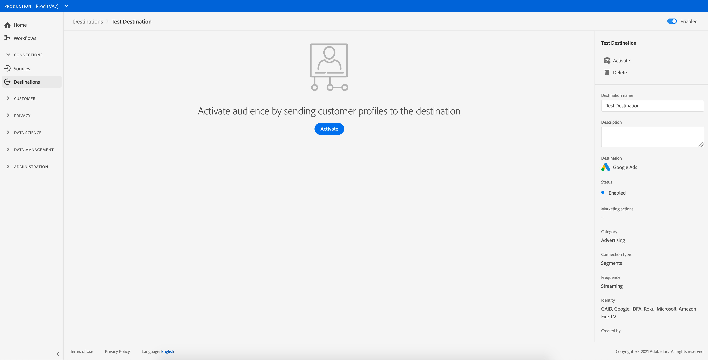
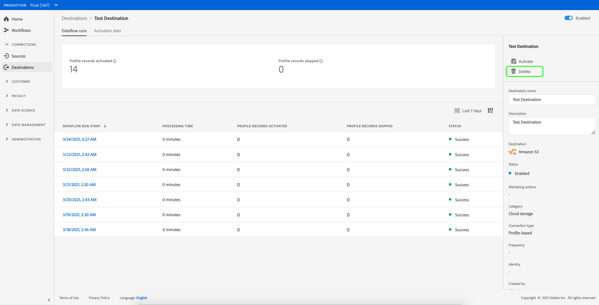
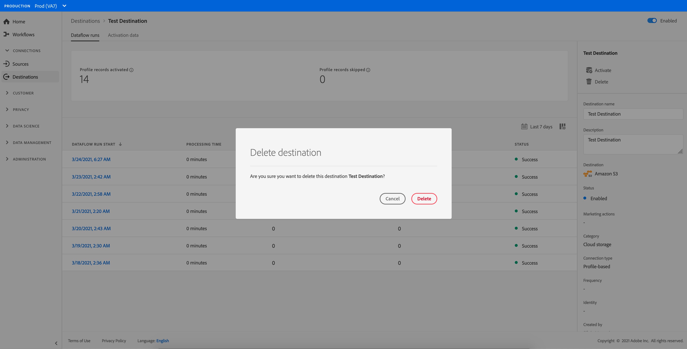

# 宛先の削除 {#delete-destinations}

## 概要 {#overview}

[!DNL Adobe Experience Platform] ユーザーインターフェイスで、宛先への既存の接続を削除できます。

宛先を削除すると、その宛先に対する既存のデータフローが削除されます。 削除した宛先に対してアクティブ化されたすべてのオーディエンスは、データフローが削除される前にマッピング解除されます。

[!DNL Experience Platform] [!DNL UI]から宛先を削除するには、2つの方法があります。 実行できる操作は、次のとおりです。

* [[!UICONTROL Browse] タブから宛先を削除](#delete-browse-tab)
* [宛先の詳細ページから宛先を削除する](#delete-destination-details-page)

## 「参照」タブから宛先を削除します{#delete-browse-tab}

次の手順に従って、[!UICONTROL Browse] タブから宛先を削除します。

1. [Experience Platform UI](https://platform.adobe.com/)にログインし、左側のナビゲーションバーから「**[!UICONTROL Destinations]**」を選択します。 既存の宛先を表示するには、上部ヘッダーから「**[!UICONTROL Browse]**」を選択します。

   

2. 左上のフィルターアイコン  を選択して、並べ替えパネルを開きます。並べ替えパネルには、すべての宛先のリストが表示されます。 リストから複数の宛先を選択して、選択した宛先に関連付けられた特定のデータフローを表示できます。

   

3. 名前列の ボタンを選択し、 **[!UICONTROL Delete]**を選択して、既存の宛先接続を削除します。
   

4. 宛先接続の削除を確認するには、**[!UICONTROL Delete]**&#x200B;を選択します。

   

## 宛先の詳細ページから宛先を削除する{#delete-destination-details-page}

宛先の詳細ページから宛先を削除するには、次の手順に従います。

1. [Experience Platform UI](https://platform.adobe.com/)にログインし、左側のナビゲーションバーから「**[!UICONTROL Destinations]**」を選択します。 既存の宛先を表示するには、上部ヘッダーから「**[!UICONTROL Browse]**」を選択します。

   

2. 左上のフィルターアイコン  を選択して、並べ替えパネルを開きます。並べ替えパネルには、すべての宛先のリストが表示されます。 リストから複数の宛先を選択して、選択した宛先に関連付けられた特定のデータフローを表示できます。

   

3. 削除する宛先の名前を選択します。

   

   * 宛先に既存のデータフローがある場合は、[!UICONTROL Dataflow runs] タブに移動します。

     

   * 宛先に既存のデータフローがない場合は、オーディエンスのアクティベーションを開始できる空のページに移動します。

     

4. 右側のパネルで「**[!UICONTROL Delete]**」を選択します。

   

5. 確認ダイアログで「**[!UICONTROL Delete]**」を選択して、宛先を削除します。

   

   >[!NOTE]
   >
   >サーバーの負荷によっては、[!DNL Experience Platform]が宛先を削除するのに数分かかる場合があります。
