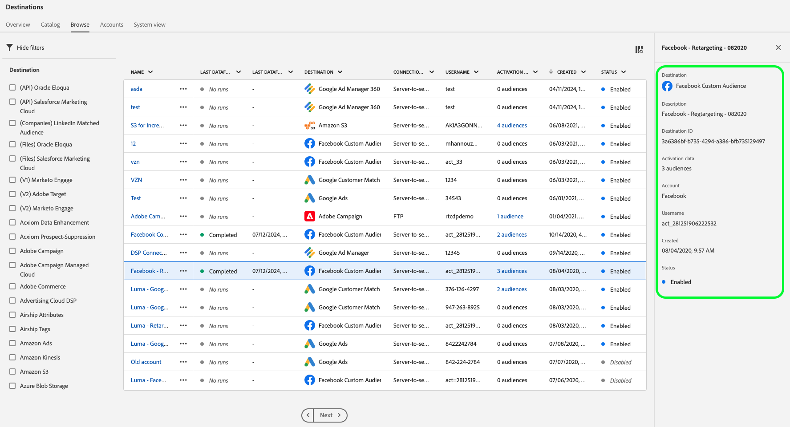
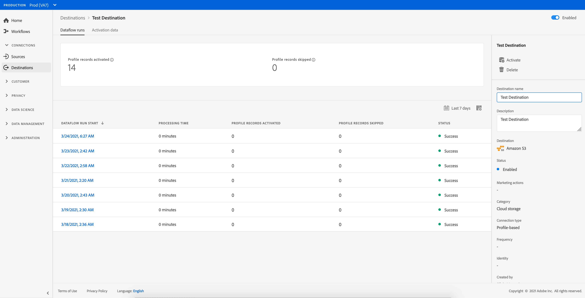
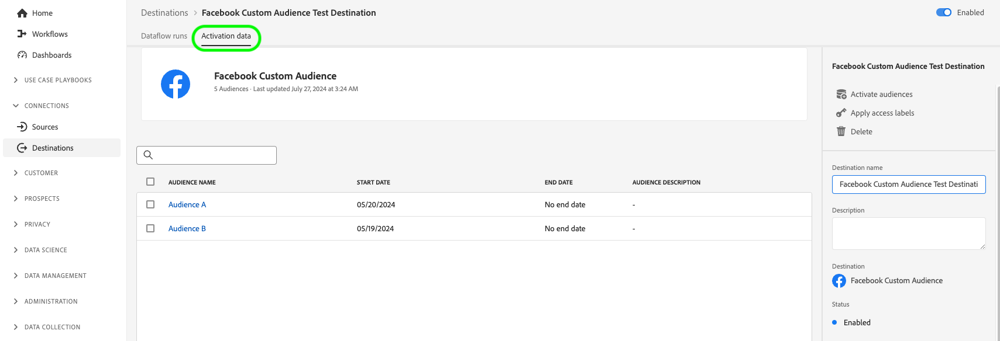
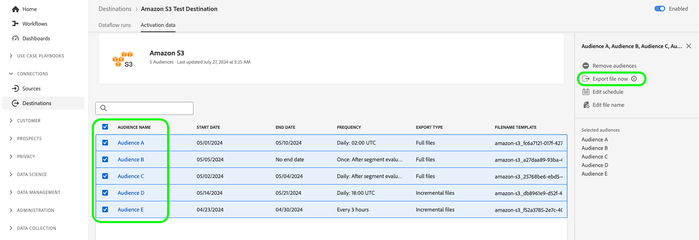
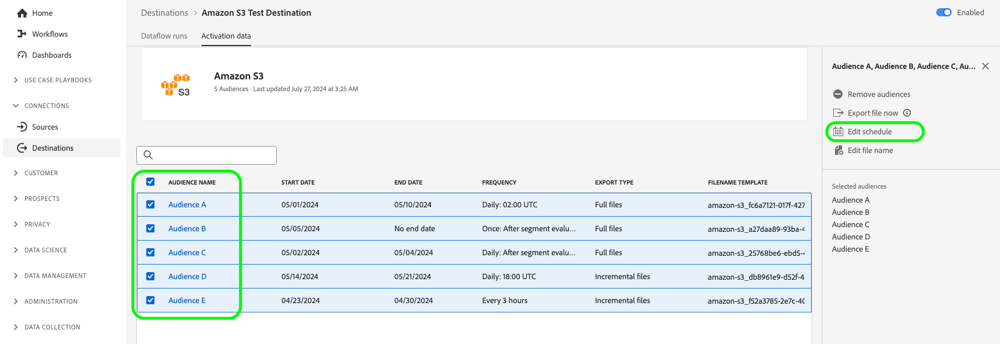
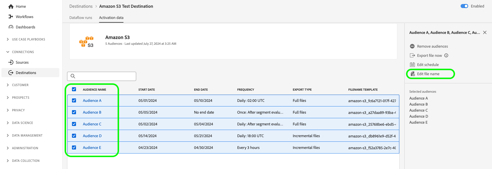

# 宛先の詳細を表示

## 概要 {#overview}

[!DNL Adobe Experience Platform] ユーザーインターフェイスで、宛先の属性とアクティビティを表示および監視できます。 これらの詳細には、宛先の名前とID、宛先をアクティブ化または無効にするコントロールなどが含まれます。 詳細には、アクティブ化されたプロファイルレコード、アクティブ化されたID、失敗したID、除外されたID、データフロー実行の履歴などの指標も含まれます。

>[!NOTE]
>
>宛先の詳細ページは、[!UICONTROL Destinations] [!DNL Experience Platform]の[!DNL UI] ワークスペースの一部です。 詳しくは、[[!UICONTROL Destinations] ワークスペースの概要](./destinations-workspace.md)を参照してください。

## 宛先の詳細を表示 {#view-details}

既存の宛先に関する詳細を表示するには、次の手順に従います。 宛先の宛先ID、宛先を作成したユーザー、作成日時などの情報を確認できます。

1. [Experience Platform UI](https://platform.adobe.com/)にログインし、左側のナビゲーションバーから「**[!UICONTROL Destinations]**」を選択します。 上部ヘッダーから「**[!UICONTROL Browse]**」を選択して、既存の宛先を表示します。

   

2. 左上のフィルターアイコン  を選択して、並べ替えパネルを開きます。並べ替えパネルには、すべての宛先のリストが表示されます。 リストから複数の宛先を選択して、選択した宛先に関連付けられた特定のデータフローを表示できます。

   

3. 詳細を表示する宛先の行を選択します。 これにより、宛先ID、宛先接続を作成したユーザー、その他の情報など、宛先に関する情報を含む右側のパネルが表示されます。

   

4. または、表示する宛先&#x200B;*の名前*&#x200B;を選択して、宛先に関する他の情報を表示することもできます。

   

5. 宛先の詳細ページが右側のパネルに表示され、使用可能なコントロールが表示されます。

   

## 右側のパネル {#right-rail}

右側のパネルには、選択した宛先に関する基本情報が表示されます。

次の表では、右側のパネルで提供されるコントロールと詳細について説明します。

| 右側のパネル項目 | 説明 |
| --- | --- |
| [!UICONTROL Activate audiences] | このコントロールを選択すると、宛先にマッピングされるオーディエンスの編集、書き出しスケジュールの更新、マッピングされた属性とIDの追加と削除が行われます。 詳しくは、「[&#x200B; オーディエンスデータをオーディエンスストリーミング宛先に対してアクティブ化](./activate-segment-streaming-destinations.md)、[&#x200B; バッチプロファイルベースの宛先に対してオーディエンスデータをアクティブ化](./activate-batch-profile-destinations.md)、[&#x200B; ストリーミングプロファイルベースの宛先に対してオーディエンスデータをアクティブ化](./activate-streaming-profile-destinations.md)」のガイドを参照してください。 |
| [!UICONTROL Delete] | このデータフローを削除し、以前にアクティブ化されたオーディエンスが存在する場合は、そのオーディエンスをマッピング解除できます。 |
| [!UICONTROL Destination name] | このフィールドは、宛先の名前を更新するために編集できます。 |
| [!UICONTROL Description] | このフィールドは、宛先に対してオプションの説明を更新または追加するために編集できます。 |
| [!UICONTROL Destination] | オーディエンスの宛先プラットフォームを表します。詳しくは、[宛先カタログ &#x200B;](../catalog/overview.md)を参照してください。 |
| [!UICONTROL Status] | 宛先が有効か無効かを示します。 |
| [!UICONTROL Marketing actions] | データガバナンス目的でこの宛先に適用されるマーケティングアクション（ユースケース）を示します。 |
| [!UICONTROL Category] | 宛先タイプを示します。 詳しくは、[宛先カタログ &#x200B;](../catalog/overview.md)を参照してください。 |
| [!UICONTROL Connection type] | オーディエンスを宛先に送信するフォームを示します。 指定できる値は[!UICONTROL Cookie]と[!UICONTROL Profile-based]です。 |
| [!UICONTROL Frequency] | オーディエンスが宛先に送信される頻度を示します。指定できる値は[!UICONTROL Streaming]と[!UICONTROL Batch]です。 |
| [!UICONTROL Identity] | 宛先が受け入れたID名前空間（`GAID`、`IDFA`、`email`など）を表します。 許可されたID名前空間について詳しくは、[ID名前空間の概要](../../identity-service/features/namespaces.md)を参照してください。 |
| [!UICONTROL Created by] | この宛先を作成したユーザーを示します。 |
| [!UICONTROL Created] | この宛先が作成されたUTC日時を示します。 |

{style="table-layout:auto"}

## [!UICONTROL Enabled]/[!UICONTROL Disabled]切り替え {#enabled-disabled-toggle}

**[!UICONTROL Enabled]/[!UICONTROL Disabled]** トグルを使用して、宛先へのすべてのデータ書き出しを開始および一時停止できます。

## [!UICONTROL Dataflow runs] {#dataflow-runs}

「[!UICONTROL Dataflow runs]」タブには、バッチおよびストリーミング宛先へのデータフロー実行に関する指標データが表示されます。 詳細と指標の定義については、[&#x200B; データフローの監視](monitor-dataflows.md)を参照してください。

>[!NOTE]
>
>* 宛先モニタリング機能は、現在、*Experience Platform*、[&#x200B; カスタムパーソナライゼーション &#x200B;](/help/destinations/catalog/personalization/adobe-target-connection.md)および[Adobe Target オーディエンス &#x200B;](/help/destinations/catalog/personalization/custom-personalization.md)の宛先を除く[Experience Cloudのすべての宛先でサポートされています。](/help/destinations/catalog/adobe/experience-cloud-audiences.md)
>* [Amazon Kinesis](/help/destinations/catalog/cloud-storage/amazon-kinesis.md)、[Azure Event Hubs](/help/destinations/catalog/cloud-storage/azure-event-hubs.md)、および[HTTP API](/help/destinations/catalog/streaming/http-destination.md)の宛先について、除外されたID、失敗したID、アクティブ化されたIDに関連する指標が推定されます。 アクティベーションデータの量が多いほど、指標の精度が高くなります。

### データフロー実行期間 {#dataflow-runs-duration}

ストリーミング宛先とファイルベースの宛先の間で、表示されるデータフロー実行の期間に違いがあります。

### ストリーミング宛先 {#streaming}

ほとんどのストリーミングデータフロー実行で示される&#x200B;**[!UICONTROL Processing duration]**&#x200B;は約4時間ですが、下の画像に示すように、すべてのデータフロー実行の実際の処理時間ははるかに短くなります。 データフロー実行ウィンドウは、Experience Platformが宛先への呼び出しを再試行する必要がある場合に長く開いたままになり、同じタイムウィンドウに到着したデータが欠落しないようにします。

詳しくは、監視ドキュメントの「[&#x200B; データフローがストリーミング宛先に実行される](/help/dataflows/ui/monitor-destinations.md#dataflow-runs-for-streaming-destinations)」を参照してください。

### ファイルベースの宛先 {#file-based}

データフローがファイルベースの宛先に対して実行される場合、**[!UICONTROL Processing duration]**&#x200B;は、書き出されるデータのサイズとシステムの読み込みに依存します。 また、ファイルベースの宛先に対して実行されるデータフローは、オーディエンスごとに分類されます。

詳しくは、監視ドキュメントの「[&#x200B; データフローがバッチ（ファイルベース）宛先](/help/dataflows/ui/monitor-destinations.md#dataflow-runs-for-batch-destinations)に実行される」を参照してください。

## [!UICONTROL Activation data] {#activation-data}

「**[!UICONTROL Activation data]**」タブには、宛先にマッピングされたオーディエンスのリストが表示されます。これには、開始日と終了日（該当する場合）のほか、書き出しの種類、スケジュール、頻度など、データ書き出しに関連するその他の情報が含まれます。 特定のオーディエンスの詳細を表示するには、リストから名前を選択します。

>[!TIP]
>
>宛先にマッピングされた属性とIDに関する詳細を表示および編集するには、**[!UICONTROL Activate audiences]**&#x200B;右側のパネル [で](#right-rail)を選択します。

>[!BEGINSHADEBOX]

ファイルベースの宛先の&#x200B;**[!UICONTROL Activation data]** タブ。

>[!ENDSHADEBOX]

>[!BEGINSHADEBOX]

ストリーミング宛先の&#x200B;**[!UICONTROL Activation data]** タブ。

>[!ENDSHADEBOX]

### アクティブなオーディエンスをフィルタリング {#filter-audiences}

宛先に対してアクティブ化されたオーディエンスのリストをフィルタリングするには、検索ボックスにオーディエンス名を入力します。 オーディエンスのリストは、検索結果で自動的に更新されます。

### アクティベーションフローから複数のオーディエンスを削除する {#bulk-remove}

既存のアクティベーションフローから複数のオーディエンスを削除するには、オーディエンスを選択し、**[!UICONTROL Remove audiences]**&#x200B;を選択します。

「オーディエンスを削除」オプションを強調表示する

### 複数のファイルをオンデマンドでバッチ宛先にエクスポートします {#bulk-export}

[&#x200B; ページから](../ui/export-file-now.md)複数のファイルをオンデマンドで&#x200B;**[!UICONTROL Activation data]**&#x200B;書き出すことができます。 これを行うには、ファイルをオンデマンドで書き出すオーディエンスを選択し、**[!UICONTROL Export file now]** コントロールを選択して、選択した各オーディエンスのファイルをバッチ宛先に配信する1回限りの書き出しをトリガーします。

「今すぐファイルを書き出し」ボタンを強調表示する

### バッチ宛先に書き出された複数オーディエンスのアクティベーションスケジュールを編集します {#bulk-edit-schedule}

複数のオーディエンスの既存のアクティブ化スケジュールを同時に編集するには、目的のオーディエンスを選択してから&#x200B;**[!UICONTROL Edit schedule]**&#x200B;を選択します。 書き出しスケジュールを定義または編集する方法について詳しくは、「[&#x200B; オーディエンスの書き出しをスケジュール &#x200B;](../ui/activate-batch-profile-destinations.md#scheduling)」の節を参照してください。

>[!NOTE]
>
>オーディエンスの詳細ページについて詳しくは、[&#x200B; オーディエンスポータルの概要](../../segmentation/ui/audience-portal.md#audience-details)を参照してください。

### バッチ宛先に書き出された複数のオーディエンスのファイル名を編集する {#bulk-edit-file-names}

複数のオーディエンスの書き出されたファイル名を同時に編集するには、目的のオーディエンスを選択してから&#x200B;**[!UICONTROL Edit file name]**&#x200B;を選択します。 ファイル名を定義または編集する方法について詳しくは、「[&#x200B; ファイル名を設定する](../ui/activate-batch-profile-destinations.md#configure-file-names)」の節を参照してください。

