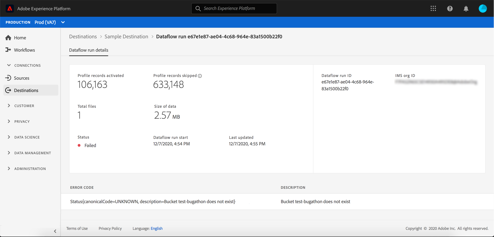

# 表示先の詳細

## 概要 {#overview}

Adobe Experience Platformユーザーインターフェイスでは、宛先の属性やアクティビティを表示および監視できます。 これらの詳細には、宛先の名前とID、宛先をアクティブ化または無効化するためのコントロールなどが含まれます。 バッチ宛先の詳細には、アクティブ化されたプロファイルレコードの指標やデータフロー実行の履歴も含まれます。

>[!NOTE]
>
>宛先の詳細ページは、プラットフォームUIの[!UICONTROL 宛先]ワークスペースの一部です。 詳しくは、[[!UICONTROL 宛先]ワークスペースの概要](./destinations-workspace.md)を参照してください。

プラットフォームUI内の&#x200B;**[!UICONTROL 宛先]**&#x200B;ワークスペースで、「**[!UICONTROL 参照]**」タブに移動し、表示する宛先の名前を選択します。

宛先の詳細ページが表示され、使用可能なコントロールが表示されます。 バッチ宛先の詳細を表示している場合は、監視ダッシュボードも表示されます。

また、「参照」タブで、アイコンを選択して、選択したデータフローを削除することもできます。 宛先に対してアクティブ化されたセグメントは、データフローが削除される前にマッピング解除されます。

## 右側のレール

右側のレールに、目的のファイルに関する基本情報が表示されます。

次の表に、右側のレールに表示されるコントロールと詳細を示します。

| 右側のレールアイテム | 説明 |
| --- | --- |
| [!UICONTROL アクティブ化] | このコントロールを選択して、宛先にマッピングされるセグメントを編集します。 詳しくは、[宛先へのセグメントのアクティブ化](./activate-destinations.md)のガイドを参照してください。 |
| [!UICONTROL 削除] | このデータフローを削除し、既にアクティブ化されたセグメントのマッピングを解除できます（存在する場合）。 |
| [!UICONTROL 宛先名] | このフィールドは、宛先名を更新するために編集できます。 |
| [!UICONTROL 説明] | このフィールドは、任意で説明を更新または追加するために編集できます。 |
| [!UICONTROL 宛先] | オーディエンスの宛先プラットフォームを表します。詳しくは、[宛先カタログ](../catalog/overview.md)を参照してください。 |
| [!UICONTROL ステータス] | 宛先が有効か無効かを示します。 |
| [!UICONTROL マーケティングアクション] | データ管理の目的でこの宛先に適用されるマーケティングアクション（使用例）を示します。 |
| [!UICONTROL カテゴリ] | 宛先のタイプを示します。 詳しくは、[宛先カタログ](../catalog/overview.md)を参照してください。 |
| [!UICONTROL 接続タイプ] | オーディエンスが送信先に送信される際に使用されるフォームを示します。 使用できる値は、「[!UICONTROL Cookie]」および「[!UICONTROL プロファイルベース]」です。 |
| [!UICONTROL 頻度] | オーディエンスが宛先に送信される頻度を示します。指定できる値は、「[!UICONTROL ストリーミング]」および「[!UICONTROL バッチ]」です。 |
| [!UICONTROL ID] | 宛先が受け入れるID名前空間（`GAID`、`IDFA`、`email`など）を表します。 受け入れられるID名前空間について詳しくは、[ID名前空間の概要](../../identity-service/namespaces.md)を参照してください。 |
| [!UICONTROL 作成者] | この宛先を作成したユーザーを示します。 |
| [!UICONTROL 作成] | この宛先が作成されたUTC日時を示します。 |

{style=&quot;table-layout:auto&quot;}

## [!UICONTROL 有効]/ 無効の切り替え

「**[!UICONTROL 有効]/[!UICONTROL 無効]**」トグルを使用して開始を行い、宛先へのすべてのデータのエクスポートを一時停止できます。

## [!UICONTROL データフローの実行]

[!UICONTROL Dataflow runs]タブは、バッチ宛先に対してデータフローの実行に関する指標データを提供します。 個々の実行とその特定の指標のリストが表示され、プロファイルレコードの以下の合計が示されます。

* **[!UICONTROL アクティブ化されたプロファイルレコード]**:アクティベーション用に作成または更新されたプロファイルレコードの合計数です。
* **[!UICONTROL プロファイルレコードがスキップされました]**:プロファイルEXITまたは欠落した属性に基づいて、アクティベーションでスキップされたプロファイルレコードの合計数です。

>[!NOTE]
>
>データフローの実行は、宛先データフローのスケジュール頻度に基づいて生成されます。 セグメントに適用されたマージ・ポリシーごとに、個別のデータ・フローが実行されます。

特定のデータ・フロー実行の詳細を表示するには、リストから実行の開始時間を選択します。 データフロー実行の詳細ページには、処理されたデータのサイズや、エラー診断の詳細に関するエラーのリストなどの追加情報が含まれます。

## [!UICONTROL アクティベーションデータ] {#activation-data}

「[!UICONTROL アクティベーションデータ]」タブには、開始日と終了日（該当する場合）を含む、宛先にマッピングされたセグメントのリストが表示されます。 特定のセグメントの詳細を表示するには、リストからセグメント名を選択します。

>[!NOTE]
>
>セグメントの詳細ページの詳細については、「[セグメントUIの概要](../../segmentation/ui/overview.md#segment-details)」を参照してください。

## 次の手順

このドキュメントでは、宛先の詳細ページの機能について説明します。 UIでの宛先の管理について詳しくは、[[!UICONTROL 宛先]ワークスペース](./destinations-workspace.md)の概要を参照してください。