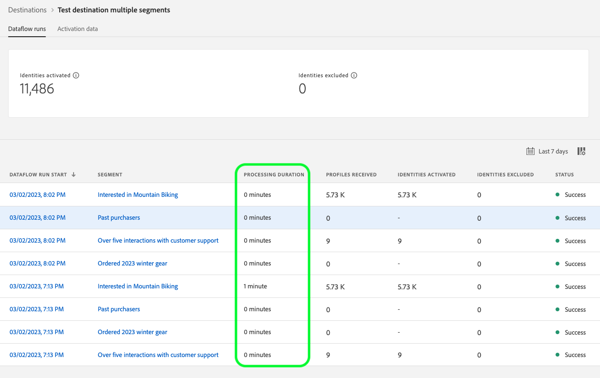

# 宛先の詳細を表示

## 概要 {#overview}

Adobe Experience Platformのユーザーインターフェイスでは、宛先の属性とアクティビティを表示およびモニタリングできます。 これらの詳細には、宛先の名前と ID、宛先をアクティブ化または無効にするコントロールなどが含まれます。 詳細には、アクティブ化されたプロファイルレコードの指標、アクティブ化された ID、失敗および除外された ID、データフロー実行の履歴も含まれます。

>[!NOTE]
>
>宛先の詳細ページは、[!DNL Experience Platform] [!DNL UI] の [!UICONTROL  宛先 ] ワークスペースの一部です。 詳しくは、[[!UICONTROL  宛先 ]Workspace の概要 ](./destinations-workspace.md) を参照してください。

## 宛先の詳細を表示 {#view-details}

既存の宛先に関する詳細を表示するには、次の手順に従います。 宛先の宛先 ID、宛先を作成したユーザー、作成時などの情報を確認できます。

1. [Experience Platform UI](https://platform.adobe.com/) にログインし、左側のナビゲーションバーから「**[!UICONTROL 宛先]**」を選択します。上部のヘッダーから **[!UICONTROL 参照]** を選択して、既存の宛先を表示します。

   

2. 左上のフィルターアイコン  を選択して、並べ替えパネルを開きます。並べ替えパネルには、すべての宛先のリストが表示されます。 リストから複数の宛先を選択して、選択した宛先に関連付けられた特定のデータフローを表示できます。

   

3. 詳細情報を表示する宛先の行を選択します。 これにより、宛先 ID、宛先接続を作成したユーザー、その他の情報など、宛先に関する情報を含む適切なパネルが表示されます。

   

4. または、表示する *宛先の名前* を選択して、宛先に関する他の情報を表示することもできます。

   

5. 宛先の詳細ページが右側のパネルに表示され、使用可能なコントロールが表示されます。

   

## 右側のパネル {#right-rail}

右側のパネルには、選択した宛先に関する基本情報が表示されます。

右側のパネルに表示されるコントロールと詳細を次の表に示します。

| 右側のパネル項目 | 説明 |
| --- | --- |
| [!UICONTROL  オーディエンスのアクティブ化 ] | このコントロールを選択して、宛先にマッピングされるオーディエンスの編集、書き出しスケジュールの更新、マッピングされた属性および ID の追加および削除を行います。 詳しくは、[ オーディエンスストリーミング宛先に対するオーディエンスデータのアクティブ化 ](./activate-segment-streaming-destinations.md)、[ バッチプロファイルベースの宛先に対するオーディエンスデータのアクティブ化 ](./activate-batch-profile-destinations.md) および [ ストリーミングプロファイルベースの宛先に対するオーディエンスデータのアクティブ化 ](./activate-streaming-profile-destinations.md) に関するガイドを参照してください。 |
| [!UICONTROL 削除] | このデータフローを削除でき、以前にアクティブ化されたオーディエンスが存在する場合は、そのオーディエンスのマッピングを解除できます。 |
| [!UICONTROL 宛先名] | このフィールドを編集して、宛先の名前を更新できます。 |
| [!UICONTROL 説明] | このフィールドを編集して、オプションの説明を宛先に更新または追加できます。 |
| [!UICONTROL 宛先] | オーディエンスの宛先プラットフォームを表します。詳しくは、[ 宛先カタログ ](../catalog/overview.md) を参照してください。 |
| [!UICONTROL ステータス] | 宛先が有効か無効かを示します。 |
| [!UICONTROL マーケティングアクション] | データガバナンスの目的でこの宛先に適用されるマーケティングアクション（ユースケース）を示します。 |
| [!UICONTROL カテゴリ] | 宛先のタイプを示します。 詳しくは、[ 宛先カタログ ](../catalog/overview.md) を参照してください。 |
| [!UICONTROL  接続タイプ ] | オーディエンスを宛先に送信する際に使用するフォームを示します。 可能な値には [!UICONTROL Cookie] および [!UICONTROL  プロファイルベース ] が含まれます。 |
| [!UICONTROL 頻度] | オーディエンスが宛先に送信される頻度を示します。使用可能な値は [!UICONTROL  ストリーミング ] および [!UICONTROL  バッチ ] です。 |
| [!UICONTROL ID] | 宛先によって受け入れられる ID 名前空間（`GAID`、`IDFA`、`email` など）を表します。 受け入れ可能な ID 名前空間について詳しくは、[ID 名前空間の概要 ](../../identity-service/features/namespaces.md) を参照してください。 |
| [!UICONTROL 作成者] | この宛先を作成したユーザーを示します。 |
| [!UICONTROL 作成日] | この宛先が作成された際の UTC 日時を示します。 |

{style="table-layout:auto"}

## [!UICONTROL  有効 ]/[!UICONTROL  無効 ] 切替スイッチ {#enabled-disabled-toggle}

**[!UICONTROL 有効 ]/[!UICONTROL  無効]** 切替スイッチを使用して、宛先へのすべてのデータ書き出しを開始および一時停止できます。

## [!UICONTROL  データフローの実行 ] {#dataflow-runs}

「[!UICONTROL  データフロー実行 ]」タブには、データフローのバッチ宛先およびストリーミング宛先への実行に関する指標データが表示されます。 詳細と指標の定義については、[ データフローの監視 ](monitor-dataflows.md) を参照してください。

>[!NOTE]
>
>* 宛先モニタリング機能は、現在、Experience Platformのすべての宛先 *[Adobe Targetを除く*、[ カスタムパーソナライゼーション ](/help/destinations/catalog/personalization/adobe-target-connection.md) および ](/help/destinations/catalog/personalization/custom-personalization.md)6}Experience Cloud オーディエンス ](/help/destinations/catalog/adobe/experience-cloud-audiences.md) の宛先でサポートされています。[
>* [Amazon Kinesis](/help/destinations/catalog/cloud-storage/amazon-kinesis.md)、[Azure Event Hubs](/help/destinations/catalog/cloud-storage/azure-event-hubs.md) および [HTTP API](/help/destinations/catalog/streaming/http-destination.md) の宛先については、除外された ID、失敗した ID およびアクティブ化された ID に関連する指標が予測されます。 アクティベーションデータの量が多いほど、指標の精度が高くなります。

### データフロー実行時間 {#dataflow-runs-duration}

ストリーミング宛先とファイルベースの宛先では、データフロー実行の表示時間に違いがあります。

### ストリーミングの宛先 {#streaming}

以下の画像に示すように、ほとんどのストリーミングデータフロー実行で示される **[!UICONTROL 処理時間]** は約 4 時間ですが、データフロー実行の実際の処理時間ははるかに短くなります。 データフロー実行ウィンドウは、Experience Platformが宛先への呼び出しを再試行する必要がある場合に長い間開いたままになり、同じ時間枠で到着する遅延データを見逃さないようにします。

詳しくは、監視ドキュメントの [ ストリーミング宛先へのデータフロー実行 ](/help/dataflows/ui/monitor-destinations.md#dataflow-runs-for-streaming-destinations) を参照してください。

### ファイルベースの宛先 {#file-based}

データフローをファイルベースの宛先に対して実行する場合、**[!UICONTROL 処理時間]** は、書き出されるデータのサイズとシステムの読み込みによって異なります。 また、データフローがファイルベースの宛先に対して実行されるは、オーディエンスごとに分類されます。

詳しくは、監視ドキュメントの [ バッチ（ファイルベース）宛先に対するデータフローの実行 ](/help/dataflows/ui/monitor-destinations.md#dataflow-runs-for-batch-destinations) を参照してください。

## [!UICONTROL  アクティベーションデータ ] {#activation-data}

**[!UICONTROL アクティベーションデータ]** タブには、宛先にマッピングされたオーディエンスのリストが表示されます。これには、オーディエンスの開始日と終了日（該当する場合）やデータ書き出しに関連するその他の情報（書き出しタイプ、スケジュール、頻度など）が含まれます。 特定のオーディエンスに関する詳細を表示するには、リストから名前を選択します。

>[!TIP]
>
>宛先にマッピングされた属性と ID に関する詳細を表示および編集するには、[ 右側のパネル **[!UICONTROL オーディエンスをアクティブ化]** を選択 ](#right-rail) ます。

>[!BEGINSHADEBOX]

ファイルベースの宛先用の「**[!UICONTROL アクティベーションデータ]**」タブ。

>[!ENDSHADEBOX]

>[!BEGINSHADEBOX]

ストリーミング宛先の **[!UICONTROL アクティベーションデータ]** タブ。

>[!ENDSHADEBOX]

### アクティブ化されたオーディエンスをフィルター {#filter-audiences}

宛先に対してアクティブ化されたオーディエンスのリストをフィルタリングするには、検索ボックスにオーディエンス名を入力します。 検索結果に合わせて、オーディエンスのリストが自動的に更新されます。

### アクティベーションフローから複数のオーディエンスを削除 {#bulk-remove}

既存のアクティベーションフローから複数のオーディエンスを削除するには、オーディエンスを選択してから、「**[!UICONTROL オーディエンスを削除]**」を選択します。

### オンデマンドでの複数ファイルのバッチ宛先への書き出し {#bulk-export}

[ アクティベーションデータ ](../ui/export-file-now.md) ページから **[!UICONTROL オンデマンドで複数のファイルを書き出す]** ことができます。 これを行うには、オンデマンドでファイルを書き出すオーディエンスを選択し、「**[!UICONTROL ファイルを今すぐ書き出し]**」コントロールを選択して、1 回限りの書き出しをトリガーにします。これにより、選択した各オーディエンスのファイルがバッチ宛先に配信されます。

### バッチ宛先に書き出された複数のオーディエンスのアクティベーションスケジュールを編集します {#bulk-edit-schedule}

複数のオーディエンスの既存のアクティベーションスケジュールを同時に編集するには、目的のオーディエンスを選択し、「**[!UICONTROL スケジュールを編集]**」を選択します。 書き出しスケジュールを定義または編集する方法について詳しくは、[ オーディエンスの書き出しをスケジュール ](../ui/activate-batch-profile-destinations.md#scheduling) の節を参照してください。

>[!NOTE]
>
>オーディエンスの詳細ページの詳細については、[ オーディエンスポータルの概要 ](../../segmentation/ui/audience-portal.md#segment-details) を参照してください。

### バッチ宛先に書き出された複数のオーディエンスのファイル名を編集します {#bulk-edit-file-names}

複数のオーディエンスの書き出されたファイル名を同時に編集するには、目的のオーディエンスを選択してから、「**[!UICONTROL ファイル名を編集]**」を選択します。 ファイル名の定義または編集方法について詳しくは、[ ファイル名の設定 ](../ui/activate-batch-profile-destinations.md#configure-file-names) の節を参照してください。

