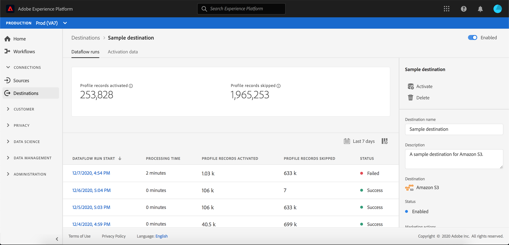

# 宛先の詳細ページ

Adobe Experience Platformユーザーインターフェイスでは、宛先の属性やアクティビティを表示および監視できます。 これらの詳細には、宛先の名前とID、宛先をアクティブ化または無効化するためのコントロールなどが含まれます。 バッチ宛先の詳細には、アクティブ化されたプロファイルレコードの指標やデータフロー実行の履歴も含まれます。

>[!NOTE]
>
>宛先の詳細ページは、プラットフォームUIの [!UICONTROL Destinations] Workspaceに含まれています。 See the [[!UICONTROL Destinations] workspace overview](./destinations-workspace.md) for more information.

Platform UI内の **[!UICONTROL Destinations]** ワークスペースで、「 **[!UICONTROL 参照]** 」タブに移動し、表示する宛先の名前を選択します。

宛先の詳細ページが表示され、使用可能なコントロールが表示されます。 バッチ宛先の詳細を表示している場合は、監視ダッシュボードも表示されます。

また、「参照」タブで、  アイコンを選択して、選択したデータフローを削除することもできます。 宛先に対してアクティブ化されたセグメントは、データフローが削除される前にマッピング解除されます。

## 右側のレール

右側のレールに、目的のファイルに関する基本情報が表示されます。

次の表に、右側のレールに表示されるコントロールと詳細を示します。

| 右側のレールアイテム | 説明 |
| --- | --- |
| [!UICONTROL アクティブ化] | このコントロールを選択して、宛先にマッピングされるセグメントを編集します。 詳しくは、宛先へのセグメントの [アクティブ化に関するガイドを参照してください](./activate-destinations.md) 。 |
| [!UICONTROL 削除] | このデータフローを削除し、既にアクティブ化されたセグメントのマッピングを解除できます（存在する場合）。 |
| [!UICONTROL 宛先名] | このフィールドは、宛先名を更新するために編集できます。 |
| [!UICONTROL 説明] | このフィールドは、任意で説明を更新または追加するために編集できます。 |
| [!UICONTROL 宛先] | オーディエンスの宛先プラットフォームを表します。See the [destinations catalog](../catalog/overview.md) for more information. |
| [!UICONTROL ステータス] | 宛先が有効か無効かを示します。 |
| [!UICONTROL マーケティングアクション] | データ管理の目的でこの宛先に適用されるマーケティングアクション（使用例）を示します。 |
| [!UICONTROL カテゴリ] | 宛先のタイプを示します。 See the [destinations catalog](../catalog/overview.md) for more information. |
| [!UICONTROL 接続タイプ] | オーディエンスが送信先に送信される際に使用されるフォームを示します。 使用できる値は「[!UICONTROL Cookie]」および「[!UICONTROL プロファイルベース]」です。 |
| [!UICONTROL 頻度] | オーディエンスが宛先に送信される頻度を示します。指定できる値は「[!UICONTROL Streaming]」および「[!UICONTROL Batch]」です。 |
| [!UICONTROL ID] | 宛先で受け入れられるID名前空間（、、など） `GAID`を表し `IDFA`ま `email`す。 For more information on accepted identity namespaces, see the [identity namespace overview](../../identity-service/namespaces.md). |
| [!UICONTROL 作成者] | この宛先を作成したユーザーを示します。 |
| [!UICONTROL 作成] | この宛先が作成されたUTC日時を示します。 |

## [!UICONTROL 有効]/[!UICONTROL 無効] 切り替え

「 **[!UICONTROL 有効]/[!UICONTROL 無効]** 」を開始に切り替えて、宛先へのすべてのデータのエクスポートを一時停止できます。

## [!UICONTROL データフローの実行]

「 [!UICONTROL Dataflow runs] 」タブは、データフローの実行上の指標データをバッチ宛先に提供します。 個々の実行とその特定の指標のリストが表示され、プロファイルレコードの以下の合計が示されます。

* **[!UICONTROL アクティブ化されたプロファイルレコード]**:アクティベーション用に作成または更新されたプロファイルレコードの合計数です。
* **[!UICONTROL プロファイルレコードがスキップされました]**: プロファイルEXITまたは欠落した属性に基づいて、アクティベーションでスキップされたプロファイルレコードの合計数です。

>[!NOTE]
>
>データフローの実行は、宛先データフローのスケジュール頻度に基づいて生成されます。 セグメントに適用されたマージ・ポリシーごとに、個別のデータ・フローが実行されます。

特定のデータ・フロー実行の詳細を表示するには、リストから実行の開始時間を選択します。 データフロー実行の詳細ページには、処理されたデータのサイズや、エラー診断の詳細に関するエラーのリストなどの追加情報が含まれます。

## [!UICONTROL アクティベーションデータ]

「 [!UICONTROL アクティベーションデータ] 」タブには、開始日と終了日（該当する場合）を含む、宛先にマッピングされたセグメントのリストが表示されます。 特定のセグメントの詳細を表示するには、リストからセグメント名を選択します。

>[!NOTE]
>
>セグメントの詳細ページについて詳しくは、「 [セグメント化UIの概要](../../segmentation/ui/overview.md#segment-details)」を参照してください。

## 次の手順

このドキュメントでは、宛先の詳細ページの機能について説明します。 UIでの宛先の管理について詳しくは、 [[!UICONTROL Destinations] Workspaceの概要を参照してください](./destinations-workspace.md)。