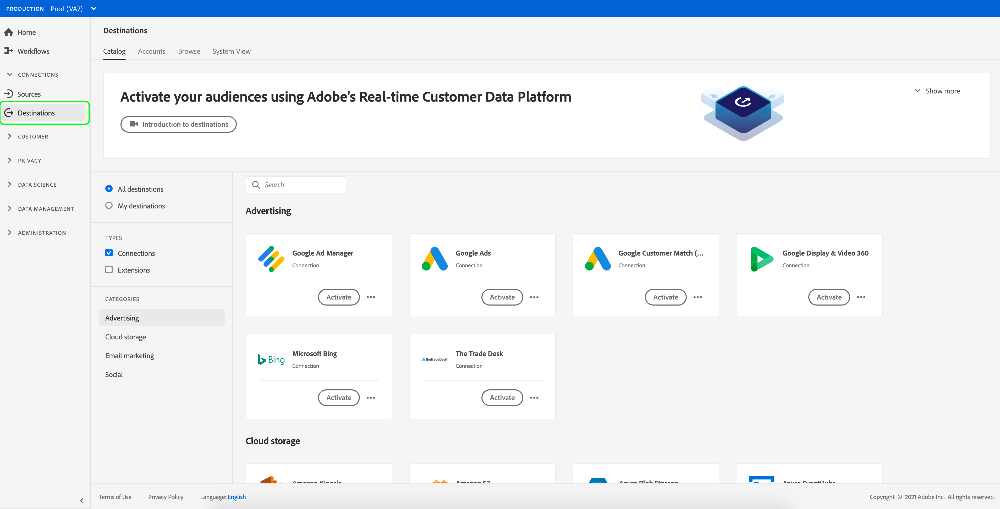

# 宛先ワークスペース {#destinations-workspace}

## 概要 {#overview}

Adobe Experience Platformで、左のナビゲーションバーから「**[!UICONTROL 宛先]**」を選択して、[!UICONTROL 宛先]ワークスペースにアクセスします。

[!UICONTROL 宛先]ワークスペースは、以下の節で説明する4つのセクション[!UICONTROL カタログ]、[!UICONTROL 参照]、[!UICONTROL アカウント]、[!UICONTROL システム表示]で構成されます。

## [!UICONTROL カタログ] {#catalog}

「**[!UICONTROL カタログ]**」タブには、[!DNL Platform]で使用可能なすべての宛先のリストが表示されます。この宛先には、データを送信できます。

[!DNL Platform]ユーザーインターフェイスは、宛先カタログページに検索およびフィルターの複数のオプションを提供します。

* ページの検索機能を使用して、特定の行き先を見つけます。
* [!UICONTROL カテゴリ]コントロールを使用して宛先をフィルターします。
* [!UICONTROL すべての宛先]と[!UICONTROL 宛先]を切り替えます。 「**[!UICONTROL すべての宛先]**」を選択すると、使用可能な[!DNL Platform]宛先がすべて表示されます。 「**[!UICONTROL 宛先]**」を選択すると、接続を確立した宛先のみが表示されます。
* 表示&#x200B;**[!UICONTROL 接続]**&#x200B;または&#x200B;**[!UICONTROL 拡張子]**&#x200B;を選択します。 2つのカテゴリの違いについては、「[宛先の種類とカテゴリ](../destination-types.md)」を参照してください。

宛先カードには、**[!UICONTROL Configure]**&#x200B;または&#x200B;**[!UICONTROL Activate]**&#x200B;コントロールと、より多くのオプションを表示するセカンダリコントロールが含まれます。 以下に、これらのコントロールを示します。

| 制御 | 説明 |
|---------|----------|
| [!UICONTROL 設定] | 宛先への接続を作成できます。 |
| [!UICONTROL アクティブ化] | 宛先への接続を確立すると、セグメントをアクティブ化できます。 |
| [!UICONTROL 表示勘定] | 宛先に接続したアカウントの表示。 |
| [!UICONTROL 表示データフロー] | 宛先に存在するデータアクティベーションフローの表示。 |
| [!UICONTROL 表示ドキュメント] | 特定のドキュメントページへのリンクを開き、そのドキュメントページの詳細と設定に役立ちます。 |

{style=&quot;table-layout:auto&quot;}

カタログ内で目的のカードを選択し、右側のパネルを開きます。 ここで、宛先の説明を確認できます。 右側のレールには、上の表で説明したのと同じコントロールが表示されます。このコントロールには、宛先の説明、宛先のカテゴリとタイプが示されます。

宛先カテゴリーと各宛先の情報について詳しくは、[宛先カタログ](../catalog/overview.md)および[宛先の種類とカテゴリ](../destination-types.md)を参照してください。

## [!UICONTROL アカウント] {#accounts}

「**[!UICONTROL アカウント]**」タブには、様々な宛先で確立した接続の詳細が表示され、既存の接続の詳細を更新できます。 詳しい手順については、[アカウントの更新](update-accounts.md)を参照してください。

## [!UICONTROL 参照] {#browse}

「**[!UICONTROL 参照]**」タブには、接続を確立した宛先が表示されます。**[!UICONTROL 有効/無効]**&#x200B;の切り替えをオンにした宛先は、それぞれアクティブまたは非アクティブに設定します。 **[!UICONTROL セグメント]**/**[!UICONTROL 参照]**&#x200B;を選択し、検査するセグメントを選択して、データの流れる宛先を表示することもできます。 「参照」タブで各宛先に対して提供されるすべての情報については、次の表を参照してください。

>[!TIP]
>
> * **[!UICONTROL 追加名前]**&#x200B;列のボタンを使用して、[他のセグメントをその宛先に対して](activate-destinations.md)アクティブにします。
> * **[!UICONTROL 名前]**&#x200B;列のを使用して、宛先への既存の接続を[削除](delete-destinations.md)します。

| 要素 | 説明 |
|---------|----------|
| 名前 | この宛先へのアクティベーションフローに指定した名前。同じ列には、次の2つのコントロールが含まれます。と[!UICONTROL 宛先]を削除します。 |
| [!UICONTROL 最後のフロー実行ステータス] | 最後のデータフロー実行のステータス。 データフローの実行の詳細については、[表示宛先の詳細](destination-details-page.md)を参照してください。 |
| [!UICONTROL 最終フロー実行日] | 最後のデータフロー実行が発生した日時。 データフローの実行の詳細については、[表示宛先の詳細](destination-details-page.md)を参照してください。 |
| [!UICONTROL 宛先] | アクティベーションフローに対して選択した宛先プラットフォームです。 |
| [!UICONTROL 接続タイプ] | ストレージバケットまたは宛先への接続タイプを表します。 <ul><li>電子メールマーケティングの宛先の場合：S3、FTP、または[!DNL Azure Blob]を指定できます。</li><li>リアルタイム広告の宛先の場合：サーバー間.</li><li>ストリーミング先の場合：[!DNL Azure Event Hubs]または[!DNL Amazon Kinesis]を指定できます。</li></ul> |
| [!UICONTROL ユーザー名] | 宛先フローに対して選択したアカウント資格情報。 |
| [!UICONTROL アクティベーションデータ] | この宛先に対してアクティブ化されているセグメントの数を示します。 このコントロールを選択すると、アクティブ化されたセグメントの詳細を確認できます。 アクティブ化されたセグメントの詳細については、宛先の詳細ページの[アクティベーションデータ](/help/destinations/ui/destination-details-page.md#activation-data)を参照してください。 |
| [!UICONTROL 作成] | 宛先へのアクティベーションフローが作成された日時（UTC 時間）。 |
| [!UICONTROL ステータス] | `Active` または `Inactive`.データがこの宛先に対してアクティブ化されているかどうかを示します。 ステータスを編集するには、「[アクティベーションの無効化](./activate-destinations.md#disable-activation)」を参照してください。 |

目的の行をクリックすると、目的の行に関する詳細情報が右側のレールに表示されます。

宛先名を選択して、この宛先に対してアクティブ化されたセグメントに関する情報を表示します。「**[!UICONTROL アクティベーションの編集]**」をクリックして、この宛先に送信されるセグメントを変更または追加します。

## [!UICONTROL システム表示]{#system-view}

「**[!UICONTROL システム表示]**」タブには、Adobe Experience Platformで設定したアクティベーションフローの図が表示されます。

ページに表示されている宛先を選択し、**[!UICONTROL 表示フロー]**&#x200B;をクリックして、各宛先に対して設定したすべての接続に関する情報を表示します。

