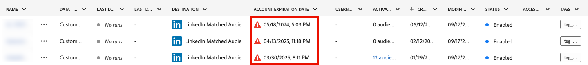
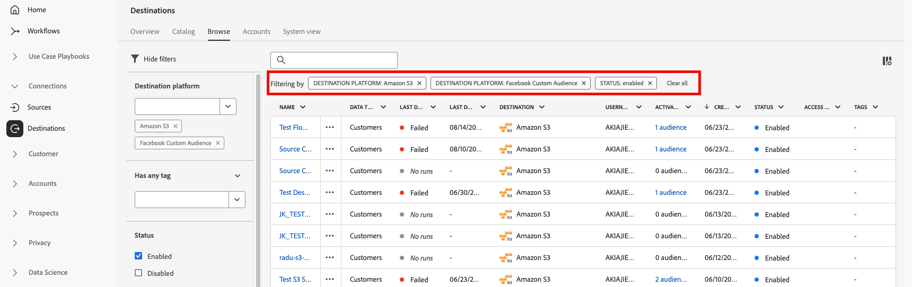

# 宛先ワークスペース {#destinations-workspace}

Adobe Experience Platformで、左側のナビゲーションバーから「**[!UICONTROL Destinations]**」を選択して、[!UICONTROL Destinations] Workspace にアクセスします。

[!UICONTROL Destinations] ワークスペースは、[!UICONTROL Overview]、[!UICONTROL Catalog]、[!UICONTROL Browse]、[!UICONTROL Accounts]、[!UICONTROL System View] の 5 つのセクションで構成されます。これらは、以下の節で説明します。

## [!UICONTROL Overview] {#overview}

「**[!UICONTROL Overview]**」タブには、[!UICONTROL Destinations] ダッシュボードが表示され、組織の宛先データに関連する主要指標が提供されます。 詳しくは、[[!UICONTROL Destinations] ダッシュボードガイドを参照してください ](../../dashboards/guides/destinations.md)。

>[!NOTE]
>
>Experience Platformを初めて使用し、アクティブな宛先がまだない組織の場合は、[!UICONTROL Destinations] ダッシュボードと「[!UICONTROL Overview]」タブは表示されません。 代わりに、左側のナビゲーションから「[!UICONTROL Destinations]」を選択すると、「[[!UICONTROL Catalog]」タブが表示され ](#catalog) す。

## [!UICONTROL Catalog] {#catalog}

「**[!UICONTROL Catalog]**」タブには、データを送信できる、[!DNL Experience Platform] で使用可能なすべての宛先のリストが表示されます。

[!DNL Experience Platform] ユーザーインターフェイスには、宛先カタログページに対して複数の検索およびフィルターオプションが用意されています。

* ページの検索機能を使用して、特定の宛先を見つけます。
* **[!UICONTROL Categories]** コントロールを使用した宛先のフィルタリング。
* **[!UICONTROL All destinations]** と **[!UICONTROL My destinations]** を切り替えます。 **[!UICONTROL All destinations]** を選択すると、使用可能なすべての [!DNL Experience Platform] 宛先が表示されます。 **[!UICONTROL My destinations]** を選択すると、接続を確立した宛先のみを表示できます。
* 選択して、**[!UICONTROL Connections]** や **[!UICONTROL Extensions]** のタイプを表示します。 2 つのカテゴリの違いを理解するには、[宛先のタイプとカテゴリ](../destination-types.md)を参照してください。
* サポートされている [ データタイプ ](/help/destinations/destination-sdk/functionality/destination-configuration/audience-data-type.md) に基づいて、使用可能な宛先をフィルタリングします。 人物オーディエンス、アカウントオーディエンス、見込み客オーディエンス、データセット書き出しから選択します。

宛先カードには、プライマリとセカンダリのコントロールオプションが含まれます。 プライマリ制御には、[!UICONTROL Set up]、[!UICONTROL Activate]、[!UICONTROL Activate audiences]、[!UICONTROL Export datasets] があります。 セカンダリ制御を使用すると、オプションを表示できます。 これらの制御については、以下で説明します。

| コントロール | 説明 |
|---------|----------|
| [!UICONTROL Set up] | 宛先への接続を作成できます。 |
| [!UICONTROL Activate] | 宛先への接続を確立したら、オーディエンスをアクティブ化したり、この宛先にデータセットを書き出したりできます。 |
| [!UICONTROL Activate audiences] | 宛先への接続を確立したら、この宛先に対してオーディエンスをアクティブ化できます。 |
| [!UICONTROL Export datasets] | 宛先への接続を確立したら、この宛先にデータセットを書き出すことができます。 |
| [!UICONTROL View account] | 宛先に接続したアカウントを表示します。 |
| [!UICONTROL View dataflows] | 宛先に存在するデータのアクティベーションフローを表示します。 |
| [!UICONTROL View documentation] | その特定の宛先のドキュメントページへのリンクを開きます。詳細の確認や設定に役立ちます。 |

{style="table-layout:auto"}

カタログ内の宛先カードを選択して、右側のパネルを開きます。ここでは、宛先の説明を確認できます。 右側のパネルには、上の表で説明したのと同じコントロールが表示されます。これには、宛先の説明、宛先のカテゴリおよびタイプが含まれます。

宛先カテゴリと各宛先の情報について詳しくは、[宛先カタログ](../catalog/overview.md)と[宛先のタイプとカテゴリ](../destination-types.md)を参照してください。

## [!UICONTROL Browse] {#browse}

>[!NOTE]
>
>ラベル設定へのアクセスにより、ユーザーがアクセス権を持たない宛先データフローが、UI にグレー表示になる場合があります。 詳しくは、[ アクセスラベルを使用した宛先データフローへのユーザーアクセスの管理 ](../../access-control/abac/apply-access-labels-destinations.md#important-callouts-and-items-to-know) に関するドキュメントを参照してください。

「**[!UICONTROL Browse]**」タブには、接続を確立した宛先が表示されます。

>[!TIP]
>
> [ 検索バー ](#search-browse) から特定のデータフローを検索し、[ サイドバーフィルター ](#filter-options-browse) を使用して結果をさらに絞り込みます。

**[!UICONTROL Enabled/Disabled]** の切り替えをオンにした宛先は、それぞれ **[!UICONTROL Enabled]** または **[!UICONTROL Disabled]** に設定します。 また、**[!UICONTROL Audiences]** / **[!UICONTROL Browse]** を選択し、検査するオーディエンスを選択すると、データのフロー先を表示することもできます。

>[!TIP]
>
> 
> 
> * `...` 列の省略記号（[!UICONTROL Name]）を選択し、**[!UICONTROL Activate audiences]** コントロールを使用して、オーディエンスまたはデータセットをその宛先に書き出すことができます。
> * `...` 列の省略記号（[!UICONTROL Name]）を選択し、**[!UICONTROL Edit destination]**コントロールを使用して、既存の宛先接続を編集します。 詳しくは、[ 宛先の編集 ](/help/destinations/ui/edit-destination.md) に関するチュートリアルを参照してください。
> * `...` 列の省略記号（[!UICONTROL Name]）を選択し、**[!UICONTROL Edit marketing actions]** コントロールを使用して、選択した宛先に対する [ マーケティングアクションの変更 ](/help/destinations/ui/edit-activation.md#edit-marketing-actions) を行います。
> * `...` 列の省略記号（[!UICONTROL Name]）を選択し、**[!UICONTROL Delete]** ントロールを使用して、既存の宛先への接続を [ 削除 ](delete-destinations.md) できます。
> * `...` 列の省略記号（[!UICONTROL Name]）を選択し、**[!UICONTROL View in monitoring]** ントロールを使用して、[ モニタリングダッシュボード ](/help/dataflows/ui/monitor-destinations.md#monitoring-destinations-dashboard) にこの宛先のアクティブ化情報を表示できます。
> * `...` 列で省略記号（[!UICONTROL Name]）を選択し、 コントロールを使用して **[!UICONTROL Subscribe to alerts]** 宛先データフローアラートを購読できます。 アラートを購読して、フロー実行のステータス、成功または失敗に関するメッセージを受け取ることができます。 宛先データフローアラートについて詳しくは、[ コンテキスト内宛先アラートの配信登録 ](alerts.md) を参照してください。
> * `...` 列の省略記号（[!UICONTROL Name]）を選択し、**[!UICONTROL Manage tags]** コントロールを使用して、宛先にタグを追加または宛先からタグを削除します。 タグの使用について詳しくは、[ 宛先タグの管理 ](#manage-tags) の節を参照してください。

「[!UICONTROL Browse]」タブで各宛先に対して提供されるすべての情報については、次の表を参照してください。

| 要素 | 説明 |
|---------|----------|
| 名前 | この宛先へのアクティベーションフローに指定した名前。 |
| データタイプ | 宛先接続でサポートされているデータのタイプ。 サポートされるデータタイプ： <ul><li>**[!UICONTROL Customers]**</li><li>**[!UICONTROL Prospects]**</li><li>**[!UICONTROL Accounts]**</li><li>**[!UICONTROL Datasets]**</li></ul> |
| [!UICONTROL Last Dataflow Run Status] | 前回のデータフロー実行のステータス。データフロー実行について詳しくは、[宛先の詳細を表示](destination-details-page.md)を参照してください。 |
| [!UICONTROL Last Dataflow Run Date] | 前回のデータフローが実行された日時。列ヘッダーを選択して、並べ替えオプション（**[!UICONTROL Sort Ascending]**、**[!UICONTROL Sort Descending]**）にアクセスします。 データフロー実行について詳しくは、[宛先の詳細を表示](destination-details-page.md)を参照してください。 |
| [!UICONTROL Destination] | アクティベーションフローに対して選択した宛先プラットフォームです。 |
| [!UICONTROL Account Expiration Date] | この宛先への接続認証が期限切れになる日付。   有効期限の前に警告アイコン  が表示され、接続が期限切れになり、更新が必要になる可能性があることを警告します。 期限切れ接続へのデータフローは停止しているので、アクティベーションワークフローを再開するには再認証する必要があります。  **重要**：この列は現在、[Pinterest](../catalog/advertising/pinterest.md)、[LinkedIn](../catalog/social/linkedin.md) および [LinkedIn Matched Audiences](../catalog/social/linkedin-b2b.md) の連携でのみ使用できます。  {width="100" zoomable="yes" alt="Screenshot showing the account expiration warning icon and expiration date in the Browse tab."} |
| [!UICONTROL Username] | 宛先フローに対して選択したアカウント資格情報。 |
| [!UICONTROL Activation Data] | この宛先に対してアクティブ化されているオーディエンスの数を示します。 このコントロールを選択すると、アクティブ化されたオーディエンスの詳細が表示されます。 アクティブ化されたオーディエンスについて詳しくは、宛先詳細ページの [ アクティベーションデータ ](/help/destinations/ui/destination-details-page.md#activation-data) を参照してください。 |
| [!UICONTROL Created] | 宛先に対するアクティブ化フローが作成された日時。 上下の矢印記号を選択すると、アクティベーションフローを新しい順または古い順に並べ替えることができます。 |
| [!UICONTROL Modified] | 宛先に対するアクティブ化フローが最後に変更された日時。 |
| [!UICONTROL Status] | `Enabled` または `Disabled`。データがこの宛先に対してアクティブ化されているかどうかを示します。 |
| [!UICONTROL Access labels] | この宛先データフローに追加されたアクセスラベルを表示します。 詳しくは、[ 宛先データフローへのアクセスラベルの適用 ](/help/access-control/abac/apply-access-labels-destinations.md) を参照してください。 |
| [!UICONTROL Tags] | この宛先データフローに追加されたタグを表示します。 タグを使用してデータフローを整理および分類し、管理を容易にします。 |

宛先の行をクリックすると、宛先 ID、説明、アクティブ化されたオーディエンスの数など、宛先に関する詳細情報が右側のパネルに表示されます。

宛先名を選択して、この宛先に対してアクティブ化されたオーディエンスに関する情報を表示します。 「**[!UICONTROL Edit destination]**」をクリックして [ 宛先設定を変更 ](/help/destinations/ui/edit-destination.md) するか、「**[!UICONTROL Activate audiences]**」をクリックして新しいオーディエンスをデータフローに追加します。

### 「参照」タブでのデータフローのフィルタリング {#filter-browse}

「**[!UICONTROL Browse]**」タブには、宛先データフローをすばやく見つけて管理するのに役立つ、強化されたフィルタリングおよび検索機能が含まれています。 左側のサイドバーを使用してフィルターを適用し、検索バーを使用して名前で特定のデータフローを検索します。

### 検索機能 {#search-browse}

テーブルの上部にある検索バーを使用すると、名前でデータフローをすばやく見つけることができます。 入力中、結果は自動的にフィルタリングされ、一致するデータフローのみが表示されます。

### フィルターオプション {#filter-options-browse}

左側のサイドバーのフィルターを使用して、検索を絞り込みます。

* **[!UICONTROL Destination platform]**：特定の宛先プラットフォーム（[!DNL Amazon S3]、[!DNL Facebook Custom Audience]、[!DNL LinkedIn Matched Audience] など）でデータフローをフィルタリングします。 複数のプラットフォームを同時に選択できます。
* **[!UICONTROL Has any tag]**：特定のタグが割り当てられているデータフローをフィルタリングします。 これにより、カスタムタグ付けに基づいてデータフローを整理および検索できます。
* **[!UICONTROL Status]**：操作ステータスでデータフローをフィルタリングします。
   * **[!UICONTROL Enabled]**：アクティブなデータフローのみを表示
   * **[!UICONTROL Disabled]**：非アクティブなデータフローのみを表示します
* **[!UICONTROL Account name]**：関連するアカウント名でデータフローをフィルタリングします。 これは、特定の宛先アカウントに接続されたすべてのデータフローを検索するのに役立ちます。
* **[!UICONTROL Created]**：作成したユーザーでデータフローをフィルタリングします。 このフィルターを使用して、特定のチームメンバーによって作成されたデータフローを検索します。
* **[!UICONTROL Modified by]**：最後に変更したユーザーでデータフローをフィルタリングします。 このフィルターを使用すると、特定のユーザーが行った最近の変更を識別できます。
* **[!UICONTROL Creation date]**：日付範囲を使用して、作成日でデータフローをフィルタリングします。
   * **[!UICONTROL Start date]**：日付範囲の開始日を設定します
   * **[!UICONTROL End date]**：日付範囲の終了日を設定します
* **[!UICONTROL Modified date]**：日付範囲を使用して、変更日でデータフローをフィルタリングします。
   * **[!UICONTROL Start date]**：日付範囲の開始日を設定します
   * **[!UICONTROL End date]**：日付範囲の終了日を設定します

### アクティブなフィルター {#active-filters-browse}

フィルターを適用すると、検索バーの下にタグとして表示されます。

ここでは、次のことができます。

* 現在アクティブなすべてのフィルターを表示
* 各フィルタータグの「`X`」アイコンをクリックして、個々のフィルターを削除します
* 「**[!UICONTROL Clear all]**」オプションを使用して、すべてのフィルターを一度にクリアする

### 宛先タグの管理 {#manage-tags}

タグを使用すると、宛先データフローを整理および分類して管理を容易にすることができます。 個々のデータフローからタグを追加および削除し、ビジネスニーズに基づいてグループ化できます。

タグをデータフローに追加するには、`...` 列の省略記号（**[!UICONTROL Name]**）を選択し、コンテキストメニューから「**[!UICONTROL Manage tags]**」を選択します。
**[!UICONTROL Tags]** フィールドに新しいタグの名前を入力し、**[!UICONTROL Save]** を選択して変更を適用します。

データフローからタグを削除するには、「`...`」列の省略記号（**[!UICONTROL Name]**）を選択し、コンテキストメニューから「**[!UICONTROL Manage tags]**」を選択した後、削除するタグの「`X`」アイコンを選択します。

### タグ付けのベストプラクティス {#tag-best-practices}

以下のタグ付けガイドラインに従って、宛先データフローが整理され、見つけやすく、管理しやすいようにしてください。

* **わかりやすい名前を使用**：データフローの目的やカテゴリを明確に示すタグ（「マーケティングキャンペーン」、「顧客維持」、「季節的プロモーション」など）を作成します。
* **一貫性を保つ**：組織全体で一貫性のある命名規則を使用します
* **シンプルにする**：タグを多く作成しすぎると、フィルタリングの効果が低下する可能性があるので、避けます
* **階層タグの使用**：関連するタグ（「Campaign-Q4」、「Campaign-Q1」など）をグループ化するには、プレフィックスの使用を検討します。

## [!UICONTROL Accounts] {#accounts}

「**[!UICONTROL Accounts]**」タブには、様々な宛先との接続を確立した場合の詳細が表示され、既存のアカウントの詳細を更新または削除できます。 各宛先のアカウントについて取得できるすべての情報については、次の表を参照してください。

>[!TIP]
>
> * `...` 列の省略記号（[!UICONTROL Platform]）を選択し、**[!UICONTROL Activate]**/**[!UICONTROL Activate audiences]**/**[!UICONTROL Export datasets]**コントロールを使用して、オーディエンスまたはデータセットをその宛先に書き出すことができます。
> * `...` 列の省略記号（[!UICONTROL Platform]）を選択し、**[!UICONTROL Edit details]**コントロールを使用して、既存の宛先アカウントの詳細を [ 更新 ](update-accounts.md) します。
> * `...` 列の省略記号（[!UICONTROL Platform]）を選択し、**[!UICONTROL Delete]**コントロールを使用して、既存の宛先アカウントを [ 削除 ](delete-destination-account.md) します。

| 要素 | 説明 |
|---|---|
| [!UICONTROL Name] | 宛先の [ 設定中 ](connect-destination.md#authenticate) に宛先アカウントに割り当てた名前。 列ヘッダーを選択して、並べ替えオプション（**[!UICONTROL Sort Ascending]**、**[!UICONTROL Sort Descending]**）にアクセスします。 |
| [!UICONTROL Destination] | 接続を設定した宛先コネクタ。 |
| [!UICONTROL Connection Type] | ストレージバケットまたは宛先へのアカウント接続タイプを表します。宛先に応じて、認証オプションは次のとおりです。 <ul><li>メールマーケティングの宛先の場合：S3、FTP、Azure Blob のいずれかです。</li><li>リアルタイム広告の宛先の場合：サーバー間</li><li>Amazon S3 クラウドストレージの宛先：アクセスキー </li><li>SFTP クラウドストレージの宛先：SFTP の基本認証</li><li>OAuth 1 または OAuth 2 認証</li><li>ベアラートークン認証</li></ul> |
| [!UICONTROL Username] | [ 宛先に接続ワークフロー ](../catalog/email-marketing/overview.md#connect-destination) で選択したユーザー名。 |
| [!UICONTROL Connections] | 宛先に対して作成された基本情報に接続された、一意の成功した宛先データフローの数を表します。 |
| [!UICONTROL Authorization date] | この宛先への接続が承認された日付。 |
| [!UICONTROL Expiration date] | この宛先への接続認証が期限切れになる日付。   警告アイコン  は有効期限より前に表示され、接続の有効期限が切れ、更新が必要になる可能性があることを警告します。 期限切れ接続へのデータフローは停止しているので、アクティベーションワークフローを再開するには再認証する必要があります。  **重要**：この列は現在、[Pinterest](../catalog/advertising/pinterest.md)、[LinkedIn](../catalog/social/linkedin.md) および [LinkedIn Matched Audiences](../catalog/social/linkedin-b2b.md) 接続でのみ使用できます。  {width="100" zoomable="yes"} |

{style="table-layout:auto"}

### アカウントのフィルタリング {#filter-accounts}

「**[!UICONTROL Accounts]**」タブには、宛先アカウントをすばやく見つけて管理するのに役立つ、強化されたフィルタリング機能と検索機能が含まれています。 左側のサイドバーを使用してフィルターを適用し、検索バーを使用して名前で特定のアカウントを検索します。

#### アカウントの検索 {#search-accounts}

テーブルの上部にある検索バーを使用すると、名前でアカウントをすばやく見つけることができます。 入力中、結果は自動的にフィルターされ、一致するアカウントのみが表示されます。

#### フィルターオプション {#filter-options-accounts}

左側のサイドバーのフィルターを使用して、検索を絞り込みます。

* **[!UICONTROL Destination platform]**：特定の宛先プラットフォーム（例：[!DNL Microsoft Bing]、[!DNL Amazon S3]、[!DNL Facebook Custom Audiences]、[!DNL LinkedIn Matched Audiences] など）でアカウントをフィルタリングします。 複数のプラットフォームを同時に選択できます。
* **[!UICONTROL Created by]**：アカウントを作成したユーザーでアカウントをフィルタリングします。 このフィルターを使用して、特定のチームメンバーが作成したアカウントを検索します。

#### アクティブなフィルター {#active-filters-accounts}

フィルターを適用すると、検索バーの下にタグとして表示されます。

ここでは、次のことができます。

* 現在アクティブなすべてのフィルターを表示
* 各フィルタータグの「`X`」アイコンをクリックして、個々のフィルターを削除します
* 「**[!UICONTROL Clear all]**」オプションを使用して、すべてのフィルターを一度にクリアする

## [!UICONTROL System View] {#system-view}

「**[!UICONTROL System View]**」タブには、Adobe Experience Platformで設定したアクティベーションフローを図で表示します。

ページに表示される任意の宛先を選択し、「**[!UICONTROL View dataflows]**」をクリックして、各宛先に設定したすべての接続に関する情報を表示します。

