# 宛先ワークスペース {#destinations-workspace}

[!DNL Adobe Experience Platform]で、左側のナビゲーションバーから「**[!UICONTROL Destinations]**」を選択して、[!UICONTROL Destinations] ワークスペースにアクセスします。

[!UICONTROL Destinations] ワークスペースは、以下のセクションで説明する5つのセクション、[!UICONTROL Overview]、[!UICONTROL Catalog]、[!UICONTROL Browse]、[!UICONTROL Accounts]および[!UICONTROL System View]で構成されています。

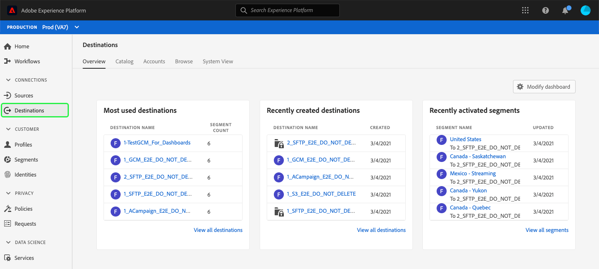

## [!UICONTROL Overview] {#overview}

「**[!UICONTROL Overview]**」タブには、[!UICONTROL Destinations] ダッシュボードが表示され、組織の宛先データに関連する主要な指標が提供されます。 詳しくは、[[!UICONTROL Destinations] ダッシュボードガイド &#x200B;](../../dashboards/guides/destinations.md)を参照してください。

>[!NOTE]
>
>お客様の組織がExperience Platformを初めて利用し、アクティブな宛先を持っていない場合、「[!UICONTROL Destinations]」ダッシュボードと「[!UICONTROL Overview]」タブは表示されません。 代わりに、左側のナビゲーションから[!UICONTROL Destinations]を選択すると、[[!UICONTROL Catalog] タブ &#x200B;](#catalog)が表示されます。

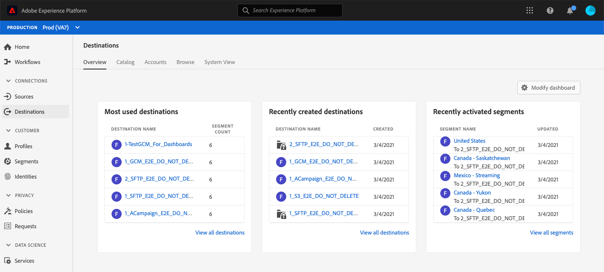

## [!UICONTROL Catalog] {#catalog}

「**[!UICONTROL Catalog]**」タブには、[!DNL Experience Platform]で利用可能なすべての宛先のリストが表示され、データの送信先になります。

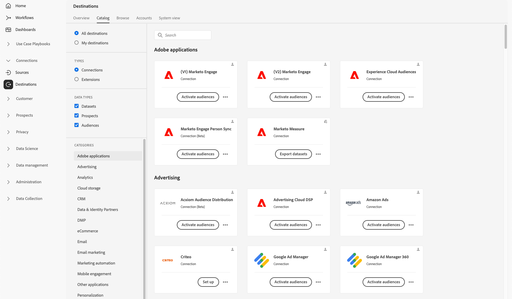

[!DNL Experience Platform] ユーザーインターフェイスには、宛先カタログページに対して複数の検索およびフィルターオプションが用意されています。

* ページの検索機能を使用して、特定の宛先を見つけます。
* **[!UICONTROL Categories]** コントロールを使用して宛先をフィルタリングします。
* **[!UICONTROL All destinations]**&#x200B;と&#x200B;**[!UICONTROL My destinations]**&#x200B;を切り替えます。 **[!UICONTROL All destinations]**&#x200B;を選択すると、利用可能なすべての[!DNL Experience Platform]宛先が表示されます。 **[!UICONTROL My destinations]**&#x200B;を選択すると、接続を確立した宛先のみが表示されます。
* を選択して、**[!UICONTROL Connections]**&#x200B;および/または&#x200B;**[!UICONTROL Extensions]**&#x200B;種類を表示します。 2 つのカテゴリの違いを理解するには、[宛先のタイプとカテゴリ](../destination-types.md)を参照してください。
* サポートされている[&#x200B; データ型](/help/destinations/destination-sdk/functionality/destination-configuration/audience-data-type.md)に基づいて、使用可能な宛先をフィルタリングします。 人物オーディエンス、アカウントオーディエンス、見込みオーディエンス、データセットの書き出しのいずれかを選択します。

宛先カードには、プライマリとセカンダリのコントロールオプションが含まれます。 プライマリコントロールには、[!UICONTROL Set up]、[!UICONTROL Activate]、[!UICONTROL Activate audiences]または[!UICONTROL Export datasets]が含まれます。 セカンダリ制御を使用すると、オプションを表示できます。 これらの制御については、以下で説明します。

| コントロール | 説明 |
|---------|----------|
| [!UICONTROL Set up] | 宛先への接続を作成できます。 |
| [!UICONTROL Activate] | 宛先への接続を確立したら、オーディエンスをアクティブ化するか、データセットをこの宛先に書き出すことができます。 |
| [!UICONTROL Activate audiences] | 宛先への接続を確立したら、この宛先に対してオーディエンスをアクティブ化できます。 |
| [!UICONTROL Export datasets] | 宛先への接続を確立したら、この宛先にデータセットを書き出すことができます。 |
| [!UICONTROL View account] | 宛先に接続したアカウントを表示します。 |
| [!UICONTROL View dataflows] | 宛先に存在するデータのアクティベーションフローを表示します。 |
| [!UICONTROL View documentation] | その特定の宛先のドキュメントページへのリンクを開きます。詳細の確認や設定に役立ちます。 |

{style="table-layout:auto"}

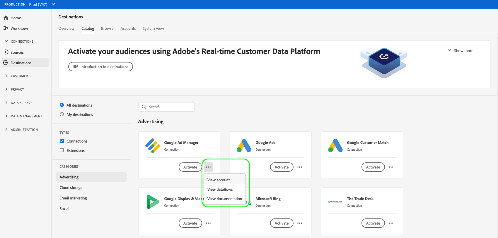

カタログ内の宛先カードを選択して、右側のパネルを開きます。ここでは、宛先の説明を確認できます。 右側のパネルには、上の表で説明したのと同じコントロールが表示されます。これには、宛先の説明、宛先のカテゴリおよびタイプが含まれます。

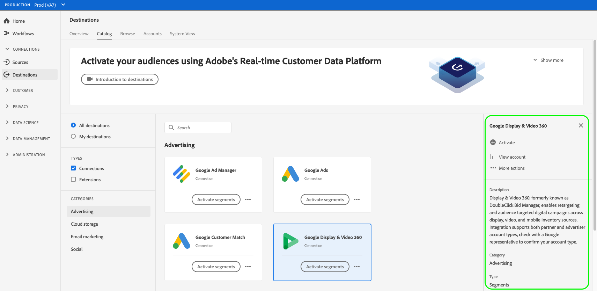

宛先カテゴリと各宛先の情報について詳しくは、[宛先カタログ](../catalog/overview.md)と[宛先のタイプとカテゴリ](../destination-types.md)を参照してください。

## [!UICONTROL Browse] {#browse}

>[!NOTE]
>
>アクセスラベルの設定により、ユーザーがアクセスできない宛先データフローが、グレー表示された状態でUIに表示される場合があります。 詳しくは、[&#x200B; アクセスラベルを使用した宛先データフロー](../../access-control/abac/apply-access-labels-destinations.md#important-callouts-and-items-to-know)へのユーザーアクセスの管理に関するドキュメントを参照してください。

「**[!UICONTROL Browse]**」タブには、接続を確立した宛先が表示されます。

>[!TIP]
>
> [検索バー](#search-browse)で特定のデータフローを検索し、[&#x200B; サイドバーフィルター](#filter-options-browse)を使用して結果をさらに絞り込みます。

「**[!UICONTROL Enabled/Disabled]**」切り替えがオンになっている宛先は、それぞれ宛先を&#x200B;**[!UICONTROL Enabled]**&#x200B;または&#x200B;**[!UICONTROL Disabled]**&#x200B;に設定します。 **[!UICONTROL Audiences]** > **[!UICONTROL Browse]**&#x200B;を選択し、検査するオーディエンスを選択すると、データが流れている宛先を表示することもできます。

>[!TIP]
>
> 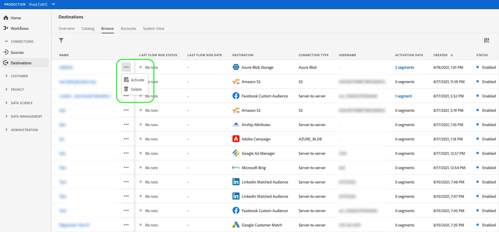
> 
> * `...`列の省略記号（[!UICONTROL Name]）を選択し、 **[!UICONTROL Activate audiences]** コントロールを使用して、オーディエンスまたはデータセットをその宛先に書き出します。
> * `...`列の省略記号（[!UICONTROL Name]）を選択し、**[!UICONTROL Edit destination]**&#x200B;コントロールを使用して、既存の宛先接続を編集します。 詳しくは、[宛先の編集](/help/destinations/ui/edit-destination.md)に関するチュートリアルを参照してください。
> * `...`列の省略記号（[!UICONTROL Name]）を選択し、 **[!UICONTROL Edit marketing actions]** コントロールを使用して、選択した宛先のマーケティングアクション [を](/help/destinations/ui/edit-activation.md#edit-marketing-actions)変更します。
> * `...`列の省略記号（[!UICONTROL Name]）を選択し、 **[!UICONTROL Delete]** コントロールを使用して、宛先への既存の接続を[削除](delete-destinations.md)します。
> * `...`列の省略記号（[!UICONTROL Name]）を選択し、監視コントロールの **[!UICONTROL View in monitoring]** コントロールを使用して、[監視ダッシュボード &#x200B;](/help/dataflows/ui/monitor-destinations.md#monitoring-destinations-dashboard)でこの宛先のアクティブ化情報を表示します。
> * `...`列の省略記号（[!UICONTROL Name]）を選択し、 **[!UICONTROL Subscribe to alerts]** コントロールを使用して、宛先データフローアラートを購読します。 アラートを購読して、フロー実行のステータス、成功または失敗に関するメッセージを受け取ることができます。 宛先データフローアラートについて詳しくは、[&#x200B; コンテキスト内の宛先アラートの購読](alerts.md)を参照してください。
> * `...`列の省略記号（[!UICONTROL Name]）を選択し、 **[!UICONTROL Manage tags]** コントロールを使用して、タグを宛先に追加または削除します。 タグの使用について詳しくは、[宛先タグの管理](#manage-tags)の節を参照してください。

[!UICONTROL Browse] タブの各宛先に提供されるすべての情報については、次の表を参照してください。

| 要素 | 説明 |
|---------|----------|
| 名前 | この宛先へのアクティベーションフローに指定した名前。 |
| データタイプ | 宛先接続でサポートされるデータのタイプ。 サポートされるデータタイプ： <ul><li>**[!UICONTROL Customers]**</li><li>**[!UICONTROL Prospects]**</li><li>**[!UICONTROL Accounts]**</li><li>**[!UICONTROL Datasets]**</li></ul> |
| [!UICONTROL Last Dataflow Run Status] | 前回のデータフロー実行のステータス。データフロー実行について詳しくは、[宛先の詳細を表示](destination-details-page.md)を参照してください。 |
| [!UICONTROL Last Dataflow Run Date] | 前回のデータフローが実行された日時。並べ替えオプション （**[!UICONTROL Sort Ascending]**、**[!UICONTROL Sort Descending]**）にアクセスするには、列ヘッダーを選択します。 データフロー実行について詳しくは、[宛先の詳細を表示](destination-details-page.md)を参照してください。 |
| [!UICONTROL Destination] | アクティベーションフローに対して選択した宛先プラットフォームです。 |
| [!UICONTROL Account Expiration Date] | この宛先への接続認証が期限切れになる日付。  警告アイコン が有効期限の前に表示され、接続が期限切れになり、更新が必要になる可能性があることを警告します。 期限切れの接続へのデータフローは停止され、アクティベーションワークフローを再開するには再認証が必要です。  **重要**：この列は現在、[Pinterest](../catalog/advertising/pinterest.md)、[LinkedIn](../catalog/social/linkedin.md)、[LinkedIn Matched Audiences](../catalog/social/linkedin-b2b.md)接続でのみ使用できます。  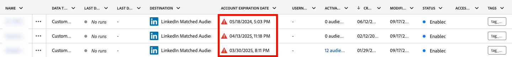{width="100" zoomable="yes" alt="Screenshot showing the account expiration warning icon and expiration date in the Browse tab."} |
| [!UICONTROL Username] | 宛先フローに対して選択したアカウント資格情報。 |
| [!UICONTROL Activation Data] | この宛先に対してアクティブ化されているオーディエンスの数を示します。 このコントロールを選択して、アクティブ化されたオーディエンスの詳細を確認します。 アクティブ化されたオーディエンスについて詳しくは、宛先の詳細ページの[&#x200B; アクティベーションデータ &#x200B;](/help/destinations/ui/destination-details-page.md#activation-data)を参照してください。 |
| [!UICONTROL Created] | 宛先へのアクティベーションフローが作成された日時。 上下の矢印記号を選択すると、アクティベーションフローを新しい順または古い順に並べ替えることができます。 |
| [!UICONTROL Modified] | 宛先へのアクティベーションフローが最後に変更された日時。 |
| [!UICONTROL Status] | `Enabled` または `Disabled`。データがこの宛先に対してアクティブ化されているかどうかを示します。 |
| [!UICONTROL Access labels] | この宛先データフローに追加されたアクセスラベルを表示します。 宛先データフロー[へのアクセスラベルの適用について詳しくは、](/help/access-control/abac/apply-access-labels-destinations.md)を参照してください。 |
| [!UICONTROL Tags] | この宛先データフローに追加されたタグを表示します。 タグを使用してデータフローを整理および分類し、管理を容易にします。 |

{style="table-layout:auto"}

宛先行をクリックすると、宛先ID、説明、アクティブ化されたオーディエンスの数など、右側のパネルに宛先に関する詳細が表示されます。

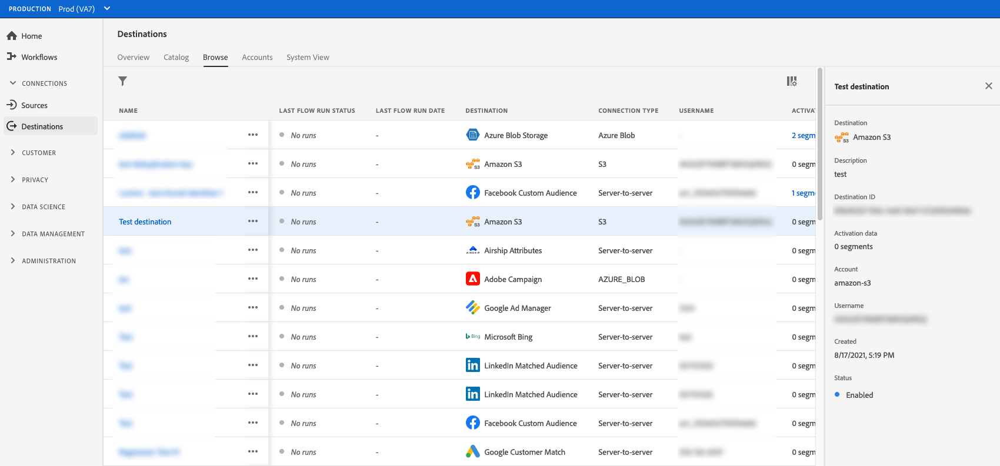

宛先名を選択すると、この宛先に対してアクティブ化されたオーディエンスに関する情報が表示されます。 **[!UICONTROL Edit destination]**&#x200B;をクリックして[宛先設定を変更](/help/destinations/ui/edit-destination.md)または&#x200B;**[!UICONTROL Activate audiences]**&#x200B;し、データフローに新しいオーディエンスを追加します。

### 「参照」タブのデータフローのフィルタリング {#filter-browse}

「**[!UICONTROL Browse]**」タブには、宛先データフローをすばやく検索および管理するための強化されたフィルタリングおよび検索機能が含まれています。 左側のサイドバーを使用してフィルターを適用し、検索バーを使用して特定のデータフローを名前で検索します。

### 検索機能 {#search-browse}

テーブルの上部にある検索バーを使用して、名前でデータフローをすばやく検索します。 入力すると、結果は自動的にフィルタリングされ、一致するデータフローのみが表示されます。

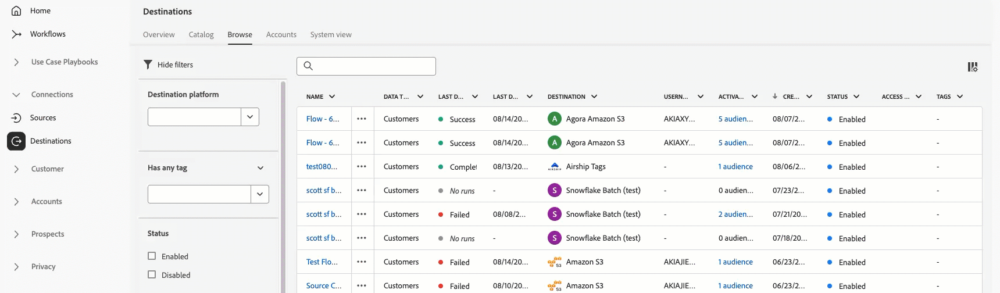

### フィルターオプション {#filter-options-browse}

左側のサイドバーにあるフィルターを使用して、検索を絞り込みます。

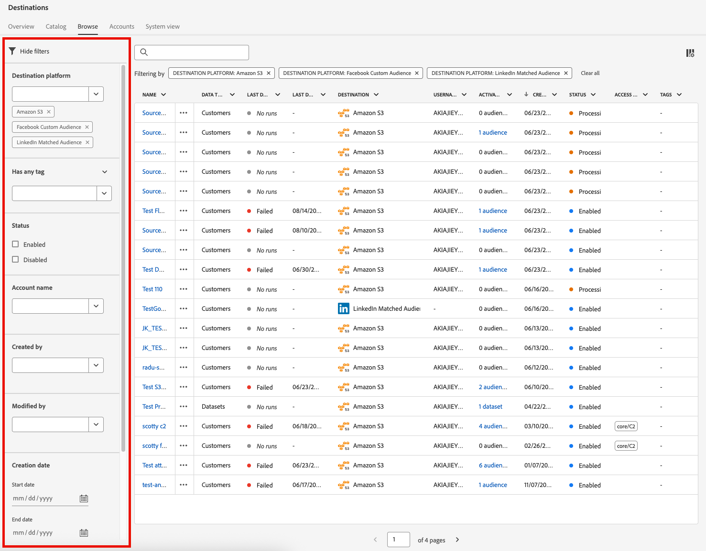

* **[!UICONTROL Destination platform]**：特定の宛先プラットフォームでデータフローをフィルタリングします（例：[!DNL Amazon S3]、[!DNL Facebook Custom Audience]、[!DNL LinkedIn Matched Audience]など）。 複数のプラットフォームを同時に選択できます。
* **[!UICONTROL Has any tag]**：特定のタグが割り当てられているデータフローをフィルタリングします。 これにより、カスタムタグに基づいてデータフローを整理し、見つけることができます。
* **[!UICONTROL Status]**: データフローを操作ステータスでフィルタリングします：
   * **[!UICONTROL Enabled]**: アクティブなデータフローのみを表示
   * **[!UICONTROL Disabled]**：非アクティブなデータフローのみを表示
* **[!UICONTROL Account name]**：関連付けられたアカウント名でデータフローをフィルタリングします。 これにより、特定の宛先アカウントに接続されているすべてのデータフローを見つけることができます。
* **[!UICONTROL Created]**: データフローを作成したユーザーがデータフローをフィルタリングします。 このフィルターを使用して、特定のチームメンバーが作成したデータフローを検索します。
* **[!UICONTROL Modified by]**: データフローを最後に変更したユーザーでフィルタリングします。 このフィルターは、特定のユーザーが最近行った変更を識別するために使用します。
* **[!UICONTROL Creation date]**：日付範囲を使用して、作成日でデータフローをフィルタリングします。
   * **[!UICONTROL Start date]**：日付範囲の先頭を設定します
   * **[!UICONTROL End date]**：日付範囲の終わりを設定します
* **[!UICONTROL Modified date]**：日付範囲を使用して、変更日でデータフローをフィルタリングします。
   * **[!UICONTROL Start date]**：日付範囲の先頭を設定します
   * **[!UICONTROL End date]**：日付範囲の終わりを設定します

### アクティブなフィルター {#active-filters-browse}

フィルターを適用すると、検索バーの下にタグとして表示されます。

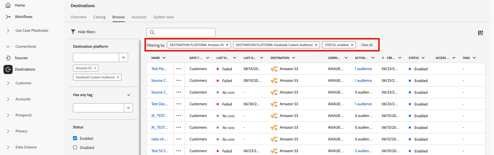

次のことができます。

* 現在アクティブなすべてのフィルターを表示
* 各フィルタータグの`X` アイコンを選択して、個々のフィルターを削除します
* **[!UICONTROL Clear all]** オプションを使用して、すべてのフィルターを一度にクリアします

### 宛先タグの管理 {#manage-tags}

タグは、宛先データフローを整理および分類し、管理を容易にするのに役立ちます。 個々のデータフローにタグを追加したり削除したりすることで、ビジネスニーズに応じてグループ化できます。

データフローにタグを追加するには、`...`列の省略記号（**[!UICONTROL Name]**）を選択し、コンテキストメニューから&#x200B;**[!UICONTROL Manage tags]**&#x200B;を選択します。
**[!UICONTROL Tags]** フィールドに新しいタグの名前を入力し、**[!UICONTROL Save]**&#x200B;を選択して変更を適用します。

タグの選択と作成オプションを表示する

データフローからタグを削除するには、`...`列の省略記号（**[!UICONTROL Name]**）を選択し、コンテキストメニューから&#x200B;**[!UICONTROL Manage tags]**&#x200B;を選択してから、削除するタグの`X` アイコンを選択します。

### タグ付けのベストプラクティス {#tag-best-practices}

以下のタグ付けガイドラインに従って、宛先データフローを整理し、見つけやすく、管理しやすくします。

* **わかりやすい名前を使用**: データフローの目的またはカテゴリを明確に示すタグを作成します（「マーケティングキャンペーン」、「顧客維持」、「季節プロモーション」など）
* **一貫性のある**：組織全体で一貫した命名規則を使用する
* **シンプルさを維持**：タグを作成しすぎないようにします。これにより、フィルタリングの効果が低下する可能性があります
* **階層タグを使用**：関連するタグをグループ化するプレフィックスの使用を検討します（例：「Campaign-Q4」、「Campaign-Q1」）

## [!UICONTROL Accounts] {#accounts}

「**[!UICONTROL Accounts]**」タブには、様々な宛先で確立した接続に関する詳細が表示され、既存のアカウントの詳細を更新または削除できます。 各宛先のアカウントについて取得できるすべての情報については、次の表を参照してください。

>[!TIP]
>
> * `...`列の省略記号（[!UICONTROL Platform]）を選択し、**[!UICONTROL Activate]**/**[!UICONTROL Activate audiences]**/**[!UICONTROL Export datasets]**&#x200B;コントロールを使用して、オーディエンスまたはデータセットをその宛先に書き出します。
> * `...`列の省略記号（[!UICONTROL Platform]）を選択し、**[!UICONTROL Edit details]**&#x200B;コントロールを使用して、既存の宛先アカウントの詳細を[更新](update-accounts.md)します。
> * `...`列の省略記号（[!UICONTROL Platform]）を選択し、**[!UICONTROL Delete]**&#x200B;コントロールを使用して、既存の宛先アカウントを[削除](delete-destination-account.md)します。

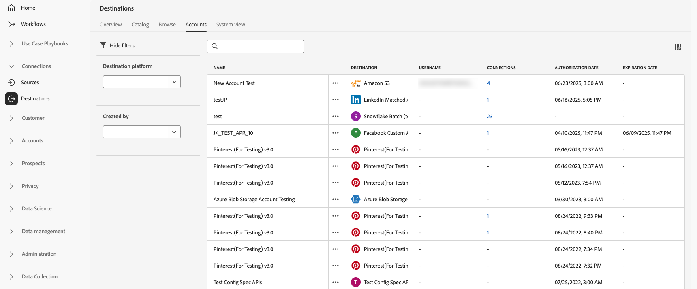

| 要素 | 説明 |
|---|---|
| [!UICONTROL Name] | 宛先を[設定](connect-destination.md#authenticate)している間に宛先アカウントに割り当てた名前。 並べ替えオプション （**[!UICONTROL Sort Ascending]**、**[!UICONTROL Sort Descending]**）にアクセスするには、列ヘッダーを選択します。 |
| [!UICONTROL Destination] | 接続を設定した宛先コネクタ。 |
| [!UICONTROL Connection Type] | ストレージバケットまたは宛先へのアカウント接続タイプを表します。宛先に応じて、認証オプションは次のとおりです。 <ul><li>メールマーケティングの宛先の場合：S3、FTP、Azure Blob のいずれかです。</li><li>リアルタイム広告の宛先の場合：サーバー間</li><li>Amazon S3 クラウドストレージの宛先：アクセスキー </li><li>SFTP クラウドストレージの宛先：SFTP の基本認証</li><li>OAuth 1 または OAuth 2 認証</li><li>ベアラートークン認証</li></ul> |
| [!UICONTROL Username] | [接続先ワークフロー](../catalog/email-marketing/overview.md#connect-destination)で選択したユーザー名。 |
| [!UICONTROL Connections] | 宛先に対して作成された基本情報に接続された、一意の成功した宛先データフローの数を表します。 |
| [!UICONTROL Authorization date] | この宛先への接続が承認された日付。 |
| [!UICONTROL Expiration date] | この宛先への接続認証が期限切れになる日付。  警告アイコン は有効期限の前に表示され、接続が期限切れになり、更新が必要になる可能性があることを通知します。 期限切れの接続へのデータフローは停止され、アクティベーションワークフローを再開するには再認証が必要です。  **重要**：この列は現在、[Pinterest](../catalog/advertising/pinterest.md)、[LinkedIn](../catalog/social/linkedin.md)、[LinkedIn Matched Audiences](../catalog/social/linkedin-b2b.md)接続でのみ使用できます。  {width="100" zoomable="yes"} |

{style="table-layout:auto"}

### アカウントの絞り込み {#filter-accounts}

**[!UICONTROL Accounts]** タブには、宛先アカウントをすばやく検索および管理するための強化されたフィルタリングおよび検索機能が含まれています。 左側のサイドバーを使用してフィルターを適用し、検索バーを使用して名前で特定のアカウントを検索します。

#### アカウントの検索 {#search-accounts}

テーブルの上部にある検索バーを使用すると、名前でアカウントをすばやく検索できます。 入力すると、結果は自動的にフィルタリングされ、一致するアカウントのみが表示されます。

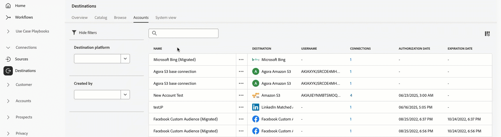

#### フィルターオプション {#filter-options-accounts}

左側のサイドバーにあるフィルターを使用して、検索を絞り込みます。

「アカウント」タブの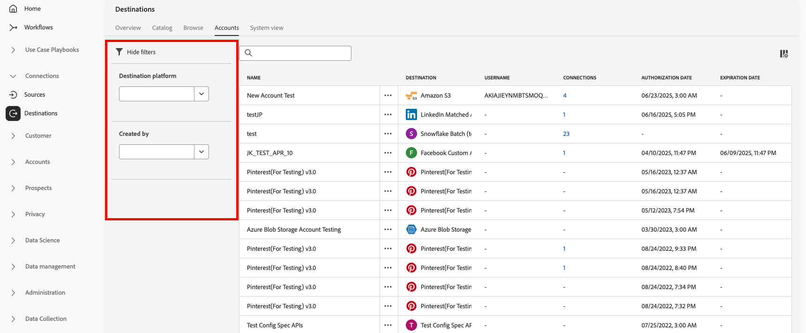

* **[!UICONTROL Destination platform]**：特定の宛先プラットフォームでアカウントをフィルタリングします（例：[!DNL Microsoft Bing]、[!DNL Amazon S3]、[!DNL Facebook Custom Audiences]、[!DNL LinkedIn Matched Audiences]など）。 複数のプラットフォームを同時に選択できます。
* **[!UICONTROL Created by]**: アカウントを作成したユーザーでアカウントをフィルタリングします。 このフィルターを使用して、特定のチームメンバーが作成したアカウントを検索します。

#### アクティブなフィルター {#active-filters-accounts}

フィルターを適用すると、検索バーの下にタグとして表示されます。

「アカウント」タブにタグとして表示される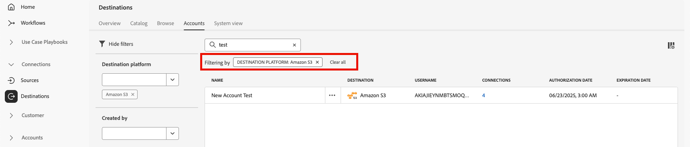

次のことができます。

* 現在アクティブなすべてのフィルターを表示
* 各フィルタータグの`X` アイコンを選択して、個々のフィルターを削除します
* **[!UICONTROL Clear all]** オプションを使用して、すべてのフィルターを一度にクリアします

## [!UICONTROL System View] {#system-view}

「**[!UICONTROL System View]**」タブには、[!DNL Adobe Experience Platform]で設定したアクティベーションフローのグラフィックが表示されます。

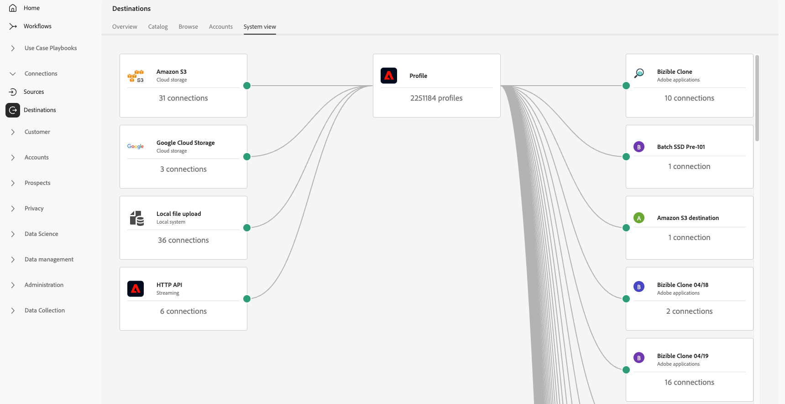

ページに表示されている宛先のいずれかを選択し、**[!UICONTROL View dataflows]**&#x200B;を選択して、各宛先に設定したすべての接続に関する情報を表示します。

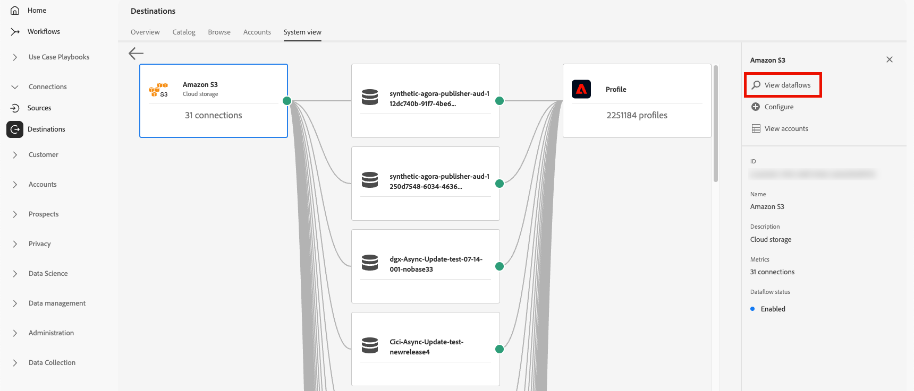
