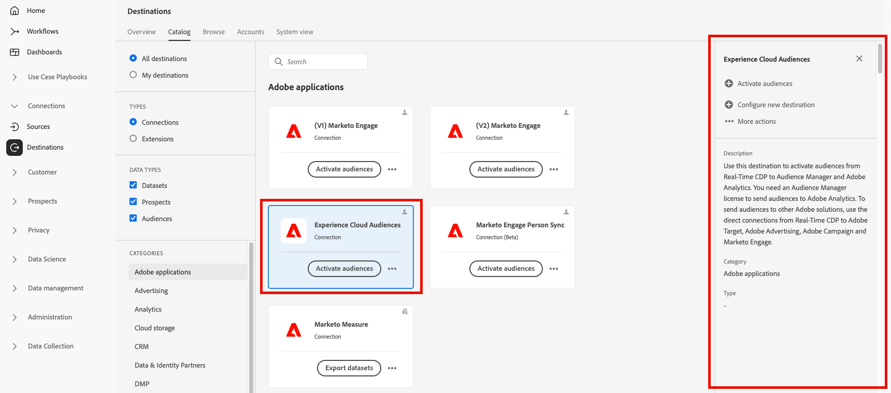
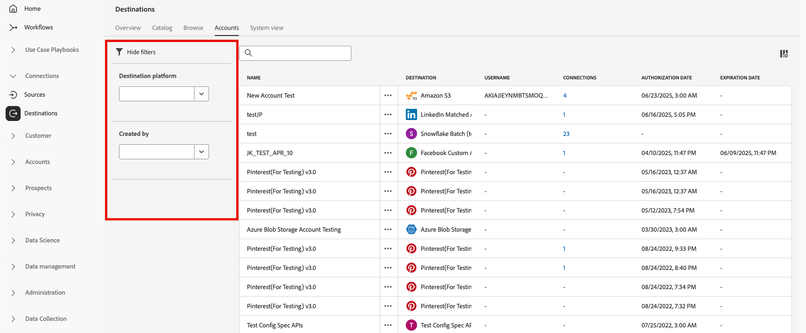

# 宛先ワークスペース {#destinations-workspace}

Adobe Experience Platform で、左側のナビゲーションバーから「**[!UICONTROL 宛先]**」を選択して、[!UICONTROL 宛先]ワークスペースにアクセスします。

[!UICONTROL 宛先]ワークスペースは、「[!UICONTROL 概要]」、「[!UICONTROL カタログ]」、 「[!UICONTROL 参照]」、「[!UICONTROL アカウント]」、「[!UICONTROL システム表示]」の 5 つのセクションで構成されます。これらは、以下の節で説明します。

## [!UICONTROL 概要] {#overview}

「**[!UICONTROL 概要]**」タブには、[!UICONTROL 宛先]ダッシュボードが表示され、組織の宛先データに関連する主要指標が提供されます。詳しくは、[[!UICONTROL 宛先]ダッシュボードガイド](../../dashboards/guides/destinations.md)を参照してください。

>[!NOTE]
>
>Experience Platform を初めて使用し、まだアクティブな宛先がない組織の場合、[!UICONTROL 宛先]ダッシュボードと「[!UICONTROL 概要]」タブは表示されません。 代わりに、左側のナビゲーションから「[!UICONTROL 宛先]」を選択すると、「[[!UICONTROL カタログ]」タブ](#catalog)が表示されます

## [!UICONTROL カタログ] {#catalog}

「**[!UICONTROL カタログ]**」タブには、データを送信できる [!DNL Experience Platform] で使用可能なすべての宛先のリストが表示されます。

[!DNL Experience Platform] ユーザーインターフェイスには、宛先カタログページに対して複数の検索およびフィルターオプションが用意されています。

* ページの検索機能を使用して、特定の宛先を見つけます。
* **[!UICONTROL カテゴリ]**&#x200B;コントロールを使用した宛先のフィルタリング。
* **[!UICONTROL すべての宛先]**&#x200B;と&#x200B;**[!UICONTROL 宛先]**&#x200B;を切り替えます。**[!UICONTROL すべての宛先]**&#x200B;を選択すると、使用可能なすべての [!DNL Experience Platform] の宛先が表示されます。 **[!UICONTROL 宛先]**&#x200B;を選択すると、接続を確立した宛先のみを表示できます。
* 選択して、**[!UICONTROL 接続]**&#x200B;および／または&#x200B;**[!UICONTROL 拡張機能]**&#x200B;のタイプを表示します。 2 つのカテゴリの違いを理解するには、[宛先のタイプとカテゴリ](../destination-types.md)を参照してください。
* サポートされている [ データタイプ ](/help/destinations/destination-sdk/functionality/destination-configuration/audience-data-type.md) に基づいて、使用可能な宛先をフィルタリングします。 人物オーディエンス、アカウントオーディエンス、見込み客オーディエンス、データセット書き出しから選択します。

宛先カードには、プライマリとセカンダリのコントロールオプションが含まれます。 主な制御には [!UICONTROL  設定 ]、[!UICONTROL  アクティブ化 ]、[!UICONTROL  オーディエンスをアクティブ化 ] または [!UICONTROL  データセットを書き出し ] が含まれます。 セカンダリ制御を使用すると、オプションを表示できます。 これらの制御については、以下で説明します。

| コントロール | 説明 |
|---------|----------|
| [!UICONTROL 設定] | 宛先への接続を作成できます。 |
| [!UICONTROL アクティブ化] | 宛先への接続を確立したら、オーディエンスをアクティブ化したり、この宛先にデータセットを書き出したりできます。 |
| [!UICONTROL  オーディエンスのアクティブ化 ] | 宛先への接続を確立したら、この宛先に対してオーディエンスをアクティブ化できます。 |
| [!UICONTROL データセットを書き出し] | 宛先への接続を確立したら、この宛先にデータセットを書き出すことができます。 |
| [!UICONTROL アカウントを表示] | 宛先に接続したアカウントを表示します。 |
| [!UICONTROL データフローを表示] | 宛先に存在するデータのアクティベーションフローを表示します。 |
| [!UICONTROL ドキュメントを表示] | その特定の宛先のドキュメントページへのリンクを開きます。詳細の確認や設定に役立ちます。 |

{style="table-layout:auto"}

カタログ内の宛先カードを選択して、右側のパネルを開きます。ここでは、宛先の説明を確認できます。 右側のパネルには、上の表で説明したのと同じコントロールが表示されます。これには、宛先の説明、宛先のカテゴリおよびタイプが含まれます。

宛先カテゴリと各宛先の情報について詳しくは、[宛先カタログ](../catalog/overview.md)と[宛先のタイプとカテゴリ](../destination-types.md)を参照してください。

## [!UICONTROL 参照] {#browse}

**[!UICONTROL 参照]** タブには、接続を確立した宛先が表示されます。

>[!TIP]
>
> [ 検索バー ](#search-browse) から特定のデータフローを検索し、[ サイドバーフィルター ](#filter-options-browse) を使用して結果をさらに絞り込みます。

宛先の切替スイッチを **[!UICONTROL 有効/無効]** オンにすると、それぞれ **[!UICONTROL 有効]** または **[!UICONTROL 無効]** に設定されます。 また、**[!UICONTROL オーディエンス]**/**[!UICONTROL 参照]** を選択し、検査するオーディエンスを選択すると、データのフロー先を表示することもできます。

>[!TIP]
>
> 
> 
> * `...` 名前 [!UICONTROL  列の省略記号（]）を選択し、**[!UICONTROL オーディエンスをアクティブ化]** コントロールを使用して、オーディエンスまたはデータセットをその宛先に書き出すことができます。
> * `...` 名前 [!UICONTROL  列の省略記号（]）を選択し、**[!UICONTROL  宛先を編集 ]**コントロールを使用して、既存の宛先接続を編集します。 詳しくは、[ 宛先の編集 ](/help/destinations/ui/edit-destination.md) に関するチュートリアルを参照してください。
> * `...` 名前 [!UICONTROL  列の省略記号（]）を選択し、**[!UICONTROL マーケティングアクションの編集]** コントロールを使用して、選択した宛先の [ マーケティングアクションの変更 ](/help/destinations/ui/edit-activation.md#edit-marketing-actions) を行います。
> * `...` 名前 [!UICONTROL  列の省略記号（]）を選択し、**[!UICONTROL 削除]** コントロールを使用して、既存の宛先への接続を [ 削除 ](delete-destinations.md) します。
> * `...` 名前 [!UICONTROL  列の省略記号（]）を選択し、**[!UICONTROL モニタリングで表示]** コントロールを使用して、[ モニタリングダッシュボード ](/help/dataflows/ui/monitor-destinations.md#monitoring-destinations-dashboard) にこの宛先のアクティブ化情報を表示します。
> * `...` 名前 [!UICONTROL  列で省略記号（]）を選択し、**[!UICONTROL アラートを購読]** コントロールを使用して、宛先データフローアラートを購読できます。 アラートを購読して、フロー実行のステータス、成功または失敗に関するメッセージを受け取ることができます。 宛先データフローアラートについて詳しくは、[ コンテキスト内宛先アラートの配信登録 ](alerts.md) を参照してください。
> * `...` 名前 [!UICONTROL  列の省略記号（]）を選択し、**[!UICONTROL タグを管理]** コントロールを使用して、宛先にタグを追加または宛先からタグを削除します。 タグの使用について詳しくは、[ 宛先タグの管理 ](#manage-tags) の節を参照してください。

「[!UICONTROL  参照 ] タブで各宛先に対して提供されるすべての情報については、次の表を参照してください。

| 要素 | 説明 |
|---------|----------|
| 名前 | この宛先へのアクティベーションフローに指定した名前。 |
| データタイプ | 宛先接続でサポートされているデータのタイプ。 サポートされるデータタイプ： <ul><li>**[!UICONTROL 顧客]**</li><li>**[!UICONTROL 見込み客]**</li><li>**[!UICONTROL アカウント]**</li><li>**[!UICONTROL データセット]**</li></ul> |
| [!UICONTROL  前回のデータフロー実行ステータス ] | 前回のデータフロー実行のステータス。データフロー実行について詳しくは、[宛先の詳細を表示](destination-details-page.md)を参照してください。 |
| [!UICONTROL  前回のデータフロー実行日 ] | 前回のデータフローが実行された日時。データフローの実行について詳しくは、[宛先の詳細を表示](destination-details-page.md)を参照してください。 |
| [!UICONTROL 宛先] | アクティベーションフローに対して選択した宛先プラットフォームです。 |
| [!UICONTROL  アカウントの有効期限 ] | この宛先への接続認証が期限切れになる日付。  **重要**：この列は現在、[Facebook](../catalog/social/facebook.md) 接続でのみ使用できます。 |
| [!UICONTROL ユーザー名] | 宛先フローに対して選択したアカウント資格情報。 |
| [!UICONTROL アクティベーションデータ] | この宛先に対してアクティブ化されているオーディエンスの数を示します。 このコントロールを選択すると、アクティブ化されたオーディエンスの詳細が表示されます。 アクティブ化されたオーディエンスについて詳しくは、宛先詳細ページの [ アクティベーションデータ ](/help/destinations/ui/destination-details-page.md#activation-data) を参照してください。 |
| [!UICONTROL 作成日] | 宛先へのアクティベーションフローが作成された日時（UTC 時間）。上下の矢印記号を選択すると、アクティベーションフローを新しい順または古い順に並べ替えることができます。 |
| [!UICONTROL ステータス] | `Enabled` または `Disabled`。データがこの宛先に対してアクティブ化されているかどうかを示します。 |
| [!UICONTROL アクセスラベル] | この宛先データフローに追加されたアクセスラベルを表示します。 詳しくは、[ 宛先データフローへのアクセスラベルの適用 ](/help/access-control/abac/apply-access-labels-destinations.md) を参照してください。 |
| [!UICONTROL タグ] | この宛先データフローに追加されたタグを表示します。 タグを使用してデータフローを整理および分類し、管理を容易にします。 |

宛先の行をクリックすると、宛先 ID、説明、アクティブ化されたオーディエンスの数など、宛先に関する詳細情報が右側のパネルに表示されます。

宛先名を選択して、この宛先に対してアクティブ化されたオーディエンスに関する情報を表示します。 **[!UICONTROL 宛先を編集]** をクリックして [ 宛先設定を変更 ](/help/destinations/ui/edit-destination.md) または **[!UICONTROL オーディエンスをアクティブ化]** をクリックして、新しいオーディエンスをデータフローに追加します。

### 「参照」タブでのデータフローのフィルタリング {#filter-browse}

この **[!UICONTROL 参照]** タブには、宛先データフローをすばやく見つけて管理するのに役立つ、強化されたフィルタリングおよび検索機能が含まれています。 左側のサイドバーを使用してフィルターを適用し、検索バーを使用して名前で特定のデータフローを検索します。

### 検索機能 {#search-browse}

テーブルの上部にある検索バーを使用すると、名前でデータフローをすばやく見つけることができます。 入力中、結果は自動的にフィルタリングされ、一致するデータフローのみが表示されます。

>[!NOTE]
>
> 検索ボックスを使用してデータフローを検索する場合、結果には、[ ユーザーアクセスラベル ](/help/access-control/abac/apply-access-labels-destinations.md) が表示を制限するデータフローが含まれる場合があります。 この動作は、今後のアップデートで修正される予定です。 そのようなデータフローを選択すると、右側のパネルに情報が表示されず、必要なラベルにアクセスできないユーザーは、データフローへのオーディエンスのマッピングやスケジュールの編集などの変更を実行できません。

### フィルターオプション {#filter-options-browse}

左側のサイドバーのフィルターを使用して、検索を絞り込みます。

* **[!UICONTROL 宛先プラットフォーム]**：特定の宛先プラットフォーム（[!DNL Amazon S3]、[!DNL Facebook Custom Audience]、[!DNL LinkedIn Matched Audience] など）でデータフローをフィルタリングします。 複数のプラットフォームを同時に選択できます。
* **[!UICONTROL 任意のタグがある]**：特定のタグが割り当てられているデータフローをフィルタリングします。 これにより、カスタムタグ付けに基づいてデータフローを整理および検索できます。
* **[!UICONTROL ステータス]**：操作ステータスでデータフローをフィルタリングします。
   * **[!UICONTROL 有効]**：アクティブなデータフローのみを表示します
   * **[!UICONTROL 無効]**：非アクティブなデータフローのみを表示します
* **[!UICONTROL アカウント名]**：関連するアカウント名でデータフローをフィルタリングします。 これは、特定の宛先アカウントに接続されたすべてのデータフローを検索するのに役立ちます。
* **[!UICONTROL 作成済み]**：データフローを作成したユーザーでデータフローをフィルタリングします。 このフィルターを使用して、特定のチームメンバーによって作成されたデータフローを検索します。
* **[!UICONTROL 変更者]**：最後に変更したユーザーでデータフローをフィルタリングします。 このフィルターを使用すると、特定のユーザーが行った最近の変更を識別できます。
* **[!UICONTROL 作成日]**：日付範囲を使用して、作成日でデータフローをフィルタリングします。
   * **[!UICONTROL 開始日]**：日付範囲の開始日を設定します
   * **[!UICONTROL 終了日]**：日付範囲の終了日を設定します
* **[!UICONTROL 変更日]**：日付範囲を使用して、変更日でデータフローをフィルタリングします。
   * **[!UICONTROL 開始日]**：日付範囲の開始日を設定します
   * **[!UICONTROL 終了日]**：日付範囲の終了日を設定します

### アクティブなフィルター {#active-filters-browse}

フィルターを適用すると、検索バーの下にタグとして表示されます。

ここでは、次のことができます。

* 現在アクティブなすべてのフィルターを表示
* 各フィルタータグの「`X`」アイコンをクリックして、個々のフィルターを削除します
* 「すべてをクリア **[!UICONTROL オプションを使用して、すべてのフィルターを一度にクリア]** ます

### 宛先タグの管理 {#manage-tags}

タグを使用すると、宛先データフローを整理および分類して管理を容易にすることができます。 個々のデータフローからタグを追加および削除し、ビジネスニーズに基づいてグループ化できます。

データフローにタグを追加するには、「名前 `...` 列の省略記号（**[!UICONTROL ）を選択し、コンテキストメニューから]** タグを管理 **[!UICONTROL を選択し]** す。
「**[!UICONTROL タグ]**」フィールドに新しいタグの名前を入力し、「**[!UICONTROL 保存]**」を選択して変更を適用します。

データフローからタグを削除するには、「`...` 名前 **[!UICONTROL 」列の省略記号（]**）を選択し、コンテキストメニューから「**[!UICONTROL タグを管理]**」を選択した後、削除するタグの `X` アイコンを選択します。

### タグ付けのベストプラクティス {#tag-best-practices}

以下のタグ付けガイドラインに従って、宛先データフローが整理され、見つけやすく、管理しやすいようにしてください。

* **わかりやすい名前を使用**：データフローの目的やカテゴリを明確に示すタグ（「マーケティングキャンペーン」、「顧客維持」、「季節的プロモーション」など）を作成します。
* **一貫性を保つ**：組織全体で一貫性のある命名規則を使用します
* **シンプルにする**：タグを多く作成しすぎると、フィルタリングの効果が低下する可能性があるので、避けます
* **階層タグの使用**：関連するタグ（「Campaign-Q4」、「Campaign-Q1」など）をグループ化するには、プレフィックスの使用を検討します。

## [!UICONTROL アカウント] {#accounts}

「**[!UICONTROL アカウント]**」タブには、様々な宛先との接続を確立した場合の詳細が表示され、既存のアカウントの詳細を更新または削除できます。 各宛先のアカウントについて取得できるすべての情報については、次の表を参照してください。

>[!TIP]
>
> * `...`Platform[!UICONTROL  列の省略記号（]）を選択し、**[!UICONTROL  アクティブ化 ]**/**[!UICONTROL  オーディエンスをアクティブ化 ]**/**[!UICONTROL  データセットを書き出し ]**コントロールを使用して、オーディエンスまたはデータセットをその宛先に書き出すことができます。
> * [!UICONTROL プラットフォーム]列の省略記号（`...`）を選択し、**[!UICONTROL 詳細を編集&#x200B;]**コントロールを使用して、既存の宛先アカウントの詳細を[更新](update-accounts.md)します。
> * [!UICONTROL プラットフォーム]列の省略記号（`...`）を選択し、**[!UICONTROL 削除&#x200B;]**コントロールを使用して、既存の宛先アカウントを[削除](delete-destination-account.md)します。

| 要素 | 説明 |
|---|---|
| [!UICONTROL 名前] | 宛先の [ 設定中 ](connect-destination.md#authenticate) に宛先アカウントに割り当てた名前。 |
| [!UICONTROL 宛先] | 接続を設定した宛先コネクタ。 |
| [!UICONTROL 接続タイプ] | ストレージバケットまたは宛先へのアカウント接続タイプを表します。宛先に応じて、認証オプションは次のとおりです。 <ul><li>メールマーケティングの宛先の場合：S3、FTP、Azure Blob のいずれかです。</li><li>リアルタイム広告の宛先の場合：サーバー間</li><li>Amazon S3 クラウドストレージの宛先：アクセスキー </li><li>SFTP クラウドストレージの宛先：SFTP の基本認証</li><li>OAuth 1 または OAuth 2 認証</li><li>ベアラートークン認証</li></ul> |
| [!UICONTROL ユーザー名] | [ 宛先に接続ワークフロー ](../catalog/email-marketing/overview.md#connect-destination) で選択したユーザー名。 |
| [!UICONTROL 接続] | 宛先に対して作成された基本情報に接続された、一意の成功した宛先データフローの数を表します。 |
| [!UICONTROL  認可日 ] | この宛先への接続が承認された日付。 |
| [!UICONTROL 有効期限] | この宛先への接続認証が期限切れになる日付。  **重要**：この列は現在、[Facebook](../catalog/social/facebook.md) 接続でのみ使用できます。 |

{style="table-layout:auto"}

### アカウントのフィルタリング {#filter-accounts}

「**[!UICONTROL アカウント]**」タブには、宛先アカウントをすばやく見つけて管理するのに役立つ、強化されたフィルタリングおよび検索機能が含まれています。 左側のサイドバーを使用してフィルターを適用し、検索バーを使用して名前で特定のアカウントを検索します。

#### アカウントの検索 {#search-accounts}

テーブルの上部にある検索バーを使用すると、名前でアカウントをすばやく見つけることができます。 入力中、結果は自動的にフィルターされ、一致するアカウントのみが表示されます。

#### フィルターオプション {#filter-options-accounts}

左側のサイドバーのフィルターを使用して、検索を絞り込みます。

* **[!UICONTROL 宛先プラットフォーム]**：特定の宛先プラットフォーム（例：[!DNL Microsoft Bing]、[!DNL Amazon S3]、[!DNL Facebook Custom Audiences]、[!DNL LinkedIn Matched Audiences] など）でアカウントをフィルタリングします。 複数のプラットフォームを同時に選択できます。
* **[!UICONTROL 作成者]**：アカウントを作成したユーザーでアカウントをフィルタリングします。 このフィルターを使用して、特定のチームメンバーが作成したアカウントを検索します。

#### アクティブなフィルター {#active-filters-accounts}

フィルターを適用すると、検索バーの下にタグとして表示されます。

ここでは、次のことができます。

* 現在アクティブなすべてのフィルターを表示
* 各フィルタータグの「`X`」アイコンをクリックして、個々のフィルターを削除します
* 「すべてをクリア **[!UICONTROL オプションを使用して、すべてのフィルターを一度にクリア]** ます

## [!UICONTROL システム表示] {#system-view}

「**[!UICONTROL システム表示]**」タブには、Adobe Experience Platform で設定したアクティベーションフロー図が表示されます。

ページに表示される任意の宛先を選択し、「**[!UICONTROL データフローを表示]**」をクリックして、各宛先に設定したすべての接続に関する情報を表示します。

