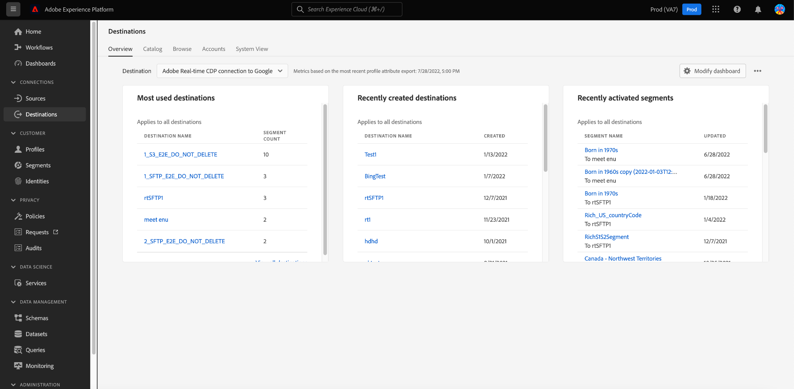

# 宛先ワークスペース {#destinations-workspace}

Adobe Experience Platformで、左側のナビゲーションバーから「**[!UICONTROL 宛先]**」を選択して、「[!UICONTROL 宛先]」ワークスペースにアクセスします。

[!UICONTROL 宛先]ワークスペースは、以下の節で説明する5つのセクション（[!UICONTROL 概要]、[!UICONTROL カタログ]、[!UICONTROL 参照]、[!UICONTROL アカウント]、[!UICONTROL システムビュー]）で構成されます。

## [!UICONTROL 概要] {#overview}

「**[!UICONTROL 概要]**」タブに、[!UICONTROL 宛先]ダッシュボードが表示されます。このダッシュボードには、組織の宛先データに関連する主要指標が表示されます。 詳しくは、[[!UICONTROL 宛先]ダッシュボードガイド](../../dashboards/guides/destinations.md)を参照してください。

>[!NOTE]
>
>組織がExperience Platformを初めて使用し、まだアクティブな宛先がない場合、「[!UICONTROL 宛先]」ダッシュボードと「[!UICONTROL 概要]」タブは表示されません。 代わりに、左のナビゲーションから「[!UICONTROL 宛先]」を選択すると、「[[!UICONTROL カタログ]」タブ](#catalog)が表示されます。

## [!UICONTROL カタログ] {#catalog}

「**[!UICONTROL カタログ]**」タブには、[!DNL Platform]で使用可能なすべての宛先のリストが表示されます。このリストには、データを送信できます。

[!DNL Platform]ユーザーインターフェイスには、宛先カタログページに対する検索およびフィルターのオプションがいくつか用意されています。

* ページ上の検索機能を使用して、特定の宛先を見つけます。
* [!UICONTROL カテゴリ]コントロールを使用して宛先をフィルターします。
* [!UICONTROL すべての宛先]と[!UICONTROL My destinations]を切り替えます。 「**[!UICONTROL すべての宛先]**」を選択すると、使用可能な[!DNL Platform]宛先がすべて表示されます。 「**[!UICONTROL 宛先]**」を選択すると、接続を確立した宛先のみを表示できます。
* **[!UICONTROL 接続]**&#x200B;や&#x200B;**[!UICONTROL 拡張]**&#x200B;を表示する場合に選択します。 2つのカテゴリの違いを理解するには、「[宛先のタイプとカテゴリ](../destination-types.md)」を参照してください。

宛先カードには、**[!UICONTROL Set up]**&#x200B;または&#x200B;**[!UICONTROL Activate segments]**&#x200B;コントロールと、より多くのオプションを表示するセカンダリコントロールが含まれます。 以下に、これらのコントロールについて説明します。

| 制御 | 説明 |
|---------|----------|
| [!UICONTROL 設定] | 宛先への接続を作成できます。 |
| [!UICONTROL セグメントのアクティブ化] | 宛先への接続を確立したら、セグメントをアクティブ化できます。 |
| [!UICONTROL アカウントの表示] | 宛先に接続したアカウントを表示します。 |
| [!UICONTROL データフローの表示] | 宛先に存在するデータアクティベーションフローを表示します。 |
| [!UICONTROL ドキュメントを表示] | その特定の宛先のドキュメントページへのリンクを開きます。詳細情報や設定に役立ちます。 |

{style=&quot;table-layout:auto&quot;}

カタログ内の宛先カードを選択して、右側のパネルを開きます。 ここで、宛先の説明を確認できます。 右側のレールには、宛先の説明、宛先のカテゴリとタイプの表示など、上の表で説明したのと同じコントロールが表示されます。

宛先カテゴリと各宛先の情報について詳しくは、「[宛先カタログ](../catalog/overview.md) 」と「[宛先のタイプとカテゴリ](../destination-types.md) 」を参照してください。

## [!UICONTROL アカウント] {#accounts}

「**[!UICONTROL アカウント]**」タブには、様々な宛先との接続を確立した場合の詳細が表示され、既存の接続の詳細を更新できます。 詳しい手順については、[アカウントの更新](update-accounts.md)を参照してください。

## [!UICONTROL 参照] {#browse}

「**[!UICONTROL 参照]**」タブには、接続を確立した宛先が表示されます。切り替え&#x200B;**[!UICONTROL 有効/無効]**&#x200B;をオンにした宛先は、それぞれアクティブまたは非アクティブに設定します。 **[!UICONTROL Segments]** / **[!UICONTROL Browse]**&#x200B;を選択し、検査するセグメントを選択すると、データのフロー先を表示することもできます。 「参照」タブで各宛先に対して提供されるすべての情報については、次の表を参照してください。

>[!TIP]
>
> * 「[!UICONTROL 名前]」列の3つのドットを選択し、「**[!UICONTROL 「セグメントをアクティブ化&#x200B;]**」ボタンを使用して、セグメントをその宛先に送信します。
> * 「[!UICONTROL 名前]」列の3つのドットを選択し、「**[!UICONTROL 「]**を削除」ボタンを使用して、宛先への既存の接続を[削除](delete-destinations.md)します。

| 要素 | 説明 |
|---------|----------|
| 名前 | この宛先へのアクティベーションフローに指定した名前。同じ列には、次の2つのコントロールが含まれます。と[!UICONTROL 宛先を削除]を有効にします。 |
| [!UICONTROL 最後のフロー実行ステータス] | 最後のデータフロー実行のステータス。 データフロー実行の詳細については、「[宛先の詳細の表示](destination-details-page.md)」を参照してください。 |
| [!UICONTROL 最終フロー実行日] | 最後のデータフロー実行が発生した日時。 データフロー実行の詳細については、「[宛先の詳細の表示](destination-details-page.md)」を参照してください。 |
| [!UICONTROL 宛先] | アクティベーションフローに対して選択した宛先プラットフォームです。 |
| [!UICONTROL 接続タイプ] | ストレージバケットまたは宛先への接続タイプを表します。 <ul><li>電子メールマーケティングの宛先の場合：S3、FTP、[!DNL Azure Blob]のいずれかです。</li><li>リアルタイム広告の宛先の場合：サーバー間.</li><li>ストリーミング先の場合：[!DNL Azure Event Hubs]または[!DNL Amazon Kinesis]を指定できます。</li></ul> |
| [!UICONTROL ユーザー名] | 宛先フローに対して選択したアカウント資格情報。 |
| [!UICONTROL アクティベーションデータ] | この宛先に対してアクティブ化されるセグメントの数を示します。 このコントロールを選択して、アクティブ化されたセグメントの詳細を確認します。 アクティブ化されたセグメントの詳細については、宛先の詳細ページの「 [アクティブ化データ](/help/destinations/ui/destination-details-page.md#activation-data) 」を参照してください。 |
| [!UICONTROL 作成] | 宛先へのアクティベーションフローが作成された日時（UTC 時間）。 |
| [!UICONTROL ステータス] | `Active` または `Inactive`.この宛先に対してデータがアクティブ化されているかどうかを示します。 |

目的の行をクリックすると、目的の行に関する詳細情報が右側のレールに表示されます。

宛先名を選択して、この宛先に対してアクティブ化されたセグメントに関する情報を表示します。「**[!UICONTROL アクティベーションの編集]**」をクリックして、この宛先に送信されるセグメントを変更または追加します。

## [!UICONTROL システム表示] {#system-view}

「**[!UICONTROL システムビュー]**」タブには、Adobe Experience Platformで設定したアクティベーションフローの図が表示されます。

ページに表示される任意の宛先を選択し、「**[!UICONTROL データフローを表示]**」をクリックして、各宛先に設定したすべての接続に関する情報を表示します。

