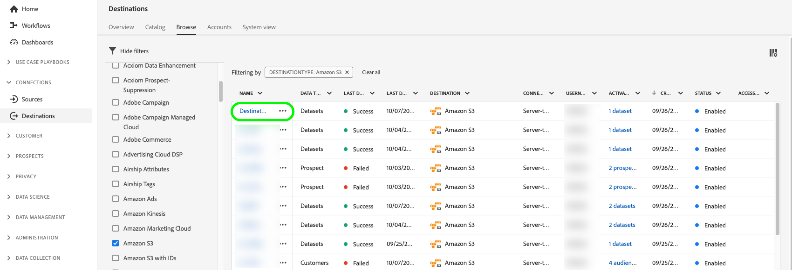

# アクティベーションデータフローを編集 {#edit-activation-flows}

Adobe Experience Platformでは、既存のアクティベーションデータフローの様々なコンポーネントを、書き出したセグメントやプロファイル属性、書き出し頻度、アクティベーションデータフローが有効か無効かなど、宛先に編集できます。

## データフローを編集 {#edit-dataflows}

既存のアクティベーションデータフローを編集するには、次の手順に従います。

1. にログインします。 [Experience PlatformUI](https://platform.adobe.com/) を選択し、 **[!UICONTROL 宛先]** をクリックします。 選択 **[!UICONTROL 参照]** を上部のヘッダーから開き、既存の宛先データフローを表示します。

   

2. フィルターアイコンを選択します。  をクリックして、並べ替えパネルを起動します。 並べ替えパネルには、すべての宛先のリストが表示されます。 リストから複数の宛先を選択して、選択した宛先に関連付けられたデータフローのフィルタリングされた選択を表示できます。

   

3. 編集する宛先データフローの名前を選択します。

   

4. この **[!UICONTROL データフローの実行]** リンク先のページが表示され、使用可能なコントロールが示されます。 この時点で、宛先データフローの複数のコンポーネントを編集できます。

   * 選択 **[!UICONTROL セグメントのアクティブ化]** をクリックして、宛先に送信するセグメントまたはプロファイル属性を変更します。 このアクションを実行すると、アクティベーションワークフローが表示されます。このワークフローは、宛先のタイプに応じて異なります。 詳しくは、次のガイドを参照してください。
      * [ストリーミング宛先をセグメント化するためのオーディエンスデータのアクティブ化](./activate-segment-streaming-destinations.md) ( 例：Facebook、Twitter)。
      * [プロファイルベースの宛先へのオーディエンスデータのアクティブ化](./activate-batch-profile-destinations.md) ( 例：Amazon S3 またはOracleEloqua)。
      * [ストリーミングプロファイルベースの宛先に対するオーディエンスデータのアクティブ化](./activate-streaming-profile-destinations.md) ( 例：HTTP API やAmazon Kinesis)。
   * さらに、宛先のデータフローの名前と説明を編集できます。
   * 以下を使用して、 **[!UICONTROL 有効]/[!UICONTROL 無効]** 宛先へのすべてのデータ書き出しを開始および一時停止する切り替え。

   

## 次の手順 {#next-steps}

このチュートリアルでは、 **[!UICONTROL 宛先]** ワークスペースを使用して、既存の宛先データフローを更新します。

宛先について詳しくは、 [宛先の概要](../catalog/overview.md).
