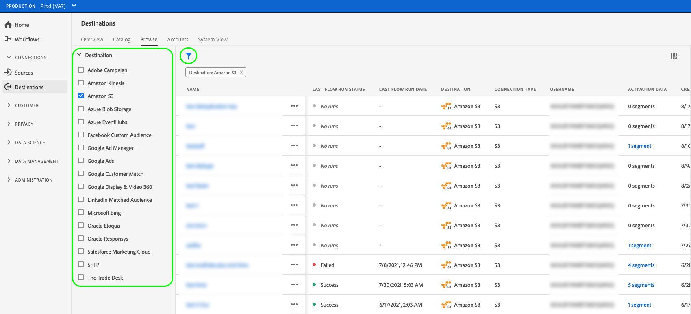
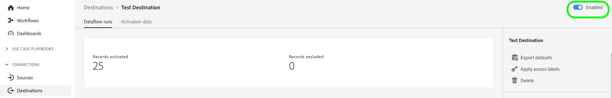
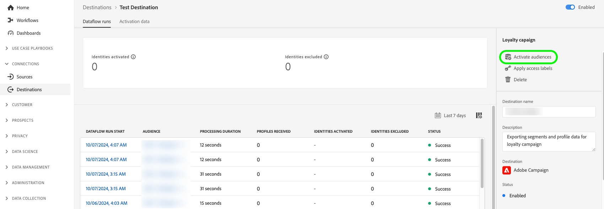
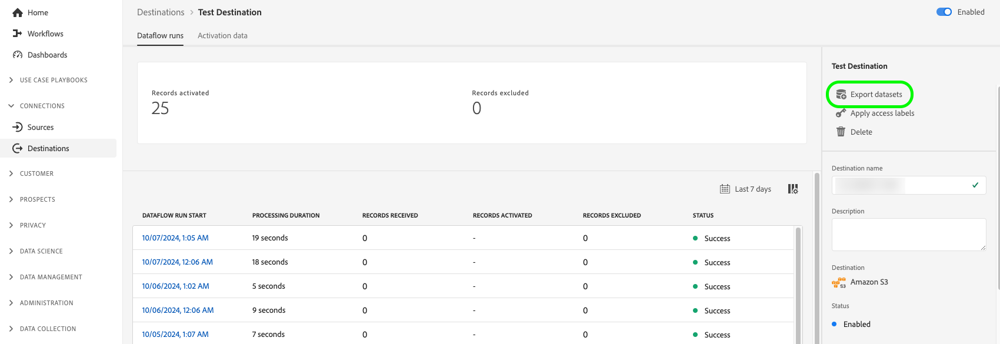
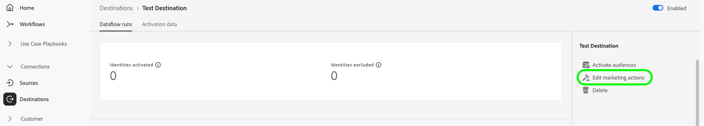
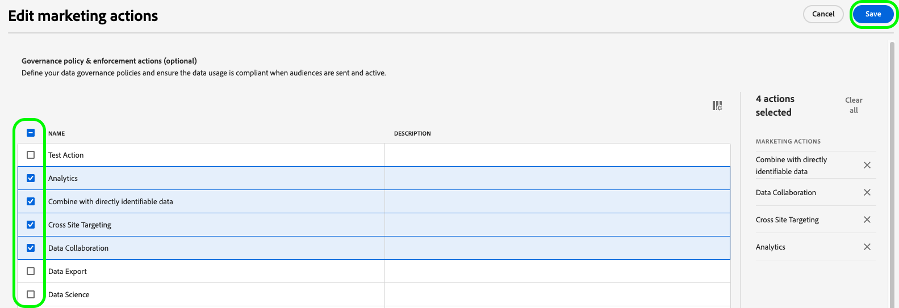
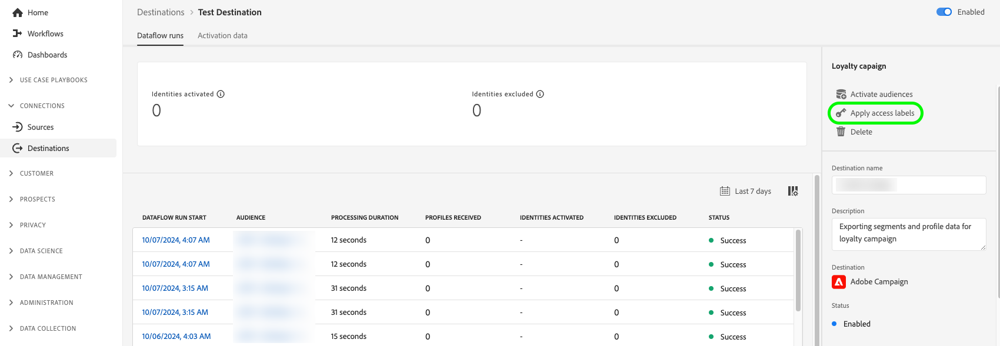
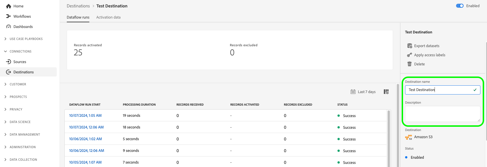

# アクティベーションデータフローを編集 {#edit-activation-flows}

[!DNL Adobe Experience Platform]では、既存のアクティベーションデータフローの様々なコンポーネントを宛先に設定できます。

* [&#x200B; アクティベーションデータフローを有効または無効にする](#enable-disable-dataflows)
* [&#x200B; アクティベーションデータフローに追加オーディエンス &#x200B;](#add-audiences)を追加
* [マッピングされた属性とIDの編集](#edit-mapped-attributes)
* [アクティベーションスケジュールと書き出し頻度の編集](#edit-schedule-frequency)
* [&#x200B; アクティベーションワークフローにデータセット &#x200B;](#add-datasets)を追加
* アクティベーションデータフローの[&#x200B; マーケティングアクションの編集](#edit-marketing-actions)
* [書き出したデータにアクセスラベル &#x200B;](#apply-access-labels)を適用する
* [&#x200B; アクティベーションデータフローの名前と説明を編集](#edit-names-descriptions)

## アクティベーションデータフローを参照 {#browse-activation-dataflows}

既存のアクティベーションデータフローを参照し、編集するデータフローを特定するには、次の手順に従います。

1. [Experience Platform UI](https://platform.adobe.com/)に移動し、左側のナビゲーションバーから&#x200B;**[!UICONTROL Destinations]**&#x200B;を選択します。 上部ヘッダーから「**[!UICONTROL Browse]**」を選択して、既存の宛先データフローを表示します。

   

2. 左上のフィルターアイコン  を選択して、並べ替えパネルを開きます。並べ替えパネルには、すべての宛先のリストが表示されます。 リストから複数の宛先を選択して、選択した宛先に関連付けられた特定のデータフローを表示できます。

   

3. 編集する宛先データフローの名前を選択します。

   

4. 宛先の&#x200B;**[!UICONTROL Dataflow runs]** ページが表示され、使用可能なコントロールが表示されます。 宛先タイプに応じて、さまざまなデータフロー操作を実行できます。 サポートされている各データフロー操作については、次の節を参照してください。

## アクティベーションデータフローを有効または無効にする {#enable-disable-dataflows}

宛先へのすべてのデータ書き出しを開始または一時停止するには、**[!UICONTROL Enabled]/[!UICONTROL Disabled]** トグルを使用します。

## アクティベーションデータフローへのオーディエンスの追加 {#add-audiences}

右側のパネルで「**[!UICONTROL Activate audiences]**」を選択して、宛先に送信するオーディエンスを変更します。 このアクションは、アクティベーションワークフローに移動します。

アクティブ化ワークフローの&#x200B;**[!UICONTROL Select audiences]** ステップで、既存のオーディエンスを削除するか、アクティブ化ワークフローに新しいオーディエンスを追加できます。

アクティベーションのワークフローは、宛先のタイプによって少し異なります。 各宛先タイプのアクティベーションワークフローについて詳しくは、次のガイドを参照してください。

* [&#x200B; ストリーミング宛先に対してオーディエンスをアクティブ化](./activate-segment-streaming-destinations.md) （例：FacebookまたはTwitter）;
* [&#x200B; バッチプロファイル書き出し先にオーディエンスをアクティブ化](./activate-batch-profile-destinations.md) （例：Amazon S3またはOracle Eloqua）;
* [&#x200B; ストリーミングプロファイル書き出し先にオーディエンスをアクティブ化](./activate-streaming-profile-destinations.md) （HTTP APIまたはAmazon Kinesisなど）。

## アクティベーションスケジュールと書き出し頻度の編集 {#edit-schedule-frequency}

右側のパネルで「**[!UICONTROL Activate audiences]**」を選択します。 このアクションは、アクティベーションワークフローに移動します。

アクティベーションワークフローの&#x200B;**[!UICONTROL Scheduling]** ステップを選択して、データフローのアクティベーションスケジュールと書き出し頻度を編集します。 この手順は、データを宛先に書き出す頻度を設定するために使用します。

アクティベーション ワークフローの&#x200B;**[!UICONTROL Scheduling]** ステップでは、次のことができます。

* 書き出し頻度を調整します。
* アクティベーションデータフローの開始日と終了日などを設定または変更します。

実行できるスケジュール設定の操作は、宛先のタイプによって少し異なります。 各宛先タイプのアクティベーションワークフローについて詳しくは、次のガイドを参照してください。

* [&#x200B; ストリーミング宛先に対してオーディエンスをアクティブ化](./activate-segment-streaming-destinations.md) （例：FacebookまたはTwitter）;
* [&#x200B; バッチプロファイル書き出し先にオーディエンスをアクティブ化](./activate-batch-profile-destinations.md) （例：Amazon S3またはOracle Eloqua）;
* [&#x200B; ストリーミングプロファイル書き出し先にオーディエンスをアクティブ化](./activate-streaming-profile-destinations.md) （HTTP APIまたはAmazon Kinesisなど）。

## マッピングされた属性とIDの編集 {#edit-mapped-attributes}

右側のパネルで「**[!UICONTROL Activate audiences]**」を選択します。 このアクションは、アクティベーションワークフローに移動します。

アクティブ化ワークフローの&#x200B;**[!UICONTROL Mapping]** ステップを選択して、アクティブ化データフローのマッピングされた属性とIDを編集します。 この手順を使用して、宛先に書き出すプロファイル属性とIDを調整します。

アクティベーション ワークフローの&#x200B;**[!UICONTROL Mapping]** ステップでは、次のことができます。

* マッピングに新しい属性またはIDを追加します。
* マッピングから既存の属性またはIDを削除します。
* マッピングの順序を調整して、書き出したファイルの列の順序を定義します。

アクティベーションのワークフローは、宛先のタイプによって少し異なります。 各宛先タイプのアクティベーションワークフローについて詳しくは、次のガイドを参照してください。

* [&#x200B; ストリーミング宛先に対してオーディエンスをアクティブ化](./activate-segment-streaming-destinations.md) （例：FacebookまたはTwitter）;
* [&#x200B; バッチプロファイル書き出し先にオーディエンスをアクティブ化](./activate-batch-profile-destinations.md) （例：Amazon S3またはOracle Eloqua）;
* [&#x200B; ストリーミングプロファイル書き出し先にオーディエンスをアクティブ化](./activate-streaming-profile-destinations.md) （HTTP APIまたはAmazon Kinesisなど）。

## アクティベーションデータフローへのデータセットの追加 {#add-datasets}

右側のパネルで「**[!UICONTROL Export datasets]**」を選択し、宛先に書き出す追加のデータセットを選択します。 このオプションを選択すると、[&#x200B; データセット書き出しワークフロー](export-datasets.md)に移動します。

>[!NOTE]
>
>このオプションは、データセットの書き出しをサポートする[宛先にのみ表示されます](export-datasets.md#supported-destinations)。

## マーケティングアクションを編集 {#edit-marketing-actions}

>[!IMPORTANT]
>
>マーケティングアクションを編集するには、**[!UICONTROL Activate Destinations]**&#x200B;および&#x200B;**[!UICONTROL Manage Destinations]** [&#x200B; アクセス制御権限](/help/access-control/home.md#permissions)が必要です。 [アクセス制御の概要](/help/access-control/ui/overview.md)を参照するか、製品管理者に問い合わせて必要な権限を取得してください。

最初に宛先に接続するときに設定したマーケティングアクションを追加または削除できます。

右側のパネルで「**[!UICONTROL Edit marketing actions]**」を選択して、マーケティングアクションの選択画面を開きます。

該当するマーケティング アクションを選択し、**[!UICONTROL Save]**&#x200B;を選択して変更を適用します。

マーケティングアクションの編集画面を示す

## アクセスラベルの適用 {#apply-access-labels}

書き出されたデータのデータ使用ラベルを編集するには、**[!UICONTROL Apply access labels]**&#x200B;を選択します。 詳しくは、[&#x200B; データ使用ラベルのドキュメント &#x200B;](../../data-governance/labels/overview.md)を参照してください。

## アクティベーションデータフロー名と説明の編集 {#edit-names-descriptions}

アクティベーションデータフローの名前と説明を編集するには、**[!UICONTROL Destination name]**&#x200B;および&#x200B;**[!UICONTROL Description]** フィールドを使用します。

## 次の手順 {#next-steps}

**[!UICONTROL destinations]** ワークスペースを使用して宛先データフローを正常に更新しました。

宛先について詳しくは、[宛先の概要](../catalog/overview.md)を参照してください。
