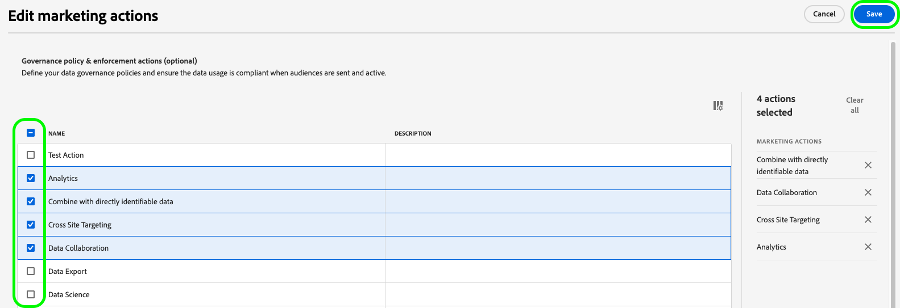

# アクティベーションデータフローを編集 {#edit-activation-flows}

Adobe Experience Platformでは、宛先に対する既存のアクティベーションデータフローの様々なコンポーネントを設定できます。以下に例を示します。

* アクティベーションデータフローの [&#x200B; 有効化または無効化 &#x200B;](#enable-disable-dataflows)
* [&#x200B; 追加のオーディエンスを追加 &#x200B;](#add-audiences) アクティベーションデータフローに
* [マッピングされた属性と ID の編集](#edit-mapped-attributes)
* [アクティベーションスケジュールとエクスポート頻度を編集](#edit-schedule-frequency)
* [&#x200B; 追加のデータセット &#x200B;](#add-datasets) アクティベーションワークフローに
* アクティベーションデータフローの [&#x200B; マーケティングアクションの編集 &#x200B;](#edit-marketing-actions)
* 書き出されたデータへの [&#x200B; アクセスラベルの適用 &#x200B;](#apply-access-labels)
* アクティベーションデータフローの [&#x200B; 名前と説明を編集 &#x200B;](#edit-names-descriptions)

## アクティベーションデータフローを参照 {#browse-activation-dataflows}

次の手順に従って、既存のアクティベーションデータフローを参照し、編集するデータフローを特定します。

1. [Experience Platform UI にログインし &#x200B;](https://platform.adobe.com/) 左側のナビゲーションバーから「**[!UICONTROL Destinations]**」を選択します。 上部のヘッダーから「**[!UICONTROL Browse]**」を選択して、既存の宛先データフローを表示します。

   

2. 左上のフィルターアイコン  を選択して、並べ替えパネルを開きます。並べ替えパネルには、すべての宛先のリストが表示されます。 リストから複数の宛先を選択して、選択した宛先に関連付けられた特定のデータフローを表示できます。

   

3. 編集する宛先データフローの名前を選択します。

   

4. 宛先の **[!UICONTROL Dataflow runs]** ページが表示され、使用可能なコントロールが表示されます。 宛先タイプに応じて、様々なデータフロー操作を実行できます。 サポートされる各データフロー操作については、次の節を参照してください。

## アクティベーションデータフローを有効または無効にする {#enable-disable-dataflows}

**[!UICONTROL Enabled]/[!UICONTROL Disabled]** 切り替えスイッチを使用して、宛先へのすべてのデータ書き出しを開始または一時停止します。

## アクティベーションデータフローへのオーディエンスの追加 {#add-audiences}

右側のパネルで「**[!UICONTROL Activate audiences]**」を選択して、宛先に送信するオーディエンスを変更します。 このアクションを実行すると、アクティベーションワークフローに移動します。

アクティベーションワークフローの **[!UICONTROL Select audiences]** の手順で、既存のオーディエンスを削除したり、新しいオーディエンスをアクティベーションワークフローに追加したりできます。

アクティベーションのワークフローは、宛先のタイプによって若干異なります。 各宛先タイプのアクティベーションワークフローについて詳しくは、次のガイドを参照してください。

* [&#x200B; ストリーミング宛先に対するオーディエンスのアクティブ化 &#x200B;](./activate-segment-streaming-destinations.md) （例：Facebook、Twitter）。
* [&#x200B; プロファイル書き出しのバッチ宛先に対するオーディエンスのアクティブ化 &#x200B;](./activate-batch-profile-destinations.md) （例：Amazon S3 またはOracle Eloqua）。
* [&#x200B; ストリーミングプロファイル書き出し宛先に対するオーディエンスのアクティブ化 &#x200B;](./activate-streaming-profile-destinations.md) （HTTP API やAmazon Kinesis など）。

## アクティベーションスケジュールとエクスポート頻度を編集 {#edit-schedule-frequency}

右側のパネルで「**[!UICONTROL Activate audiences]**」を選択します。 このアクションを実行すると、アクティベーションワークフローに移動します。

アクティベーションワークフローの **[!UICONTROL Scheduling]** のステップを選択して、データフローのアクティベーションスケジュールと書き出し頻度を編集します。 この手順では、データを宛先に書き出す頻度を設定できます。

アクティベーションワークフローの **[!UICONTROL Scheduling]** の手順では、次の操作を実行できます。

* 書き出し頻度を調整します。
* アクティベーションデータフローの開始日と終了日などを設定または変更します。

実行できるスケジューリング操作は、宛先タイプによって若干異なります。 各宛先タイプのアクティベーションワークフローについて詳しくは、次のガイドを参照してください。

* [&#x200B; ストリーミング宛先に対するオーディエンスのアクティブ化 &#x200B;](./activate-segment-streaming-destinations.md) （例：Facebook、Twitter）。
* [&#x200B; プロファイル書き出しのバッチ宛先に対するオーディエンスのアクティブ化 &#x200B;](./activate-batch-profile-destinations.md) （例：Amazon S3 またはOracle Eloqua）。
* [&#x200B; ストリーミングプロファイル書き出し宛先に対するオーディエンスのアクティブ化 &#x200B;](./activate-streaming-profile-destinations.md) （HTTP API やAmazon Kinesis など）。

## マッピングされた属性と ID の編集 {#edit-mapped-attributes}

右側のパネルで「**[!UICONTROL Activate audiences]**」を選択します。 このアクションを実行すると、アクティベーションワークフローに移動します。

アクティベーションワークフローの **[!UICONTROL Mapping]** の手順を選択して、アクティベーションデータフローのマッピングされた属性と ID を編集します。 これにより、宛先に書き出すプロファイル属性と ID を調整できます。

アクティベーションワークフローの **[!UICONTROL Mapping]** の手順では、次の操作を実行できます。

* 新しい属性または ID をマッピングに追加します。
* 既存の属性または ID をマッピングから削除します。
* マッピングの順序を調整して、書き出されたファイルの列順序を定義します。

アクティベーションのワークフローは、宛先のタイプによって若干異なります。 各宛先タイプのアクティベーションワークフローについて詳しくは、次のガイドを参照してください。

* [&#x200B; ストリーミング宛先に対するオーディエンスのアクティブ化 &#x200B;](./activate-segment-streaming-destinations.md) （例：Facebook、Twitter）。
* [&#x200B; プロファイル書き出しのバッチ宛先に対するオーディエンスのアクティブ化 &#x200B;](./activate-batch-profile-destinations.md) （例：Amazon S3 またはOracle Eloqua）。
* [&#x200B; ストリーミングプロファイル書き出し宛先に対するオーディエンスのアクティブ化 &#x200B;](./activate-streaming-profile-destinations.md) （HTTP API やAmazon Kinesis など）。

## アクティベーションデータフローへのデータセットの追加 {#add-datasets}

右側のパネルで「**[!UICONTROL Export datasets]**」を選択して、宛先に書き出す追加のデータセットを選択します。 このオプションを選択すると、[&#x200B; データセット書き出しワークフロー &#x200B;](export-datasets.md) が表示されます。

>[!NOTE]
>
>このオプションは、[&#x200B; データセットの書き出しをサポートする宛先 &#x200B;](export-datasets.md#supported-destinations) に対してのみ表示されます。

## [!BADGE Beta]{type=Informative} マーケティングアクションの編集 {#edit-marketing-actions}

>[!NOTE]
>
>この機能は現在 **ベータ版** です。 アクセスをリクエストするには、Adobe担当者にお問い合わせください。

宛先に最初に接続する際に設定したマーケティングアクションを追加または削除できます。

右側のパネルで「**[!UICONTROL Edit marketing actions]**」を選択して、マーケティングアクション選択画面を開きます。

該当するマーケティングアクションを選択してから、「**[!UICONTROL Save]**」を選択して変更を適用します。

## アクセスラベルの適用 {#apply-access-labels}

「**[!UICONTROL Apply access labels]**」を選択して、書き出されたデータのデータ使用ラベルを編集します。 詳しくは、[&#x200B; データ使用ラベルのドキュメント &#x200B;](../../data-governance/labels/overview.md) を参照してください。

## アクティベーションデータフローの名前と説明の編集 {#edit-names-descriptions}

アクティベーションデータフローの名前と説明を編集するには、「**[!UICONTROL Destination name]**」フィールドと「**[!UICONTROL Description]**」フィールドを使用します。

## 次の手順 {#next-steps}

このチュートリアルでは、**[!UICONTROL destinations]** ワークスペースを使用して既存の宛先データフローを正常に更新しました。

宛先について詳しくは、[&#x200B; 宛先の概要 &#x200B;](../catalog/overview.md) を参照してください。
