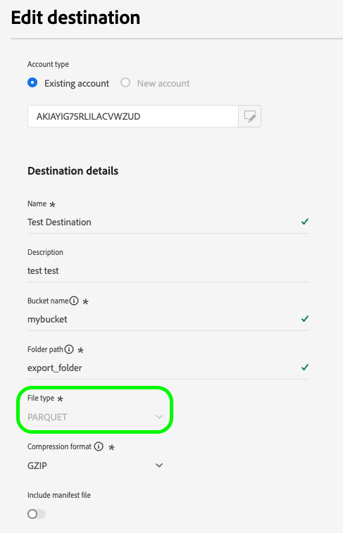
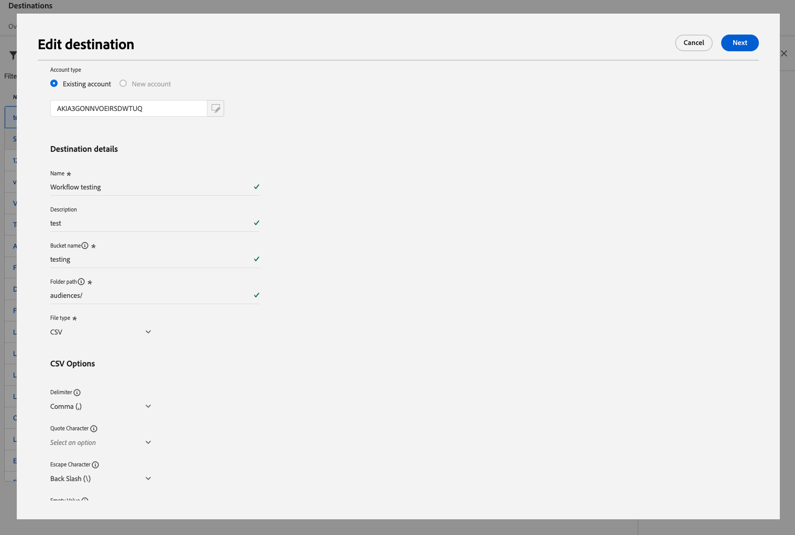
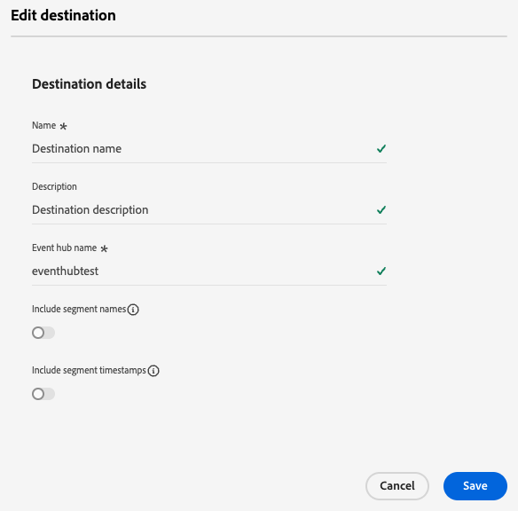
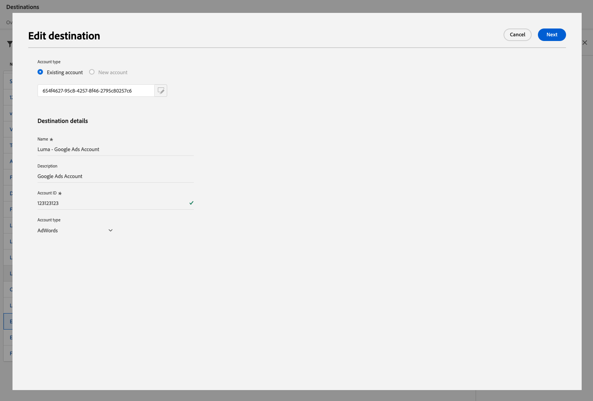

# 宛先の編集

Experience Platform UIを使用して、認証資格情報の更新や場所の書き出しなど、既存の宛先接続の様々なコンポーネントを編集する方法について説明します。

>[!NOTE]
>
> このチュートリアルで説明する編集操作は、API操作でもサポートされています。 詳しくは、[APIで宛先を編集する方法](/help/destinations/api/edit-destination.md)に関するチュートリアルを参照してください。

## 前提条件 {#prerequisites}

宛先接続を編集するには、**[!UICONTROL Manage Destinations]** [ アクセス制御権限](/help/access-control/home.md#permissions)が必要です。 [アクセス制御の概要](/help/access-control/ui/overview.md)を参照するか、製品管理者に問い合わせて必要な権限を取得してください。

## 宛先接続の編集 {#edit}

既存の宛先接続の様々なコンポーネントを編集するには：

1. **[!UICONTROL Destinations]**／**[!UICONTROL Browse]**&#x200B;に移動します。
2. 編集する目的の宛先を選択します。
3. `...`列の省略記号（[!UICONTROL Name]）を選択し、**[!UICONTROL Edit destination]**コントロールを使用して、既存の宛先接続を編集します。
4. モーダルウィンドウで、任意の設定を編集します。 完了したら、**[!UICONTROL Save]**&#x200B;を選択します。

「宛先を編集」ウィンドウでは、最初に宛先に接続したときに設定した設定を更新できます。 これらの設定は、更新する宛先プラットフォームによって異なります。

宛先の設定方法によっては、一部のフィールドが読み取り専用で、編集できない場合があります。 読み取り専用フィールドの値を変更するには、新しいフィールド値で[新しい宛先接続](../ui/connect-destination.md)を作成する必要があります。

読み取り専用フィールドを示す

以下に、[Amazon S3](../catalog/cloud-storage/amazon-s3.md)、[Azure イベントハブ ](../catalog/cloud-storage/azure-event-hubs.md)、[Google Ads](../catalog/advertising/google-ads-destination.md)の宛先に対して更新できる設定の例を示します。

  
  
  

>[!SUCCESS]
>
>これで、宛先接続設定が更新されました。

## その他の編集オプション {#other-editing-options}

Experience Platform UIまたはFlow Service APIを使用すると、以下のリンクに記載されているように、様々な宛先設定を編集できます。

| Experience Platform UIの使用 | Flow Service APIの使用 |
|---------|----------|
| 宛先接続の編集（このページ） | [ ターゲット接続コンポーネント（ストレージの場所と他のコンポーネント）の編集](/help/destinations/api/edit-destination.md#patch-target-connection) |
| [ アカウントの編集](/help/destinations/ui/update-accounts.md) | [ ベース接続コンポーネント（認証パラメーターおよびその他のコンポーネント）を編集](/help/destinations/api/edit-destination.md#patch-base-connection) |
| [ アクティベーションデータフローの編集](/help/destinations/ui/edit-activation.md) | [宛先データフローの更新](/help/destinations/api/update-destination-dataflows.md) |

## 次の手順 {#next-steps}

**[!UICONTROL destinations]** ワークスペースを使用して既存の宛先接続を正常に更新しました。

宛先について詳しくは、[宛先の概要](../catalog/overview.md)を参照してください。
