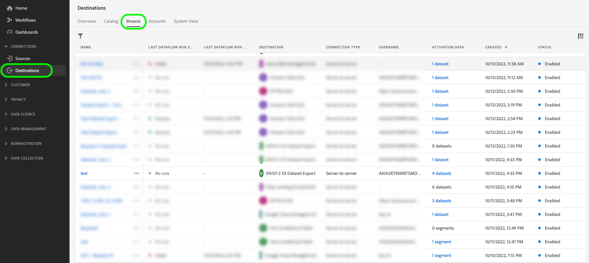
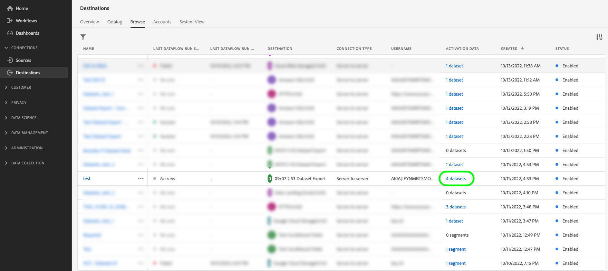
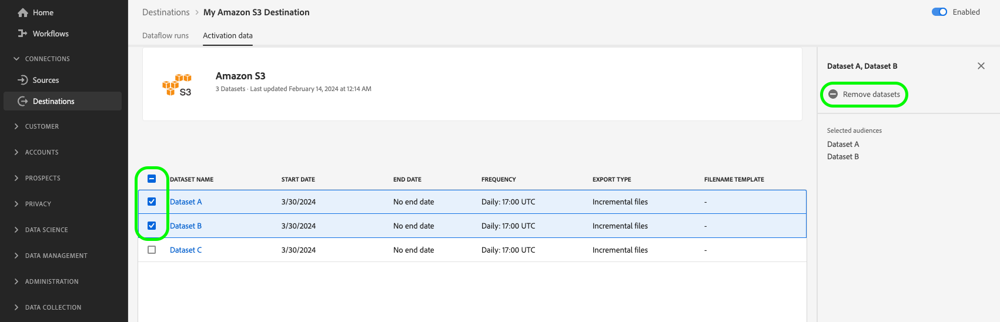
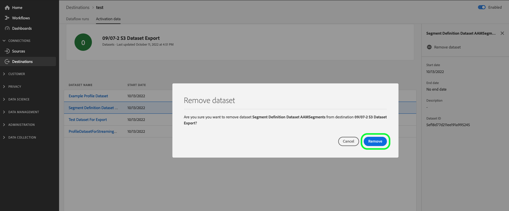

# データセットをクラウドストレージの宛先にエクスポートする

>[!AVAILABILITY]
>
>この機能は、[!DNL Real-Time CDP] PrimeまたはUltimate パッケージ、[!DNL Adobe Journey Optimizer]、またはCustomer Journey Analyticsを購入したお客様が利用できます。 詳しくは、アドビ担当者にお問い合わせください。

>[!IMPORTANT]
>
>**アクション項目**: Experience Platform[の2024年9月2日リリースでは、データセットの書き出しデータフローの日付を](/help/release-notes/latest/latest.md#destinations)に設定するオプションが導入されました。 `endTime`Adobeでは、2024年11月1日&#x200B;*より前に作成されたすべてのデータセット書き出しデータフローに対して、2025年9月1日のデフォルトの終了日も導入されました。*
>
>これらのデータフローのいずれかで、データフローの終了日を終了日より前に手動で更新する必要があります。そうしないと、書き出しはその日に停止します。 Experience Platform UIを使用して、2025年9月1日に停止するように設定されているデータフローを表示します。
>
>データセット書き出しデータフローの終了日を編集する方法については、[ スケジュール設定の節](#scheduling)を参照してください。

ここでは、Experience Platform UIを使用して、[ データセット ](/help/catalog/datasets/overview.md)を[!DNL Adobe Experience Platform]から[!DNL Amazon S3]、SFTPの場所、または[!DNL Google Cloud Storage]などの任意のクラウドストレージの場所に書き出すために必要なワークフローについて説明します。

Experience Platform APIを使用して、データセットを書き出すこともできます。 詳しくは、[ データセットの書き出しAPI チュートリアル ](/help/destinations/api/export-datasets.md)を参照してください。

## 書き出しに使用できるデータセット {#datasets-to-export}

書き出すことができるデータセットは、Experience Platform アプリケーション （[!DNL Real-Time CDP]、[!DNL Adobe Journey Optimizer]）、階層（PrimeまたはUltimate）、および購入したアドオン （例：Data Distiller）によって異なります。

アプリケーション、製品層、購入したアドオンに応じて、書き出すことができるデータセットの種類を次の表で確認してください。

<table>
<thead>
  <tr>
    <th>アプリケーション/アドオン</th>
    <th>階層</th>
    <th>書き出しに使用できるデータセット</th>
  </tr>
</thead>
<tbody>
  <tr>
    <td rowspan="2">[!DNL Real-Time CDP]</td>
    <td>Prime</td>
    <td>ソース、Web SDK、モバイルSDK、Analytics Data Connector、Audience Managerを通じてデータを取得または収集した後、Experience Platform UIで作成されたプロファイルおよびエクスペリエンスイベントデータセット。</td>
  </tr>
  <tr>
    <td>Ultimate</td>
    <td><ul><li>ソース、Web SDK、モバイルSDK、Analytics Data Connector、Audience Managerを通じてデータを取得または収集した後、Experience Platform UIで作成されたプロファイルおよびエクスペリエンスイベントデータセット。</li><li> <a href="https://experienceleague.adobe.com/docs/experience-platform/dashboards/query.html#profile-attribute-datasets"> システム生成プロファイル スナップショット データセット </a>。</li></td>
  </tr>
  <tr>
    <td rowspan="2">[!DNL Adobe Journey Optimizer]</td>
    <td>Prime</td>
    <td><a href="https://experienceleague.adobe.com/docs/journey-optimizer/using/data-management/datasets/export-datasets.html#datasets"> [!DNL Adobe Journey Optimizer]</a> ドキュメントを参照してください。</td>
  </tr>
  <tr>
    <td>Ultimate</td>
    <td><a href="https://experienceleague.adobe.com/docs/journey-optimizer/using/data-management/datasets/export-datasets.html#datasets"> [!DNL Adobe Journey Optimizer]</a> ドキュメントを参照してください。</td>
  </tr>
  <tr>
    <td>Customer Journey Analytics</td>
    <td>すべて</td>
    <td> ソース、Web SDK、モバイルSDK、Analytics Data Connector、Audience Managerを通じてデータを取得または収集した後、Experience Platform UIで作成されたプロファイルおよびエクスペリエンスイベントデータセット。</td>
  </tr>
  <tr>
    <td>Data Distiller</td>
    <td>Data Distiller （アドオン）</td>
    <td>クエリサービスを通じて作成された派生データセット：</td>
  </tr>
</tbody>
</table>

## ビデオチュートリアル {#video-tutorial}

このページで説明されているワークフローのエンドツーエンドの説明、データセットの書き出し機能を使用する利点、推奨されるユースケースについて、次のビデオをご覧ください。

>[!VIDEO](https://video.tv.adobe.com/v/3424392/)

## サポートされる宛先 {#supported-destinations}

現在、スクリーンショットで強調表示され、以下に示すクラウドストレージの宛先にデータセットを書き出すことができます。

* [[!DNL Azure Data Lake Storage Gen2]](../../destinations/catalog/cloud-storage/adls-gen2.md)
* [[!DNL Data Landing Zone]](../../destinations/catalog/cloud-storage/data-landing-zone.md)
* [[!DNL Google Cloud Storage]](../../destinations/catalog/cloud-storage/google-cloud-storage.md)
* [[!DNL Amazon S3]](../../destinations/catalog/cloud-storage/amazon-s3.md#changelog)
* [[!DNL Azure Blob]](../../destinations/catalog/cloud-storage/azure-blob.md#changelog)
* [[!DNL SFTP]](../../destinations/catalog/cloud-storage/sftp.md#changelog)

## オーディエンスをアクティベートしたり、データセットを書き出したりするタイミング {#when-to-activate-audiences-or-activate-datasets}

Experience Platform カタログの一部のファイルベースの宛先では、オーディエンスのアクティベーションとデータセットの書き出しの両方をサポートしています。

* データを活用して、オーディエンスの興味関心や適格性ごとにグループ化したプロファイルを作成したい場合は、オーディエンスのアクティベーションを検討しましょう。
* また、オーディエンスの関心や選定別にグループ化または構造化されていない未加工のデータセットを書き出そうとしている場合は、データセットの書き出しを検討します。 これらのデータは、レポートやデータサイエンスのワークフローなど、さまざまなユースケースで活用できます。 たとえば、管理者、データエンジニア、アナリストであれば、Experience Platformからデータをエクスポートして、データウェアハウスと同期したり、BI分析ツールや外部のクラウド ML ツールで使用したり、システムに保存して長期的なストレージのニーズに対応したりできます。

このドキュメントには、データセットの書き出しに必要な情報がすべて含まれています。*オーディエンス*&#x200B;をクラウドストレージまたはメールマーケティング宛先にアクティベートする場合は、[ オーディエンスデータをバッチプロファイル書き出し宛先にアクティベート ](/help/destinations/ui/activate-batch-profile-destinations.md)をお読みください。

## 前提条件 {#prerequisites}

データセットを書き出すには、次の前提条件に注意してください。

* データセットをクラウドストレージ宛先に書き出すには、正常に[宛先に接続されている](./connect-destination.md)必要があります。まだ接続していない場合は、[宛先カタログ](../catalog/overview.md)に移動し、サポートされている宛先を参照し、使用する宛先を設定します。
* リアルタイム顧客プロファイルで使用するには、プロファイルデータセットを有効にする必要があります。 このオプションを有効にする方法について[詳細](/help/ingestion/tutorials/ingest-batch-data.md#enable-for-profile)を読む。

### 必要な権限 {#permissions}

データセットをエクスポートするには、**[!UICONTROL View Destinations]**、**[!UICONTROL View Datasets]**&#x200B;および&#x200B;**[!UICONTROL Manage and Activate Dataset Destinations]** [ アクセス制御権限](/help/access-control/home.md#permissions)が必要です。 必要な権限を取得するには、[アクセス制御の概要](/help/access-control/ui/overview.md)を参照するか、製品管理者に問い合わせてください。

データセットの書き出しに必要な権限があることと、宛先でデータセットの書き出しがサポートされていることを確認するには、宛先カタログを参照します。 宛先に&#x200B;**[!UICONTROL Activate]**&#x200B;または&#x200B;**[!UICONTROL Export datasets]** コントロールがある場合は、適切な権限を持っています。

## 宛先の選択 {#select-destination}

データセットを書き出すことができる宛先を選択するには、次の手順に従います。

1. **[!UICONTROL Connections > Destinations]**&#x200B;に移動し、「**[!UICONTROL Catalog]**」タブを選択します。

   

1. データセットの書き出し先に対応するカードで&#x200B;**[!UICONTROL Activate]**&#x200B;または&#x200B;**[!UICONTROL Export datasets]**&#x200B;を選択します。

   

1. **[!UICONTROL Data type Datasets]**&#x200B;を選択し、データセットの書き出し先となる宛先接続を選択してから、**[!UICONTROL Next]**&#x200B;を選択します。

>[!TIP]
> 
>データセットを書き出す新しい宛先を設定する場合は、**[!UICONTROL Configure new destination]**&#x200B;を選択して、[宛先に接続](/help/destinations/ui/connect-destination.md) ワークフローをトリガーします。

1. **[!UICONTROL Select datasets]** ビューが表示されます。 次の節に進んで、書き出す[データセットを選択](#select-datasets)します。

## データセットの選択 {#select-datasets}

データセット名の左側にあるチェックボックスを使用して、宛先に書き出すデータセットを選択し、**[!UICONTROL Next]**&#x200B;を選択します。

>[!NOTE]
>
>ここで選択したすべてのデータセットは、同じ書き出しスケジュールを共有します。 異なる書き出しスケジュールが必要な場合（一部のデータセットの増分書き出しや、他のデータセットの1回限りの完全な書き出しなど）、スケジュールタイプごとに個別のデータフローを作成します。

## データセット書き出しのスケジュール設定 {#scheduling}

>[!CONTEXTUALHELP]
>id="platform_destinations_activate_datasets_exportoptions"
>title="データセットのファイル書き出しオプション"
>abstract="「**増分ファイルの書き出し**」を選択すると、前回の書き出し以降にデータセットに追加されたデータのみを書き出すことができます。  最初の増分ファイル書き出しには、データセット内のすべてのデータが含まれ、バックフィルとして機能します。 それ以後の増分ファイルには、最初の書き出し以降にデータセットに追加されたデータのみが含まれます。 各書き出しで各データセットの完全なメンバーシップを書き出すには、「**完全ファイルを書き出し**」を選択します。 "

>[!CONTEXTUALHELP]
>id="dataset_dataflow_needs_schedule_end_date_header"
>title="このデータフローの終了日を更新"
>abstract="このデータフローの終了日を更新"

>[!CONTEXTUALHELP]
>id="dataset_dataflow_needs_schedule_end_date_body"
>title="このデータフロー本文の終了日を更新"
>abstract="この宛先が最近更新されたので、データフローには終了日が必要になりました。アドビでは、デフォルトの終了日を 2025年9月1日（PT）に設定しています。希望の終了日に更新してください。更新しない場合、データの書き出しがデフォルトの日付で停止します。"

>[!IMPORTANT]
>
>**スケジュールは、データフロー**&#x200B;内のすべてのデータセットに適用されます
>
>書き出しスケジュールを設定または変更すると、現在設定しているデータフローを通じて書き出されているすべてのデータセット **に適用されます。**&#x200B;同じデータフロー内で個々のデータセットに異なるスケジュールを設定することはできません。
>
>異なるデータセットに対して異なる書き出しスケジュールが必要な場合は、スケジュールタイプごとに別々のデータフロー（別々の宛先接続）を作成する必要があります。
>
>**例：** データセット Aを増分的にエクスポートしており、データセット Bを1回限りの完全なエクスポート スケジュールで追加した場合、データセット Aも1回限りの完全なエクスポート スケジュールに更新されます。

**[!UICONTROL Scheduling]** ステップを使用して、以下を行います。

* データセットの書き出しに、開始日と終了日、および書き出し頻度を設定します。
* 書き出されたデータセットファイルで、データセットの完全なメンバーシップを書き出す必要があるか、書き出し時に各メンバーシップに対する増分の変更のみを行うかを設定します。
* データセットを書き出すストレージの場所のフォルダーパスをカスタマイズします。 詳しくは、[書き出しフォルダーのパスを編集する方法を参照してください](#edit-folder-path)。

ページの&#x200B;**[!UICONTROL Edit schedule]** コントロールを使用して、書き出しの書き出し頻度を編集したり、完全ファイルと増分ファイルのどちらを書き出すかを選択したりします。

>[!WARNING]
>
>ここでスケジュールを変更すると、このデータフロー内のすべてのデータセットの書き出し動作が更新されます。 このデータフローに複数のデータセットが含まれる場合、これらはすべて、この変更の影響を受けます。

**[!UICONTROL Export incremental files]** オプションはデフォルトで選択されています。 これにより、データセットの完全なスナップショットを表す1つまたは複数のファイルの書き出しがトリガーされます。 後続のファイルは、前回の書き出し以降のデータセットへの増分ファイルです。 **[!UICONTROL Export full files]**&#x200B;を選択することもできます。 この場合、データセットの1回限りの完全な書き出しの頻度&#x200B;**[!UICONTROL Once]**&#x200B;を選択します。

>[!IMPORTANT]
>
>最初の増分ファイル書き出しには、データセット内の既存のすべてのデータが含まれ、バックフィルとして機能します。 書き出しには、1つまたは複数のファイルを含めることができます。

1. **[!UICONTROL Frequency]** セレクターを使用して、書き出し頻度を選択します。

   * **[!UICONTROL Daily]**：指定した時刻に、1日1回、毎日1回、増分ファイル書き出しをスケジュールします。
   * **[!UICONTROL Hourly]**: 3、6、8、または12時間ごとに増分ファイルの書き出しをスケジュールします。

2. **[!UICONTROL Time]** セレクターを使用して、書き出しを行う時刻を[!DNL UTC]形式で選択します。

3. **[!UICONTROL Date]** セレクターを使用して、書き出しを実行する間隔を選択します。

4. **[!UICONTROL Save]**&#x200B;を選択してスケジュールを保存し、**[!UICONTROL Review]** ステップに進みます。

>[!NOTE]
>
>データセット書き出しの場合、ファイル名には事前に設定されたデフォルトの形式が使用され、これを変更することはできません。 書き出されたファイルの詳細と例については、[データセットの正常な書き出しの確認](#verify)の節を参照してください。

## フォルダーパスの編集 {#edit-folder-path}

>[!CONTEXTUALHELP]
>id="destinations_folder_name_template"
>title="フォルダーパスの編集"
>abstract="提供されている複数のマクロを使用して、データセットが書き出されるフォルダーパスをカスタマイズします。"

>[!CONTEXTUALHELP]
>id="destinations_folder_name_template_preview"
>title="データセットフォルダーパスのプレビュー"
>abstract="このウィンドウで追加したマクロに基づいて、ストレージの場所に作成されるフォルダー構造のプレビューを取得します。"

**[!UICONTROL Edit folder path]**&#x200B;を選択して、書き出されたデータセットが格納される保存場所のフォルダー構造をカスタマイズします。

使用可能なマクロをいくつか使用して、目的のフォルダー名をカスタマイズできます。 マクロをダブルクリックしてフォルダーパスに追加し、マクロ間で`/`を使用してフォルダーを分離します。

カスタムフォルダーモーダルウィンドウで選択した

目的のマクロを選択すると、ストレージの場所に作成されるフォルダー構造のプレビューが表示されます。 フォルダー構造内の最初のレベルは、**[!UICONTROL Folder path]**&#x200B;宛先[に接続してデータセットを書き出したときに指定した](/help/destinations/ui/connect-destination.md#set-up-connection-parameters)を表します。

### 複数のデータセットを管理するためのベストプラクティス {#best-practices-multiple-datasets}

複数のデータセットを書き出す場合は、次のベストプラクティスを考慮してください。

* **同じスケジュール要件**：同じ書き出しスケジュール（頻度、タイプ）を必要とするデータセットを単一のデータフローにグループ化して、管理を容易にします。
* **異なるスケジュール要件**：異なる書き出しスケジュールまたは書き出しタイプ（増分と完全）を必要とするデータセットに対して、個別のデータフローを作成します。 これにより、各データセットが特定のニーズに従って書き出されます。
* **変更する前に確認する**：既存のデータフローのスケジュールを変更する前に、そのデータフローを通じて既に書き出されているデータセットを確認して、書き出し動作に意図しない変更を加えないようにします。
* **設定を文書化する**：特に異なる宛先で複数の書き出しスケジュールを管理する場合は、どのデータセットがどのデータフローにあるのかを追跡します。

## レビュー {#review}

**[!UICONTROL Review]** ページで、選択内容の概要を表示できます。 **[!UICONTROL Cancel]**&#x200B;を選択してフローを分割し、**[!UICONTROL Back]**&#x200B;を選択して設定を変更するか、**[!UICONTROL Finish]**&#x200B;を選択して選択を確定し、データセットの宛先へのエクスポートを開始します。

## データセットの正常な書き出しの確認 {#verify}

データセットを書き出す場合、Experience Platformは、指定したストレージの場所に1つまたは複数の`.json`または`.parquet`個のファイルを作成します。 指定した書き出しスケジュールに従って、新しいファイルがストレージの場所に格納されることを期待します。

Experience Platform は、指定されたストレージの場所にフォルダー構造を作成し、書き出されたデータセットファイルを格納します。 デフォルトのフォルダー書き出しパターンは次の通りですが、フォルダー構造を好みのマクロで[ カスタマイズできます](#edit-folder-path)。

>[!TIP]
>
>このフォルダー構造の最初のレベル - `folder-name-you-provided` – は、**[!UICONTROL Folder path]**&#x200B;宛先[に接続してデータセットをエクスポートしたときに指定した](/help/destinations/ui/connect-destination.md#set-up-connection-parameters)を表します。

`folder-name-you-provided/datasetID/exportTime=YYYYMMDDHHMM`

デフォルトのファイル名はランダムに生成され、書き出されたファイルの名前は必ず一意になります。

### サンプルデータセットファイル {#sample-files}

これらのファイルがストレージの場所に存在すれば、書き出しは成功しています。書き出されたファイルの構造を理解するには、サンプルの [.parquet ファイル](../assets/common/part-00000-tid-253136349007858095-a93bcf2e-d8c5-4dd6-8619-5c662e261097-672704-1-c000.parquet)または [.json ファイル](../assets/common/part-00000-tid-4172098795867639101-0b8c5520-9999-4cff-bdf5-1f32c8c47cb9-451986-1-c000.json)をダウンロードできます。

#### 圧縮されたデータセットファイル {#compressed-dataset-files}

[宛先への接続ワークフロー](/help/destinations/ui/connect-destination.md#file-formatting-and-compression-options)で、次に示すように、圧縮する書き出されたデータセット ファイルを選択できます。

圧縮した場合、2つのファイルタイプ間のファイル形式の違いに注意してください。

* 圧縮されたJSON ファイルを書き出す場合、書き出されるファイル形式は`json.gz`です。 書き出されたJSONの形式はNDJSONで、ビッグデータエコシステムの標準的な交換形式です。 Adobeでは、書き出されたファイルを読み取るために、NDJSON互換クライアントを使用することをお勧めします。
* 圧縮されたparquet ファイルを書き出す場合、書き出されたファイル形式は`gz.parquet`です

JSON ファイルへの書き出しは、圧縮モードでのみ&#x200B;*サポートされます*。 Parquet ファイルへの書き出しは、圧縮モードと非圧縮モードでサポートされています。

## 宛先からのデータセットの削除 {#remove-dataset}

既存のデータフローからデータセットを削除するには、次の手順に従います。

1. [Experience Platform UI](https://experience.adobe.com/platform/)に移動し、左側のナビゲーションバーから&#x200B;**[!UICONTROL Destinations]**&#x200B;を選択します。 上部ヘッダーから「**[!UICONTROL Browse]**」を選択して、既存の宛先データフローを表示します。

   

   >[!TIP]
   >
   >左上のフィルターアイコン  を選択して、並べ替えパネルを開きます。並べ替えパネルには、すべての宛先のリストが表示されます。 リストから複数の宛先を選択して、選択した宛先に関連付けられた特定のデータフローを表示できます。

2. **[!UICONTROL Activation data]**&#x200B;列から、データセット コントロールを選択して、この書き出しデータフローにマッピングされたすべてのデータセットを表示します。

   

3. 宛先の&#x200B;**[!UICONTROL Activation data]** ページが表示されます。 データセットリストの左側にあるチェックボックスを使用して、削除するデータセットを選択し、右側のパネルで「**[!UICONTROL Remove datasets]**」を選択して、データセットの削除の確認ダイアログをトリガーします。

   

4. 確認ダイアログで「**[!UICONTROL Remove]**」を選択して、データセットを宛先への書き出しからすぐに削除します。

   

## データセット書き出しの使用権限 {#licensing-entitlement}

1年間にExperience Platform アプリケーションごとに書き出すことができるデータの量については、製品説明ドキュメントを参照してください。 例えば、[!DNL Real-Time CDP]製品説明[ここ](https://helpx.adobe.com/jp/legal/product-descriptions/real-time-customer-data-platform-b2c-edition-prime-and-ultimate-packages.html)を表示できます。

異なるアプリケーションのデータ書き出し権限は追加されないことに注意してください。 例えば、[!DNL Real-Time CDP] Ultimateと[!DNL Adobe Journey Optimizer] Ultimateを購入した場合、プロファイル書き出し使用権限は、商品説明に従って、2つの使用権限のうち大きい方になります。 ボリュームエンタイトルメントは、ライセンス済みプロファイルの合計数を取得し、[!DNL Real-Time CDP] Primeの場合は500 KB、Ultimateの場合は700 KBを掛けて、使用権限のあるデータの量を判断することで計算されます。[!DNL Real-Time CDP]

一方、Data Distillerなどのアドオンを購入した場合、権限を持つデータ書き出し制限は、製品層とアドオンの合計を表します。

[ ライセンス使用状況ダッシュボード ](/help/landing/license-usage-and-guardrails/license-usage-dashboard.md)で、プロファイルの書き出しを契約上の制限に照らし合わせて表示および追跡できます。

## 既知の制限事項 {#known-limitations}

データセット書き出しの一般公開リリースでは、次の制限に注意してください。

* Experience Platformでは、小さなデータセットでも複数のファイルを書き出すことができます。 データセットの書き出しは、システム間の統合のために設計され、パフォーマンスのために最適化されているため、書き出されるファイルの数はカスタマイズできません。
* 書き出されたファイル名は、現在カスタマイズできません。
* 宛先に書き出されるデータセットの削除は、現在、UI で禁止されていません。 宛先に書き出されるデータセットは削除しないでください。 データセットを削除する場合は、まず、宛先データフローから[データセットを削除](#remove-dataset)します。
* データセット書き出しのモニタリング指標は、現在、プロファイル書き出しの数値と混在しているので、実際の書き出し数値を反映していません。
* タイムスタンプが365日を超えるデータは、データセットの書き出しから除外されます。 詳細については、スケジュールされたデータセットの書き出しに関する[ ガードレール ](/help/destinations/guardrails.md#scheduled-dataset-exports)を参照してください

## よくある質問 {#faq}

**フォルダーのパスとして`/`に保存するだけで、フォルダーなしでファイルを生成できますか？ また、フォルダーのパスが必要ない場合、フォルダーまたは場所に重複する名前のファイルはどのように生成されますか？**

+++回答
2024年9月リリース以降、フォルダー名をカスタマイズし、同じフォルダー内のすべてのデータセットのファイルの書き出しに`/`を使用することもできます。 Adobeでは、異なるデータセットに属するシステム生成ファイル名が同じフォルダー内に混在するため、複数のデータセットを書き出す宛先には使用しないことをお勧めします。
+++

**マニフェストファイルをあるフォルダーに、データファイルを別のフォルダーにルーティングできますか？**

+++回答
いいえ。マニフェストファイルを別の場所にコピーする機能はありません。
+++

**ファイル配信の順序やタイミングを制御できますか？**

+++回答
書き出しのスケジュールを設定するオプションがあります。 ファイルのコピーを遅延または順序付けするオプションはありません。 それらは生成されるとすぐに、ストレージの場所にコピーされます。
+++

**マニフェスト ファイルに使用できる形式は何ですか？**

+++回答
マニフェストファイルは.json形式です。
+++

**マニフェスト ファイルにAPIを使用できますか？**

+++回答
マニフェストファイルに使用できるAPIはありませんが、書き出しを構成するファイルのリストが含まれています。
+++

**マニフェスト ファイルに追加の詳細（レコード数）を追加できますか？ その場合、どうですか？**

+++回答
マニフェストファイルに追加情報を追加する可能性はありません。 レコード数は、`flowRun` エンティティを介して使用できます（API経由でクエリ可能）。 詳しくは、宛先監視を参照してください。
+++

**データファイルはどのように分割されますか？ 1つのファイルあたりのレコード数は？**

+++回答
データファイルは、Experience Platform データレイクのデフォルトのパーティションごとに分割されます。 データセットが大きいほど、パーティションの数が多くなります。 デフォルトのパーティション設定は、読み取り用に最適化されているため、ユーザーは設定できません。
+++

**しきい値（ファイルあたりのレコード数）を設定できますか？**

+++回答
いいえ、不可能です。
+++

**最初の送信が不正な場合、データセットを再送信するにはどうすればよいですか？**

+++回答
再試行は、ほとんどのタイプのシステムエラーに対して自動的に実行されます。
+++

**同じデータフロー内の異なるデータセットに対して、異なる書き出しスケジュールを設定できますか？**

+++回答
いいえ。単一のデータフロー内のすべてのデータセットは、同じ書き出しスケジュールを共有します。 異なるデータセットに対して異なる書き出しスケジュールが必要な場合は、スケジュールタイプごとに個別のデータフロー（宛先接続）を作成する必要があります。 例えば、データセット Aを毎日増分エクスポートし、データセット Bを1回限りの完全エクスポートとしてエクスポートする場合は、2つの別々のデータフローを作成する必要があります。
+++
