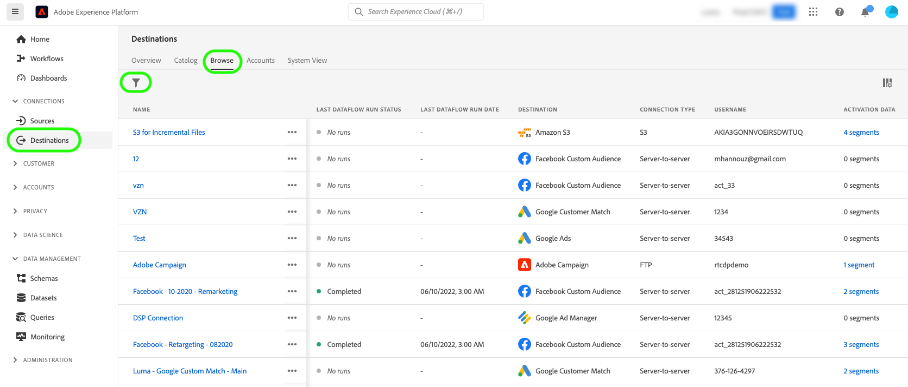
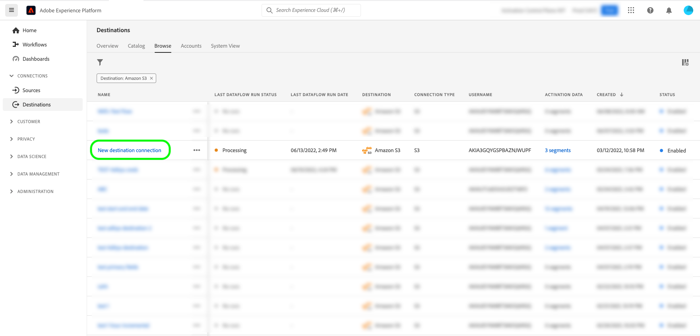
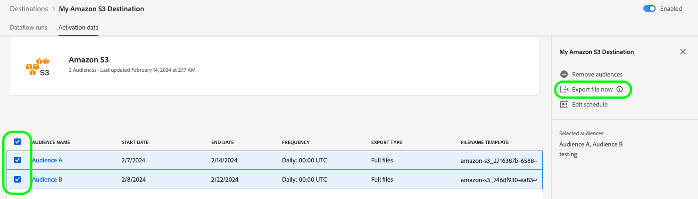
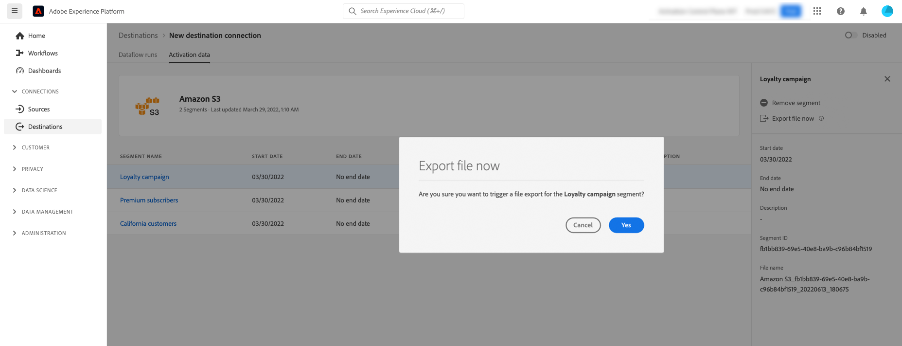
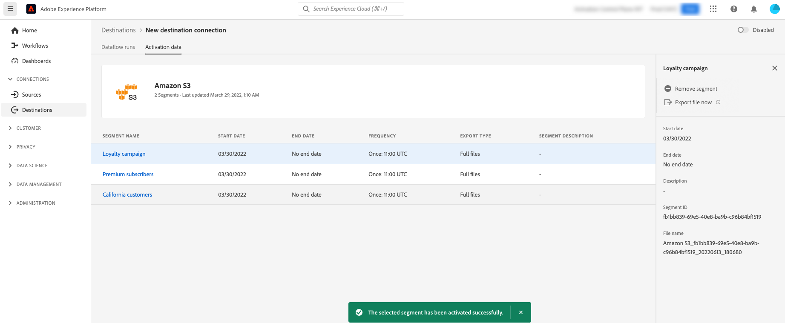

# Experience Platform UIを使用して、オンデマンドでファイルをバッチ宛先に書き出します

>[!IMPORTANT]
>
>データをアクティブ化するには、**[!UICONTROL View Destinations]**、**[!UICONTROL Activate Destinations]**、**[!UICONTROL View Profiles]**&#x200B;および&#x200B;**[!UICONTROL View Segments]** [&#x200B; アクセス制御権限](/help/access-control/home.md#permissions)が必要です。 [アクセス制御の概要](/help/access-control/ui/overview.md)を参照するか、製品管理者に問い合わせて必要な権限を取得してください。

## [!UICONTROL Export file now] の概要 {#overview}

>[!CONTEXTUALHELP]
>id="platform_destinations_activationchaining_activatenow"
>title="今すぐファイルを書き出し"
>abstract="このコントロールを選択すると、以前の定期エクスポートに加えて完全なファイル書き出しが実行されます。ファイルの書き出しが直ちにトリガーされ、Experience Platform のセグメント化実行から最新の結果が取得されます。"

この記事では、Experience Platform UIを使用して、[&#x200B; クラウドストレージ &#x200B;](/help/destinations/catalog/cloud-storage/overview.md)や[&#x200B; メールマーケティング &#x200B;](/help/destinations/catalog/email-marketing/overview.md)などのバッチ宛先にオンデマンドでファイルを書き出す方法について説明します。

以前にスケジュールされたオーディエンスの現在の書き出しスケジュールを中断せずに完全なファイルを書き出すには、**[!UICONTROL Export file now]** コントロールを使用します。 この書き出しは、以前にスケジュールされた書き出しに加えて行われ、オーディエンスの書き出し頻度は変更されません。

ファイルの書き出しは直ちにトリガーされ、最新のオーディエンス評価スナップショットのデータのみが使用されます。 スナップショットの作成後に発生するプロファイルやIDの変更は含まれません。 一方、スケジュールされた書き出しには、スナップショットデータと、スナップショットの作成と書き出しの時間の間に発生する増分変更の両方が含まれます。

この目的のためにExperience Platform APIを使用することもできます。 アドホックアクティベーション API[を使用して、バッチ宛先に対してオンデマンドでオーディエンスをアクティベートする方法を確認します。](/help/destinations/api/ad-hoc-activation-api.md)

## 定期エクスポートとオンデマンド書き出し {#scheduled-vs-ondemand}

オンデマンド書き出しと定期エクスポートでは、異なるデータソースを使用するため、書き出されたデータが異なる場合があります。 各ケースで書き出される内容については、次の表を参照してください。

|  | 今すぐファイルを書き出し | 定期エクスポート |
|--------|-----------------|-------------------|
| **データソース** | スナップショットのみ | スナップショット +増分変更 |
| **プロファイル属性** | スナップショット時の値 | エクスポート時の現在の値 |

>[!NOTE]
>
>スケジュールされた書き出しでは、オーディエンスの評価後に発生するプロファイル更新が含まれるため、オンデマンド書き出しとは異なるプロファイル数または属性値が表示される場合があります。

詳しくは、[&#x200B; スケジュールされた書き出し動作について](/help/destinations/ui/activate-batch-profile-destinations.md#export-behavior)を参照してください。

## 前提条件 {#prerequisites}

オンデマンドでファイルをバッチ宛先に書き出すには、宛先[に正常に](./connect-destination.md)接続している必要があります。 まだ接続していない場合は、[宛先カタログ](../catalog/overview.md)に移動し、サポートされている宛先を参照し、使用する宛先を設定します。

## オンデマンドでファイルをエクスポートする方法 {#how-to-export-files-on-demand}

1. **[!UICONTROL Connections > Destinations]**&#x200B;に移動し、**[!UICONTROL Browse]** タブとフィルター記号を選択して、目的のバッチ宛先への既存の接続を表示します。

   

2. 目的の宛先接続を選択して、既存の宛先へのデータフローを検査します。

   フィルター処理されたデータフローを強調表示する

3. 「**[!UICONTROL Activation data]**」タブを選択し、ファイルをオンデマンドで書き出すオーディエンスを選択し、**[!UICONTROL Export file now]** コントロールを選択して、選択した各オーディエンスのファイルをバッチ宛先に配信する1回限りの書き出しをトリガーします。

   「今すぐファイルを書き出し」ボタンを強調表示する

4. **[!UICONTROL Yes]**&#x200B;を選択して、ファイルの書き出しを確定し、トリガーします。

   

5. ファイルの書き出しが開始されたことを知らせる確認メッセージが表示されます。

   

6. 「**[!UICONTROL Dataflow runs]**」タブに切り替えて、ファイルの書き出しが開始されたことを確認することもできます。

## 注意点 {#considerations}

**[!UICONTROL Export file now]** コントロールを使用する場合は、次の点に注意してください。

* **[!UICONTROL Export file now]**&#x200B;は、バッチ アクティベーション データフロー内のスケジュールが現在の日付と重複するオーディエンスでのみ機能します。 これには、終了日のないスケジュール（書き出し頻度&#x200B;**[!UICONTROL Once]**）や、終了日がまだ経過していないスケジュールを含むオーディエンスが含まれます。
* 既存のデータフローにオーディエンスを追加する場合は、**コントロールを使用する前に** 1時間以上&#x200B;**[!UICONTROL Export file now]**&#x200B;待ってください。
* オーディエンスの結合ポリシーを変更する場合、または新しい結合ポリシーを使用するオーディエンスを作成する場合は、**[!UICONTROL Export file now]** コントロールを使用するまで24時間待ちます。
* **[!UICONTROL Export file now]**&#x200B;は、スケジュールされたスナップショットの書き出しからのデータのみを使用します。 API トリガーの書き出しジョブからデータを取得しません。 API トリガーの書き出しジョブの後に最新のデータを書き出すには、次にスケジュールされた書き出しが実行されるのを待ちます。

## UI エラーメッセージ {#ui-error-messages}

**[!UICONTROL Export file now]** コントロールを使用すると、以下に示すエラーメッセージが表示される場合があります。 表を確認して、それらの対処方法を確認します。

| エラーメッセージ | 解決策 |
|---------|----------|
| 実行ID `segment ID`の注文`dataflow ID`のオーディエンス `flow run ID`に対して、既に実行が行われています | このエラーメッセージは、オーディエンスに対してアドホックアクティベーションフローが現在進行中であることを示します。 ジョブが終了するのを待ってから、アクティベーションジョブを再度トリガーします。 |
| オーディエンス `<segment name>`は、このデータフローに含まれていないか、スケジュール範囲外です。 | このエラーメッセージは、アクティブ化するために選択したオーディエンスがデータフローにマッピングされていないか、オーディエンス用に設定されたアクティベーションスケジュールが期限切れであるか、まだ開始されていないことを示します。 オーディエンスが実際にデータフローにマッピングされているかどうかを確認し、オーディエンスアクティベーションスケジュールが現在の日付と重複していることを確認します。 |

## 関連情報 {#related-information}

* [Experience Platform APIを使用して、オンデマンドでバッチ配信先にオーディエンスをアクティベートできます](/help/destinations/api/ad-hoc-activation-api.md)
* [プロファイル書き出しのバッチ宛先に対するオーディエンスデータの有効化](/help/destinations/ui/activate-batch-profile-destinations.md)
