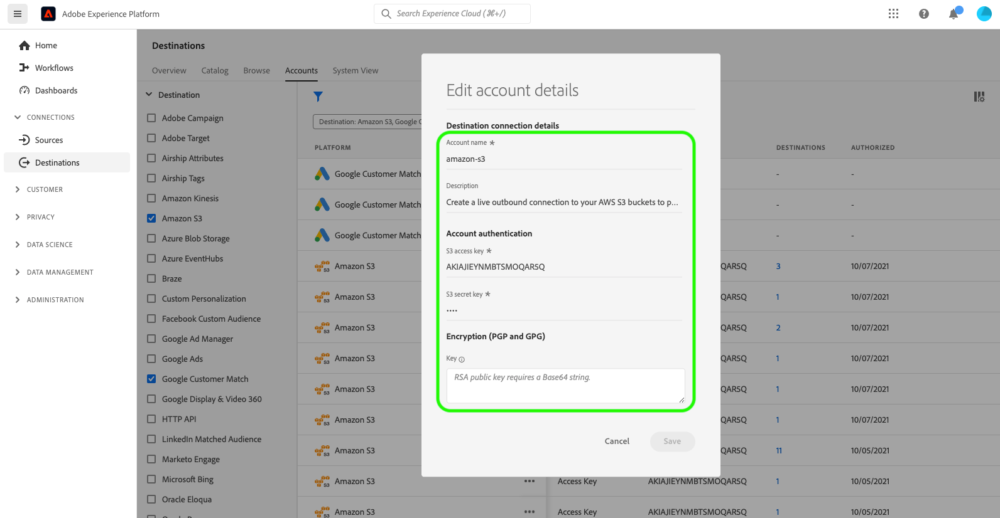

# 宛先アカウントの更新

## 概要 {#overview}

「**[!UICONTROL アカウント]**」タブには、様々な宛先との接続を確立した場合の詳細が表示されます。 各宛先について取得できるすべての情報については、次の表を参照してください。

| 要素 | 説明 |
|---|---|
| [!UICONTROL プラットフォーム] | 接続を設定した宛先。 |
| [!UICONTROL 接続タイプ] | ストレージバケットまたは宛先への接続タイプを表します。 <ul><li>電子メールマーケティングの宛先の場合：S3 または FTP</li><li>リアルタイム広告の宛先の場合：サーバー間</li><li>Amazon S3 クラウドストレージの宛先：アクセスキー </li><li>SFTP クラウドストレージの宛先：SFTP の基本認証</li></ul> |
| [!UICONTROL ユーザー名] | [「宛先の接続」ウィザード](../catalog/email-marketing/overview.md#connect-destination)で選択したユーザー名。 |
| [!UICONTROL 宛先] | 宛先に対して作成された基本情報に接続された、一意に成功した宛先フローの数を表します。 |
| [!UICONTROL 認証済み] | この宛先への接続が承認された日付。 |

## アカウントの更新 {#update}

次の手順に従って、既存の宛先への接続の詳細を更新します。

1. [Experience PlatformUI](https://platform.adobe.com/) にログインし、左側のナビゲーションバーから **[!UICONTROL 宛先]** を選択します。 上部のヘッダーから「**[!UICONTROL アカウント]**」を選択して、既存のアカウントを表示します。

   

2. 左上のフィルターアイコン  を選択して、並べ替えパネルを起動します。 並べ替えパネルには、すべての宛先のリストが表示されます。 リストから複数の宛先を選択すると、選択した宛先に関連付けられたアカウントのフィルターされた選択範囲を表示できます。

   

3.  **[!UICONTROL **[!UICONTROL  プラットフォーム ]**列の  編集ボタン]** を選択して、アカウントの情報を編集します。

   

4. 更新したアカウント資格情報を入力します。

   * `OAuth2` 接続タイプを使用するアカウントの場合は、「**[!UICONTROL OAuth を再接続]**」を選択して、アカウントの資格情報を更新します。

      

   * 接続タイプ `Access Key` または `ConnectionString` を使用するアカウントの場合は、アクセス ID、秘密鍵、接続文字列などの情報を含むアカウント認証情報を編集できます。

      

5. 「**[!UICONTROL 保存]**」を選択して、資格情報の更新を終了します。
