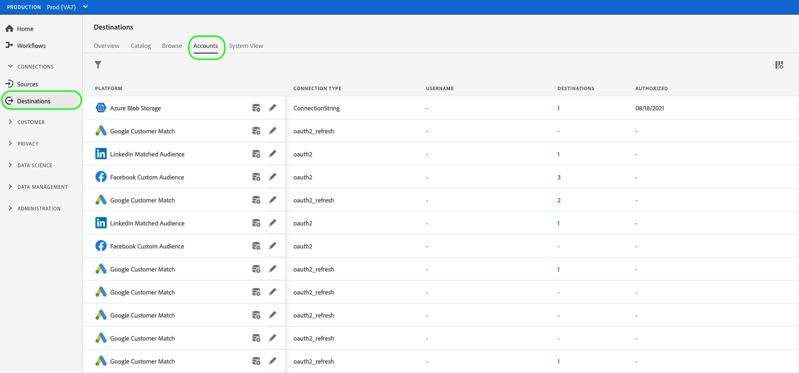
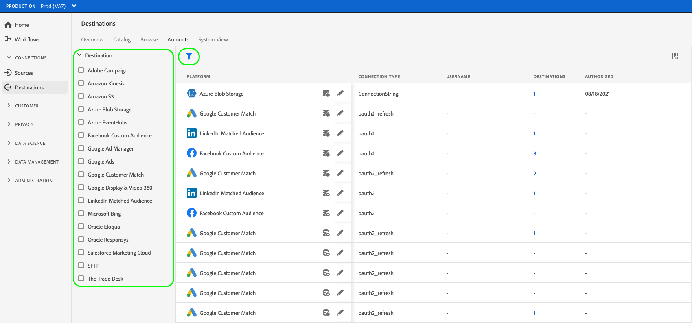
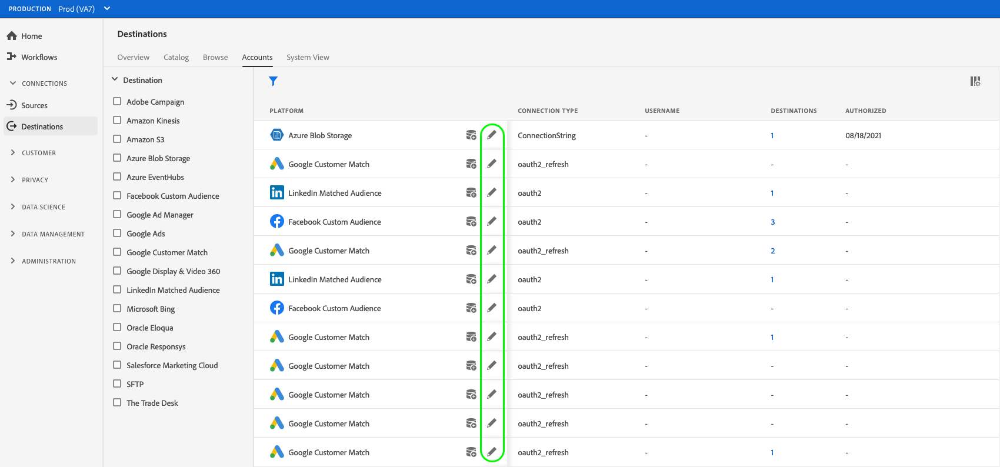
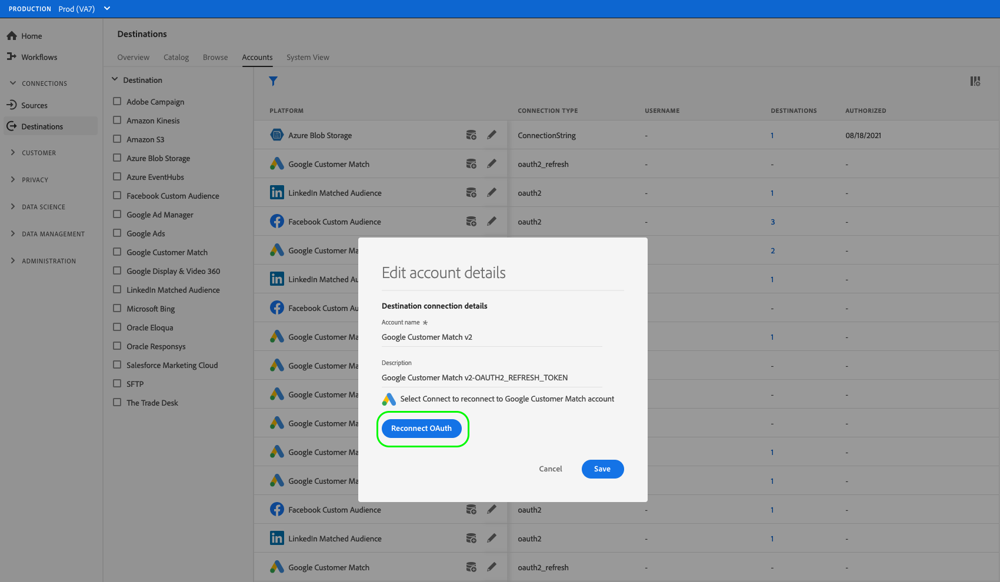
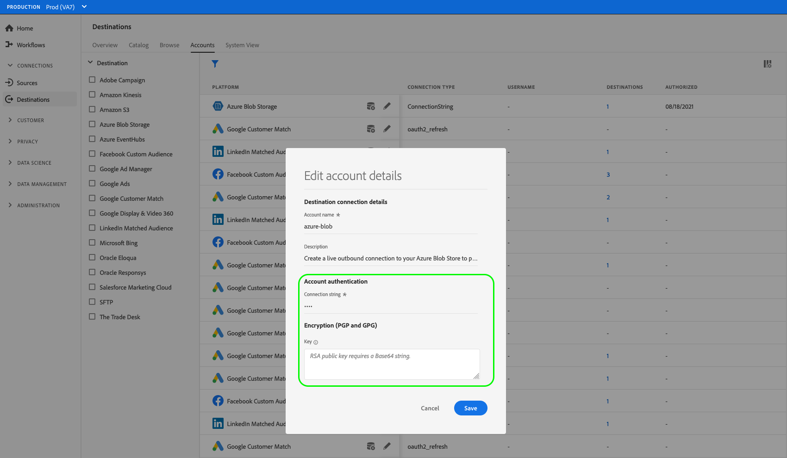
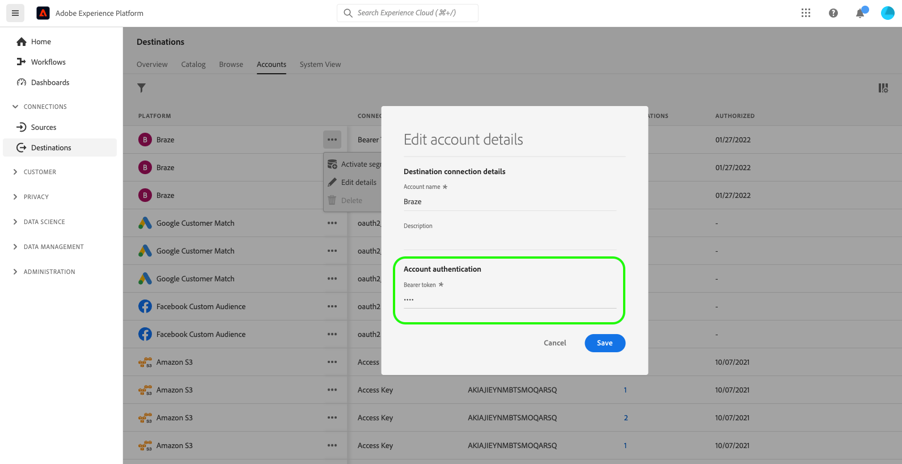
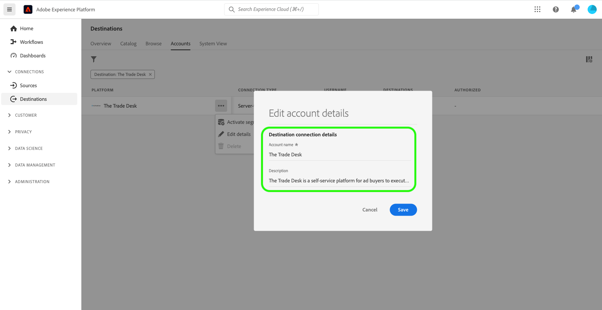

# 宛先アカウントの更新

## 概要 {#overview}

「**[!UICONTROL Accounts]**」タブには、様々な宛先で確立した接続に関する詳細が表示されます。 各宛先アカウントで使用可能なすべての情報については、[ アカウントの概要](../ui/destinations-workspace.md#accounts)を参照してください。

このチュートリアルでは、Experience Platform UIを使用して宛先アカウントの詳細を更新する手順について説明します。

宛先アカウントの詳細を更新して、現在使用している宛先の現在のアカウントまたは期限切れのアカウントの資格情報を更新し、再認証することができます。 通常、OAuthおよびベアラートークンの有効期間は、宛先プラットフォームによって異なります。 これらのトークンが期限切れになると、以下で詳しく説明するワークフローで更新できます。 このワークフローでは、OAuth ワークフローを実行するか、トークンを再挿入するように指示します。 同様に、ダウンストリームプラットフォームでパスワードまたはユーザーアクセスが変更された場合は、資格情報を更新できます。

バッチ宛先の場合、アクセスまたは秘密鍵のいずれかが変更されている場合は、アクセスまたは秘密鍵を更新できます。 さらに、ファイルを暗号化する場合は、RSA公開鍵を挿入すると、書き出されたファイルが暗号化されます。

## アカウントの更新 {#update}

既存の宛先に接続の詳細を更新するには、次の手順に従います。

1. [Experience Platform UI](https://platform.adobe.com/)に移動し、左側のナビゲーションバーから&#x200B;**[!UICONTROL Destinations]**&#x200B;を選択します。 上部ヘッダーから&#x200B;**[!UICONTROL Accounts]**&#x200B;を選択して、既存のアカウントを表示します。

   

2. 左上のフィルターアイコン  を選択して、並べ替えパネルを開きます。並べ替えパネルには、すべての宛先のリストが表示されます。 リストから複数の宛先を選択すると、選択した宛先に関連付けられているアカウントのフィルタリングされた選択を表示できます。

   

3. 更新するアカウントの名前の横にある省略記号（`...`）を選択します。 ポップアップパネルが表示され、アカウントの&#x200B;**[!UICONTROL Activate audiences]**、**[!UICONTROL Edit details]**&#x200B;および&#x200B;**[!UICONTROL Delete]**&#x200B;にオプションが表示されます。 「 **[!UICONTROL Edit details]** ボタンを選択して、アカウント情報を編集します。

   

4. 更新したアカウント資格情報を入力します。

   * `OAuth1`または`OAuth2`接続タイプを使用するアカウントの場合は、**[!UICONTROL Reconnect OAuth]**&#x200B;を選択してアカウント資格情報を更新します。 アカウントの名前と説明を更新することもできます。

   

   * `Access Key`または`ConnectionString`接続タイプを使用するアカウントの場合、アクセス ID、秘密鍵、接続文字列などの情報を含むアカウント認証情報を編集できます。 アカウントの名前と説明を更新することもできます。

   

   * `Bearer token`接続タイプを使用するアカウントの場合、必要に応じて新しいベアラートークンを入力できます。 アカウントの名前と説明を更新することもできます。

   

   * `Server to server`接続タイプを使用するアカウントの場合、アカウントの名前と説明を更新できます。

   

5. アカウントの詳細の更新を完了するには、**[!UICONTROL Save]**&#x200B;を選択します。

## 次の手順 {#next-steps}

**[!UICONTROL destinations]** ワークスペースを使用して既存のアカウントを正常に更新しました。

宛先について詳しくは、[宛先の概要](../catalog/overview.md)を参照してください。