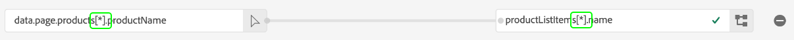

# データ収集のためのデータ準備

Data Prep は、データのマッピング、変換、検証をAdobe Experience Platformのサービスです。 [エクスペリエンスデータモデル (XDM)](../../xdm/home.md). Platform を有効に設定する場合 [datastream](./overview.md)では、Data Prep 機能を使用して、ソースデータを Platform Edge ネットワークに送信する際に XDM にマッピングできます。

>[!NOTE]
>
>計算フィールドの変換関数を含む、すべての Data Prep 機能に関する包括的なガイダンスについては、次のドキュメントを参照してください。
>
>* [データ準備の概要](../../data-prep/home.md)
>* [データ準備のマッピング機能](../../data-prep/functions.md)
>* [Data Prep でのデータ形式の取り扱い](../../data-prep/data-handling.md)


このガイドでは、データ収集 UI 内でデータをマッピングする方法について説明します。 手順に従うには、 [基本設定手順](./overview.md#create).

Data Prep for Data Collection プロセスの簡単なデモについては、次のビデオを参照してください。

>[!VIDEO](https://video.tv.adobe.com/v/342120?quality=12&enable10seconds=on&speedcontrol=on)

## [!UICONTROL データの選択] {#select-data}

選択 **[!UICONTROL マッピングの保存と追加]** データストリームの基本設定を完了した後、 **[!UICONTROL データを選択]** 手順が表示されます。 ここから、Platform に送信する予定のデータの構造を表すサンプル JSON オブジェクトを提供する必要があります。

データレイヤーから直接プロパティを取り込むには、JSON オブジェクトに 1 つのルートプロパティが必要です `data`. のサブプロパティ `data` オブジェクトは、取り込むデータレイヤーのプロパティにマッピングする方法で構築する必要があります。 以下のセクションを選択して、 `data` ルートを使用します。

+++を使用した JSON ファイルのサンプル `data` root

```json
{
  "data": {
    "eventMergeId": "cce1b53c-571f-4f36-b3c1-153d85be6602",
    "eventType": "view:load",
    "timestamp": "2021-09-30T14:50:09.604Z",
    "web": {
      "webPageDetails": {
        "siteSection": "Product section",
        "server": "example.com",
        "name": "product home",
        "URL": "https://www.example.com"
      },
      "webReferrer": {
        "URL": "https://www.adobe.com/index2.html",
        "type": "external"
      }
    },
    "commerce": {
      "purchase": 1,
      "order": {
        "orderID": "1234"
      }
    },
    "product": [
      {
        "productInfo": {
          "productID": "123"
        }
      },
      {
        "productInfo": {
          "productID": "1234"
        }
      }
    ],
    "reservation": {
      "id": "anc45123xlm",
      "name": "Embassy Suits",
      "SKU": "12345-L",
      "skuVariant": "12345-LG-R",
      "priceTotal": "112.99",
      "currencyCode": "USD",
      "adults": 2,
      "children": 3,
      "productAddMethod": "PDP",
      "_namespace": {
        "test": 1,
        "priceTotal": "112.99",
        "category": "Overnight Stay"
      },
      "freeCancellation": false,
      "cancellationFee": 20,
      "refundable": true
    }
  }
}
```

+++

XDM オブジェクトデータ要素からプロパティを取り込むには、同じルールが JSON オブジェクトに適用されますが、ルートプロパティはとしてキー設定する必要があります。 `xdm` 代わりに、 以下のセクションを選択して、 `xdm` ルートを使用します。

+++を使用した JSON ファイルのサンプル `xdm` root

```json
{
  "xdm": {
    "environment": {
      "type": "browser",
      "browserDetails": {
        "userAgent": "Mozilla/5.0 (Macintosh; Intel Mac OS X 10_7_5) AppleWebkit/537.36 (KHTML, like Gecko) Chrome/49.0.2623.112 Safari/537.36",
        "javaScriptEnabled": true,
        "javaScriptVersion": "1.8.5",
        "cookiesEnabled": true,
        "viewportHeight": 900,
        "viewportWidth": 1680,
        "javaEnabled": true
      },
      "domain": "adobe.com",
      "colorDepth": 24,
      "viewportHeight": 1050,
      "viewportWidth": 1680
    },
    "device": {
      "screenHeight": 1050,
      "screenWidth": 1680
    }
  }
}
```

+++

このオプションを選択して、オブジェクトをファイルとしてアップロードするか、生のオブジェクトを指定されたテキストボックスに貼り付けることができます。 JSON が有効な場合は、右側のパネルにプレビュースキーマが表示されます。 「**[!UICONTROL 次へ]**」をクリックして続行します。


## [!UICONTROL マッピング]

この **[!UICONTROL マッピング]** 手順が表示され、ソースデータのフィールドを Platform のターゲットイベントスキーマのフィールドにマッピングできます。 ここから、次の 2 つの方法でマッピングを設定できます。

* [新しいマッピングルールを作成](#create-mapping) 手動プロセスを通じて、このデータストリームに対して。
* [マッピングルールをインポート](#import-mapping) 既存のデータストリームから。

### 新しいマッピングを作成 {#create-mapping}

利用を開始するには、「 **[!UICONTROL 新しいマッピングを追加]** 新しいマッピング行を作成します。


ソースアイコン () をクリックし、表示されるダイアログで、提供されたキャンバスにマッピングするソースフィールドを選択します。 フィールドを選択したら、 **[!UICONTROL 選択]** ボタンをクリックして続行します。


次に、スキーマアイコン () をクリックして、ターゲットイベントスキーマに類似したダイアログを開きます。 でを確認する前に、データのマッピング先のフィールドを選択します。 **[!UICONTROL 選択]**.


マッピングページが再び表示され、完了したフィールドマッピングが表示されます。 この **[!UICONTROL マッピングの進行状況]** 「 」セクションが更新され、正常にマッピングされたフィールドの合計数が反映されます。


>[!TIP]
>
>（ソースフィールド内の）オブジェクトの配列を（ターゲットフィールド内の）異なるオブジェクトの配列にマッピングする場合は、 `[*]` の後に追加します。
>
>

### 既存のマッピングルールをインポート {#import-mapping}

以前にデータストリームを作成した場合は、設定済みのマッピング・ルールを新しいデータストリームに再利用できます。

>[!WARNING]
>
>別のデータストリームからマッピングルールをインポートすると、インポート前に追加したフィールドマッピングが上書きされます。

開始するには、 **[!UICONTROL マッピングを読み込み]**.

![を示す画像 [!UICONTROL マッピングを読み込み] ボタンが選択されています](../images/datastreams/data-prep/import-mapping-button.png)

表示されるダイアログで、マッピング・ルールをインポートするデータ・ストリームを選択します。 データストリームを選択したら、 **[!UICONTROL プレビュー]**.


>[!NOTE]
>
>データストリームは同じ内でのみインポートできます [サンドボックス](../../sandboxes/home.md). つまり、あるサンドボックスから別のサンドボックスにデータストリームをインポートすることはできません。

次の画面には、選択したデータストリームに対する保存済みのマッピングルールのプレビューが表示されます。 表示されたマッピングが期待どおりであることを確認し、「 」を選択します。 **[!UICONTROL インポート]** マッピングを確認し、新しいデータストリームに追加する。


>[!NOTE]
>
>インポートされたマッピングルール内のソースフィールドが、サンプル JSON データに含まれていない場合 [以前に提供される](#select-data)の場合、これらのフィールドマッピングはインポートに含まれません。

### マッピングを完了

上記の手順に従って、残りのフィールドをターゲットスキーマにマッピングします。 使用可能なすべてのソースフィールドをマッピングする必要はありませんが、この手順を完了するには、必要に応じて設定されたターゲットスキーマ内のフィールドをマッピングする必要があります。 この **[!UICONTROL 必須フィールド]** カウンターは、現在の設定でまだマッピングされていない必須フィールドの数を示します。

必須フィールドの数が 0 に達し、マッピングに問題がなければ、「 」を選択します。 **[!UICONTROL 保存]** 変更を確定します。


## 次の手順

このガイドでは、データ収集 UI でデータストリームを設定する際に、データを XDM にマッピングする方法について説明しました。 一般的なデータストリームのチュートリアルに従っていた場合は、次の手順に戻ることができます。 [データストリームの詳細の表示](./overview.md).
