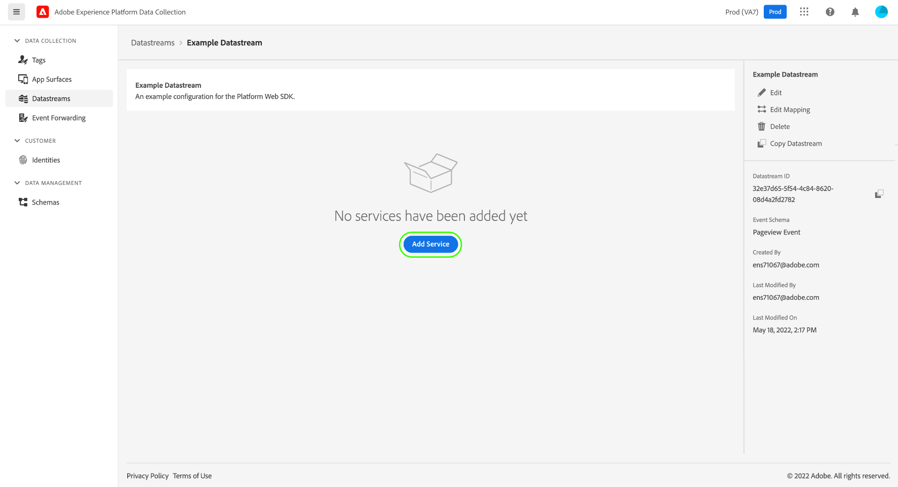

# データストリームの概要

データストリームは、Adobe Experience Platform Web および Mobile SDK を実装する際のサーバーサイド設定を表します。SDK の [configure コマンド](../fundamentals/configuring-the-sdk.md)がクライアント上で処理される必要があるもの（`edgeDomain` など）を制御するのに対して、データストリームは、SDK のその他すべての設定を処理します。リクエストが Adobe Experience Platform Edge Network に送付されると、データストリームを参照するために `edgeConfigId` が使用されます。これにより、web サイト上でコードを変更することなく、サーバーサイド設定を更新できます。

このドキュメントでは、データ収集 UI でデータストリームを設定する手順を説明します。

## [!UICONTROL データストリーム]ワークスペースへのアクセス

左側のナビゲーションで&#x200B;**[!UICONTROL データストリーム]**&#x200B;を選択することで、データ収集 UI でデータストリームを作成および管理できます。

「[!UICONTROL データストリーム]」タブには、わかりやすい名前、ID および最終更新日を含む、既存のデータストリームのリストが表示されます。データストリームの名前を選択して、[その詳細および設定サービスを表示](#view-details)します。

特定のデータストリームの「その他」アイコン（**...**）を選択して、その他のオプションを表示します。データストリームの[基本設定](#configure)を更新するには&#x200B;**[!UICONTROL 編集]**&#x200B;を選択し、データストリームを削除するには&#x200B;**[!UICONTROL 削除]**&#x200B;を選択します。

## 新しいデータストリームの作成 {#create}

データストリームを作成するには、最初に「**[!UICONTROL 新規データストリーム]**」を選択します。

設定手順から始まる、データストリーム作成ワークフローが表示されます。ここから、データストリームの名前およびオプションで説明を指定する必要があります。

Experience Platform で使用するためにこのデータストリームを設定していて、Platform Web SDK を使用している場合、取り込みを予定しているデータを表すために、[イベントベースのエクスペリエンスデータモデル（XDM）スキーマ](../../xdm/classes/experienceevent.md)も選択する必要があります。

「**[!UICONTROL 詳細オプション]**」を選択して、データストリームを設定するための追加のコントロールを表示します。

| 設定 | 説明 |
| --- | --- |
| [!UICONTROL ジオ位置情報] | ユーザーの IP アドレスに基づいて GPS ルックアップが発生するかどうかを決定します。デフォルト設定&#x200B;**[!UICONTROL なし]**&#x200B;は、すべての GPS ルックアップを無効にするのに対して、**[!UICONTROL 市区町村]**&#x200B;設定は、GPS 座標を小数第 2 位で提供します。 |
| [!UICONTROL ファーストパーティ ID Cookie] | この設定を有効にすると、Edge Network は[ファーストパーティデバイス ID](../identity/first-party-device-ids.md) を参照する際に、この値を ID Map で参照するのではなく、指定された Cookie を参照するように指示します。  この設定を有効にする場合、ID が保存されていると期待される Cookie の名前を指定する必要があります。 |
| [!UICONTROL サードパーティ ID 同期] | ID 同期は、コンテナにグループ化して、異なる ID 同期を異なる時間に実行できます。この設定を有効にすると、どの ID 同期のコンテナがこのデータストリームに対して実行されるかを指定できます。 |
| [!UICONTROL アクセスタイプ] | [!DNL Edge Network] がデータストリームに受け入れる認証タイプを定義します。 <ul><li>**[!UICONTROL 混合認証]**：このオプションを選択すると、Edge Network は認証済みリクエストと未認証リクエストの両方を受け入れます。[Server API](../../server-api/overview.md) と一緒に Web SDK または [Mobile SDK](https://aep-sdks.gitbook.io/docs/) を使用する場合は、このオプションを選択してください。 </li><li>**[!UICONTROL 認証済みのみ]**：このオプションを選択すると、Edge Network は認証済みのリクエストのみを受け入れます。Server API のみを使用する予定で、未認証のリクエストが [!DNL Edge Network] で処理されないようにする場合は、このオプションを選択します。 </li></ul> |

ここから、Experience Platform のデータストリームを設定している場合は、[データ収集のためのデータ準備](./data-prep.md)に関するチュートリアルに従って、Platform イベントスキーマにデータをマッピングしてから、このガイドに戻ってください。それ以外の場合は、「**[!UICONTROL 保存]**」を選択して、次の節を続行します。

## データストリームの詳細の表示 {#view-details}

新しいデータストリームを設定したり、表示するために既存のデータストリームを選択したりすると、そのデータストリームの詳細ページが表示されます。ここでは、データストリームの詳細情報（ID など）を確認できます。

データストリームの詳細画面から、[サービスを追加](#add-services)して、アクセス権のある Adobe Experience Cloud 製品の機能を有効にできます。また、データストリームの[基本設定](#create)を編集したり、その[マッピングルール](./data-prep.md)を更新したり、[データストリームをコピー](#copy)したり、完全に削除したりできます。

## データストリームへのサービスの追加 {#add-services}

データストリームの詳細ページで、「**[!UICONTROL サービスを追加]**」を選択して、そのデータストリームで使用可能なサービスの追加を開始します。

次の画面で、ドロップダウンメニューを使用して、このデータストリームで設定するサービスを選択します。アクセス権のあるサービスのみが、このリストに表示されます。

目的のサービスを選択し、表示される設定オプションに入力してから、「**[!UICONTROL 保存]**」を選択してデータストリームにサービスを追加します。データストリームの詳細表示に、追加されたすべてのサービスが表示されます。

次の項では、各サービスの設定オプションを説明します。

>[!NOTE]
>
>各サービス設定には、サービスが選択されると自動的にアクティブ化される「**[!UICONTROL 有効]**」トグルが含まれます。このデータストリーム用に選択されたサービスを無効にするには、もう一度「**[!UICONTROL 有効]**」トグルを選択します。

### Adobe Analytics 設定 {#analytics}

このサービスは、Adobe Analytics にデータを送信するかどうかと、どのように送信するかを制御します。追加情報については、[Analytics へのデータの送信](../data-collection/adobe-analytics/analytics-overview.md)に関するガイドを参照してください。

| 設定 | 説明 |
| --- | --- |
| [!UICONTROL レポートスイート ID] | **（必須）**&#x200B;データの送信先の Analytics レポートスイートの ID。この ID は、Adobe Analytics UI の[!UICONTROL 管理者]／[!UICONTROL レポートスイート]にあります。複数のレポートスイートが指定された場合、データは各レポートスイートにコピーされます。 |

### Adobe Audience Manager 設定 {#audience-manager}

このサービスは、Adobe Audience Manager にデータを送信するかどうかと、どのように送信するかを制御します。Audience Manager にデータを送信するために必要なのは、このセクションを有効にすることだけです。その他の設定は、オプションですが推奨されます。

| 設定 | 説明 |
| --- | --- |
| [!UICONTROL Cookie 宛先が有効] | SDK で、[!DNL Audience Manager] から [Cookie 宛先](https://experienceleague.adobe.com/docs/audience-manager/user-guide/features/destinations/custom-destinations/create-cookie-destination.html?lang=ja)経由でセグメント情報を共有できるようにします。 |
| [!UICONTROL URL 宛先が有効] | SDK で、[!DNL Audience Manager] から [URL 宛先](https://experienceleague.adobe.com/docs/audience-manager/user-guide/features/destinations/custom-destinations/create-url-destination.html?lang=ja)経由でセグメント情報を共有できるようにします。 |

### Adobe Experience Platform 設定 {#aep}

>[!IMPORTANT]
>
>Platform のデータストリームを有効にする場合、データ収集 UI の上部リボンに表示されている、現在使用している Platform サンドボックスに注意してください。
>
>
>
>サンドボックスは、Adobe Experience Platform の仮想パーティションで、組織内の他のユーザーからデータおよび実装を分離できます。一旦データストリームが作成されると、そのサンドボックスは変更できません。Experience Platform のサンドボックスの役割について詳しくは、[サンドボックスのドキュメント](../../sandboxes/home.md)を参照してください。

このサービスは、Adobe Experience Platform にデータを送信するかどうかと、どのように送信するかを制御します。

| 設定 | 説明 |
|---| --- |
| [!UICONTROL イベントデータセット] | **（必須）**&#x200B;顧客イベントデータのストリーミング先となる Platform データセットを選択します。このスキーマは、[XDM ExperienceEvent クラス](../../xdm/classes/experienceevent.md)を使用する必要があります。 |
| [!UICONTROL プロファイルデータセット] | 顧客属性データの送信先となる Platform データセットを選択します。このスキーマは、[XDM Individual Profile クラス](../../xdm/classes/individual-profile.md)を使用する必要があります。 |
| [!UICONTROL Offer Decisioning] | このチェックボックスを選択して、Platform Web SDK 実装用の Offer Decisioning を有効にします。実装について詳しくは、[Platform Web SDK での Offer Decisioning の使用](../personalization/offer-decisioning/offer-decisioning-overview.md)に関するガイドを参照してください。Offer Decisioning 機能について詳しくは、[Adobe Journey Optimizer のドキュメント](https://experienceleague.adobe.com/docs/journey-optimizer/using/offer-decisioniong/get-started/starting-offer-decisioning.html?lang=ja)を参照してください。 |
| [!UICONTROL エッジのセグメント化] | このチェックボックスを選択して、このデータストリームの[エッジのセグメント化](../../segmentation/ui/edge-segmentation.md)を有効にします。SDK がエッジセグメント化対応データストリームでデータを送信すると、当該プロファイルの更新されたセグメントメンバーシップが応答で返されます。  このオプションは、[次のページパーソナライゼーションのユースケース](../../destinations/ui/configure-personalization-destinations.md)の[!UICONTROL パーソナライゼーションの宛先]と組み合わせて使用できます。 |
| [!UICONTROL パーソナライゼーションの宛先] | 「[!UICONTROL エッジセグメント化]」チェックボックスを有効にした後でこの項目を有効にすると、[カスタムパーソナライゼーション](../../destinations/catalog/personalization/custom-personalization.md)などのパーソナライゼーションの宛先にデータストリームが接続できるようになります。[パーソナライゼーションの宛先の設定](../../destinations/ui/configure-personalization-destinations.md)に関する特定の手順については、宛先のドキュメントを参照してください。 |

### Adobe Target 設定 {#target}

このサービスは、Adobe Target にデータを送信するかどうかと、どのように送信するかを制御します。

| 設定 | 説明 |
| --- | --- |
| [!UICONTROL プロパティトークン] | [!DNL Target] を使用すると、お客様は、プロパティの使用を通じて権限を制御できます。プロパティについて詳しくは、[!DNL Target] ドキュメントの[エンタープライズ権限の設定](https://experienceleague.adobe.com/docs/target/using/administer/manage-users/enterprise/properties-overview.html?lang=ja)に関するガイドを参照してください。  プロパティトークンは、Adobe Target UI の[!UICONTROL 設定]／[!UICONTROL プロパティ]にあります。 |
| [!UICONTROL Target 環境 ID] | [Adobe Target の環境](https://experienceleague.adobe.com/docs/target/using/administer/hosts.html?lang=ja)を使用すると、開発のすべてのステージを通じて実装を管理できます。この設定は、このデータストリームで使用しようとしている環境を指定します。  ベストプラクティスは、`dev`、`stage`、`prod` の各データストリーム環境ごとに異なる設定を行って、物事をシンプルに保つことです。ただし、既に Adobe Target 環境を定義している場合は、それを使用できます。 |
| [!UICONTROL Target サードパーティ ID 名前空間] | このデータストリームに使用する `mbox3rdPartyId` の ID 名前空間。詳しくは、[Web SDK を使用した `mbox3rdPartyId` の実装](../personalization/adobe-target/using-mbox-3rdpartyid.md)に関するガイドを参照してください。 |

### [!UICONTROL イベント転送]設定

このサービスは、[イベント転送](../../tags/ui/event-forwarding/overview.md)にデータを送信するかどうかと、どのように送信するかを制御します。

| 設定 | 説明 |
| --- | --- |
| [!UICONTROL Launch プロパティ] | **（必須）**&#x200B;データの送信先のイベント転送プロパティ。 |
| [!UICONTROL Launch 環境] | **（必須）**&#x200B;データの送信先の選択されたプロパティ内の環境。 |

>[!NOTE]
>
>「**[!UICONTROL 手動で ID を入力]**」を選択すると、ドロップダウンメニューを使用せずに、プロパティ名および環境名を入力できます。

## データストリームのコピー {#copy}

既存のデータストリームのコピーを作成し、必要に応じて、その詳細を変更できます。

>[!NOTE]
>
>データストリームは、同じ[サンドボックス](../../sandboxes/home.md)内でのみコピーできます。つまり、あるサンドボックスから別のサンドボックスにデータストリームをコピーすることはできません。

[!UICONTROL データストリーム]ワークスペースのメインページから、当該データストリームの省略記号（**...**）を選択してから、「**[!UICONTROL コピー]**」を選択します。

![データストリームリスト表示から「[!UICONTROL コピー]」オプションが選択されていることを示す画像](../images/datastreams/overview/copy-datastream-list.png)

または、指定されたデータストリームの詳細表示から「**[!UICONTROL データストリームをコピー]**」を選択することもできます。

![データストリームの詳細表示から「[!UICONTROL コピー]」オプションが選択されていることを示す画像](../images/datastreams/overview/copy-datastream-details.png)

作成する新しいデータストリームの一意の名前を指定するよう促す確認ダイアログが表示され、上書きされる設定オプションに関する詳細が表示されます。準備ができたら、「**[!UICONTROL コピー]**」を選択します。

[!UICONTROL データストリーム]ワークスペースのメインページが再表示され、新しいデータストリームがリスト表示されます。

## 次の手順

このガイドでは、データ収集 UI でのデータストリームの管理方法について説明しました。データストリーム設定後の Web SDK のインストールおよび設定方法について詳しくは、[データ収集 E2E ガイド](../../collection/e2e.md#install)を参照してください。
