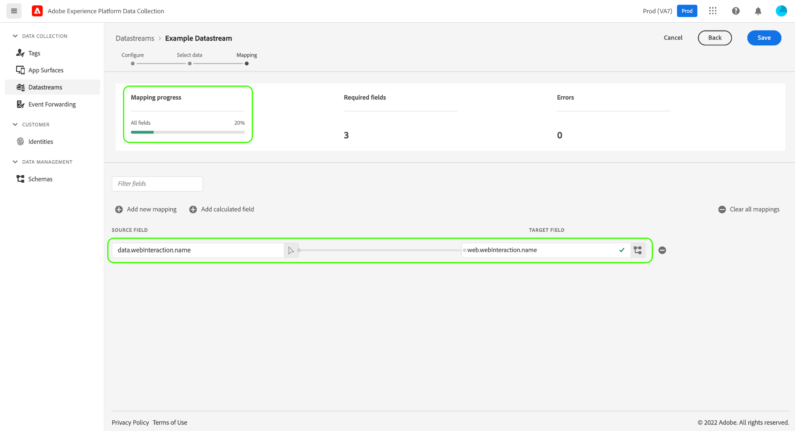
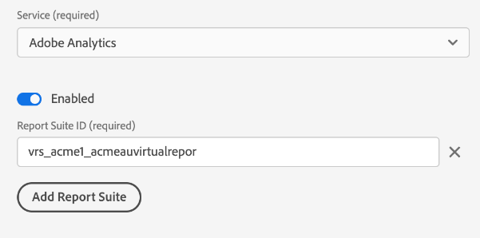

# データストリームの設定

datastream は、Adobe Experience Platform Web および Mobile SDK を実装する際のサーバー側の設定を表します。 また、 [設定コマンド](configuring-the-sdk.md) は、クライアントで処理する必要のあるものを制御します ( 例えば、 `edgeDomain`)、データストリームは、SDK のその他すべての設定を処理します。 リクエストがAdobe Experience Platform Edge Network に送信されると、 `edgeConfigId` は、データストリームを参照するために使用されます。 これにより、Web サイトでコードを変更しなくても、サーバー側の設定を更新できます。

このドキュメントでは、データ収集 UI でデータストリームを設定する手順を説明します。

>[!NOTE]
>
>UI でこの機能にアクセスするには、組織がこの機能のプロビジョニングを受ける必要があります。 アクセス権がない場合は、カスタマーサクセスマネージャー (CSM) に問い合わせて、問題の原因を突き止めてくだ許可リストさい。

## 次にアクセス： [!UICONTROL データストリーム] workspace

データ収集 UI でデータストリームを作成および管理するには、次を選択します。 **[!UICONTROL データストリーム]** をクリックします。

>[!NOTE]
>
>次にアクセスすると、 [!UICONTROL データストリーム] タブは、Platform のタグ管理機能を使用するかどうかに関係なく、データストリーム自体を管理するための開発者権限が必要です。 詳しくは、 [ユーザー権限](../../tags/ui/administration/user-permissions.md) 詳しくは、タグに関するドキュメントの記事を参照してください。

この [!UICONTROL データストリーム] 「 」タブには、既存のデータストリームのリストが表示されます。これには、わかりやすい名前、ID、最終変更日が含まれます。 データストリームの名前を選択 [詳細の表示とサービスの設定](#view-details).

「その他」のアイコン (**...**) をクリックして、その他のオプションを表示します。 選択 **[!UICONTROL 編集]** を更新するには、 [基本設定](#configure) データストリームの場合は、 **[!UICONTROL 削除]** データストリームを削除します。

## 新しいデータストリームの作成 {#create}

データストリームを作成するには、まず「 」を選択します。 **[!UICONTROL 新規データストリーム]**.

### [!UICONTROL 設定] {#configure}

設定手順から、データストリーム作成ワークフローが表示されます。 ここから、データストリームの名前と説明（オプション）を入力する必要があります。

このデータストリームをExperience Platformで使用するように設定し、Platform Web SDK を使用する場合は、 [イベントベースのエクスペリエンスデータモデル (XDM) スキーマ](../../xdm/classes/experienceevent.md) 取り込む予定のデータを表す。

この節の残りの部分では、選択した Platform イベントスキーマにデータをマッピングする手順に焦点を当てます。 Mobile SDK を使用している場合や、Platform 用にデータストリームを設定していない場合は、 **[!UICONTROL 保存]** ～に関する次の項に進む前に [データストリームへのサービスの追加](#add-services).

### データ収集用のデータ準備 {#data-prep}

>[!IMPORTANT]
>
>データ収集用のデータ準備は、現在、Mobile SDK 実装ではサポートされていません。

Data Prep は、Experience Data Model(XDM) との間でデータのマッピング、変換、検証をおこなえるExperience Platformサービスです。 Platform が有効なデータストリームを設定する場合、Data Prep 機能を使用して、Platform Edge ネットワークに送信する際にソースデータを XDM にマッピングできます。

以下のサブセクションでは、データ収集 UI 内でデータをマッピングするための基本的な手順について説明します。 計算フィールドの変換関数を含む、すべての Data Prep 機能に関する包括的なガイダンスについては、次のドキュメントを参照してください。

* [Data Prep の概要](../../data-prep/home.md)
* [データ準備マッピング関数](../../data-prep/functions.md)
* [Data Prep でのデータ形式の取り扱い](../../data-prep/data-handling.md)

#### [!UICONTROL データを選択]

選択 **[!UICONTROL マッピングの保存と追加]** 完了後 [基本設定手順](#configure)、および **[!UICONTROL データを選択]** 手順が表示されます。 ここから、Platform に送信する予定のデータの構造を表すサンプル JSON オブジェクトを提供する必要があります。 このオプションを選択して、オブジェクトをファイルとしてアップロードするか、生のオブジェクトを指定されたテキストボックスに貼り付けることができます。

>[!NOTE]
>
>JSON オブジェクトには 1 つのルートノードが必要です `data` 検証に合格するために。

JSON が有効な場合は、右側のパネルにプレビュースキーマが表示されます。 「**[!UICONTROL 次へ]**」をクリックして続行します。

#### [!UICONTROL マッピング]

この **[!UICONTROL マッピング]** 手順が表示され、ソースデータのフィールドを Platform のターゲットイベントスキーマのフィールドにマッピングできます。 利用を開始するには、「 **[!UICONTROL 新しいマッピングを追加]** 新しいマッピング行を作成します。

ソースアイコン () をクリックし、表示されるダイアログで、提供されたキャンバスにマッピングするソースフィールドを選択します。 フィールドを選択したら、 **[!UICONTROL 選択]** ボタンをクリックして続行します。

次に、スキーマアイコン () をクリックして、ターゲットイベントスキーマに類似したダイアログを開きます。 でを確認する前に、データのマッピング先のフィールドを選択します。 **[!UICONTROL 選択]**.

マッピングページが再び表示され、完了したフィールドマッピングが表示されます。 この **[!UICONTROL マッピングの進行状況]** 「 」セクションが更新され、正常にマッピングされたフィールドの合計数が反映されます。

上記の手順に従って、残りのフィールドをターゲットスキーマにマッピングします。 使用可能なすべてのソースフィールドをマッピングする必要はありませんが、この手順を完了するには、必要に応じて設定されたターゲットスキーマ内のフィールドをマッピングする必要があります。 この **[!UICONTROL 必須フィールド]** カウンターは、現在の設定でまだマッピングされていない必須フィールドの数を示します。

必須フィールドの数が 0 に達し、マッピングに問題がなければ、「 」を選択します。 **[!UICONTROL 保存]** 変更を確定します。

## データストリームの詳細を表示 {#view-details}

新しいデータストリームを設定するか、表示する既存のデータストリームを選択すると、そのデータストリームの詳細ページが表示されます。 ID など、データストリームに関する詳細情報は、ここで確認できます。

データストリームを作成すると、同じ設定で、関連する 3 つの環境が自動的に作成されます。 次の 3 つの環境があります。 `dev`, `stage`、および `prod`( [タグのデフォルト環境](../../tags/ui/publishing/environments.md). タグライブラリを `dev` 環境の場合、ライブラリは `dev` 環境を datastream から取得します。 必要に応じて、個々の環境で自由に設定を編集できます。

SDK 実装で、 `edgeConfigId` は、データストリームとそのデータストリーム内の特定の環境を指定する複合 ID です。 例えば、 `stage` ID を持つデータストリームの環境 `1c86778b-cdba-4684-9903-750e52912ad1`、 `edgeConfigId` `1c86778b-cdba-4684-9903-750e52912ad1:stage`.

>[!IMPORTANT]
>
>複合 ID に環境が存在しない場合、実稼動環境 (`prod`) が使用されます。

データストリームの詳細画面から、次の操作を実行できます。 [サービスの追加](#add-services) アクセス権のあるAdobe Experience Cloud製品の機能を有効にする。

## データストリームへのサービスの追加 {#add-services}

データストリームの詳細ページで、 **[!UICONTROL サービスを追加]** をクリックして、そのデータストリームで使用可能なサービスの追加を開始します。

次の画面では、ドロップダウンメニューを使用して、このデータストリーム用に設定するサービスを選択します。 このリストには、アクセス権のあるサービスのみが表示されます。

目的のサービスを選択し、表示される設定オプションを入力して、「 」を選択します。 **[!UICONTROL 保存]** をクリックして、サービスをデータストリームに追加します。 データストリームの詳細表示には、追加されたすべてのサービスが表示されます。

以下のサブセクションでは、各サービスの設定オプションについて説明します。

>[!NOTE]
>
>各サービス設定には、 **[!UICONTROL 有効]** サービスが選択されたときに自動的にアクティブ化される切り替え。 このデータストリームに対して選択したサービスを無効にするには、 **[!UICONTROL 有効]** もう一度切り替えます。

### Adobe Analytics設定

このサービスは、データをAdobe Analyticsに送信するかどうかと方法を制御します。 詳しくは、 [Analytics にデータを送信する](../data-collection/adobe-analytics/analytics-overview.md).

| 設定 | 説明 |
| --- | --- |
| [!UICONTROL レポートスイート ID] | **（必須）** データの送信先の Analytics レポートスイートの ID。 この ID は、Adobe Analytics UI の下にあります。 [!UICONTROL 管理者] > [!UICONTROL レポートスイート]. 複数のレポートスイートが指定されている場合、データは各レポートスイートにコピーされます。 |

### Adobe Audience Manager設定

このサービスは、データをAdobe Audience Managerに送信するかどうかと方法を制御します。 データをAudience Managerに送信するために必要なのは、このセクションを有効にすることだけです。 その他の設定はオプションですが、推奨されます。

| 設定 | 説明 |
| --- | --- |
| [!UICONTROL Cookie の宛先が有効になっています] | SDK が [cookie の宛先](https://experienceleague.adobe.com/docs/audience-manager/user-guide/features/destinations/custom-destinations/create-cookie-destination.html) から [!DNL Audience Manager]. |
| [!UICONTROL URL の宛先が有効になっています] | SDK が [URL の宛先](https://experienceleague.adobe.com/docs/audience-manager/user-guide/features/destinations/custom-destinations/create-url-destination.html) から [!DNL Audience Manager]. |

### Adobe Experience Platform 設定

>[!IMPORTANT]
>
>Platform のデータストリームを有効にする場合は、データ収集 UI の上部のリボンに表示されるように、現在使用している Platform サンドボックスを控えておきます。
>
>
>
>サンドボックスは、Adobe Experience Platformの仮想パーティションで、データと実装を組織内の他のユーザーから分離できます。 データストリームを作成した後は、そのサンドボックスを変更できません。 Experience Platformでのサンドボックスの役割について詳しくは、 [サンドボックスドキュメント](../../sandboxes/home.md).

このサービスは、データをAdobe Experience Platformに送信するかどうかと方法を制御します。

| 設定 | 説明 |
| --- | --- |
| [!UICONTROL イベントデータセット] | **（必須）** 顧客イベントデータのストリーミング先の Platform データセットを選択します。 このスキーマでは [XDM ExperienceEvent クラス](../../xdm/classes/experienceevent.md). |
| [!UICONTROL プロファイルデータセット] | 顧客属性データの送信先の Platform データセットを選択します。 このスキーマでは [XDM Individual Profile クラス](../../xdm/classes/individual-profile.md). |
| [!UICONTROL Offer Decisioning] | Platform Web SDK 実装のOffer decisioningを有効にするには、このチェックボックスを選択します。 詳しくは、 [Platform Web SDK でのOffer decisioningの使用](../personalization/offer-decisioning/offer-decisioning-overview.md) を参照してください。 offer decisioning機能について詳しくは、 [Adobe Journey Optimizerドキュメント](https://experienceleague.adobe.com/docs/journey-optimizer/using/offer-decisioniong/get-started/starting-offer-decisioning.html?lang=ja). |
| [!UICONTROL エッジセグメント化] | 有効にするには、このチェックボックスを選択します [エッジセグメント化](../../segmentation/ui/edge-segmentation.md) このデータストリーム用。 SDK がエッジセグメント化対応データストリームを介してデータを送信すると、該当するプロファイルの更新済みのセグメントメンバーシップが応答に返されます。  このオプションは、 [!UICONTROL パーソナライズ機能の宛先] 対象 [次のページのパーソナライゼーションの使用例](../../destinations/ui/configure-personalization-destinations.md). |
| [!UICONTROL パーソナライズ機能の宛先] | を [!UICONTROL エッジセグメント化] 「 」チェックボックスにチェックを入れると、データストリームがAdobe Targetなどのパーソナライゼーションエンジンに接続できるようになります。 の具体的な手順については、宛先のドキュメントを参照してください。 [パーソナライゼーションの宛先の設定](../../destinations/ui/configure-personalization-destinations.md). |

### Adobe Target設定

このサービスは、データをAdobe Targetに送信するかどうかと方法を制御します。

| 設定 | 説明 |
| --- | --- |
| [!UICONTROL プロパティトークン] | [!DNL Target] を使用すると、プロパティを使用して権限を制御できます。 プロパティについて詳しくは、 [enterprise 権限の設定](https://experienceleague.adobe.com/docs/target/using/administer/manage-users/enterprise/properties-overview.html?lang=ja) 内 [!DNL Target] ドキュメント。  プロパティトークンは、Adobe Target UI の下にあります。 [!UICONTROL 設定] > [!UICONTROL プロパティ]. |
| [!UICONTROL Target 環境 ID] | [Adobe Targetの環境](https://experienceleague.adobe.com/docs/target/using/administer/hosts.html) は、あらゆる開発段階を通じて実装を管理するのに役立ちます。 この設定は、このデータストリームで使用する環境を指定します。  ベストプラクティスは、これを各 `dev`, `stage`、および `prod` データストリーム環境を使用して、操作をシンプルにします。 ただし、既にAdobe Target環境を定義している場合は、それらを使用できます。 |
| [!UICONTROL Target サードパーティ ID 名前空間] | の ID 名前空間 `mbox3rdPartyId` このデータストリームにを使用します。 詳しくは、 [実装 `mbox3rdPartyId` Web SDK を使用](../personalization/adobe-target/using-mbox-3rdpartyid.md) を参照してください。 |

### [!UICONTROL イベント転送] 設定

このサービスは、データの送信先と送信方法を制御します [イベント転送](../../tags/ui/event-forwarding/overview.md).

| 設定 | 説明 |
| --- | --- |
| [!UICONTROL Launch プロパティ] | **（必須）** データの送信先のイベント転送プロパティ。 |
| [!UICONTROL Launch 環境] | **（必須）** データの送信先となる、選択したプロパティ内の環境。 |

>[!NOTE]
>
>次を選択できます。 **[!UICONTROL ID を手動で入力]** をクリックして、ドロップダウンメニューを使用する代わりにプロパティ名と環境名を入力します。

### [!UICONTROL サードパーティ ID の同期] 設定

サードパーティ ID セクションは、常に表示される唯一のセクションです。 次の 2 つの設定を使用できます。&quot;[!UICONTROL サードパーティ ID 同期が有効になっています]&quot;および&quot;[!UICONTROL サードパーティ ID 同期コンテナ ID]&quot;.

| 設定 | 説明 |
| --- | --- |
| [!UICONTROL サードパーティ ID 同期コンテナ ID] | ID 同期をコンテナにグループ化して、ID 同期を異なる時間に実行できるようにします。 このデータストリームに対して実行される ID 同期のコンテナを制御します。 |

## 次の手順

このガイドでは、データ収集 UI でのデータストリームの設定方法について説明しました。 データストリームの設定後に Web SDK をインストールおよび設定する方法について詳しくは、 [データ収集 E2E ガイド](../../collection/e2e.md#install).
