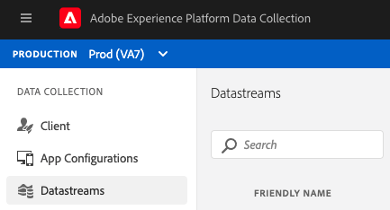

# データストリームの設定

Adobe Experience Platform Web SDK の設定は、2 つの場所に分かれています。 SDK の [configure コマンド ](configuring-the-sdk.md) は、`edgeDomain` のように、クライアントで処理する必要がある処理を制御します。 データストリームは、SDK のその他すべての設定を処理します。 リクエストがAdobe Experience Platform Edge ネットワークに送信されると、`edgeConfigId` がサーバー側の設定の参照に使用されます。 これにより、Web サイトでコードを変更しなくても設定を更新できます。

この機能を使用するには、組織がプロビジョニングされている必要があります。 カスタマーサクセスマネージャー (CSM) に問い合わせて、このマネージャーを使用してく許可リストださい。

## データストリーム設定の作成

データストリームは、データ収集 UI でデータストリーム設定ツールを使用して作成できます。

>[!NOTE]
>
>データストリーム設定ツールは、Platform をタグマネージャーとして使用しているかどうかに関係なく、許可リスト上のお客様が使用できます。 また、ユーザーには開発権限が必要です。 詳しくは、タグのドキュメントの [ ユーザー権限 ](../../tags/ui/administration/user-permissions.md) の記事を参照してください。

画面の右上の「**[!UICONTROL 新しいデータストリーム]**」をクリックして、データストリームを作成します。 名前と説明を入力すると、各環境のデフォルト設定を求められます。 以下に、利用可能な設定について説明します。

データストリームを作成する場合、同じ設定で 3 つの環境が自動的に作成されます。 これら 3 つの環境は、*dev*、*stage*、*prod* です。 タグの 3 つのデフォルト環境に一致します。 開発環境にタグライブラリを構築すると、ライブラリは設定の開発環境を自動的に使用します。 個々の環境の設定は、好きなだけ編集できます。

SDK で `edgeConfigId` として使用される ID は、設定と環境を指定する複合 ID です（例：`1c86778b-cdba-4684-9903-750e52912ad1:stage`）。 複合 ID に環境が存在しない場合（前の例では `stage`）、実稼動環境が使用されます。

各設定環境で使用できる設定を以下に示します。 ほとんどのセクションは、有効または無効にできます。 無効にすると、設定は保存されますが、アクティブになりません。

## [!UICONTROL サードパーティ ID] の設定

サードパーティ ID セクションは、常にに表示される唯一のセクションです。 次の 2 つの設定を使用できます。&quot;[!UICONTROL  サードパーティ ID 同期が有効 ]&quot;および&quot;[!UICONTROL  サードパーティ ID 同期コンテナ ID]&quot;

### [!UICONTROL サードパーティ ID 同期の有効化]

SDK がサードパーティパートナーとの ID 同期を実行するかどうかを制御します。

### [!UICONTROL サードパーティ ID 同期コンテナ ID]

ID 同期をコンテナにグループ化して、ID 同期を異なる時間に実行できます。 特定の設定 ID に対して実行される ID 同期のコンテナを制御します。

## Adobe Experience Platform Settings

ここに示す設定を使用して、Adobe Experience Platformにデータを送信できます。 Adobe Experience Platformを購入済みの場合にのみ、このセクションを有効にする必要があります。

### [!UICONTROL サンドボックス]

サンドボックスは、Adobe Experience Platform内のお客様がデータと実装を分離できる場所です。 その仕組みについて詳しくは、[ サンドボックスのドキュメント ](../../sandboxes/home.md) を参照してください。

### [!UICONTROL ストリーミングインレット]

ストリーミングインレットは、Adobe Experience Platformの HTTP ソースです。 これらは、Adobe Experience Platformの「[!UICONTROL Sources]」タブに HTTP API として作成されます。

### [!UICONTROL イベントデータセット]

データストリームは、[!UICONTROL  エクスペリエンスイベント ] クラスのスキーマを持つデータセットへのデータの送信をサポートします。

## Adobe Target Settings

Adobe Targetを設定するには、クライアントコードを指定する必要があります。 その他のフィールドはオプションです。

>[!NOTE]
>
>クライアントコードに関連付けられた組織は、設定 ID を作成する組織と一致する必要があります。

### [!UICONTROL クライアントコード]

ターゲットアカウントの一意の ID。 これを見つけるには、[!UICONTROL Adobe Target] > [!UICONTROL  セットアップ ] [!UICONTROL  実装 ] > [!UICONTROL  編集設定 ] の隣にある [!UICONTROL at.js] または ] に移動します。2/>mbox.js][!UICONTROL [!UICONTROL 

### [!UICONTROL プロパティトークン]

[!DNL Target] では、プロパティを使用して権限を制御できます。詳しくは、[!DNL Target] ドキュメントの [Enterprise 権限 ](https://experienceleague.adobe.com/docs/target/using/administer/manage-users/enterprise/properties-overview.html?lang=ja) の節を参照してください。

プロパティトークンは、[!UICONTROL Adobe Target] > [!UICONTROL setup] > [!UICONTROL  プロパティ ] にあります。

### [!UICONTROL Target 環境 ID]

 環境Adobe Targetは、あらゆる開発段階を通じて実装を管理するのに役立ちます。この設定は、各環境で使用する環境を指定します。

Adobeでは、この設定を `dev`、`stage`、`prod` の各データストリーム環境ごとに異なる方法でおこない、シンプルな設定を維持することをお勧めします。 ただし、既にAdobe Target環境を定義している場合は、それらを使用できます。

## Adobe Audience Manager Settings

Adobe Audience Managerにデータを送信するために必要なのは、このセクションを有効にすることだけです。 その他の設定はオプションですが、推奨されます。

### [!UICONTROL Cookie の宛先が有効]

SDK が [!DNL Audience Manager] の [Cookie の宛先 ](https://experienceleague.adobe.com/docs/audience-manager/user-guide/features/destinations/custom-destinations/create-cookie-destination.html) を介してセグメント情報を共有できるようにします。

### [!UICONTROL URL 宛先の有効化]

SDK が [URL の宛先 ](https://experienceleague.adobe.com/docs/audience-manager/user-guide/features/destinations/custom-destinations/create-url-destination.html) を介してセグメント情報を共有できるようにします。 これらは [!DNL Audience Manager] で設定します。

## Adobe Analytics Settings

データをAdobe Analyticsに送信するかどうかを制御します。 詳しくは、[Analytics の概要 ](../data-collection/adobe-analytics/analytics-overview.md) を参照してください。

### [!UICONTROL レポートスイート ID]

このレポートスイートは、[!UICONTROL  管理者/ReportSuites] の下の「Adobe Analytics管理者」セクションにあります。 複数のレポートスイートを指定した場合、データは各レポートスイートにコピーされます。
