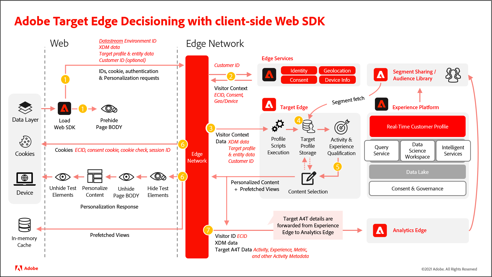

# [!DNL Adobe Target] と [!DNL Platform Web SDK] の使用

[!DNL Adobe Experience Platform] [!DNL Web SDK] では、で管理するパーソナライズされたエクスペリエンスを配信 [!DNL Adobe Target] し、レンダリングできます。[Visual Experience Composer](https://experienceleague.adobe.com/docs/target/using/experiences/vec/visual-experience-composer.html)(VEC)、または非ビジュアルインターフェイス（[ フォームベースの Experience Composer](https://experienceleague.adobe.com/docs/target/using/experiences/form-experience-composer.html)）と呼ばれる WYSIWYG エディターを使用して、アクティビティとパーソナライゼーションエクスペリエンスを作成、アクティブ化、配信できます。

>[!IMPORTANT]
>
>[Adobe Targetのドキュメント ](https://experienceleague.adobe.com/docs/target/using/implement-target/client-side/aep-implementation/aep-web-sdk.html?lang=en) には、Target の機能に関連する、Platform Web SDK に固有の情報を含むトピックが含まれています。

次の機能はテスト済みで、現在 [!DNL Target] でサポートされています。

* [A/B テスト](https://experienceleague.adobe.com/docs/target/using/activities/abtest/test-ab.html)
* [A4T インプレッションとコンバージョンのレポート](https://experienceleague.adobe.com/docs/target/using/integrate/a4t/a4t.html?lang=ja)
* [Automated Personalizationアクティビティ](https://experienceleague.adobe.com/docs/target/using/activities/automated-personalization/automated-personalization.html)
* [エクスペリエンスのターゲット設定アクティビティ](https://experienceleague.adobe.com/docs/target/using/activities/automated-personalization/automated-personalization.html)
* [多変量分析テスト (MVT)](https://experienceleague.adobe.com/docs/target/using/activities/multivariate-test/multivariate-testing.html)
* [Recommendationsアクティビティ](https://experienceleague.adobe.com/docs/target/using/recommendations/recommendations.html)
* [ネイティブの Target インプレッションおよびコンバージョンレポート](https://experienceleague.adobe.com/docs/target/using/reports/reports.html)
* [VEC サポート](https://experienceleague.adobe.com/docs/target/using/experiences/vec/visual-experience-composer.html)

## [!DNL Platform Web SDK] システム図

次の図は、[!DNL Target] と [!DNL Platform Web SDK] エッジ判定のワークフローを理解するのに役立ちます。



| を呼び出します | 詳細 |
| --- | --- |
| 1 | デバイスが [!DNL Platform Web SDK] を読み込みます。 [!DNL Platform Web SDK] は、XDM データ、データストリーム環境 ID、渡されたパラメーターおよび顧客 ID（オプション）を使用して、エッジネットワークにリクエストを送信します。 ページ（またはコンテナ）は事前に非表示になっています。 |
| 2 | エッジネットワークは、エッジサービスにリクエストを送信し、訪問者 ID、同意、その他の訪問者のコンテキスト情報（位置情報やデバイスのわかりやすい名前など）を含めてエンリッチメントをおこないます。 |
| 3 | エッジネットワークは、訪問者 ID と渡されたパラメーターを使用して、エンリッチメントされたパーソナライゼーションリクエストを [!DNL Target] エッジに送信します。 |
| 4 | プロファイルスクリプトが実行され、[!DNL Target] プロファイルストレージにフィードされます。 プロファイルストレージは、[!UICONTROL  オーディエンスライブラリ ] からセグメントを取得します（例えば、[!DNL Adobe Analytics]、[!DNL Adobe Audience Manager]、[!DNL Adobe Experience Platform] から共有されたセグメント）。 |
| 5 | [!DNL Target] は、URL リクエストパラメーターとプロファイルデータに基づいて、現在のページビューと今後のプリフェッチされたビューで、訪問者に表示するアクティビティとエクスペリエンスを決定します。 [!DNL Target] 次に、これを edge ネットワークに送り返します。 |
| 6 | a.Edge ネットワークは、パーソナライゼーション応答を（オプションで、追加のパーソナライゼーションに関するプロファイル値を含めて）ページに返します。 デフォルトコンテンツがちらつくことなく、可能な限り迅速に現在のページにパーソナライズされたコンテンツが表示されます。<br>b.シングルページアプリケーション (SPA) のユーザーアクションの結果として表示されるビュー用にパーソナライズされたコンテンツはキャッシュされるので、ビューがトリガーされたときに追加のサーバー呼び出しを必要とせず、即座に適用できます。<br>c.エッジネットワークが、同意、セッション ID、ID、Cookie チェック、パーソナライゼーションなど、訪問者 ID とその他の値を Cookie で送信します。 |
| 7 | エッジネットワークは、[!UICONTROL Analytics for Target](A4T) の詳細（アクティビティ、エクスペリエンス、コンバージョンのメタデータ）を [!DNL Analytics] エッジに転送します。 |

## [!DNL Adobe Target] を有効にしています

[!DNL Target] を有効にするには、次の操作を行います。

1. [datastream](../../fundamentals/datastreams.md) の [!DNL Target] を適切なクライアントコードで有効にします。
1. イベントに `renderDecisions` オプションを追加します。

その後、オプションで、次のオプションも追加できます。

* **`decisionScopes`**:イベントにこのオプションを追加して、特定のアクティビティ（フォームベースのコンポーザーで作成されたアクティビティで役立つ）を取得します。
* **[スニペットの事前非表示](../manage-flicker.md)**:ページの特定の部分のみを非表示にします。

## Adobe Target VEC の使用

[!DNL Platform Web SDK] 実装で VEC を使用するには、[Firefox](https://addons.mozilla.org/en-US/firefox/addon/adobe-target-vec-helper/) または [Chrome](https://chrome.google.com/webstore/detail/adobe-target-vec-helper/ggjpideecfnbipkacplkhhaflkdjagak) VEC ヘルパー拡張機能をインストールして有効にします。

詳しくは、『*Adobe Target*』の「[Visual Experience Composer ヘルパー拡張機能 ](https://experienceleague.adobe.com/docs/target/using/experiences/vec/troubleshoot-composer/vec-helper-browser-extension.html)」を参照してください。

## パーソナライズされたコンテンツのレンダリング

詳しくは、[ パーソナライゼーションコンテンツのレンダリング ](../rendering-personalization-content.md) を参照してください。

## XDM のオーディエンス

[!DNL Platform Web SDK] を介して配信される [!DNL Target] アクティビティのオーディエンスを定義する場合は、[XDM](https://experienceleague.adobe.com/docs/experience-platform/xdm/home.html?lang=ja) を定義して使用する必要があります。 XDM スキーマ、クラス、スキーマフィールドグループを定義した後、XDM データで定義される [!DNL Target] オーディエンスルールを作成してターゲティングをおこなうことができます。 [!DNL Target] 内では、XDM データは、カスタムパラメーターとして [!UICONTROL Audience Builder] に表示されます。 XDM はドット表記（例：`web.webPageDetails.name`）を使用してシリアル化されます。

カスタムパラメーターまたはユーザープロファイルを使用する事前定義済みのオーディエンスを持つ [!DNL Target] アクティビティがある場合、SDK を介して正しく配信されません。 カスタムパラメーターやユーザープロファイルを使用する代わりに、XDM を使用する必要があります。 ただし、[!DNL Platform Web SDK] 経由でサポートされる標準のオーディエンスターゲティングフィールドは、XDM は不要です。 これらのフィールドは、XDM を必要としない [!DNL Target] UI で使用できます。

* ターゲットライブラリ
* 地域
* ネットワーク
* Operating System
* サイトのページ
* ブラウザー
* トラフィックソース
* 時間枠

詳しくは、*Adobe Targetガイド* の [ オーディエンスのカテゴリ ](https://experienceleague.adobe.com/docs/target/using/audiences/create-audiences/categories-audiences/target-rules.html?lang=en) を参照してください。

### レスポンストークン

レスポンストークンは主に、Google、Facebookなどのサードパーティにメタデータを送信するために使用されます。 レスポンストークンが返されます。
`propositions` -> `items` 内の `meta` フィールド内。 次に例を示します。

```
{
  "id": "AT:eyJhY3Rpdml0eUlkIjoiMTI2NzM2IiwiZXhwZXJpZW5jZUlkIjoiMCJ9",
  "scope": "__view__",
  "scopeDetails": ...,
  "renderAttempted": true,
  "items": [
    {
      "id": "0",
      "schema": "https://ns.adobe.com/personalization/dom-action",
      "meta": {
        "experience.id": "0",
        "activity.id": "126736",
        "offer.name": "Default Content",
        "offer.id": "0"
      }
    }
  ]
}
```

レスポンストークンを収集するには、`alloy.sendEvent` プロミスをサブスクライブし、`propositions` を繰り返し処理する必要があります
`items` -> `meta` から詳細を抽出します。 すべての `proposition` には `renderAttempted` ブール値フィールドがあります
`proposition` がレンダリングされたかどうかを示す 以下のサンプルを参照してください。

```
alloy("sendEvent",
  {
    renderDecisions: true,
    decisionScopes: [
      "hero-container"
    ]
  }).then(result => {
    const { propositions } = result;

    // filter rendered propositions
    const renderedPropositions = propositions.filter(proposition => proposition.renderAttempted === true);

    // collect the item metadata that represents the response tokens
    const collectMetaData = (items) => {
      return items.filter(item => item.meta !== undefined).map(item => item.meta);
    }

    const pageLoadResponseTokens = renderedPropositions
      .map(proposition => collectMetaData(proposition.items))
      .filter(e => e.length > 0)
      .flatMap(e => e);
  });
  
```

自動レンダリングが有効な場合、提案配列には次の情報が含まれます。

#### ページ読み込み時：

* `renderAttempted` フラグを `false` に設定したフォームベースのコンポーザーベースの `propositions`
* `renderAttempted` フラグが `true` に設定された Visual Experience Composer ベースの提案
* `renderAttempted` フラグが `true` に設定されたシングルページアプリケーションビューの Visual Experience Composer ベースの提案

#### 表示時 — 変更（キャッシュされた表示用）:

* `renderAttempted` フラグが `true` に設定されたシングルページアプリケーションビューの Visual Experience Composer ベースの提案

自動レンダリングが無効な場合、提案配列には次の情報が含まれます。

#### ページ読み込み時：

* `renderAttempted` フラグを `false` に設定したフォームベースのコンポーザーベースの `propositions`
* `renderAttempted` フラグが `false` に設定された Visual Experience Composer ベースの提案
* `renderAttempted` フラグが `false` に設定されたシングルページアプリケーションビューの Visual Experience Composer ベースの提案

#### 表示時 — 変更（キャッシュされた表示用）:

* `renderAttempted` フラグが `false` に設定されたシングルページアプリケーションビューの Visual Experience Composer ベースの提案

### 単一プロファイルの更新

[!DNL Platform Web SDK] を使用すると、プロファイルを [!DNL Target] プロファイルに更新し、[!DNL Platform Web SDK] にエクスペリエンスイベントとして更新できます。

[!DNL Target] プロファイルを更新するには、次の情報を使用してプロファイルデータが渡されていることを確認します。

* 「`“data {“`
* 「`“__adobe.target”`
* プレフィックス `“profile.”` 例：

| キー | タイプ | 説明 |
| --- | --- | --- |
| `renderDecisions` | Boolean | パーソナライゼーションコンポーネントに DOM アクションを解釈するかどうかを指定します |
| `decisionScopes` | 配列 `<String>` | 決定を取得するスコープのリスト |
| `xdm` | オブジェクト | XDM で形式設定されたデータで、エクスペリエンスイベントとして Platform Web SDK に読み込まれる |
| `data` | オブジェクト | ターゲットクラスの [!DNL Target] ソリューションに送信された任意のキーと値のペア。 |

このコマンドを使用する一般的な [!DNL Platform Web SDK] コードは次のようになります。

**`sendEvent`プロファイルデータと共に**

```
alloy("sendEvent", {
   renderDecisions: true|false,
   xdm: { // Experience Event XDM data },
   data: { // Freeform data }
});
```

**プロファイル属性をAdobe Targetに送信する方法：**

```
alloy("sendEvent", {
  renderDecisions: true,
  data: {
    __adobe: {
      target: {
        "profile.gender": "female",
        "profile.age": 30
      }
    }
  }
});
```

## 推奨のリクエスト

次の表に、[!DNL Recommendations] 属性と、それぞれが [!DNL Platform Web SDK] を介してサポートされているかどうかを示します。

| カテゴリ | 属性 | サポート状況 |
| --- | --- | --- |
| Recommendations — デフォルトのエンティティ属性 | entity.id | サポートあり |
|  | entity.name | サポートあり |
|  | entity.categoryId | サポートあり |
|  | entity.pageUrl | サポートあり |
|  | entity.thumbnailUrl | サポートあり |
|  | entity.message | サポートあり |
|  | entity.value | サポートあり |
|  | entity.inventory | サポートあり |
|  | entity.brand | サポートあり |
|  | entity.margin | サポートあり |
|  | entity.event.detailsOnly | サポートあり |
| Recommendations — カスタムエンティティの属性 | entity.yourCustomAttributeName | サポートあり |
| Recommendations — 予約された mbox/ページパラメーター | excludedIds | サポートあり |
|  | cartIds | サポートあり |
|  | productPurchasedId | サポートあり |
| カテゴリ親和性のページまたは品目カテゴリ | user.categoryId | サポートあり |

**Recommendations属性をAdobe Targetに送信する方法：**

```
alloy("sendEvent", {
  renderDecisions: true,
  data: {
    __adobe: {
      target: {
        "entity.id" : "123",
        "entity.genre" : "Drama"
      }
    }
  }
});
```

## デバッグ

mboxTrace と mboxDebug は非推奨（廃止予定）となりました。 [[!DNL Platform Web SDK]  デバッグ ](https://experienceleague.adobe.com/docs/experience-platform/edge/fundamentals/debugging.html) を使用します。

## 用語

__提案：__ では、提案 [!DNL Target]は、アクティビティから選択されたエクスペリエンスと関連付けられます。

__スキーマ：__ 決定のスキーマは、でのオファーのタイプで [!DNL Target]す。

__範囲：__ 決定の範囲。[!DNL Target] では、スコープは mbox です。 グローバル mBox は `__view__` スコープです。

__XDM:__ XDM はドット表記にシリアル化され、mbox パラメーター [!DNL Target] としてに配置されます。
