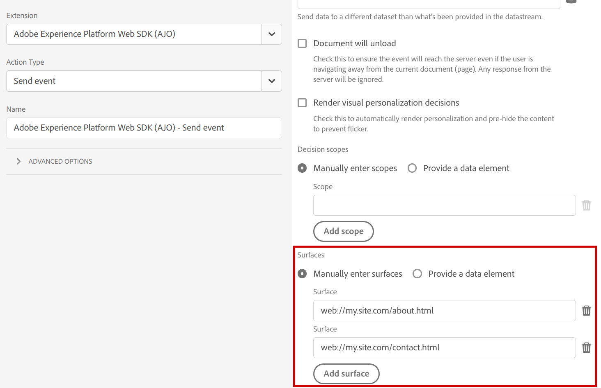

# 使用 [!DNL Adobe Journey Optimizer] と [!DNL Platform Web SDK]

[!DNL Adobe Experience Platform] [!DNL Web SDK] では、で管理されるパーソナライズされたエクスペリエンスを配信およびレンダリングできます [!DNL Adobe Journey Optimizer] を web チャネルに追加します。 WYSIWYG エディタを使用できます。 [!DNL Adobe Journey Optimizer] [ウェブキャンペーン UI](https://experienceleague.adobe.com/docs/journey-optimizer/using/web/create-web.html)を作成、アクティブ化、配信する [!DNL Journey Optimizer Web] キャンペーンとパーソナライゼーションエクスペリエンス。

>[!IMPORTANT]
>
>詳しくは、 [Adobe Journey Optimizer Web チャネルドキュメント](https://experienceleague.adobe.com/docs/journey-optimizer/using/web/get-started-web.html) の基本を学ぶには [!DNL Journey Optimizer Web] エクスペリエンスのオーサリングとレポート。

## 用語 {#terminology}

**[!UICONTROL サーフェス]**:Web サーフェスは、URL で識別される Web プロパティで、 [!DNL Adobe Journey Optimizer] エクスペリエンスコンテンツが配信されます。

**[!UICONTROL 提案]**:In [!DNL Adobe Journey Optimizer]、提案は、 [!DNL Journey Optimizer Campaign].

## 有効化 [!DNL Adobe Journey Optimizer] {#enable-ajo}

を使用し始めるには [!DNL Adobe Journey Optimizer]、次の手順に従います。

1. 詳しくは、 [前提条件](https://experienceleague.adobe.com/docs/journey-optimizer/using/web/create-web.html#prerequesites) から [!DNL Adobe Journey Optimizer] [Web エクスペリエンスガイド](https://experienceleague.adobe.com/docs/journey-optimizer/using/web/create-web.html)具体的には、
   * 設定 [!DNL Adobe Experience Cloud Visual Editing Helper].
   * 有効にする [!DNL Adobe Journey Optimizer] の [datastream](../../../datastreams/overview.md).
   * を有効にします。 [!UICONTROL エッジ上のアクティブな結合ポリシー] オプション。

2. を `renderDecisions` オプションをイベントに追加できます。 設定 `renderDecisions` から `true` 配信されたJourney Optimizerコンテンツ提案を web ページ上に自動レンダリングする場合。

   ```javascript
   alloy("sendEvent", {
       ...,
       "renderDecisions": true
   })
   ```

3. 必要に応じて、イベントに追加のサーフェスを指定します。 デフォルトでは、Web SDK は現在の Web ページの Web サーフェスを自動的に生成し、Edge Network へのリクエストに含めます。 必要に応じて、リクエストに追加のサーフェスを含めるには、 `personalization.surfaces` オプション `sendEvent` コマンド、または対応する **[!UICONTROL サーフェス]** [[!UICONTROL イベントを送信] アクション](../../../tags/extensions/client/web-sdk/action-types.md#send-event) Web SDK 拡張機能の設定。

   ```javascript
   alloy("sendEvent", {
       ...
       "personalization": {
       "surfaces": [ "web://my.site.com/about.html", "web://my.site.com/contact.html" ]
       }
   })
   ```

   

   イベントサーフェスは `query.personalization.surfaces` リクエストフィールド：

   ```json
   {
   "events": [
       {
           "query": {
               "personalization": {
               "schemas": [
                   ...
               ],
               "decisionScopes": [
                   "__view__"
               ],
               "surfaces": [
                   "web://ajostage.weebly.com/"
               ]
               }
           },
           ...
       }
   ]
   }
   ```

4. 他のパーソナライゼーション機能と同様に、 **[スニペットを非表示にする](../manage-flicker.md)** エクスペリエンスを取得する際に、ページの特定の部分のみを非表示にする

## Adobe Journey Optimizer Web エクスペリエンスの作成 {#create-ajo-web-experiences}

フォロー： [web キャンペーンのオーサリング](https://experienceleague.adobe.com/docs/journey-optimizer/using/web/create-web.html#create-web-campaign) からの指示 [!DNL Adobe Journey Optimizer] [Web エクスペリエンスガイド](https://experienceleague.adobe.com/docs/journey-optimizer/using/web/create-web.html) 作成する [!DNL Journey Optimizer Web] キャンペーンとエクスペリエンス。

## パーソナライズされたコンテンツのレンダリング {#rendering-personalized-content}

詳しくは、 [パーソナライゼーションコンテンツのレンダリング](../rendering-personalization-content.md) を参照してください。

Adobe Journey Optimizerの Web サーフェス提案は、 `__view__` 決定範囲の提案。 特に、 `renderDecisions` オプションが `true` 内 `sendEvent` コマンドを使用すると、Web SDK によって自動的にレンダリングされます。

Journey Optimizerコンテンツ提案の例：

```json
{
    "scope": "web://ajostage.weebly.com/",
    "scopeDetails": {
        "correlationID": "ccfaf19c-6360-4aea-b464-0cf924db5da7",
        "characteristics": {
            "eventToken": "eyJtZXNzYWdlRXhlY3V0aW9uIjp7Im1lc3NhZ2VFeGVjdXRpb25JRCI6ImEzNDYxYTMzLTc5MjktNGQyNS1hNmMxLTVkYzM2YWY1NzRmMyIsIm1lc3NhZ2VJRCI6ImNjZmFmMTljLTYzNjAtNGFlYS1iNDY0LTBjZjkyNGRiNWRhNyIsIm1lc3NhZ2VUeXBlIjoibWFya2V0aW5nIiwiY2FtcGFpZ25JRCI6IjEzN2JmMzllLWM1ODgtNGI1My1iODQxLTJiMWZiZDYxM2JkYiIsImNhbXBhaWduVmVyc2lvbklEIjoiMTA1NzY1MmEtZWYwNS00YjE3LWExMmUtY2FlOTQyOTFhMWFjIiwiY2FtcGFpZ25BY3Rpb25JRCI6ImViNTlmODQ4LTk5ZDYtNGE1OC05YmU4LTk4MjIxODU0NmYzNiIsIm1lc3NhZ2VQdWJsaWNhdGlvbklEIjoiYzg2NzFjZmItNDdjYS00YTVjLTg4Y2YtNzYwZDFlZjU1MzQyIn0sIm1lc3NhZ2VQcm9maWxlIjp7ImNoYW5uZWwiOnsiX2lkIjoiaHR0cHM6Ly9ucy5hZG9iZS5jb20veGRtL2NoYW5uZWxzL3dlYiIsIl90eXBlIjoiaHR0cHM6Ly9ucy5hZG9iZS5jb20veGRtL2NoYW5uZWwtdHlwZXMvd2ViIn0sIm1lc3NhZ2VQcm9maWxlSUQiOiI2YTViY2I3ZC02MmYxLTQ5NDItODRkMC02MzE5ZjM5Zjk1ZGUifX0="
        },
        "decisionProvider": "AJO",
        "activity": {
            "id": "137bf39e-c588-4b53-b841-2b1fbd613bdb#eb59f848-99d6-4a58-9be8-982218546f36"
        }
    },
    "id": "002321c0-dff5-4153-b171-a9dfb70b9750",
    "items": [
        {
            "schema": "https://ns.adobe.com/personalization/dom-action",
            "data": {
                "uiData": {
                    "tagType": "Text",
                    "actionType": "changed"
                },
                "content": "Welcome AJO!",
                "prehidingSelector": "#wsite-content > DIV:nth-of-type(2) > DIV:nth-of-type(1) > DIV:nth-of-type(1) > DIV:nth-of-type(1) > DIV:nth-of-type(1) > DIV:nth-of-type(3) > FONT:nth-of-type(1) > SPAN:nth-of-type(1)",
                "type": "setHtml",
                "selector": "#wsite-content > DIV.wsite-section-wrap:eq(1) > DIV.wsite-section:eq(0) > DIV.wsite-section-content:eq(0) > DIV.container:eq(0) > DIV.wsite-section-elements:eq(0) > DIV.paragraph:eq(0) > FONT:nth-of-type(1) > SPAN:nth-of-type(1)"
            },
            "id": "0a522f66-9e6a-4ded-b1d0-e9167f103290"
        },
        {
            "schema": "https://ns.adobe.com/personalization/dom-action",
            "data": {
                "uiData": {
                    "tagType": "Text",
                    "actionType": "changed"
                },
                "content": {
                    "font-weight": "bold"
                },
                "prehidingSelector": "#wsite-content > DIV:nth-of-type(2) > DIV:nth-of-type(1) > DIV:nth-of-type(1) > DIV:nth-of-type(1) > DIV:nth-of-type(1) > DIV:nth-of-type(3) > FONT:nth-of-type(1) > SPAN:nth-of-type(1)",
                "type": "setStyle",
                "selector": "#wsite-content > DIV.wsite-section-wrap:eq(1) > DIV.wsite-section:eq(0) > DIV.wsite-section-content:eq(0) > DIV.container:eq(0) > DIV.wsite-section-elements:eq(0) > DIV.paragraph:eq(0) > FONT:nth-of-type(1) > SPAN:nth-of-type(1)"
            },
            "id": "66216ca5-5d0f-4239-a8c8-6bc4a5a7cbdb"
        }
    ]
}
```

## デバッグ {#debugging}

Adobe Journey Optimizerのパーソナライゼーション実装をデバッグするには、 [[!DNL Web SDK] デバッグ](https://experienceleague.adobe.com/docs/experience-platform/edge/fundamentals/debugging.html). [!DNL Adobe Journey Optimizer] を使用したトラブルシューティング時に、デバッグトレースを利用できます [[!DNL Adobe Experience Platform Assurance]](https://developer.adobe.com/client-sdks/documentation/platform-assurance/). でのイベントのチェック `AJO:` プレフィックス


