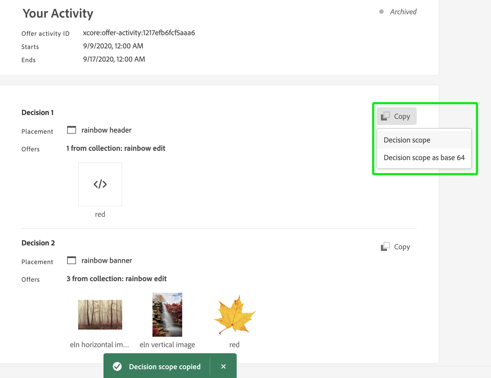

# Platform Web SDK でのOffer decisioningの使用

>[!NOTE]
>
>Adobe Experience Platform Web SDK でのOffer decisioningの使用は、一部のユーザーに早期にアクセスできます。 この機能は、一部の IMS 組織ではご利用いただけきません。

Adobe Experience Platform [!DNL Web SDK] は、Offer decisioningで管理されるパーソナライズされたオファーを配信およびレンダリングできます。 オファーユーザーインターフェイス (UI) または API を使用して、オファーやその他の関連Offer decisioningを作成できます。

## 前提条件

* IMS 組織がエッジ判定に対して有効である
* オファー、作成されたアクティビティ
* Datastream が公開されている

## 用語

offer decisioningを使用する際は、次の用語を理解することが重要です。 詳細および追加の用語を確認するには、[Offer decisioningの用語集 ](https://experienceleague.adobe.com/docs/offer-decisioning/using/get-started/glossary.html) を参照してください。

* **コンテナ：** コンテナとは、様々な懸念事項を分離するための分離メカニズムです。コンテナ ID は、すべてのリポジトリー API の最初のパス要素です。すべての決定オブジェクトはコンテナ内に存在します。

* **判定範囲：** Offer decisioningの場合、判定範囲は、offer decisioningサービスでオファーの提案に使用するアクティビティ ID と配置 ID を含む、Base64 でエンコードされた JSON 文字列です。

   *判定範囲 JSON:*

   ```json
   {
     "activityId":"xcore:offer-activity:11cfb1fa93381aca",
     "placementId":"xcore:offer-placement:1175009612b0100c"
   }
   ```

   *判定範囲 Base64 エンコードされた文字列：*

   ```json
   "eyJhY3Rpdml0eUlkIjoieGNvcmU6b2ZmZXItYWN0aXZpdHk6MTFjZmIxZmE5MzM4MWFjYSIsInBsYWNlbWVudElkIjoieGNvcmU6b2ZmZXItcGxhY2VtZW50OjExNzUwMDk2MTJiMDEwMGMifQ=="
   ```

   >[!TIP]
   >
   >判定スコープの値は、UI の **アクティビティの概要** ページからコピーできます。

   

* **データストリーム：** 詳しくは、datastreams のドキュメントを参照して [](../../fundamentals/datastreams.md) ください。

* **ID**:詳しくは、 [Platform Web SDK が ID サービスを使用する方法を概要するこのドキュメントをお読みください](../../identity/overview.md)。

## offer decisioning

offer decisioningを有効にするには、次の手順を実行します。

1. [datastream](../../fundamentals/datastreams.md) でAdobe Experience Platformを有効にし、「Offer decisioning」ボックスをオンにします

   

1. [SDK](../../fundamentals/installing-the-sdk.md) のインストールの手順に従います (SDK は、スタンドアロンで、または [ データ収集 UI](https://experience.adobe.com/#/data-collection/) を使用してインストールできます。 詳しくは、[ タグのクイックスタートガイド ](../../../tags/quick-start/quick-start.md) を参照してください。
1. [SDK を](../../fundamentals/configuring-the-sdk.md) Offer decisioningその他のOffer decisioning固有の手順を以下に示します。

   * スタンドアロン SDK のインストール

      1. `decisionScopes` で「sendEvent」アクションを設定します。

         ```javascript
          alloy("sendEvent", {
             ...
             "decisionScopes": [
                 "eyJhY3Rpdml0eUlkIjoieGNvcmU6b2ZmZXItYWN0aXZpdHk6MTIxYWIwOWMxM2JkZDIyNCIsInBsYWNlbWVudElkIjoieGNvcmU6b2ZmZXItcGxhY2VtZW50OjEyMWFiMDZhODRkMDViMTEifQ==",
                 "eyJhY3Rpdml0eUlkIjoieGNvcmU6b2ZmZXItYWN0aXZpdHk6MTIxYWIyNWI5NTUwNWIxZiIsInBsYWNlbWVudElkIjoieGNvcmU6b2ZmZXItcGxhY2VtZW50OjEyMWFiMjFmOTQzMDE0MmIifQ=="
             ]
          })
         ```
   * タグを使用した SDK のインストール

      1. [タグプロパティの作成](../../../tags/ui/administration/companies-and-properties.md)
      1. [ 埋め込みコードの追加](https://experienceleague.adobe.com/docs/core-services-learn/implementing-in-websites-with-launch/configure-launch/launch-add-embed.html)
      1. 「Datastream」ドロップダウンから設定を選択し、作成したデータストリームを使用して、Platform Web SDK 拡張機能をインストールおよび設定します。 [ 拡張機能 ](../../../tags/ui/managing-resources/extensions/overview.md) に関するドキュメントを参照してください。

         

         

      1. 必要な [ データ要素 ](../../../tags/ui/managing-resources/data-elements.md) を作成します。 少なくとも、Platform Web SDK Identity Map と Platform Web SDK XDM オブジェクトデータ要素を作成する必要があります。

         

         

      1. [ ルール ](../../../tags/ui/managing-resources/rules.md) を作成します。

         * 「Platform Web SDK Send Event」アクションを追加し、関連する `decisionScopes` をそのアクションの設定に追加します。

            
      1. [設定した関連するすべてのル](../../../tags/ui/publishing/libraries.md) ール、データ要素、拡張機能を含むライブラリを作成して公開します。


## リクエストと応答のサンプル

### 1 つの `decisionScopes` 値

**リクエスト**

```json
{
  "events": [
    {
      "xdm": {
        "identityMap": {
          "ECID": [
            {
              "id": "91133425615229052182584359620783097099"
            }
          ]
        }
      },
      "query": {
        "personalization": {
          "decisionScopes": [
            "eyJhY3Rpdml0eUlkIjoieGNvcmU6b2ZmZXItYWN0aXZpdHk6MTFjZmIxZmE5MzM4MWFjYSIsInBsYWNlbWVudElkIjoieGNvcmU6b2ZmZXItcGxhY2VtZW50OjExNzUwMDk2MTJiMDEwMGMifQ=="
          ]
        }
      }
    }
  ]
}
```

| プロパティ | 必須 | 説明 | 制限 | 例 |
|---|---|---|---|---|
| `identityMap` | ○ | この [ID サービスのドキュメント ](../../identity/overview.md) を参照してください。 | リクエストごとに 1 つの ID。 | `{ "identityMap": { "ECID": [ { "id": "91133425615229052182584359620783097099" } ] } }` |
| `decisionScopes` | ○ | アクティビティ ID と配置 ID を含む、Base64 でエンコードされた JSON の文字列の配列。 | リクエストあたり最大 30 `decisionScopes` | `"decisionScopes": ["eyJhY3Rpdml0eUlkIjoieGNvcmU6b2ZmZXItYWN0aXZpdHk6MTFjZmIxZmE5MzM4MWFjYSIsInBsYWNlbWVudElkIjoieGNvcmU6b2ZmZXItcGxhY2VtZW50OjExNzUwMDk2MTJiMDEwMGMifQ=="]` |

**応答** 

```json
{
  "requestId": "94c4f2f1-9218-43ce-afd3-eb0d853c5174",
  "handle": [
    {
      "payload": [
        {
          "id": "2862bb89-5df2-4bc6-85c2-d8f7e1a091de",
          "scope": "eyJhY3Rpdml0eUlkIjoieGNvcmU6b2ZmZXItYWN0aXZpdHk6MTFjZmIxZmE5MzM4MWFjYSIsInBsYWNlbWVudElkIjoieGNvcmU6b2ZmZXItcGxhY2VtZW50OjExNzUwMDk2MTJiMDEwMGMifQ==",
          "activity": {
            "id": "xcore:offer-activity:11cfb1fa93381aca",
            "etag": "2"
          },
          "placement": {
            "id": "xcore:offer-placement:1175009612b0100c",
            "etag": "1"
          },
          "items": [
            {
              "id": "xcore:personalized-offer:124cc332095cfa74",
              "schema": "https://ns.adobe.com/experience/offer-management/content-component-html",
              "etag": "1",
              "data": {
                "id": "xcore:personalized-offer:124cc332095cfa74",
                "format": "text/html",
                "language": [
                  "en-US"
                ],
                "content": "<p>20% Off on shipping</p>",
                "characteristics": {
                  "foo": "bar",
                  "foo1": "bar1"
                }
              }
            }
          ]
        }
      ],
      "type": "personalization:decisions",
      "eventIndex": 0
    }
  ]
}
```

| プロパティ | 説明 | 例 |
|---|---|---|
| `scope` | 提案されたオファーを導いた決定範囲。 | `"scope": "eyJhY3Rpdml0eUlkIjoieGNvcmU6b2ZmZXItYWN0aXZpdHk6MTFjZmIxZmE5MzM4MWFjYSIsInBsYWNlbWVudElkIjoieGNvcmU6b2ZmZXItcGxhY2VtZW50OjExNzUwMDk2MTJiMDEwMGMifQ=="` |
| `activity.id` | オファーアクティビティの一意の ID。 | `"id": "xcore:offer-activity:11cfb1fa93381aca"` |
| `placement.id` | オファー配置の一意の ID。 | `"id": "xcore:offer-placement:1175009612b0100c"` |
| `items.id` | 提案されたオファーの ID。 | `"id": "xcore:personalized-offer:124cc332095cfa74"` |
| `schema` | 提案されたオファーに関連付けられたコンテンツのスキーマ。 | `"schema": "https://ns.adobe.com/experience/offer-management/content-component-html"` |
| `data.id` | 提案されたオファーの ID。 | `"id": "xcore:personalized-offer:124cc332095cfa74"` |
| `format` | 提案されたオファーに関連付けられているコンテンツの形式。 | `"format": "text/html"` |
| `language` | 提案されたオファーのコンテンツに関連付けられた言語の配列。 | `"language": [ "en-US" ]` |
| `content` | 提案されたオファーに関連付けられたコンテンツ（文字列形式）。 | `"content": "<p style="color:red;">20% Off on shipping</p>"` |
| `deliveryUrl` | 提案されたオファーに関連付けられた画像コンテンツ（URL 形式）。 | `"deliveryURL": "https://image.jpeg"` |
| `characteristics` | 提案されたオファーに JSON オブジェクトの形式で関連付けられている特性。 | `"characteristics": { "foo": "bar", "foo1": "bar1" }` |

### 複数の `decisionScopes` 値

**リクエスト**

```json
{
  "events": [
    {
      "xdm": {
        "identityMap": {
          "ECID": [
            {
              "id": "91133425615229052182584359620783097099"
            }
          ]
        }
      },
      "query": {
        "personalization": {
          "decisionScopes": [
            "eyJhY3Rpdml0eUlkIjoieGNvcmU6b2ZmZXItYWN0aXZpdHk6MTFjZmIxZmE5MzM4MWFjYSIsInBsYWNlbWVudElkIjoieGNvcmU6b2ZmZXItcGxhY2VtZW50OjExNzUwMDk2MTJiMDEwMGMifQ==",
            "eyJhY3Rpdml0eUlkIjoieGNvcmU6b2ZmZXItYWN0aXZpdHk6MTIyMjA4YjNhODc0MDU1OCIsInBsYWNlbWVudElkIjoieGNvcmU6b2ZmZXItcGxhY2VtZW50OjEyMjIwNDUyOTUxNGEyYzAifQ==",
            "eyJhY3Rpdml0eUlkIjoieGNvcmU6b2ZmZXItYWN0aXZpdHk6MTIyYzkxMzg1Mjc2MDE4YyIsInBsYWNlbWVudElkIjoieGNvcmU6b2ZmZXItcGxhY2VtZW50OjEyMzMxZjU2MTYyYWEyZjcifQ=="
          ]
        }
      }
    }
  ]
}
```

| プロパティ | 必須 | 説明 | 制限 | 例 |
|---|---|---|---|---|
| `identityMap` | ○ | この [ID サービスのドキュメント ](../../identity/overview.md) を参照してください。 | リクエストごとに 1 つの ID。 | `{ "identityMap": { "ECID": [ { "id": "91133425615229052182584359620783097099" } ] } }` |
| `decisionScopes` | ○ | アクティビティ ID と配置 ID を含む、Base64 でエンコードされた JSON の文字列の配列。 | リクエストあたり最大 30 `decisionScopes` | `"decisionScopes":["eyJhY3Rpdml0eUlkIjoieGNvcmU6b2ZmZXItYWN0aXZpdHk6MTFjZmIxZmE5MzM4MWFjYSIsInBsYWNlbWVudElkIjoieGNvcmU6b2ZmZXItcGxhY2VtZW50OjExNzUwMDk2MTJiMDEwMGMifQ==", "eyJhY3Rpdml0eUlkIjoieGNvcmU6b2ZmZXItYWN0aXZpdHk6MTIyMjA4YjNhODc0MDU1OCIsInBsYWNlbWVudElkIjoieGNvcmU6b2ZmZXItcGxhY2VtZW50OjEyMjIwNDUyOTUxNGEyYzAifQ=="` |

**応答** 

```json
{
  "requestId": "94c4f2f1-9218-43ce-afd3-eb0d853c5174",
  "handle": [
    {
      "payload": [
        {
          "id": "a2804dfb-a0ec-4df9-8311-59d3ecdeb642",
          "scope": "eyJhY3Rpdml0eUlkIjoieGNvcmU6b2ZmZXItYWN0aXZpdHk6MTFjZmIxZmE5MzM4MTEyMyIsInBsYWNlbWVudElkIjoieGNvcmU6b2ZmZXItcGxhY2VtZW50OjExNzUwMDk2MTJiMDExMjMifQ==",
          "activity": {
            "id": "xcore:offer-activity:11cfb1fa93381123",
            "etag": "1"
          },
          "placement": {
            "id": "xcore:offer-placement:1175009612b01123",
            "etag": "3"
          },
          "items": [
            {
              "id": "xcore:personalized-offer:11e36d4a22954123",
              "schema": "https://ns.adobe.com/experience/offer-management/content-component-text",
              "etag": "2",
              "data": {
                "id": "xcore:personalized-offer:11e36d4a22954123",
                "format": "text/text",
                "language": [
                  "en"
                ],
                "content": "20% Off on shipping",
                "characteristics": {
                  "foo2": "bar2"
                }
              }
            }
          ]
        },
        {
          "id": "a2804dfb-a0ec-4df9-8311-59d3ecdeb642",
          "scope": "eyJhY3Rpdml0eUlkIjoieGNvcmU6b2ZmZXItYWN0aXZpdHk6MTFjZmIxZmE5MzM4MWFjYSIsInBsYWNlbWVudElkIjoieGNvcmU6b2ZmZXItcGxhY2VtZW50OjExNzUwMDk2MTJiMDEwMGMifQ==",
          "activity": {
            "id": "xcore:offer-activity:11cfb1fa93381aca",
            "etag": "2"
          },
          "placement": {
            "id": "xcore:offer-placement:1175009612b0100c",
            "etag": "1"
          },
          "items": [
            {
              "id": "xcore:personalized-offer:11e36d4a2295415d",
              "schema": "https://ns.adobe.com/experience/offer-management/content-component-imagelink",
              "etag": "1",
              "data": {
                "id": "xcore:personalized-offer:11e36d4a2295415d",
                "format": "image/png",
                "language": [
                  "en"
                ],
                "deliveryURL": "https://image.jpeg",
                "characteristics": {
                  "foo": "bar",
                  "foo1": "bar1"
                }
              }
            }
          ]
        }
      ],
      "type": "personalization:decisions",
      "eventIndex": 0
    }
  ]
}
```

| プロパティ | 説明 | 例 |
|---|---|---|
| `scope` | 提案されたオファーを導いた決定範囲。 | `"scope": "eyJhY3Rpdml0eUlkIjoieGNvcmU6b2ZmZXItYWN0aXZpdHk6MTFjZmIxZmE5MzM4MWFjYSIsInBsYWNlbWVudElkIjoieGNvcmU6b2ZmZXItcGxhY2VtZW50OjExNzUwMDk2MTJiMDEwMGMifQ=="` |
| `activity.id` | オファーアクティビティの一意の ID。 | `"id": "xcore:offer-activity:11cfb1fa93381123"` |
| `placement.id` | オファー配置の一意の ID。 | `"xcore:offer-placement:1175009612b01123"` |
| `items.id` | 提案されたオファーの ID。 | `"id": "xcore:personalized-offer:11e36d4a22954123"` |
| `schema` | 提案されたオファーに関連付けられたコンテンツのスキーマ。 | `"schema": "https://ns.adobe.com/experience/offer-management/content-component-text"` |
| `data.id` | 提案されたオファーの ID。 | `"id": "xcore:personalized-offer:11e36d4a22954123"` |
| `format` | 提案されたオファーに関連付けられているコンテンツの形式。 | `"format": "text/text"` |
| `language` | 提案されたオファーのコンテンツに関連付けられた言語の配列。 | `"language": [ "en-US" ]` |
| `content` | 提案されたオファーに関連付けられたコンテンツ（文字列形式）。 | `"content": "<p style="color:red;">20% Off on shipping</p>"` |
| `deliveryUrl` | 提案されたオファーに関連付けられた画像コンテンツ（URL 形式）。 | `"deliveryURL": "https://image.jpeg"` |
| `characteristics` | 提案されたオファーに JSON オブジェクトの形式で関連付けられている特性。 | `"characteristics": { "foo": "bar", "foo1": "bar1" }` |

## 制限事項

現在、一部のオファー制約は、モバイルエクスペリエンスエッジワークフロー（キャッピングなど）ではサポートされていません。 「キャッピング」フィールド値は、すべてのユーザーに対してオファーを提示できる回数を指定します。 詳しくは、[ オファーの実施要件ルールと制約のドキュメント ](https://experienceleague.adobe.com/docs/offer-decisioning/using/managing-offers-in-the-offer-library/creating-personalized-offers.html#eligibility) を参照してください。
