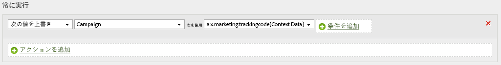

# （ベータ版）Adobe Analyticsへのデータの送信

>[!IMPORTANT]
>
>Adobe Experience Platform Web SDKは現在ベータ版で、すべてのユーザーが利用できるわけではありません。 ドキュメントと機能は変更される場合があります。

Adobe Experience Platform Web SDKは、Adobe Analyticsにデータを送信できます。 これは、Adobe Analyticsで使用で `xdm` きる形式に変換することで機能します。

## セットアップ

顧客設定UIでレポートスイートがマッピングされている場合、Adobe Analyticsは送信するデータを自動的に取得します。 ここで、1つ以上のレポートを特定の設定にマップできます。 レポートスイートのマッピング後、データのフローが自動的に開始されます。

## 自動的にマッピングされたデータ

Adobe Experience Platform Edge Networkは、多くのXDM変数を自動的にマッピングします。 自動的にマッピングされた変数の完全なリストをここに示 [します](../analytics/automatically-mapped-vars.md)。

## 手動でマッピングされたデータ

エッジネットワークによって収集されたすべてのデータは、処理ルールを介してアクセスできます。 データはドット表記を使用して統合され、contextDataとして使用できます。

このようなスキーマがある場合。

```javascript
{
  key:value,
  object:{
    key1:value1,
    key2:value2
  },
  array:[
    v1,
    v2,
    v3
  ],
  arrayofobjects:[
    {
      obj1key:objval1
    },
    {
      obj2key:objval2
    }
  ]
}
```

これらは、使用可能なコンテキストデータキーになります。

```javascript
a.x.key //value
a.x.object.key1 //value1
a.x.object.key2 //value2
a.x.array[0] //v1
a.x.array[1] //v2
a.x.array[3] //v3
a.x.arrayofobjects[1].obj1key //objval1
a.x.arrayofobjects[2].obj2key //objval2
```

次に、このデータを使用する処理ルールの例を示します。


