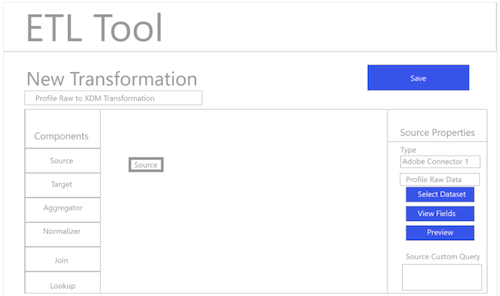

# ETL ワークフロー

様々な抽出、変換、読み込み（ETL）ツールの形式は異なることがありますが、ほとんどのツールでは、複数のデータソースを組み合わせる際に役立つ類似した機能が公開されています。

## ETL ツールの例

次の図は、一般的な ETL アクションと、標準的なインタラクションにおける一般的なユーザーエクスペリエンスを示しています。これらの画像は、特定の ETL ユーザーエクスペリエンスで容易に活用することができます。

以下に示すアクションの手順については、[ETL 統合ガイド](home.md)で説明しています。一部の手順では特定の「図」を参照しています。その他の手順では、ここに示したワークフローと同様のアクションについて説明しています。

### 図 1 - 新しい Adobe Experience Platform コネクタの設定：

### 図 2 - [!DNL Experience Platform] 有効化されたコネクタ：

### 図 3 - ETL 変換管理 UI：

### 図 4 — 新しい変換 UI、選択 [!DNL Experience Platform] 接続：

### 図 5 — ソースの参照 [!DNL Experience Platform] データセット：

### 図 6 - データセットのメタデータとサンプルデータ（ETL UI）：

### 図 7 - データセットのフィールドスキーマ情報の表示：

### 図 8 - データセットのデータのプレビュー：

### 図 9 - 変換の操作のためのデータ同期パラメーターの定義：

### 図 10 — の定義 [!DNL Experience Data Model] (XDM) ターゲットデータセット：

### 図 11 - マッピング／変換のために XDM 階層スキーマとメタデータを表示する：

### 図 12 - 保存して変換を実行する／変換のスケジュールを設定する：

