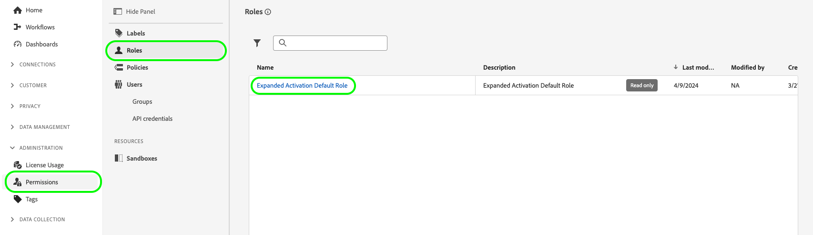

# アカウント管理

Audience Managerからオーディエンスを取り込み、ソーシャルおよび広告の宛先に対してアクティブ化するには、まず拡張アクティベーションユーザーアカウントを作成し、適切な権限のロールにアカウントを割り当てる必要があります。

ここでは、Admin Consoleでユーザーアカウントを作成し、拡張アクティベーションの正しい権限を付与する方法について説明します。

## ユーザーアカウントの作成 {#create-users}

[!DNL Audience Manager Expanded Activation] を使用するには、まずユーザーアカウントを作成する必要があります。

[!DNL Expanded Activation] のユーザーアカウントを作成するには、[Adobe Admin Console](https://helpx.adobe.com/jp/enterprise/using/manage-users-individually.html) ドキュメントのユーザーの管理の手順に従ってください。

## 権限ロールにユーザーを追加 {#permissions}

ユーザーアカウントを作成したら、[!DNL Expanded Activation] ユーザーインターフェイスで、そのユーザーアカウントを [!DNL Expanded Activation] 権限ロールに追加する必要があります。

**[!UICONTROL 管理]**/**[!UICONTROL 権限]**/**[!UICONTROL 役割]** に移動し、「**[!UICONTROL 拡張アクティベーションのデフォルトの役割]**」を選択します。

「**[!UICONTROL ユーザー]**」タブに移動し、「**[!UICONTROL ユーザーを追加]**」を選択します。

使用可能なリストから新しく作成したユーザーを選択し、「**[!UICONTROL 保存]**」を選択します。

これでユーザーアカウントが作成され、正しい役割に割り当てられました。 これで、**[!UICONTROL 拡張アクティベーション]** ユーザーインターフェイスにアクセスする準備が整いました。

## ライセンス使用状況の監視 {#license-usage}

[!DNL Audience Manager Expanded Activation] 契約では、アカウントに取り込むことができるハッシュ化されたメールの最大数を指定します。

この情報は、**[!UICONTROL 管理]**/**[!UICONTROL ライセンスの使用状況]** ページに移動すると確認できます。

このページには、次の情報が表示されます。

* **[!UICONTROL Product]**：ライセンスを取得したAdobe。 これは常に、**[!UICONTROL Audience Managerで展開されたライセンス認証]** になります。
* **[!UICONTROL プライマリ指標]**：使用状況について追跡されている指標の名前。 これは常に **[!UICONTROL アドレス可能なオーディエンス]** になります。
* **[!UICONTROL ライセンス量]**：取り込みライセンスがある、ハッシュ化されたメールの最大数です。

  >[!TIP]
  >
  >[Audience Managerソースコネクタ &#x200B;](../sources/connectors/adobe-applications/audience-manager.md) を介してハッシュ化されたメールを取り込みます。 詳しくは、[&#x200B; オーディエンスのアクティブ化方法 &#x200B;](activate-audiences.md) に関するドキュメントを参照してください。

* **[!UICONTROL 使用状況]**：取り込んだハッシュ化されたメールの数。
* **[!UICONTROL 使用状況 %]**：使用したライセンス量の割合。

Experience Platformでのライセンスの使用について詳しくは、[&#x200B; ライセンスの使用に関するドキュメント &#x200B;](../dashboards/guides/license-usage.md) を参照してください。

## 次の手順 {#next-steps}

展開されたアクティベーションへの適切なアクセス権を持つユーザーアカウントを少なくとも 1 つ設定したので、そのアカウントを使用して [&#x200B; オーディエンスをアクティブ化 &#x200B;](activate-audiences.md) できます。
