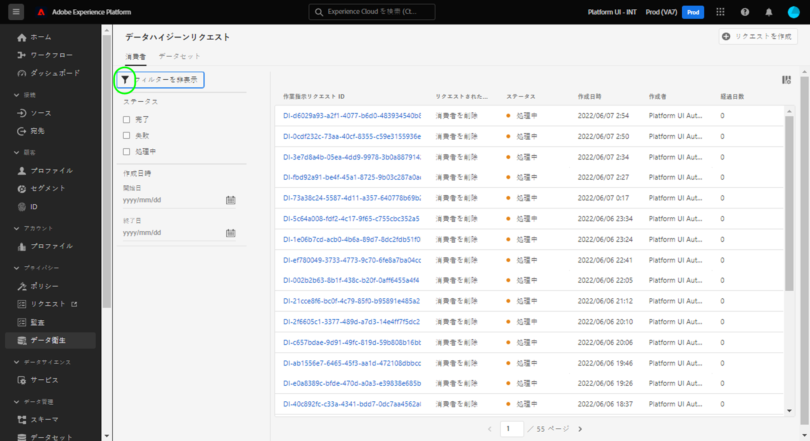
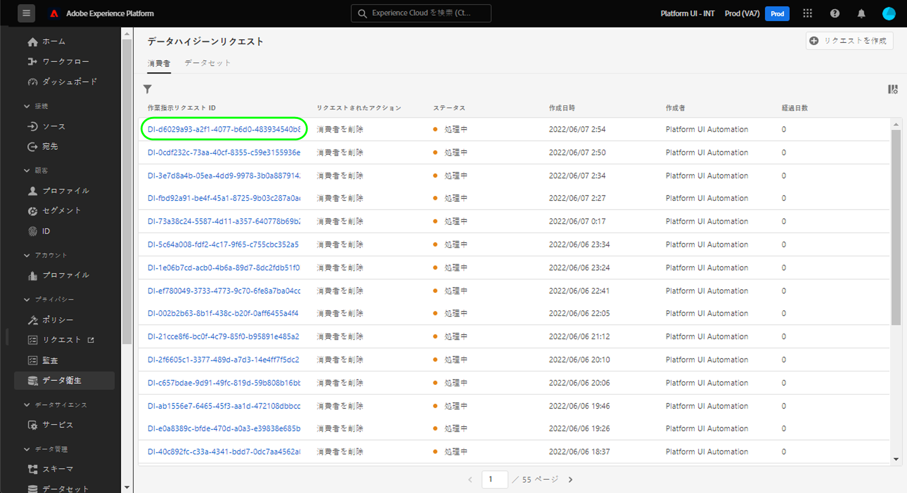
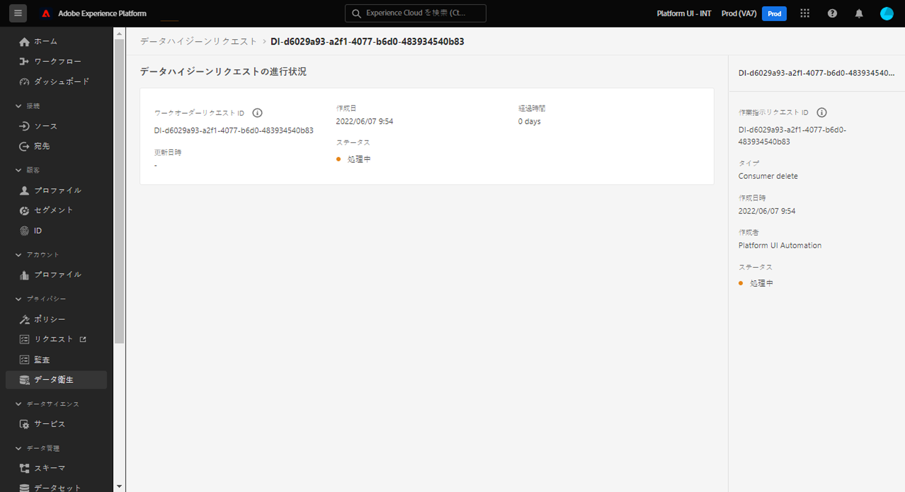
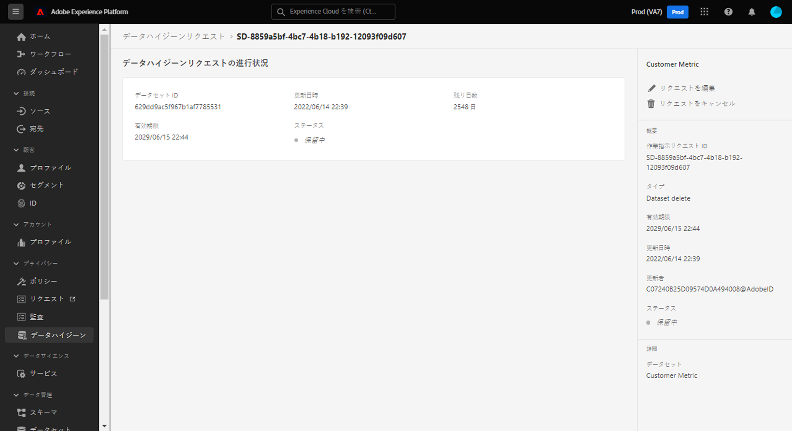

# データハイジーン作業指示の参照 {#browse-work-orders}

>[!CONTEXTUALHELP]
>id="platform_hygiene_workorders"
>title="作業指示 ID"
>abstract="データハイジーンリクエストがシステムに送信されると、リクエストされたタスクを実行するための作業指示が作成されます。つまり、作業指示は、特定のデータハイジーン処理を表し、その現在のステータスおよび他の関連する詳細が含まれます。各作業指示は、作成時に独自の一意の ID が自動的に割り当てられます。"
>text="See the data hygiene UI guide to learn more."

>[!IMPORTANT]
>
>Adobe Experience Platform のデータハイジーン機能は、現在、Healthcare Shield を購入した組織のみが利用できます。

データハイジーンリクエストがシステムに送信されると、リクエストされたタスクを実行するための作業指示が作成されます。作業指示は、特定のデータの衛生処理（スケジュール済みのデータセット有効期限など）を表します。このプロセスには、現在のステータスやその他の関連する詳細が含まれます。

このガイドでは、Adobe Experience Platform UI での既存の作業指示の表示および管理方法を説明します。

## 既存の作業指示のリスト表示とフィルタリング

UI で最初に&#x200B;**[!UICONTROL データハイジーン]**&#x200B;ワークスペースにアクセスすると、既存の作業指示のリストが、基本的な情報と共に表示されます。

![Platform UI の[!UICONTROL データハイジーン]ワークスペースを示す画像](../images/ui/browse/work-order-list.png)

<!-- The list only shows work orders for one category at a time. Select **[!UICONTROL Consumer]** to view a list of consumer deletion tasks, and **[!UICONTROL Dataset]** to view a list of scheduled dataset expirations.

![Image showing the [!UICONTROL Dataset] tab](../images/ui/browse/dataset-tab.png) -->

ファネルアイコン（）を選択すると、表示された作業指示のフィルターのリストが表示されます。

| フィルター | 説明 |
| --- | --- |
| [!UICONTROL ステータス] | 作業指示の現在のステータスに基づいてフィルタリングします。<ul><li>**[!UICONTROL 完了]**：ジョブが完了しました。</li><li>**[!UICONTROL 保留中]**：ジョブは作成されましたが、まだ実行されていません。A [データセット有効期限リクエスト](./dataset-expiration.md) は、このステータスが、予定されている削除日より前にあると仮定します。 削除日に達すると、ジョブが事前にキャンセルされない限り、ステータスは[!UICONTROL 実行中]に更新されます。</li><li>**[!UICONTROL 実行中]**:データセット有効期限のリクエストが開始され、現在処理中です。</li><li>**[!UICONTROL キャンセル]**：ジョブは、手動のユーザーリクエストの一環としてキャンセルされました。</li></ul> |
| [!UICONTROL 作成日] | 作業指示が作成された日時に基づいてフィルタリングします。 |
| [!UICONTROL 有効期限] | 対象のデータセットに対してスケジュールされた削除日に基づいて、データセットの有効期限リクエストをフィルタリングします。 |
| [!UICONTROL 更新日] | 作業指示が最後に更新された日時に基づいて、データセットの有効期限リクエストをフィルタリングします。 作成と有効期限は更新としてカウントされます。 |

{style=&quot;table-layout:auto&quot;}

## 作業指示の詳細の表示 {#view-details}

>[!CONTEXTUALHELP]
>id="platform_hygiene_statusbyservice"
>title="サービス別ステータス"
>abstract="データの衛生要求は、複数のExperience Platform・サービスで独立して処理されます。 この節では、各サービスに関するリクエストの現在の処理ステータスについて説明します。 詳しくは、『データ衛生 UI ガイド』を参照してください。"

>[!CONTEXTUALHELP]
>id="platform_hygiene_numberofidentities"
>title="ID 数"
>abstract="この作業指示の一部として削除をリクエストされた ID の数。 カウントに含まれる ID は、影響を受けるデータセットに存在しない場合があります。 詳しくは、『データ衛生 UI ガイド』を参照してください。"

>[!CONTEXTUALHELP]
>id="platform_hygiene_responsemessages"
>title="消費者の削除応答"
>abstract="消費者削除プロセスがシステムから応答を受け取ると、これらのメッセージは **[!UICONTROL 結果]** 」セクションに入力します。 作業指示の処理中に問題が発生した場合は、問題のトラブルシューティングに役立つ関連するエラーメッセージがこのセクションに表示されます。 詳しくは、データハイジーン UI ガイドを参照してください。"

リストされた作業指示の ID を選択して、そのの詳細を表示します。

<!-- Depending on the type of work order selected, different information and controls are provided. These are covered in the sections below.

### Consumer delete details {#consumer-delete}

The details of a consumer delete request are read-only, displaying its basic attributes such as its current status and the time elapsed since the request was made.

### Dataset expiration details {#dataset-expiration} -->

データセットの有効期限の詳細ページには、削除がおこなわれる前の日数の予定有効期限など、基本属性に関する情報が表示されます。 右側のレールでは、コントロールを使用して、有効期限を編集またはキャンセルできます。

## 次の手順

このガイドでは、Platform UI での既存のデータハイジーン作業指示の表示および管理方法について説明しました。独自の作業指示の作成について詳しくは、 [データセットの有効期限のスケジュール設定](./dataset-expiration.md).
