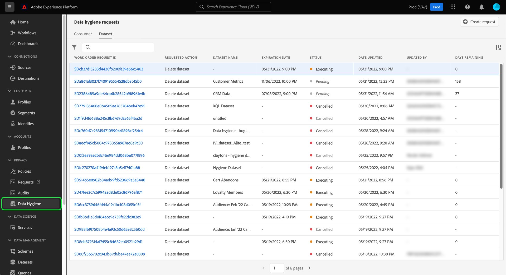
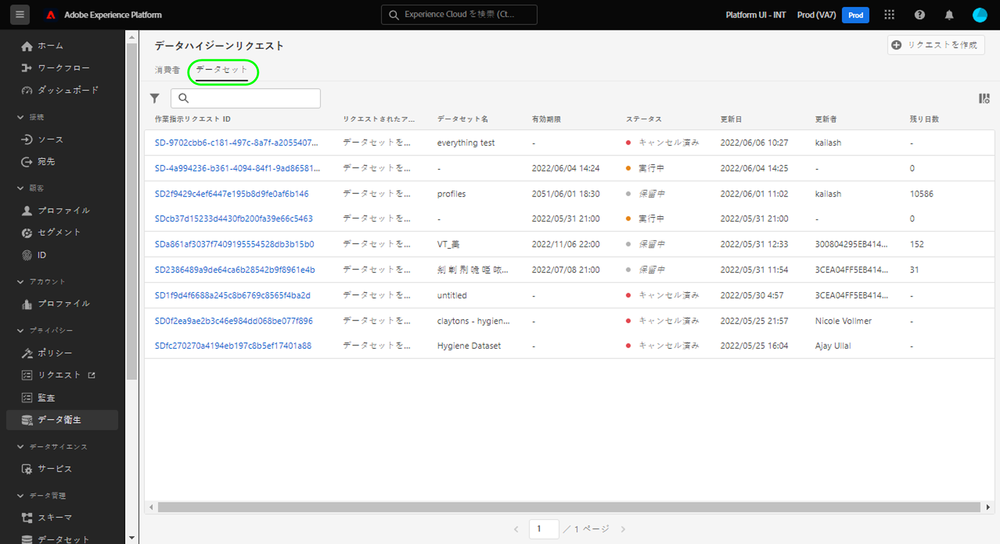
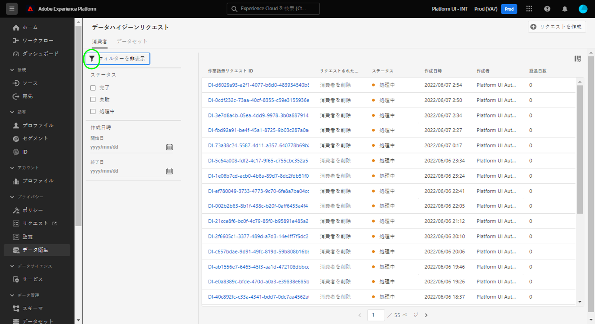
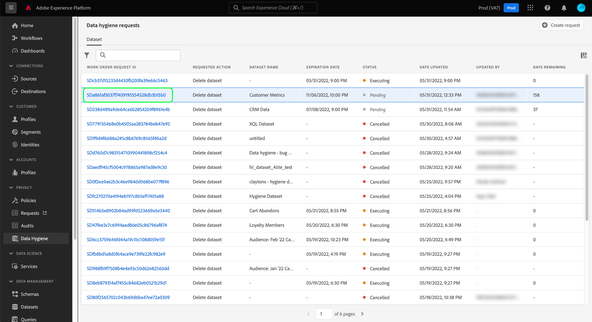
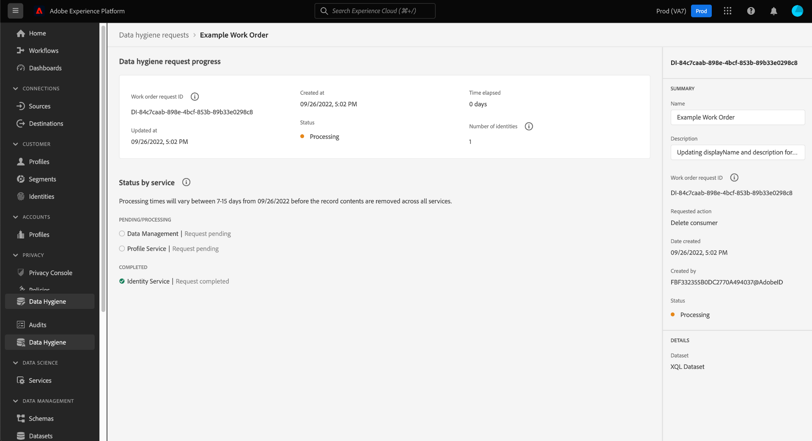
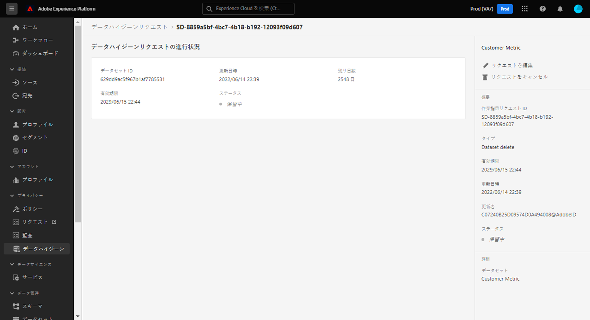

# データライフサイクル作業指示の参照 {#browse-work-orders}

>[!CONTEXTUALHELP]
>id="platform_hygiene_workorders"
>title="作業指示 ID"
>abstract="データライフサイクルリクエストがシステムに送信されると、リクエストされたタスクを実行するための作業指示が作成されます。 つまり、作業指示は、特定のデータライフサイクルプロセスを表し、その現在のステータスおよび他の関連する詳細が含まれます。 各作業指示は、作成時に独自の一意の ID が自動的に割り当てられます。"
>text="See the data lifecycle UI guide to learn more."

データライフサイクルリクエストがシステムに送信されると、リクエストされたタスクを実行するための作業指示が作成されます。 作業指示は、スケジュールされたデータセットの有効期限など、特定のデータライフサイクルプロセスを表し、これには現在のステータスやその他の関連する詳細が含まれます。

このガイドでは、Adobe Experience Platform UI での既存の作業指示の表示および管理方法を説明します。

## 既存の作業指示のリスト表示とフィルタリング

UIの&#x200B;**[!UICONTROL Data Lifecycle]** ワークスペースに最初にアクセスすると、既存の作業指示のリストが基本詳細とともに表示されます。

Experience Platform UIの[!UICONTROL Data Lifecycle] ワークスペースを示す画像

リストには、一度に 1 つのカテゴリの作業指示のみが表示されます。 レコード削除タスクのリストを表示するには&#x200B;**[!UICONTROL Consumer]**&#x200B;を選択し、スケジュールされたデータセット有効期限のリストを表示するには&#x200B;**[!UICONTROL Dataset]**&#x200B;を選択します。

[!UICONTROL Dataset] タブ を示す画像

ファネルアイコン（）を選択すると、表示された作業指示のフィルターのリストが表示されます。

表示する作業指示のタイプに応じて、様々なフィルターオプションを使用できます。

### レコード削除用フィルター

次のフィルターは、レコード削除要求に適用されます。

| フィルター | 説明 |
| --- | --- |
| [!UICONTROL Status] | 作業指示の現在のステータスに基づいてフィルタリングします。<ul><li>**[!UICONTROL Completed]**: ジョブが完了しました。</li><li>**[!UICONTROL Failed]**: ジョブでエラーが発生したため、完了できませんでした。</li><li>**[!UICONTROL Processing]**：要求が開始され、現在処理中です。</li></ul> |
| [!UICONTROL Date created] | 作業指示が作成された日時に基づいてフィルタリングします。 |
| [!UICONTROL Date updated] | 作業指示が最後に更新された日時に基づいたフィルター。 作成は更新としてカウントされます。 |

### データセット有効期限のフィルター

次のフィルターは、データセットの有効期限のリクエストに適用されます。

| フィルター | 説明 |
| --- | --- |
| [!UICONTROL Status] | 作業指示の現在のステータスに基づいてフィルタリングします。<ul><li>**[!UICONTROL Completed]**: ジョブが完了しました。</li><li>**[!UICONTROL Pending]**: ジョブは作成されましたが、まだ実行されていません。 [データセットの有効期限リクエスト](./dataset-expiration.md)は、スケジュール済みの削除日より前にこのステータスを想定します。 削除日が到来すると、ジョブが事前にキャンセルされない限り、ステータスは[!UICONTROL Executing]に更新されます。</li><li>**[!UICONTROL Executing]**: データセットの有効期限リクエストが開始され、現在処理中です。</li><li>**[!UICONTROL Cancelled]**：手動ユーザーリクエストの一部として、ジョブがキャンセルされました。</li></ul> |
| [!UICONTROL Date created] | 作業指示が作成された日時に基づいてフィルタリングします。 |
| [!UICONTROL Expiration date] | 対象のデータセットに対してスケジュール済みの削除日に基づいて、データセットの有効期限リクエストをフィルタリングします。 |
| [!UICONTROL Date updated] | 作業指示が最後に更新された日時に基づいたフィルター。 作成と有効期限は、更新としてカウントされます。 |

{style="table-layout:auto"}

## 作業指示の詳細の表示 {#view-details}

>[!CONTEXTUALHELP]
>id="platform_hygiene_statusbyservice"
>title="サービス別ステータス"
>abstract="データライフサイクルリクエストは、複数の Experience Platform サービスで独立して処理されます。 この節では、各サービスに関するリクエストの現在の処理ステータスについて説明します。 詳しくは、データライフサイクル UI ガイドを参照してください。"

>[!CONTEXTUALHELP]
>id="platform_hygiene_numberofidentities"
>title="ID 数"
>abstract="この作業指示の一環として、レコードの更新または削除をリクエストされた ID の数。 カウントに含まれる ID は、影響を受けるデータセットに存在しない場合があります。 詳しくは、データライフサイクル UI ガイドを参照してください。"

>[!CONTEXTUALHELP]
>id="platform_hygiene_responsemessages"
>title="レコード削除応答"
>abstract="レコード削除プロセスがシステムから応答を受信すると、これらのメッセージは&#x200B;**[!UICONTROL Result]** セクションの下に表示されます。 作業指示の処理中に問題が発生した場合は、問題のトラブルシューティングに役立つ関連エラーメッセージがこのセクションに表示されます。 詳しくは、データライフサイクル UI ガイドを参照してください。"

リストされた作業指示の ID を選択して、そのの詳細を表示します。

選択した作業指示のタイプに応じて、様々な情報およびコントロールが提供されます。 これらは、次の節で説明します。

### レコード削除の詳細 {#record-delete}

レコード削除リクエストの詳細には、現在のステータスと、リクエストが行われてから経過した時間が含まれます。 各リクエストには、**[!UICONTROL Status by service]** セクションも含まれており、削除に関連する各ダウンストリームサービスの個々のステータスの詳細を提供します。 右側のパネルでは、コントロールを使用して、作業指示の名前と説明を更新できます。

>[!TIP]
>
>レコード削除リクエストは、処理が開始される前にバッチ処理され、標準のSLAで完了するまでに最大30日かかる場合があります。 各ステージで何が起こるかの詳細については、[削除タイムラインの記録](../home.md#record-delete-transparency)を参照してください。

レコード削除作業指示の詳細ページを示す

### データセット有効期限の詳細 {#dataset-expiration}

データセットの有効期限の詳細ページは、その基本属性に関する情報を提供します（削除が発生するまでの残り日数に対してスケジュール設定された有効期限など）。 右側のパネルで、有効期限を編集またはキャンセルするためのコントロールを使用できます。

## 次の手順

このガイドでは、Experience Platform UIで既存のデータライフサイクル作業指示を表示および管理する方法について説明しました。 独自の作業指示の作成について詳しくは、次のドキュメントを参照してください。

* [データセット有効期限の管理](./dataset-expiration.md)
* [レコード削除の管理](./record-delete.md)
