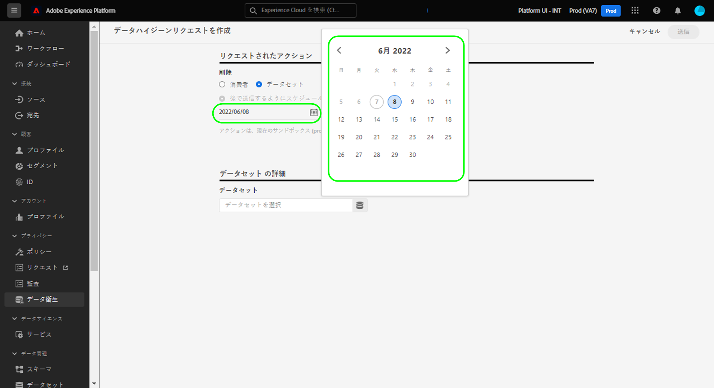
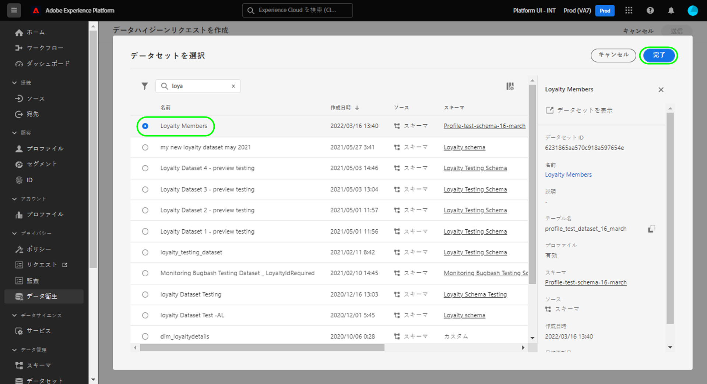

# データセット有効期限の管理

>[!IMPORTANT]
>
>現在、Adobe Experience Platformのデータ衛生機能は、Healthcare Shield を購入した組織でのみ使用できます。

この [[!UICONTROL データの衛生状態] workspace](./overview.md) Adobe Experience Platform UI では、データセットの有効期限をスケジュールできます。 データセットが有効期限に達すると、データレイク、ID サービス、リアルタイム顧客プロファイルは、別々のプロセスを開始し、各サービスからデータセットの内容を削除します。 3 つのサービスすべてからデータを削除すると、有効期限が完了とマークされます。

>[!WARNING]
>
>データセットの有効期限が切れるように設定されている場合、ダウンストリームワークフローに悪影響が及ばないよう、データをそのデータセットに取り込む可能性があるデータフローを手動で変更する必要があります。

このドキュメントでは、Platform UI のデータセット有効期限をスケジュール設定および管理する方法を説明します。

## データセット有効期限のスケジュール設定

新しいリクエストを作成するには、ワークスペースのメインページから「**[!UICONTROL リクエストを作成]**」を選択します。

![「[!UICONTROL リクエストを作成]」ボタンが選択されていることを示す画像](../images/ui/ttl/create-request-button.png)

リクエスト作成ダイアログが表示されます。以下 **[!UICONTROL 要求されたアクション]** セクション、選択 **[!UICONTROL データセットを削除]** をクリックして、データセットの有効期限のスケジュール設定に使用できるコントロールを更新します。

![「[!UICONTROL リクエストを作成]」ボタンが選択されていることを示す画像](../images/ui/ttl/dataset-selected.png)

### 日付およびデータセットの選択

リクエスト作成ダイアログが表示されます。以下 **[!UICONTROL 要求されたアクション]** 「 」セクションで、データセットを削除する日付を選択します。 手動で日付を入力（`mm/dd/yyyy` 形式）するか、カレンダーアイコン（）を選択して、ダイアログから日付を選択します。

次に、「**[!UICONTROL データセットの詳細]**」で、データベースアイコン（）を選択して、データセット選択ダイアログを開きます。リストから有効期限を適用するデータセットを選択して、「**[!UICONTROL 完了]**」を選択します。

>[!NOTE]
>
>現在のサンドボックスに属するデータセットのみが表示されます。

### リクエストの送信

この [!UICONTROL データセットの詳細] 「 」セクションには、選択したデータセットのプライマリ id とスキーマが入力されます。 の下 **[!UICONTROL リクエスト設定]**、リクエストの名前とオプションの説明を入力し、その後に **[!UICONTROL 送信]**.

![「[!UICONTROL 送信]」ボタンが選択されていることを示す画像](../images/ui/ttl/submit.png)

データセットが削除される日付を確認するよう求められます。「**[!UICONTROL 送信]**」をクリックして続行します。

リクエストが送信されると、作業指示が作成され、[!UICONTROL データハイジーン]ワークスペースのメインタブに表示されます。ここから、リクエストを処理する作業指示のステータスを監視できます。

>[!NOTE]
>
>概要に関する節 ( [タイムラインと透明性](../home.md#dataset-expiration-transparency) を参照してください。

## データセット有効期限の編集またはキャンセル

データセットの有効期限を編集またはキャンセルするには、ワークスペースのメインページで&#x200B;**[!UICONTROL データセット]**&#x200B;を選択して、リストからデータセットの有効期限を選択します。

データセット有効期限の詳細ページで、右側のパネルにスケジュール設定された削除を編集またはキャンセルするためのコントロールが表示されます。

## 次の手順

このドキュメントでは、Experience Platform UI でデータセットの有効期限をスケジュール設定する方法について説明しました。UI で他のデータハイジーンタスクを実行する方法について詳しくは、[データハイジーン UI の概要](./overview.md)を参照してください。

Data Hygiene API を使用したデータセット有効期限のスケジュール設定方法については、[データセット有効期限のエンドポイントガイド](../api/dataset-expiration.md)を参照してください。
