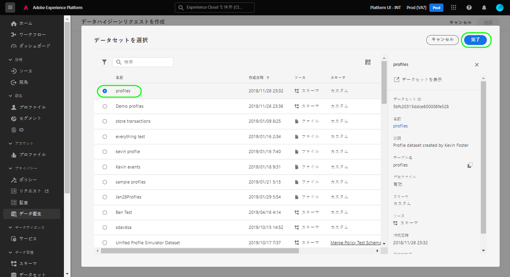
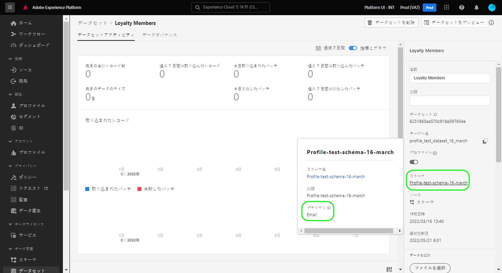
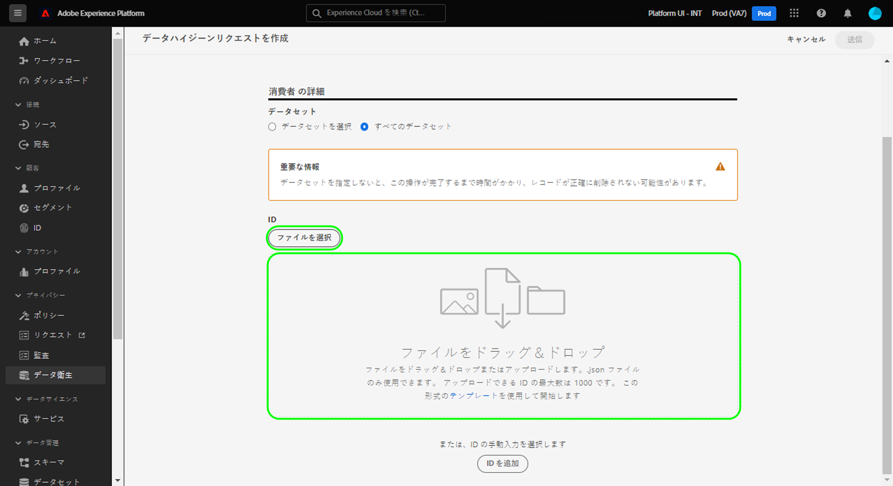
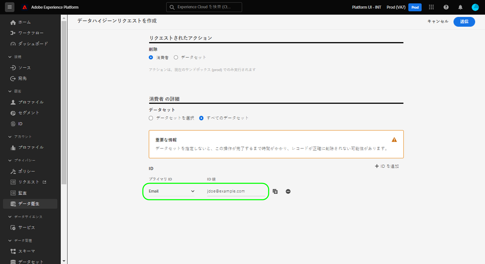
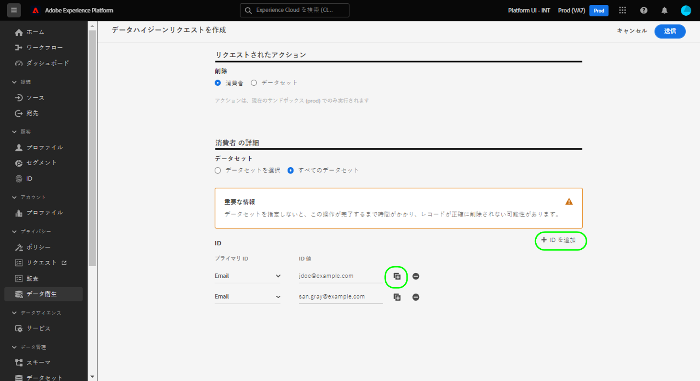
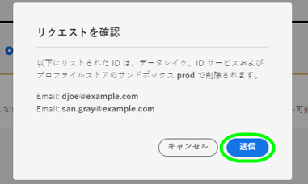

# 消費者レコードの削除

>[!IMPORTANT]
>
>現在、Adobe Experience Platformのデータ衛生機能は、医療用Adobeシールドを購入した組織でのみ使用できます。

この [[!UICONTROL データの衛生状態] workspace](./overview.md) Adobe Experience Platform UI では、ID サービスとリアルタイム顧客プロファイルに参加している消費者レコードを削除できます。

## 前提条件

消費者レコードを削除するには、ID フィールドがExperience Platformでどのように機能するかを、実際に理解しておく必要があります。 特に、削除元のデータセット（複数可）に応じて、レコードを削除するコンシューマーのプライマリ ID 値を把握しておく必要があります。

Platform での ID について詳しくは、次のドキュメントを参照してください。

* [Adobe Experience Platform ID サービス](../../identity-service/home.md)：デバイスやシステム間で ID をブリッジし、準拠する XDM スキーマで定義された ID フィールドに基づいてデータセットをリンクします。
   * [ID 名前空間](../../identity-service/namespaces.md):ID 名前空間は、1 人の個人に関連付けることができる様々なタイプの ID 情報を定義し、各 ID フィールドの必須コンポーネントです。
* [リアルタイム顧客プロファイル](../../profile/home.md):消費者の ID グラフを活用して、ほぼリアルタイムで更新された、複数のソースからの集計データに基づいて、統合された消費者プロファイルを提供します。
* [エクスペリエンスデータモデル (XDM)](../../xdm/home.md):スキーマを使用して、Platform データの標準的な定義と構造を提供します。 すべての Platform データセットは特定の XDM スキーマに準拠し、スキーマはどのフィールドを ID として定義します。
   * [ID フィールド](../../xdm/ui/fields/identity.md):XDM スキーマでの ID フィールドの定義方法を説明します。

## 新しいリクエストの作成

プロセスを開始するには、「 **[!UICONTROL リクエストを作成]** をワークスペースのメインページから削除します。

![を示す画像 [!UICONTROL リクエストを作成] ボタンが選択されています](../images/ui/delete-consumer/create-request-button.png)

リクエスト作成ダイアログが表示されます。 デフォルトでは、 **[!UICONTROL 消費者]** オプションが **[!UICONTROL アクション]** 」セクションに入力します。 このオプションは選択したままにします。


## データセットを選択

以下 **[!UICONTROL 消費者の詳細]** の節では、次に、1 つのデータセットから消費者データを削除するか、すべてのデータセットから消費者データを削除するかを決定します。

次を選択した場合： **[!UICONTROL データセットを選択]**、データベースアイコン () が表示され、リストから目的のデータセットを選択できるダイアログが表示されます。



すべてのデータセットから消費者データを削除する場合は、「 」を選択します。 **[!UICONTROL すべてのデータセット]**.

![を示す画像 [!UICONTROL すべてのデータセット] 選択したオプション](../images/ui/delete-consumer/all-datasets.png)

>[!NOTE]
>
>の選択 **[!UICONTROL すべてのデータセット]** オプションを使用すると、削除操作に時間がかかり、正確なレコードの削除がおこなわれない場合があります。

## 消費者 ID の提供 {#identities}

>[!CONTEXTUALHELP]
>id="platform_hygiene_primaryidentity"
>title="プライマリID"
>abstract="プライマリ ID は、レコードをExperience Platform内の消費者のプロファイルに結び付ける属性です。 データセットのプライマリ ID フィールドは、データセットの基になるスキーマによって定義されます。 この列では、消費者のプライマリ ID のタイプ（または名前空間）を指定する必要があります。例えば、電子メールアドレスには「電子メール」、Experience CloudID には「ecid」と入力します。 詳しくは、『データ衛生 UI ガイド』を参照してください。"

>[!CONTEXTUALHELP]
>id="platform_hygiene_identityvalue"
>title="ID 値"
>abstract="この列では、消費者のプライマリ ID の値を指定する必要があります。この値は、左の列で指定された ID タイプに対応している必要があります。 プライマリ ID タイプが「email」の場合、値は消費者の電子メールアドレスにする必要があります。 詳しくは、『データ衛生 UI ガイド』を参照してください。"

消費者データを削除する場合は、削除する必要のあるレコードをシステムが判断できるように、ID 情報を指定する必要があります。 Platform のデータセットの場合、レコードは **プライマリ ID** データセットのスキーマで定義されるフィールド。

Platform のすべての ID フィールドと同様、プライマリ ID は、次の 2 つの要素で構成されます。a **type** （id 名前空間とも呼ばれます）と **値**. ID タイプは、フィールドが消費者を識別する方法（電子メールアドレスなど）に関するコンテキストを提供し、値は、そのタイプの消費者固有の ID( 例えば、 `jdoe@example.com` の `email` id タイプ )。  ID として使用される一般的なフィールドには、アカウント情報、デバイス ID、Cookie ID が含まれます。

>[!TIP]
>
>特定のデータセットのプライマリ ID がわからない場合、Platform UI で見つけることができます。 内 **[!UICONTROL データセット]** ワークスペースで、問題のデータセットをリストから選択します。 データセットの詳細ページで、右側のパネルにあるデータセットのスキーマの名前の上にマウスポインターを置きます。 プライマリ ID が、スキーマ名と説明と共に表示されます。
>
>

1 つのデータセットから消費者レコードを削除する場合、データセットには 1 つのプライマリ ID しか割り当てられないので、指定する ID すべてに同じタイプが必要です。 すべてのデータセットから削除する場合、異なるデータセットには異なるプライマリ ID が存在する可能性があるので、複数の ID タイプを含めることができます。

消費者レコードを削除する際に消費者 ID を指定する方法は 2 つあります。

* [JSON ファイルのアップロード](#upload-json)
* [ID 値を手動で入力](#manual-identity)

### JSON ファイルのアップロード {#upload-json}

JSON ファイルをアップロードするには、ファイルを指定領域にドラッグ&amp;ドロップするか、「 **[!UICONTROL ファイルを選択]** をクリックし、ローカルディレクトリからを参照して選択します。



JSON ファイルは、オブジェクトの配列（各オブジェクトはコンシューマー ID を表す）として形式設定する必要があります。

```json
[
  {
    "namespaceCode": "email",
    "value": "jdoe@example.com"
  },
  {
    "namespaceCode": "email",
    "value": "san.gray@example.com"
  }
]
```

| プロパティ | 説明 |
| --- | --- |
| `namespaceCode` | ID タイプ。 |
| `value` | タイプで示される、消費者の ID。 |

ファイルがアップロードされたら、 [リクエストを送信](#submit).

### ID を手動で入力 {#manual-identity}

ID を手動で入力するには、「 」を選択します **[!UICONTROL ID を追加]**.

![を示す画像 [!UICONTROL ID を追加] ボタンが選択されています](../images/ui/delete-consumer/add-identity.png)

消費者 ID を 1 つずつ入力できるコントロールが表示されます。 の下 **[!UICONTROL プライマリID]**&#x200B;を選択し、ドロップダウンメニューを使用して id タイプを選択します。 の下 **[!UICONTROL ID 値]**」で、消費者のプライマリ ID 値を指定します。



ID を追加するには、プラスアイコン () をクリックするか、 **[!UICONTROL ID を追加]**.



## リクエストを送信します (#submit)

リクエストへの ID の追加が完了したら、「 」を選択します。 **[!UICONTROL 送信]**.

![を示す画像 [!UICONTROL 送信] ボタンが選択されています](../images/ui/delete-consumer/submit.png)

データを削除する ID のリストを確認するよう求められます。 選択 **[!UICONTROL 送信]** をクリックして選択を確定します。



リクエストが送信されると、作業指示が作成され、 [!UICONTROL 消費者] タブ [!UICONTROL データの衛生状態] ワークスペース。 ここから、作業指示のステータスを監視して、要求を処理できます。 ほとんどの消費者の削除作業指示は、完了するまで数日かかります。

## 次の手順

このドキュメントでは、消費者 UI で消費者レコードを削除する方法についてExperience Platformしました。 UI でのその他のデータ衛生タスクの実行方法について詳しくは、 [データ衛生 UI の概要](./overview.md).

データ衛生 API を使用して消費者レコードを削除する方法については、 [作業順序エンドポイントガイド](../api/workorder.md).
