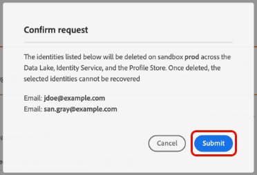

# レコードを削除

この [[!UICONTROL データの衛生状態] workspace](./overview.md) Adobe Experience Platform UI では、ID サービスとリアルタイム顧客プロファイルに参加しているレコードを削除できます。 これらのレコードは、個々のコンシューマーや、ID グラフに含まれる他のエンティティに結び付けることができます。

>[!IMPORTANT]
>
>レコードの削除リクエストは、を購入した組織でのみ使用できます **Adobeヘルスケアシールド**.
>
>
>レコードの削除は、データのクレンジング、匿名データの削除、またはデータの最小化に使用するためのものです。 これらは **not** :EU 一般データ保護規則 (GDPR) などのプライバシー規制に関するデータ主体の権利要求（コンプライアンス）に使用されます。 すべてのコンプライアンスの使用例に対して、 [Adobe Experience Platform Privacy Service](../../privacy-service/home.md) 代わりに、

## 前提条件

レコードを削除するには、ID フィールドがExperience Platformでどのように機能するかに関する十分な知識が必要です。 特に、レコードを削除するエンティティのプライマリ ID 値は、削除元のデータセット（複数可）に応じて、そのエンティティの主 ID 値を把握しておく必要があります。

Platform の ID について詳しくは、次のドキュメントを参照してください。

* [Adobe Experience Platform ID サービス](../../identity-service/home.md)：デバイスやシステム間で ID をブリッジし、準拠する XDM スキーマで定義された ID フィールドに基づいてデータセットをリンクします。
   * [ID 名前空間](../../identity-service/namespaces.md)：ID 名前空間は、1 人の人物に関連している可能性のある様々なタイプの ID 情報を定義する、各 ID フィールドに必須のコンポーネントです。
* [リアルタイム顧客プロファイル](../../profile/home.md):ID グラフを活用して、ほぼリアルタイムで更新された、複数のソースからの集計データに基づいて、統合された消費者プロファイルを提供します。
* [エクスペリエンスデータモデル（XDM）](../../xdm/home.md)：スキーマの使用により、Platform データの標準的な定義および構造を提供します。すべての Platform データセットは特定の XDM スキーマに準拠しており、スキーマはどのフィールドが ID であるかを定義しています。
   * [ID フィールド](../../xdm/ui/fields/identity.md)：XDM スキーマで ID フィールドが定義される方法を説明します。

## 新しいリクエストの作成

プロセスを開始するには、ワークスペースのメインページから「**[!UICONTROL リクエストを作成]**」を選択します。

![「[!UICONTROL リクエストを作成]」ボタンが選択されていることを示す画像](../images/ui/record-delete/create-request-button.png)

リクエスト作成ダイアログが表示されます。デフォルトでは、 **[!UICONTROL 消費者を削除]** オプションが **[!UICONTROL 要求されたアクション]** 」セクションに入力します。 このオプションを選択されたままにします。


## データセットの選択

以下 **[!UICONTROL 消費者の詳細]** の節では、次に、1 つのデータセットからレコードを削除するか、すべてのデータセットからレコードを削除するかを決定します。

「**[!UICONTROL データセットを選択]**」を選択する場合、データベースアイコン（）を選択すると、リストから目的のデータセットを選択できるダイアログが表示されます。


すべてのデータセットからレコードを削除する場合は、「 」を選択します。 **[!UICONTROL すべてのデータセット]**.

![「[!UICONTROL すべてのデータセット]」オプションが選択されていることを示す画像](../images/ui/record-delete/all-datasets.png)

>[!NOTE]
>
>「**[!UICONTROL すべてのデータセット]**」オプションを選択すると、削除操作により時間がかかり、正確なレコード削除にならない可能性があります。

## ID の提供 {#provide-identities}

>[!CONTEXTUALHELP]
>id="platform_hygiene_primaryidentity"
>title="プライマリ ID"
>abstract="プライマリ ID は、Experience Platform でレコードを消費者のプロファイルに結び付ける属性です。データセットのプライマリ ID フィールドは、そのデータセットが基づいているスキーマによって定義されます。この列では、レコードのプライマリ ID のタイプ（または名前空間）を指定する必要があります ( 例： `email` （電子メールアドレスの場合） `ecid` (Experience CloudID)。 詳しくは、データの衛生 UI ガイドを参照してください。"

>[!CONTEXTUALHELP]
>id="platform_hygiene_identityvalue"
>title="ID 値"
>abstract="この列では、レコードのプライマリ ID の値を指定する必要があります。この値は、左の列で指定された ID タイプに対応している必要があります。 プライマリ ID タイプが `email`の場合、値はレコードの電子メールアドレスにする必要があります。 詳しくは、データハイジーン UI ガイドを参照してください。"

レコードを削除する場合は、削除するレコードをシステムが決定できるように、ID 情報を指定する必要があります。 Platform のデータセットの場合、レコードは、データセットのスキーマによって定義された「**プライマリ ID**」フィールドに基づいて削除されます。

Platform のすべての ID フィールドと同様に、プライマリ ID は、**タイプ**（ID 名前空間とも呼ばれる）と&#x200B;**値**&#x200B;の 2 つで構成されます。ID タイプは、フィールドがレコード（E メールアドレスなど）を識別するコンテキストを提供し、値は、そのタイプのレコード固有の ID( 例： `jdoe@example.com` の `email` id タイプ )。 ID として使用される共通のフィールドには、アカウント情報、デバイス ID および Cookie ID が含まれます。

>[!TIP]
>
>特定のデータセットのプライマリ ID がわからない場合は、Platform UI で見つけることができます。**[!UICONTROL データセット]**&#x200B;ワークスペースで、リストから問題のデータセットを選択します。データセットの詳細ページの右側のパネルで、データセットのスキーマの名前の上にマウスポインターを置きます。プライマリ ID が、スキーマ名および説明と共に表示されます。
>
>

1 つのデータセットからレコードを削除する場合、データセットには 1 つのプライマリ ID しか割り当てられないので、指定する ID すべてに同じタイプが必要です。 すべてのデータセットから削除している場合、データセットが異なるとプライマリ ID が異なる可能性があるので、複数の ID タイプを含めることができます。

レコードを削除する際に ID を指定する方法は 2 つあります。

* [JSON ファイルのアップロード](#upload-json)
* [ID 値を手動で入力](#manual-identity)

### JSON ファイルのアップロード {#upload-json}

JSON ファイルをアップロードするには、ファイルを提供領域にドラッグ＆ドロップするか、「**[!UICONTROL ファイルを選択]**」を選択して、ローカルディレクトリから参照して選択できます。


JSON ファイルは、オブジェクトの配列（ID を表す各オブジェクト）として形式設定する必要があります。

```json
[
  {
    "namespaceCode": "email",
    "value": "jdoe@example.com"
  },
  {
    "namespaceCode": "email",
    "value": "san.gray@example.com"
  }
]
```

| プロパティ | 説明 |
| --- | --- |
| `namespaceCode` | ID タイプ。 |
| `value` | タイプで示される ID 値。 |

ファイルがアップロードされると、引き続き[リクエストを送信](#submit)できます。

### ID を手動で入力 {#manual-identity}

ID を手動で入力するには、「**[!UICONTROL ID を追加]**」を選択します。

![「[!UICONTROL ID を追加]」ボタンが選択されていることを示す画像](../images/ui/record-delete/add-identity.png)

ID を 1 つずつ入力できるコントロールが表示されます。 「**[!UICONTROL プライマリ ID]**」で、ドロップダウンメニューを使用して ID タイプを選択します。の下 **[!UICONTROL ID 値]**&#x200B;に、レコードのプライマリ ID 値を指定します。


さらに ID を追加するには、行の横にあるプラスアイコン（）を選択するか、「**[!UICONTROL ID を追加]**」を選択します。


## リクエストの送信（#submit）

リクエストへの ID の追加が完了したら、「**[!UICONTROL 送信]**」を選択する前に&#x200B;**[!UICONTROL リクエスト設定]**&#x200B;でリクエストの名前とオプションの説明を入力します。

![「[!UICONTROL 送信]」ボタンが選択されていることを示す画像](../images/ui/record-delete/submit.png)

データを削除する ID のリストを確認することを求められます。「**[!UICONTROL 送信]**」を選択して、選択を確定します。



リクエストが送信されると、作業指示が作成され、[!UICONTROL データハイジーン]ワークスペースの「[!UICONTROL 消費者]」タブに表示されます。ここから、リクエストを処理する作業指示のステータスを監視できます。

>[!NOTE]
>
>概要に関する節 ( [タイムラインと透明性](../home.md#record-delete-transparency) を参照してください。

## 次の手順

このドキュメントでは、Experience PlatformUI でのレコードの削除方法を説明しました。 UI で他のデータハイジーンタスクを実行する方法について詳しくは、[データハイジーン UI の概要](./overview.md)を参照してください。

データ衛生 API を使用してレコードを削除する方法については、 [作業順序エンドポイントガイド](../api/workorder.md).
