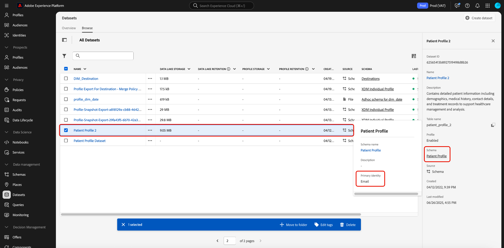

# レコードの削除 {#record-delete}

[[!UICONTROL  データライフサイクル ] ワークスペース ](./overview.md) を使用して、プライマリ ID に基づいてAdobe Experience Platform内のレコードを削除します。 これらのレコードは、個々のコンシューマーまたは ID グラフに含まれるその他のエンティティに関連付けることができます。

>[!IMPORTANT]
> 
>レコード削除機能は現在Betaにあり、**限定リリース** でのみ使用できます。 すべてのお客様にご利用いただけるわけではありません。 レコード削除リクエストは、限定リリースの組織でのみ使用できます。
> 
> 
>レコードの削除は、データクレンジング、匿名データの削除、またはデータの最小化のために使用されます。 これらは、EU 一般データ保護規則（GDPR）などのプライバシー規制に関するデータサブジェクト権利リクエスト（コンプライアンス）に対して使用するためのものでは&#x200B;**ありません**。コンプライアンスに関するユースケースについて詳しくは、[Adobe Experience Platform Privacy Service](../../privacy-service/home.md) を参照してください。

## 前提条件 {#prerequisites}

レコードを削除するには、Experience Platformの ID フィールドがどのように機能するかについての実践的な理解が必要です。 特に、削除元の（1 つまたは複数の）データセットに応じて、レコードを削除するエンティティの ID 名前空間値を把握する必要があります。

Platform の ID について詳しくは、次のドキュメントを参照してください。

* [Adobe Experience Platform ID サービス](../../identity-service/home.md)：デバイスやシステム間で ID をブリッジし、準拠する XDM スキーマで定義された ID フィールドに基づいてデータセットをリンクします。
* [ID 名前空間](../../identity-service/features/namespaces.md)：ID 名前空間は、1 人の人物に関連している可能性のある様々なタイプの ID 情報を定義する、各 ID フィールドに必須のコンポーネントです。
* [ リアルタイム顧客プロファイル ](../../profile/home.md):ID グラフを使用して、ほぼリアルタイムで更新される、複数のソースからの集計データに基づいて統合された消費者プロファイルを提供します。
* [エクスペリエンスデータモデル（XDM）](../../xdm/home.md)：スキーマの使用により、Platform データの標準的な定義および構造を提供します。すべての Platform データセットは特定の XDM スキーマに準拠しており、スキーマはどのフィールドが ID であるかを定義しています。
* [ID フィールド](../../xdm/ui/fields/identity.md)：XDM スキーマで ID フィールドが定義される方法を説明します。

## リクエストの作成 {#create-request}

プロセスを開始するには、Platform UI の左側のナビゲーションで **[!UICONTROL データライフサイクル]** を選択します。 [!UICONTROL  データライフサイクルリクエスト ] ワークスペースが表示されます。 次に、ワークスペースのメインページから「**[!UICONTROL リクエストを作成]**」を選択します。

![[!UICONTROL  リクエストを作成 ] が選択された [!UICONTROL  データライフサイクルリクエスト ] ワークスペース ](../images/ui/record-delete/create-request-button.png)

リクエスト作成ワークフローが表示されます。 デフォルトでは、「**[!UICONTROL リクエストされたアクション]** セクションで **[!UICONTROL レコードを削除]** オプションが選択されています。 このオプションを選択されたままにします。

>[!IMPORTANT]
> 
>効率を向上させ、データセット操作のコストを削減するために、Delta 形式に移動された組織は、ID サービス、リアルタイム顧客プロファイル、データレイクからデータを削除できます。 このタイプのユーザーは、デルタ移行済みと呼ばれます。 デルタ移行された組織のユーザーは、1 つまたはすべてのデータセットからレコードを削除できます。 次の画像に示すように、デルタ移行を受けていない組織のユーザーが、単一のデータセットまたはすべてのデータセットからレコードを選択的に削除できません。 この場合は、ガイドの [ID の提供 ](#provide-identities) の節に進みます。

![ 「レコードを削除 [!UICONTROL  オプションが選択されハイライト表示され ] リクエスト作成ワークフロー ](../images/ui/record-delete/delete-record.png)

## データセットの選択 {#select-dataset}

次の手順では、単一のデータセットとすべてのデータセットのどちらからレコードを削除するかを決定します。 このオプションを使用できない場合は、ガイドの [ID の提供 ](#provide-identities) の節に進みます。

「**[!UICONTROL レコードの詳細]** セクションで、ラジオボタンを使用して、特定のデータセットとすべてのデータセットを選択します。 「**[!UICONTROL データセットを選択]**」を選択する場合は、データベースアイコン（）に進んで、使用可能なデータセットのリストを提供するダイアログを開きます。 リストから目的のデータセットを選択し、続いて **[!UICONTROL 完了]** を選択します。

![ データセットが選択され ] 完了 [!UICONTROL  がハイライト表示された [!UICONTROL  データセットを選択 ] ダイアログ ](../images/ui/record-delete/select-dataset.png)

すべてのデータセットからレコードを削除する場合、「**[!UICONTROL すべてのデータセット]**」を選択します。

![ 「[!UICONTROL  すべてのデータセット ] オプションが選択された [!UICONTROL  データセットを選択 ] ダイアログ ](../images/ui/record-delete/all-datasets.png)

>[!NOTE]
>
>「**[!UICONTROL すべてのデータセット]**」オプションを選択すると、削除操作により時間がかかり、正確なレコード削除にならない可能性があります。

## ID を提供 {#provide-identities}

>[!CONTEXTUALHELP]
>id="platform_hygiene_primaryidentity"
>title="ID 名前空間"
>abstract="ID 名前空間は、Experience Platform の消費者のプロファイルにレコードを結び付ける属性です。データセットの ID 名前空間フィールドは、データセットの基になるスキーマによって定義されます。この列には、レコードの ID 名前空間のタイプ（または名前空間）を指定する必要があります（メールアドレスの場合は `email`、Experience Cloud ID の場合は `ecid` など）。詳しくは、データライフサイクル UI ガイドを参照してください。"

>[!CONTEXTUALHELP]
>id="platform_hygiene_identityvalue"
>title="プライマリ ID 値"
>abstract="この列には、レコードの ID 名前空間の値を指定する必要があります（この値は、左側の列で指定した ID タイプに対応している必要があります）。ID 名前空間タイプが `email` の場合、値はレコードのメールアドレスである必要があります。詳しくは、データライフサイクル UI ガイドを参照してください。"

レコードを削除する場合、システムがどのレコードを削除するかを決定できるように、ID 情報を指定する必要があります。 Platform のデータセットの場合、レコードは、データセットのスキーマによって定義された **ID 名前空間** フィールドに基づいて削除されます。

Platform のすべての ID フィールドと同様に、ID 名前空間は、**タイプ** （ID 名前空間とも呼ばれる）と **値** の 2 つで構成されます。 ID タイプは、フィールドがどのようにレコードを識別するかについてのコンテキストを提供します（メールアドレスなど）。 値は、そのタイプに対するレコードの特定の ID を表します（例えば、`email` ID タイプの `jdoe@example.com`）。 ID として使用される共通のフィールドには、アカウント情報、デバイス ID および Cookie ID が含まれます。

>[!TIP]
>
>特定のデータセットの ID 名前空間がわからない場合は、Platform UI で見つけることができます。 **[!UICONTROL データセット]**&#x200B;ワークスペースで、リストから問題のデータセットを選択します。データセットの詳細ページの右側のパネルで、データセットのスキーマの名前の上にマウスポインターを置きます。ID 名前空間が、スキーマ名および説明と共に表示されます。
>
>

単一のデータセットからレコードを削除している場合、データセットが持つことができるのは 1 つの ID 名前空間のみなので、指定したすべての ID が同じタイプである必要があります。 すべてのデータセットから削除している場合、データセットが異なるとプライマリ ID が異なる可能性があるので、複数の ID タイプを含めることができます。

レコードを削除する場合、ID を提供するには 2 つのオプションがあります。

* [JSON ファイルのアップロード](#upload-json)
* [プライマリ ID 値を手動で入力](#manual-identity)

### JSON ファイルのアップロード {#upload-json}

JSON ファイルをアップロードするには、ファイルを指定された領域にドラッグ&amp;ドロップするか、「**[!UICONTROL ファイルを選択]**」を選択して、ローカルディレクトリから参照して選択できます。


JSON ファイルは、各オブジェクトが ID を表す、オブジェクトの配列としてフォーマットされている必要があります。

```json
[
  {
    "namespaceCode": "email",
    "value": "jdoe@example.com"
  },
  {
    "namespaceCode": "email",
    "value": "san.gray@example.com"
  }
]
```

| プロパティ | 説明 |
| --- | --- |
| `namespaceCode` | ID タイプ。 |
| `value` | タイプで示されるプライマリ ID 値。 |

ファイルがアップロードされると、引き続き[リクエストを送信](#submit)できます。

### ID を手動で入力 {#manual-identity}

ID を手動で入力するには、「**[!UICONTROL ID を追加]**」を選択します。

![ 「[!UICONTROL ID を追加 ] オプションがハイライト表示されたリクエスト作成ワークフロー ](../images/ui/record-delete/add-identity.png)

ID を 1 つずつ入力できるコントロールが表示されます。 **[!UICONTROL ID 名前空間]** で、ドロップダウンメニューを使用して ID タイプを選択します。 「**[!UICONTROL プライマリ ID 値]**」で、レコードの ID 名前空間値を指定します。


さらに ID を追加するには、プラスアイコン（）を選択するか、**[!UICONTROL ID を追加]** を選択します。


## リクエストの送信 {#submit}

リクエストへの ID の追加が完了したら、「**[!UICONTROL 送信]**」を選択する前に&#x200B;**[!UICONTROL リクエスト設定]**&#x200B;でリクエストの名前とオプションの説明を入力します。

>[!IMPORTANT]
> 
>毎月送信できる一意の ID レコード削除の合計数には、異なる制限があります。 これらの制限は、ライセンス契約に基づいています。 Adobe Real-time Customer Data PlatformまたはAdobe Journey Optimizerのすべてのエディションを購入した組織は、毎月最大 100,000 件の ID レコード削除を送信できます。 **Adobeの Healthcare Shield** または **Adobeのプライバシーとセキュリティシールド** を購入した組織は、毎月、最大 600,000 件の ID レコード削除を送信できます。<br>UI を使用して 1 つのレコードを削除するリクエストを実行すると、一度に 10,000 個の ID を送信できます。 レコードを削除する [API メソッド ](../api/workorder.md#create) を使用すると、一度に 100,000 個の ID を送信できます。<br> ベストプラクティスとして、ID の制限を上限とするリクエストあたり、できるだけ多くの ID を送信します。 大量の ID を削除する場合は、少量の ID や、レコード削除リクエストごとに 1 つの ID を送信しないでください。

![ リクエスト設定の [!UICONTROL  名前 ] フィールドと [!UICONTROL  説明 ] フィールドは「[!UICONTROL  送信 ] がハイライト表示されています。](../images/ui/record-delete/submit.png)

ID が削除されると復元できないことを示す [!UICONTROL  リクエストを確認 ] ダイアログが表示されます。 「**[!UICONTROL 送信]**」を選択して、データを削除する ID のリストを確定します。

![[!UICONTROL  リクエストを確認 ] ダイアログ ](../images/ui/record-delete/confirm-request.png)

リクエストが送信されると、作業指示が作成され、「データライフサイクル ] ワークスペースの [!UICONTROL  レコード [!UICONTROL  タブに表示さ ] ます。 ここから、リクエストを処理する作業指示のステータスを監視できます。

>[!NOTE]
>
>レコードの削除が実行されるとどのように処理されるかの詳細については、[ タイムラインと透明性 ](../home.md#record-delete-transparency) の概要に関する節を参照してください。

![ 新しいリクエストがハイライト表示された [!UICONTROL  データライフサイクル ] ワークスペースの「[!UICONTROL  レコード ]」タブ。](../images/ui/record-delete/request-log.png)

## 次の手順

このドキュメントでは、Experience PlatformUI でレコードを削除する方法について説明しました。 UI で他のデータライフサイクル管理タスクを実行する方法について詳しくは、[ データライフサイクル UI の概要 ](./overview.md) を参照してください。

Data Hygiene API を使用したレコードの削除方法については、[ 作業指示エンドポイントガイド ](../api/workorder.md) を参照してください。
