# ID グラフビューア

ID グラフは、特定の顧客に対するさまざまなID間の関係のマップであり、さまざまなチャネルで顧客がどのようにブランドと関わっているかを視覚的に表現します。 すべての顧客 ID グラフは、顧客のアクティビティに応じて、Adobe Experience Platform ID サービスによってほぼリアルタイムで一括管理および更新されます。

Experience PlatformのユーザーインターフェイスのID グラフビューアを使用すると、どの方法で、どの顧客IDをつなぎ合わせているかを視覚化し、より深く理解できます。 このビューアを使用すると、グラフの様々な部分をドラッグおよび操作でき、ID 間の複雑な関係を調べたり、デバッグをより効率的に実行したり、情報の利用方法に関する透明性を高めたりできます。

次のドキュメントでは、Experience Platform UIでID グラフビューアにアクセスして使用する手順について説明します。

## チュートリアルビデオ

次のビデオは、ID グラフビューアに関する理解を深めることを目的としています。

>[!VIDEO](https://video.tv.adobe.com/v/345656/?captions=jpn&quality=12&learn=on)

## はじめに

ID グラフビューアを使用するには、関連する様々なAdobe Experience Platform サービスについて理解する必要があります。 ID グラフビューアの使用を開始する前に、次のサービスに関するドキュメントを確認してください。

- [[!DNL Identity Service]](../home.md): デバイスとシステム間でIDを橋渡しすることで、個々の顧客とその行動をより詳細に把握します。
- [ リアルタイム顧客プロファイル ](../../profile/home.md):ID グラフは、リアルタイム顧客プロファイルによって活用され、顧客属性と行動の包括的かつ単一のビューを作成します。

### 用語

- **ID （ノード）:** IDまたはノードは、エンティティ（通常は人物）に固有のデータです。 IDは、ID名前空間とID値で構成されます。 例えば、完全修飾IDは、**Email**&#x200B;のID名前空間と&#x200B;**robin@email.com**&#x200B;のID値で構成できます。
- **リンク （エッジ）:** リンクまたはエッジは、ID間の接続を表します。 ID リンクには、最初に確立されたタイムスタンプや最後に更新されたタイムスタンプなどのプロパティが含まれます。 最初に確立されたタイムスタンプは、新しいIDが既存のIDにリンクされる日時を定義します。 最後に更新されたタイムスタンプは、既存のID リンクが最後に更新された日時を定義します。
- **グラフ （クラスター）:** グラフまたはクラスターは、個人を表すIDとリンクのグループです。

## ID グラフビューアへのアクセス {#access-identity-graph-viewer}

Experience Platform UIで、左側のナビゲーションで「**[!UICONTROL Identities]**」を選択し、ヘッダーのタブのリストから「**[!UICONTROL Identity Graph]**」を選択します。

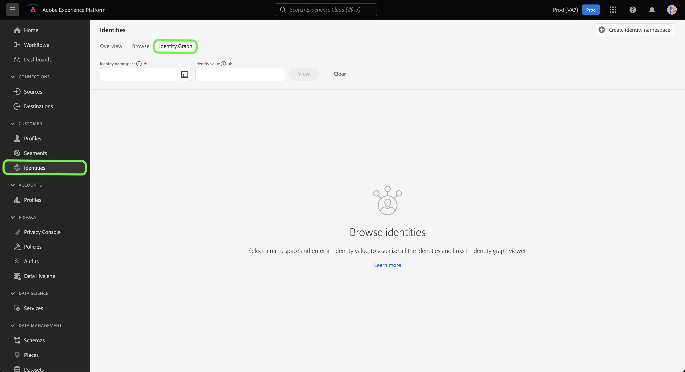

ID グラフを表示するには、ID名前空間とその対応する値を指定し、**[!UICONTROL View]**&#x200B;を選択します。

>[!TIP]
>
>テーブルアイコン を選択すると、組織内で使用可能なすべてのID名前空間のリストを含むパネルが表示されます。 有効なID値が接続されている限り、いずれかのID名前空間を使用できます。 詳しくは、[ID名前空間ガイド ](./namespaces.md)を参照してください。

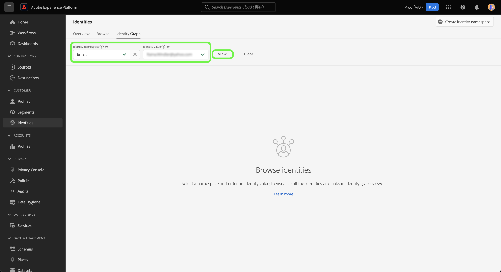

## ID グラフビューアインターフェイスについて

ID グラフビューアインターフェイスは、ID データの操作や理解に使用できる複数の要素で構成されています。

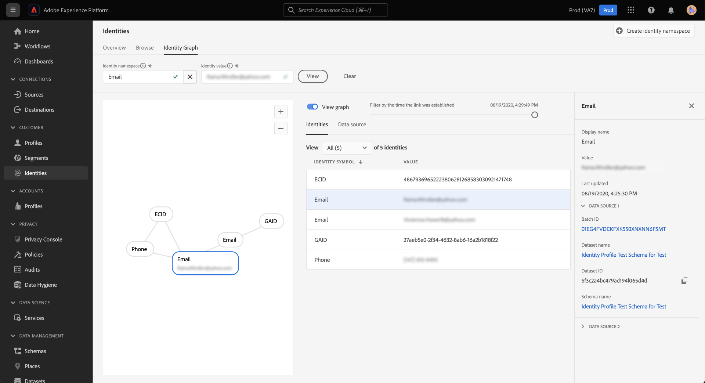

ID グラフには、入力したID名前空間と値の組み合わせにリンクされているすべてのIDが表示されます。 各ノードは、ID名前空間とそれに対応する値で構成されます。 任意のノードを選択、保持およびドラッグして、グラフを操作できます。 または、ノードにカーソルを合わせると、対応するID値に関する情報を確認できます。 グラフを非表示または表示するには、**[!UICONTROL View graph]**&#x200B;を選択します。

>[!IMPORTANT]
>
>ID グラフを作成するには、少なくとも2つのリンク IDと、有効なID名前空間と値の組み合わせが必要です。 グラフビューアで表示できるIDの最大数は50です。 詳しくは、以下の「[付録](#appendix)」の節を参照してください。

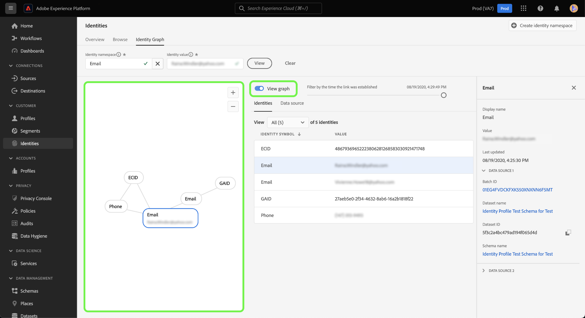

グラフ内のリンクを選択すると、そのリンクに貢献するデータセットとバッチ IDが表示されます。 リンクを選択すると、右側のパネルも更新され、データソースの詳細に関する詳細情報や、最初に確立されたタイムスタンプや最後に更新されたタイムスタンプなどのプロパティが提供されます。

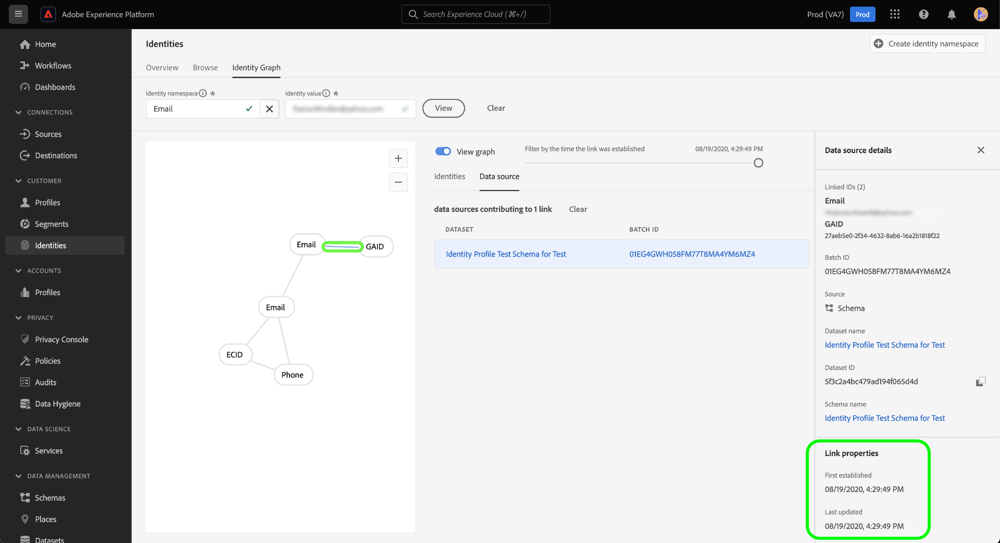

[!UICONTROL Identities] テーブルには、ID データの別のビューが表示され、ID名前空間とID値の組み合わせが表形式で一覧表示されます。 グラフ内のノードを選択すると、[!UICONTROL Identities] テーブル内の強調表示された行項目が更新されます。

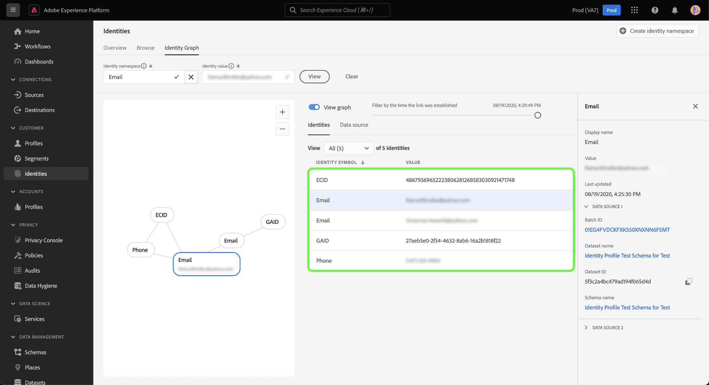

ドロップダウンメニューを使用してグラフデータを並べ替え、特定のID名前空間に関する情報を強調表示します。 例えば、メニューから「**[!UICONTROL Email]**」を選択して、電子メール ID名前空間に固有のデータを表示します。

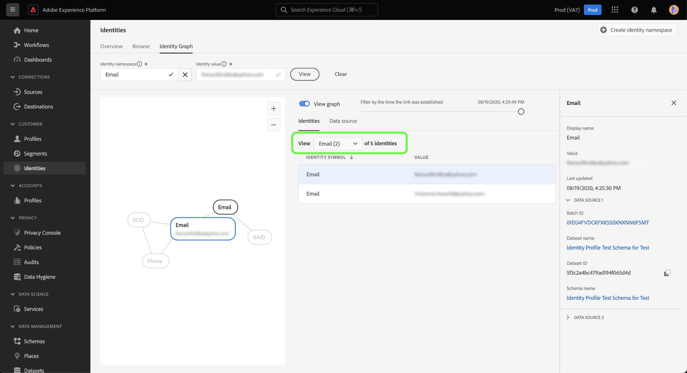

右側のパネルには、選択したIDに関する情報（最終更新されたタイムスタンプを含む）が表示されます。 右側のパネルには、選択したIDに対応するデータソースに関する情報（バッチ ID、データセット名、データセット ID、スキーマ名など）も表示されます。

次の表に、右側のパネルに表示されるデータソースプロパティに関する追加情報を示します。

| データソース | 説明 |
| --- | --- |
| バッチ ID | バッチデータに対応する自動生成されたID。 |
| データセット ID | データセットに対応する自動生成されたID。 |
| データセット名 | バッチデータを含むデータセットの名前。 |
| スキーマ名 | スキーマの名前。 スキーマは、データの構造と形式を表す一連のルールを提供します。 |

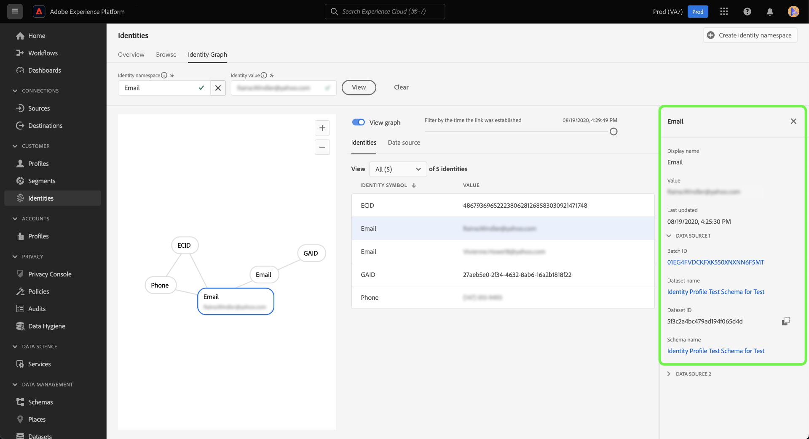

*[!UICONTROL Data source]*&#x200B;を使用して、IDに貢献するデータソースのリストを表示することもできます。 データセットとバッチ IDの表形式ビューには、[!UICONTROL Data source]を選択します。

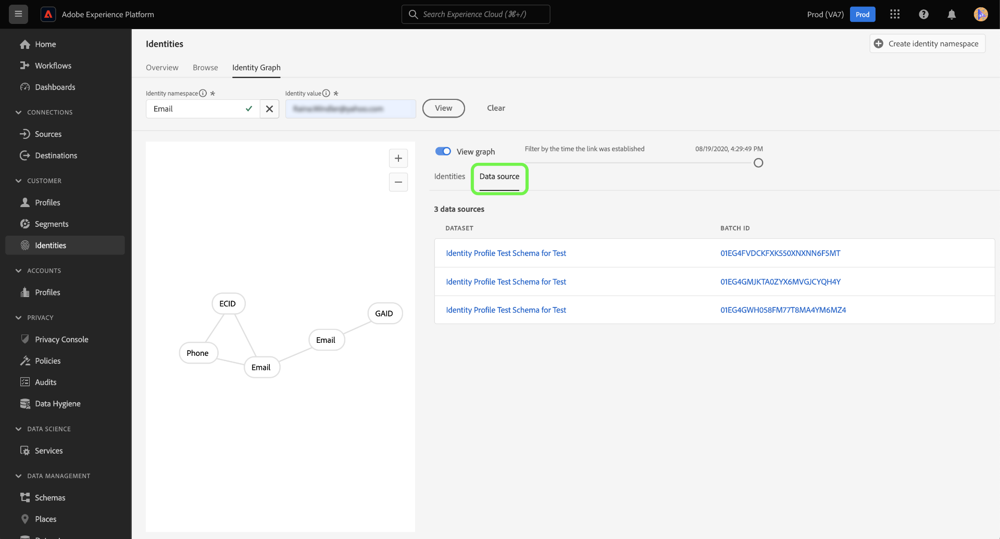

スライダーを使用して、IDが最初に確立された時間でグラフデータをフィルタリングします。 デフォルトでは、ID グラフビューアには、グラフ内でリンクされているすべてのIDが表示されます。 スライダーを押しながらドラッグして、新しいIDがグラフにリンクされた最後のタイムスタンプまでの時間を調整します。 以下の例では、グラフに最新のID リンク （GAID）が&#x200B;**[!UICONTROL 08/19/2020, 4:29:29 PM]**&#x200B;に確立されたことを示します。

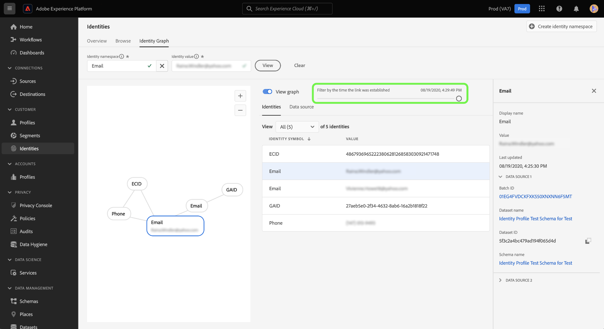

スライダーを調整して、別のID リンク （電子メール）が&#x200B;**[!UICONTROL 08/19/2020, 4:25:30 PM]**&#x200B;に確立されたことを確認します。

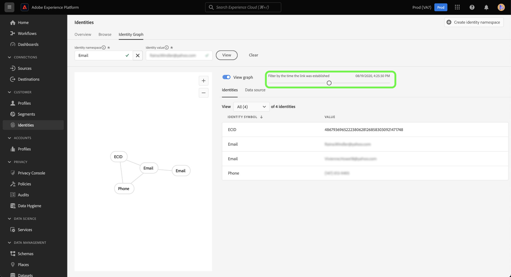

スライダーを調整して、グラフの最も早いイテレーションを確認することもできます。 以下の例では、ID グラフビューアは、グラフが最初に&#x200B;**[!UICONTROL 08/19/2020, 4:11:49 PM]**&#x200B;に作成され、最初のリンクはECID、電子メール、および電話であることを示しています。

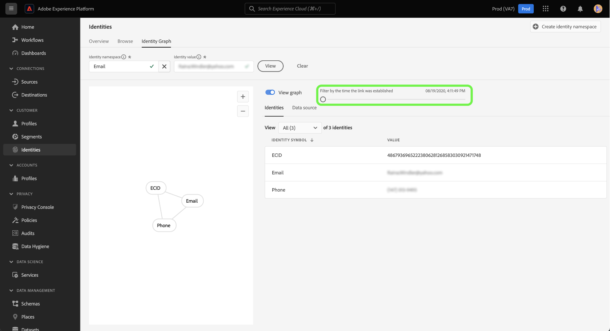

## 付録

次の節では、ID グラフビューアの操作に関する追加情報を示します。

### エラーメッセージについて

ID グラフビューアにアクセスすると、エラーが発生する場合があります。 ID グラフビューアを使用する際に注意すべき前提条件と制限事項を次に示します。

- ID値は、選択した名前空間に存在する必要があります。
- ID グラフビューアを生成するには、少なくとも2つのリンク IDが必要です。 ID値が1つだけでリンクされたIDが存在しない可能性があり、この場合、値は[!DNL Profile] ビューアにのみ存在します。
- ID グラフビューアは、最大50個のIDを超えることはできません。

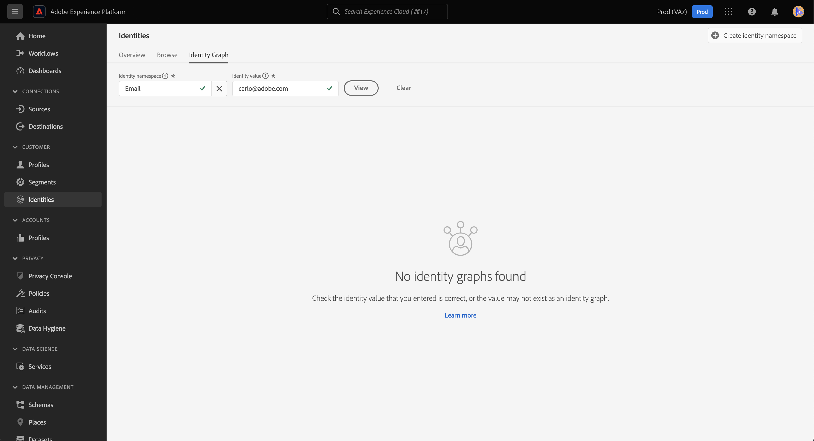

### データセットからID グラフビューアにアクセスする

データセットインターフェイスを使用して、ID グラフビューアにアクセスすることもできます。 データセット [!UICONTROL Browse] ページから、操作するデータセットを選択し、**[!UICONTROL Preview dataset]**&#x200B;を選択します

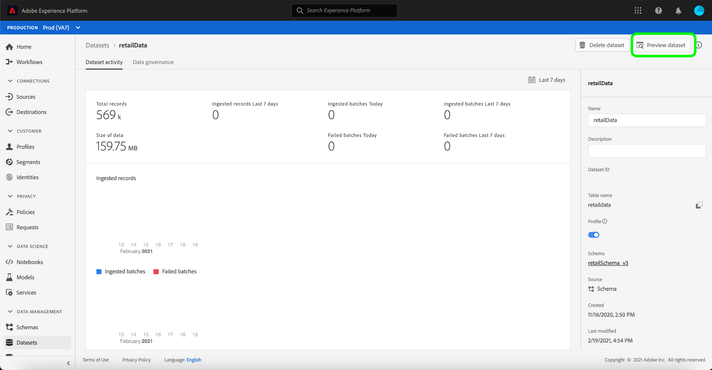

プレビューウィンドウで、指紋アイコンを選択して、ID グラフビューアで表されるIDを表示します。

>[!TIP]
>
>指紋アイコンは、データセットに2つ以上のIDがある場合にのみ表示されます。

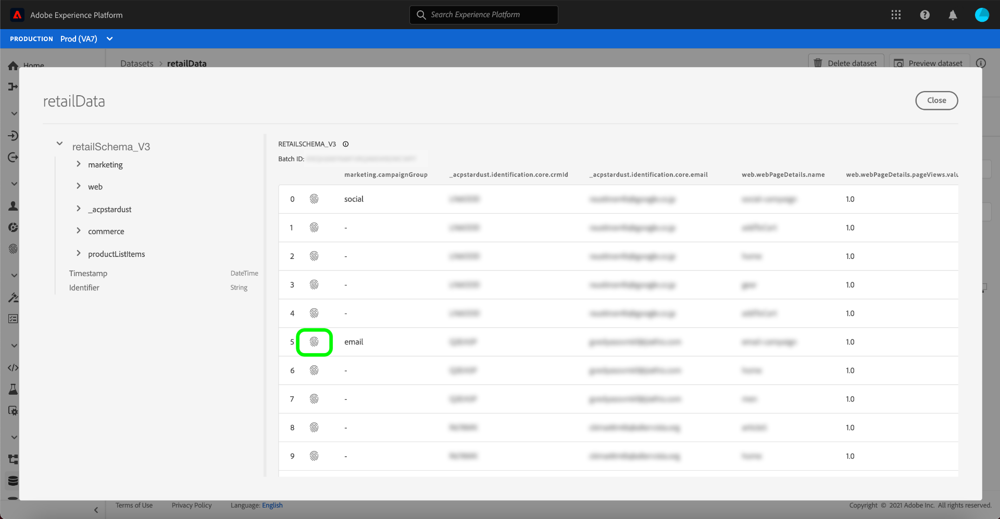

## 次の手順

このドキュメントでは、Experience Platform UIで顧客のID グラフを確認する方法について説明しました。 Experience PlatformのIDについて詳しくは、[ID サービスの概要](../home.md)を参照してください

## 変更ログ

| 日付 | アクション |
| ---- | ------ |
| 2021-01 | <ul><li>取り込んだデータのストリーミングと実稼動以外のサンドボックスのサポートを追加しました。</li><li>マイナーな問題を修正しました。</li></ul> |
| 2021-02 | <ul><li>ID グラフビューアは、データセットのプレビューを通じてアクセスできるようになります。</li><li>マイナーな問題を修正しました。</li><li>ID グラフビューアが一般公開されました。</li></ul> |
| 2023-01 | <ul><li>UIの更新：</li></ul> |
