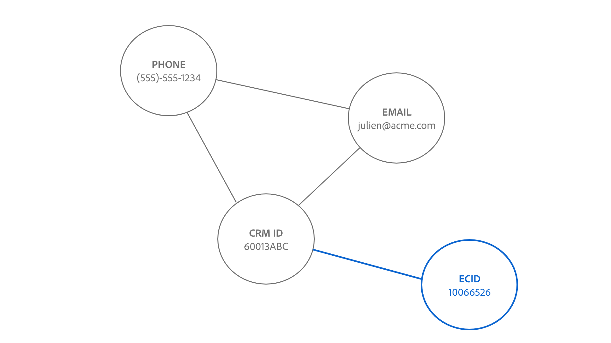

# ID サービスリンクロジック {#identity-service-linking-logic}

>[!CONTEXTUALHELP]
>id="platform_identities_simulatedgraph"
>title="シミュレートされたグラフ"
>abstract="ID 名前空間と ID 値が一致すると、ID がリンクされます。"

ID 名前空間と ID 値が一致すると、2 つの ID 間のリンクが確立されます。

リンクされる ID には、次の 2 種類があります。

* **プロファイルレコード**：通常、これらの ID は CRM システムから取得されます。
* **エクスペリエンスイベント**：これらの ID は、通常、WebSDK 実装またはAdobe Analytics ソースから取得されます。

## リンクを確立することの意味論的意味

ID は、実際のエンティティを表します。 2 つの ID の間でリンクが確立されている場合は、2 つの ID が相互に関連付けられていることを意味します。 次に、この概念を説明するいくつかの例を示します。

| アクション | 確立されたリンク | 意味 |
| --- | --- | --- |
| エンドユーザーがコンピューターを使用してログインします。 | CRMID と ECID は相互にリンクされています。 | ユーザー（CRMID）が、ブラウザー（ECID）を持つデバイスを所有しています。 |
| エンドユーザーがiPhoneを使用して匿名で閲覧する。 | IDFA は ECID にリンクされています。 | iPhoneなどのApple ハードウェアデバイス（IDFA）は、ブラウザー（ECID）に関連付けられています。 |
| エンドユーザーは、Google Chrome、次に Firefox を使用してログインします。 | CRMID は 2 つの異なる ECID にリンクされています。 | 人物（CRMID）は 2 つの web ブラウザーに関連付けられます（**メモ**：各ブラウザーには独自の ECID が割り当てられます）。 |
| データエンジニアが、ID としてマークされた 2 つのフィールド（CRMID とメール）を含む CRM レコードを取り込みます。 | CRMID とメールがリンクされています。 | 人物（CRMID）がメールアドレスに関連付けられます。 |

## ID サービスのリンクロジックについて

ID は、ID 名前空間と ID 値で構成されます。

* ID 名前空間は、に対する特定の ID 値のコンテキストです。 ID 名前空間の一般的な例としては、CRMID、メール、電話などがあります。
* ID 値は、実際のエンティティを表す文字列です。 例：「julien@acme.com」はメール名前空間の ID 値にすることができ、555-555-1234 は電話の名前空間に対応する ID 値にすることができます。

>[!TIP]
>
>ID 名前空間がないと、ID 値のコンテキストが失われ、ID を正常に照合するのに十分な情報が得られないので、ID 名前空間は重要です。

ID サービスのリンクロジックの仕組みを視覚的に表現する方法については、次の図を参照してください。

>[!BEGINTABS]

>[!TAB  既存のグラフ ]

次の 3 つのリンクされた ID を含む既存の ID グラフがあるとします。

* 電話：（555）–555-1234
* EMAIL:julien@acme.com
* CRMID:60013ABC

>[!TAB  受信データ ]

ID のペアがグラフに取り込まれ、このペアには次が含まれます。

* CRMID:60013ABC
* ECID:100066526

>[!TAB  更新されたグラフ ]

ID サービスは、CRMID:60013ABC がグラフ内に既に存在することを認識するので、新しい ECID のみをリンクします

>[!ENDTABS]

## 顧客シナリオ

データエンジニアは、次の CRM データセット（プロファイルレコード）をExperience Platformに取り込みます。

| CRMID** | 電話* | メール* | 名 | 姓 |
| --- | --- | --- | --- | --- |
| 60013ABC | 555-555-1234 | julien@acme.com | ジュリアン | Smith |
| 31260XYZ | 777-777-6890 | evan@acme.com | エヴァン | Smith |

>[!NOTE]
>
>* `**` - プライマリ ID としてマークされたフィールドを示します。
>* `*` - セカンダリ ID としてマークされているフィールドを示します。
>
>ID サービスでは、プライマリ ID とセカンダリ ID は区別されません。 フィールドが ID としてマークされている限り、ID サービスに取り込まれます。

また、WebSDK を実装し、次のデータテーブルを使用して WebSDK データセット（エクスペリエンスイベント）を取り込みました。

| タイムスタンプ | イベント内の ID* | イベント |
| --- | --- | --- |
| `t=1` | ECID:38652 | ホームページを表示 |
| `t=2` | ECID:38652、CRMID:31260XYZ | 靴を探す |
| `t=3` | ECID:44675 | ホームページを表示 |
| `t=4` | ECID:44675、CRMID:31260XYZ | 購入履歴の表示 |

各イベントのプライマリ ID は、[ データ要素タイプの設定方法 ](../../tags/extensions/client/web-sdk/data-element-types.md) に基づいて決定されます。

>[!NOTE]
>
>* プライマリとして CRMID を選択した場合、認証済みイベント（CRMID と ECID を含む ID マップを持つイベント）には、CRMID のプライマリ ID が割り当てられます。 認証されていないイベント（ID マップを持つイベントに ECID のみが含まれる）の場合、ECID のプライマリ ID が設定されます。 Adobeでは、このオプションをお勧めします。
>
>* 認証状態に関係なく、ECID をプライマリとして選択した場合、ECID はプライマリ ID になります。

この例では、次のようになります。

* `t=1` は、デスクトップコンピューター（ECID:38652）を使用し、ホームページの参照を匿名で表示しました。
* `t=2` は同じデスクトップコンピューターを使用して、（CRMID:31260XYZ）にログインし、靴を検索しました。
   * ユーザーがログインすると、イベントによって ECID と CRMID の両方が ID サービスに送信されます。
* `t=3` はラップトップ コンピューター（ECID:44675）を使用し、匿名で閲覧しました。
* `t=4` は同じノートパソコンを使用して、（CRMID:31260XYZ）にログインし、購入履歴を確認しました。

>[!BEGINTABS]

>[!TAB timestamp=0]

`timestamp=0` 時点で、2 つの異なる顧客用に 2 つの ID グラフがあります。 どちらも、3 つのリンクされた ID で表されます。

| | CRMID | メール | Phone |
| --- | --- | --- | --- |
| 顧客 1 | 60013ABC | julien@acme.com | 555-555-1234 |
| 顧客 2 | 31260XYZ | evan@acme.com | 777-777-6890 |

>[!TAB timestamp=1]

`timestamp=1` では、顧客はラップトップを使用して e コマース web サイトにアクセスし、ホームページを表示して、匿名で閲覧します。 この匿名ブラウジングイベントは、ECID:38652 として識別されます。 ID サービスは 2 つ以上の ID を持つイベントのみを保存するので、この情報は保存されません。

>[!TAB timestamp=2]

`timestamp=2` 時点では、顧客は同じラップトップを使用して e コマース web サイトにアクセスします。 ユーザー名とパスワードの組み合わせでログインし、靴を参照します。 ID サービスは、顧客の CRMID:31260XYZ に対応しているので、ログイン時に顧客のアカウントを識別します。 さらに、ID サービスは、両方とも同じデバイスで同じブラウザーを使用しているので、ECID:38562 を CRMID:31260XYZ に関連付けます。

>[!TAB timestamp=3]

`timestamp=3` 時、顧客はタブレットを使用して e コマース web サイトにアクセスし、匿名で参照します。 この匿名ブラウジングイベントは、ECID:44675 として識別されます。 ID サービスは 2 つ以上の ID を持つイベントのみを保存するので、この情報は保存されません。

>[!TAB timestamp=4]

`timestamp=4` 時点で、顧客は同じタブレットを使用してアカウント（CRMID:31260XYZ）にログインし、購入履歴を表示します。 このイベントは、CRMID:31260XYZ を匿名ブラウジングアクティビティに割り当てられた Cookie 識別子にリンクし、ECID:44675 を顧客 2 の ID グラフにリンクします。44675

>[!ENDTABS]
