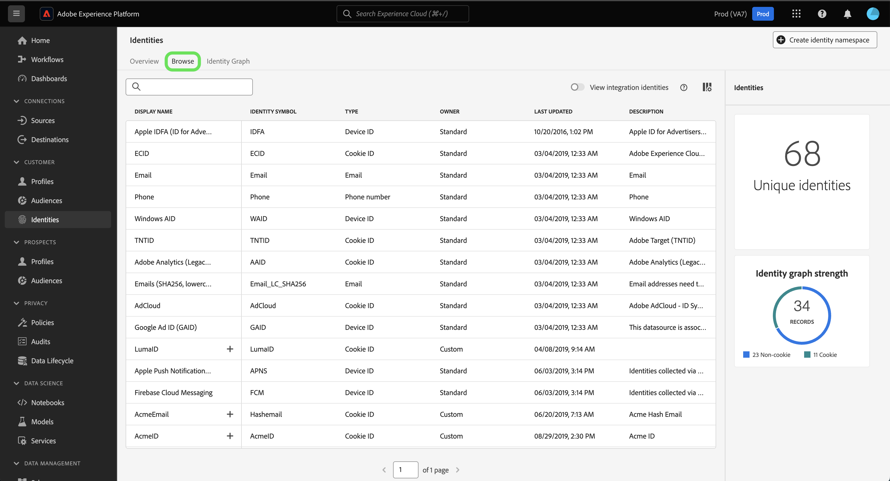
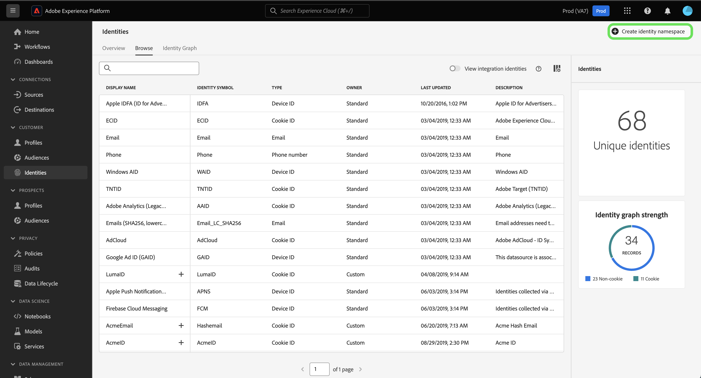
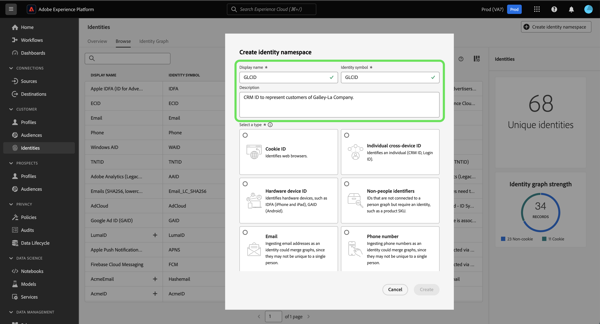
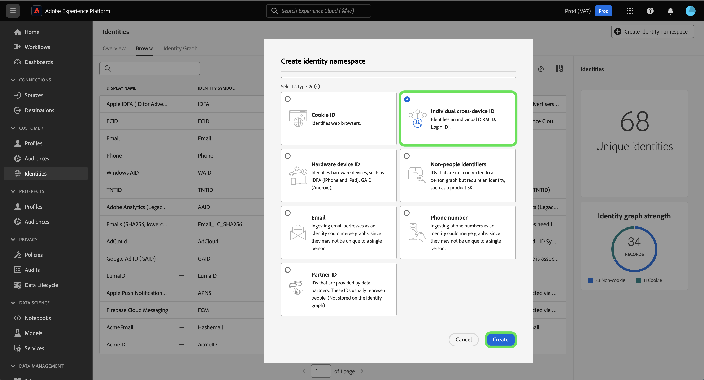

# ID 名前空間の概要

Adobe Experience Platform Identity ServiceでID名前空間を使用する方法について詳しくは、次のドキュメントを参照してください。

## はじめに

ID名前空間では、さまざまなAdobe Experience Platformサービスについて理解する必要があります。 名前空間の使用を開始する前に、次のサービスのドキュメントを確認してください。

* [[!DNL Real-Time Customer Profile]](../../profile/home.md)：複数のソースからの集約データに基づいて、統合された顧客プロファイルをリアルタイムで提供します。
* [[!DNL Identity Service]](../home.md): デバイスとシステム間でIDを橋渡しすることで、個々の顧客とその行動をより詳細に把握します。
* [[!DNL Privacy Service]](../../privacy-service/home.md): ID名前空間は、一般データ保護規則（GDPR）などの法的プライバシー規制に対するコンプライアンス要求で使用されます。 各プライバシーリクエストは、どの消費者データに影響を与えるかを特定するために、名前空間に関連して行われます。

## ID 名前空間について {#understanding-identity-namespaces}

>[!CONTEXTUALHELP]
>id="platform_identity_namespace"
>title="ID 名前空間"
>abstract="ID 名前空間は、特定の ID のコンテキストです。例えば、`Email` の名前空間を、**name@acme.com** に対応させることができます。同様に、`Phone` の名前空間は、`555-555-1234` に対応させることができます。"
>text="Learn more in documentation"

>[!CONTEXTUALHELP]
>id="platform_identity_value"
>title="ID 値"
>abstract="ID 値は、一意の個人、組織またはアセットを表す識別子です。値が表す ID のコンテキストまたはタイプは、対応する ID 名前空間によって定義されます。プロファイルフラグメント間でレコードデータを一致させる場合、名前空間と ID 値が一致する必要があります。プロファイルフラグメント間でレコードデータを一致させる場合、名前空間と ID 値が一致する必要があります。"
>text="Learn more in documentation"

完全修飾IDには、**ID値**&#x200B;と&#x200B;**ID名前空間**&#x200B;の2つのコンポーネントが含まれます。 例えば、IDの値が`scott@acme.com`の場合、名前空間はこの値に対するコンテキストを電子メールアドレスとして区別して提供します。 同様に、名前空間では、`555-123-456`を電話番号として、`3126ABC`をCRMIDとして区別できます。 基本的に、**名前空間は、特定のID**&#x200B;にコンテキストを提供します。 プロファイルフラグメント間でレコードデータを一致させる場合、[!DNL Real-Time Customer Profile]がプロファイルデータを結合する場合と同様に、ID値と名前空間の両方が一致する必要があります。

例えば、2つのプロファイルフラグメントに異なるプライマリ IDが含まれていても、「電子メール」名前空間には同じ値が共有されているため、Experience Platformはこれらのフラグメントが実際には同じ個人であることを確認し、個々のID グラフでデータを統合することができます。

>[!BEGINSHADEBOX]

**ID名前空間の説明**

名前空間の概念をよりよく理解するもうひとつの方法は、都市とそれに対応する状態などの実世界の例を考えることです。 例えば、オレゴン州ポートランド、メイン州とポートランドは、米国の2つの異なる場所です。 都市は同じ名前を共有しますが、状態は名前空間として機能し、2つの都市を区別する必要なコンテキストを提供します。

ID サービスに同じロジックを適用する：

* 一見すると、ID値`1-234-567-8900`は電話番号のように見えます。 ただし、システムの観点から、この値はCRMIDとして設定できます。 ID サービスには、対応する名前空間がなければ、このID値に必要なコンテキストを適用する方法はありません。
* 別の例として、次のID値があります：`john@gmail.com`。 このID値は簡単に電子メールと見なすことができますが、カスタム名前空間CRMIDとして設定されている可能性もあります。 名前空間を使用すると、`Email:john@gmail.com`を`CRMID:john@gmail.com`と区別できます。

>[!ENDSHADEBOX]

### 名前空間のコンポーネント

名前空間は、次のコンポーネントで構成されます。

* **表示名**：特定の名前空間のユーザーに適した名前。
* **ID シンボル**：名前空間を表すためにID サービスによって内部的に使用されるコード。
* **ID タイプ**：指定された名前空間の分類。
* **説明**: （オプション）特定の名前空間に関して提供できる補足情報。

### ID タイプ {#identity-type}

>[!CONTEXTUALHELP]
>id="platform_identity_create_namespace"
>title="ID タイプの指定"
>abstract="ID タイプは、データを ID グラフに保存するかどうかを制御します。ID グラフは、個人以外の ID とパートナー ID の ID タイプに対しては生成されません。"
>text="Learn more in documentation"

ID名前空間の1つの要素は&#x200B;**ID タイプ**&#x200B;です。 ID タイプによって次の項目が決まります。

* ID グラフを生成するかどうか：
   * ID グラフは、個人以外の ID とパートナー ID の ID タイプに対しては生成されません。
   * ID グラフは、その他のすべてのID タイプに対して生成されます。
* システムの制限に達したときにID グラフから削除されるID。 詳しくは、ID データの[&#x200B; ガードレール &#x200B;](../guardrails.md)を参照してください。

Experience Platformでは、次のID タイプを使用できます。

| ID タイプ | 説明 |
| --- | --- |
| Cookie ID | Cookie IDは、web ブラウザーを識別します。 この ID は拡張に不可欠で、ID グラフの大部分を占めます。しかし、自然界では、彼らは急速に減衰し、時間の経過とともにその価値を失います。 |
| クロスデバイス ID | クロスデバイス IDは、個人を識別し、通常は他のIDを結び付けます。 例えば、ログイン ID、CRMID、ロイヤルティ IDなどがあります。 値を慎重に処理する必要があることを[!DNL Identity Service]に示します。 |
| デバイス ID | デバイス ID は、ハードウェアデバイス (IDFA (iPhone および iPad)、GAID (Android)、RIDA (Roku) など) を識別し、家庭内の複数のユーザーによって共有される可能性があります。 |
| 電子メールアドレス | メールアドレスは多くの場合、1人の個人に関連付けられており、複数のチャネルをまたいでその個人を識別するために使用できます。 このタイプの ID には、個人を特定できる情報（PII）が含まれています。値を慎重に処理する必要があることを[!DNL Identity Service]に示します。 |
| 人物以外の識別子 | 人物以外の ID は、名前空間を必要とする識別子の保存に使用されますが、人物クラスターには接続されません。例えば、製品 SKU や、製品、組織またはストアに関連するデータがあります。 |
| パートナー ID | <ul><li>パートナー ID は、人物を表すためにデータパートナーが使用する識別子です。パートナーIDは、多くの場合、個人の真のアイデンティティを明らかにしないように偽名であり、確率的である可能性があります。 Real-Time Customer Data Platformでは、パートナーIDは、主にオーディエンスのアクティブ化とデータエンリッチメントの拡張に使用され、ID グラフのリンクの構築には使用されません。</li><li>ID グラフは、パートナーID タイプとして指定されたID名前空間を含むIDを取り込む際には生成されません。</li><li>ID タイプのパートナーIDを使用してパートナーデータを取り込まないと、ID サービスでシステムグラフの制限に達したり、プロファイルが不要に結合されたりする可能性があります。</li><ul> |
| 電話番号 | 電話番号は、多くの場合、1人の個人に関連付けられているため、様々なチャネルをまたいでその個人を識別するために使用できます。 このタイプの ID には PII が含まれます。これは、値を慎重に処理する必要があることを[!DNL Identity Service]に示しています。 |

{style="table-layout:auto"}

### 標準名前空間 {#standard}

Experience Platformには、すべての組織で使用できる複数のID名前空間が用意されています。 これらは標準の名前空間として知られており、[!DNL Identity Service] APIまたはExperience Platform UIを使用して表示できます。

次の標準的なネームスペースは、Experience Platform内のすべての組織で使用できるように用意されています。

| 表示名 | ID記号（コード） | ID タイプ | 説明 |
| ------------ | ---------------------- | ------------- | ----------- |
| AdCloud | AdCloud | Cookie ID | Adobe AdCloudを表す名前空間。 |
| Adobe Analytics (従来の ID) | AAID | Cookie ID | Adobe Analyticsを表す名前空間。 詳しくは、[Adobe Analytics名前空間](https://experienceleague.adobe.com/docs/analytics/admin/data-governance/gdpr-namespaces.html?lang=ja#namespaces)に関する次のドキュメントを参照してください。 |
| Apple IDFA（広告主の ID） | IDFA | デバイス ID | 広告主の Apple ID を表す名前空間。詳しくは、[興味／関心に基づく広告](https://support.apple.com/ja-jp/HT202074)に関するドキュメントを参照してください。 |
| Apple プッシュ通知サービス | APNS | デバイス ID | Apple プッシュ通知サービスを使用して収集されたIDを表す名前空間。 詳しくは、[Apple プッシュ通知サービス &#x200B;](https://developer.apple.com/library/archive/documentation/NetworkingInternet/Conceptual/RemoteNotificationsPG/APNSOverview.html#//apple_ref/doc/uid/TP40008194-CH8-SW1)に関する次のドキュメントを参照してください。 |
| ECID | ECID | Cookie ID | ECIDを表す名前空間。 この名前空間は、「Adobe Marketing Cloud ID」、「Adobe Experience Cloud ID」、「Adobe Experience Platform ID」という別名で呼ばれることもあります。詳しくは、[ECID](./ecid.md)の次のドキュメントを参照してください。 |
| メール | メール | メール | メールアドレスを表す名前空間。 このタイプの名前空間は、多くの場合、単一の人物に関連付けられているため、様々なチャネルをまたいでその人物を識別するために使用できます。 |
| メール（SHA256、小文字） | Email_LC_SHA256 | メール | 事前にハッシュされたメールアドレスの名前空間。この名前空間で指定された値は、小文字に変換されてから SHA256 でハッシュ化されます。メールアドレスを正規化する前に、先頭と末尾のスペースを削除する必要があります。 この設定を過去にさかのぼって変更することはできません。詳しくは、[SHA256 ハッシュサポート &#x200B;](https://experienceleague.adobe.com/docs/id-service/using/reference/hashing-support.html?lang=ja#hashing-support)に関する次のドキュメントを参照してください。 |
| Firebase Cloud Messaging | FCM | デバイス ID | プッシュ通知にGoogle Firebase Cloud Messagingを使用して収集されたIDを表す名前空間。 詳しくは、[Google Firebase Cloud Messaging](https://firebase.google.com/docs/cloud-messaging)の次のドキュメントを参照してください。 |
| Google Ad ID （GAID） | GAID | デバイス ID | Google 広告 ID を表す名前空間。詳しくは、[Google 広告 ID](https://support.google.com/googleplay/android-developer/answer/6048248?hl=ja) に関する次のドキュメントを参照してください。 |
| Phone | Phone | 電話番号 | 電話番号を表す名前空間。 このタイプの名前空間は、多くの場合、単一の人物に関連付けられているため、様々なチャネルをまたいでその人物を識別するために使用できます。 |
| 電話（E.164） | Phone_E.164 | 電話番号 | E.164形式でハッシュ化する必要がある生の電話番号を表す名前空間。 E.164形式には、プラス記号（`+`）、国際電話コード、市外局番、電話番号が含まれます。 例：`(+)(country code)(area code)(phone number)`。 |
| 電話 (SHA256) | Phone_SHA256 | 電話番号 | SHA256を使用してハッシュ化する必要がある電話番号を表す名前空間。 記号、文字、先頭のゼロを削除する必要があります。 また、国名コードをプレフィックスとして追加する必要があります。 |
| 電話（SHA256_E.164） | Phone_SHA256_E.164 | 電話番号 | SHA256 形式と E.164 形式の両方を使用してハッシュする必要がある生の電話番号を表す名前空間。 |
| TNTID | TNTID | Cookie ID | Adobe Targetを表す名前空間。 詳しくは、[Target](https://experienceleague.adobe.com/docs/target/using/target-home.html?lang=ja)の次のドキュメントを参照してください。 |
| Windows AID | WAID | デバイス ID | Windows Advertising IDを表す名前空間。 詳しくは、[Windows Advertising ID](https://docs.microsoft.com/en-us/uwp/api/windows.system.userprofile.advertisingmanager.advertisingid?view=winrt-19041)の次のドキュメントを参照してください。 |

{style="table-layout:auto"}

### ID 名前空間を表示 {#view-identity-namespaces}

>[!CONTEXTUALHELP]
>id="platform_identity_view_integration_identities"
>title="統合 ID の表示"
>abstract="統合 ID は、他のシステムと連携するために使用される名前空間で、ID の解決や ID のつなぎ合わせには使用されません。  これらの ID は、デフォルトでは非表示です。統合された名前空間を表示するには、切替スイッチを使用します。"

UIでID名前空間を表示するには、左側のナビゲーションで「**[!UICONTROL Identities]**」を選択し、「**[!UICONTROL Browse]**」を選択します。

組織内の名前空間のディレクトリが表示され、名前、ID記号、最終更新日、対応するID タイプ、説明に関する情報が表示されます。

## カスタム名前空間を作成 {#create-namespaces}

組織のデータとユースケースによっては、カスタム名前空間が必要になる場合があります。 カスタム名前空間は、[[!DNL Identity Service]](../api/create-custom-namespace.md) APIまたはUIを使用して作成できます。

カスタム名前空間を作成するには、**[!UICONTROL Create identity namespace]**&#x200B;を選択します。

>[!TIP]
>
>統合IDは、他のシステムとの接続に使用される名前空間です。 ID解決では使用されず、IDの合成にも使用されません。 リストを更新し、統合IDを含めるには、**[!UICONTROL View integration identities]**&#x200B;を選択します。 ただし、統合IDは表示専用であり、設定する必要がないため、デフォルトでは非表示になっています。

[!UICONTROL Create identity namespace] ウィンドウが表示されます。 まず、作成するカスタム名前空間の表示名とID記号を指定する必要があります。 必要に応じて、説明を指定して、作成するカスタム名前空間に追加のコンテキストを追加することもできます。

次に、カスタム名前空間に割り当てるID タイプを選択します。 終了したら「**[!UICONTROL Create]**」を選択します。

>[!IMPORTANT]
>
>* 定義した名前空間は組織では非公開であり、正常に作成するには一意のID記号が必要です。
>
>* 名前空間を作成した後は、名前空間を削除することはできず、そのID記号とタイプを変更することはできません。
>
>* 重複した名前空間はサポートされていません。 新しい名前空間を作成する際に、既存の表示名とID記号を使用することはできません。

## ID データの名前空間

ID の名前空間をどのように指定するかは、ID データの提供方法によって異なります。データ ID データの提供について詳しくは、[[!DNL Identity Service] 実装ガイド &#x200B;](../implementation.md)を参照してください。 Web SDK `identityMap`を通じてIDを送信する場合は、ID値を送信する前に準備および書式設定する方法について、[&#x200B; データ収集でのIDMapの使用](/help/collection/identity/identity-map.md)を参照してください。

## 次の手順

ID名前空間の主要な概念を理解したところで、[ID グラフビューア &#x200B;](../features/identity-graph-viewer.md)を使用してID グラフを操作する方法を学び始めることができます。
