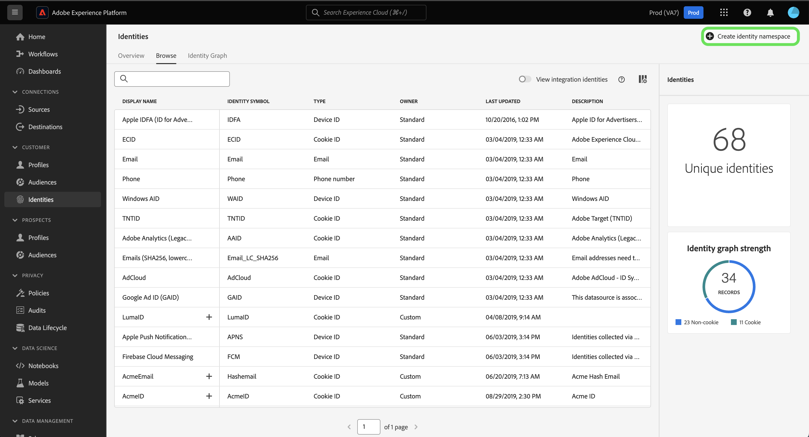

# ID 名前空間の概要

Adobe Experience Platform ID サービスで ID 名前空間を使用する方法について詳しくは、次のドキュメントを参照してください。

## はじめに

ID 名前空間を使用するには、様々なAdobe Experience Platform サービスに関する知識が必要です。 名前空間の使用を開始する前に、次のサービスのドキュメントを確認してください。

* [[!DNL Real-Time Customer Profile]](../../profile/home.md)：複数のソースから集計したデータに基づいて、統合された顧客プロファイルをリアルタイムで提供します。
* [[!DNL Identity Service]](../home.md)：デバイスやシステム間で ID を橋渡しすることで、個々の顧客とその行動をより確実に把握することができます。
* [[!DNL Privacy Service]](../../privacy-service/home.md): ID 名前空間は、EU 一般データ保護規則（GDPR）などの法的プライバシー規制のコンプライアンスリクエストで使用されます。 各プライバシーリクエストは、影響を受ける消費者のデータを識別するために、名前空間に関連して行われます。

## ID 名前空間について {#understanding-identity-namespaces}

>[!CONTEXTUALHELP]
>id="platform_identity_namespace"
>title="ID 名前空間"
>abstract="ID 名前空間は、特定の ID のコンテキストです。例えば、`Email` の名前空間を、**name@acme.com** に対応させることができます。同様に、`Phone` の名前空間は、`555-555-1234` に対応させることができます。"
>text="Learn more in documentation"

>[!CONTEXTUALHELP]
>id="platform_identity_value"
>title="ID 値"
>abstract="ID 値は、一意の個人、組織またはアセットを表す識別子です。値が表す ID のコンテキストまたはタイプは、対応する ID 名前空間によって定義されます。プロファイルフラグメント間でレコードデータを一致させる場合、名前空間と ID 値が一致する必要があります。プロファイルフラグメント間でレコードデータを一致させる場合、名前空間と ID 値が一致する必要があります。"
>text="Learn more in documentation"

完全修飾 ID には、**ID 値** と **ID 名前空間** の 2 つのコンポーネントが含まれています。 例えば、ID の値が `scott@acme.com` の場合、名前空間はメールアドレスとして識別することで、この値にコンテキストを提供します。 同様に、名前空間では `555-123-456` を電話番号、`3126ABC` を CRMID として区別できます。 基本的に、**名前空間は特定の ID にコンテキストを提供します**。 プロファイルフラグメント間でレコードデータを照合する場合、[!DNL Real-Time Customer Profile] がプロファイルデータを結合する場合と同様に、ID 値と名前空間の両方が一致する必要があります。

例えば、2 つのプロファイルフラグメントには、異なるプライマリ ID が含まれていても、「電子メール」名前空間の値が同じなので、Experience Platformは、これらのフラグメントが実際には同じ人物であることを確認し、そのデータを個人の ID グラフにまとめることができます。

>[!BEGINSHADEBOX]

**ID 名前空間について**

名前空間の概念をより深く理解するもう 1 つの方法は、都市や対応する状態などの実際の例を検討することです。 例えば、アメリカではポートランド、メインとポートランド、オレゴンの 2 つの州があります。 都市は同じ名前を共有しますが、州は名前空間として動作し、2 つの都市を区別するために必要なコンテキストを提供します。

同じロジックを ID サービスに適用する：

* ID 値は一目で電話番号のよ `1-234-567-8900` に見えることがあります。 ただし、システムの観点では、この値は CRMID として設定できました。 対応する名前空間がない場合、ID サービスは必要なコンテキストをこの ID 値に適用することができません。
* もう 1 つの例は、`john@gmail.com` の ID 値です。 この ID 値はメールと簡単に想定できますが、カスタム名前空間の CRMID として設定されている可能性は十分にあります。 名前空間を使用すると、`Email:john@gmail.com` と `CRMID:john@gmail.com` を区別できます。

>[!ENDSHADEBOX]

### 名前空間のコンポーネント

名前空間は、次のコンポーネントで構成されます。

* **表示名**：特定の名前空間のわかりやすい名前。
* **ID シンボル**：名前空間を表すために ID サービスで内部的に使用されるコード。
* **ID タイプ**：特定の名前空間の分類。
* **説明**:（任意）特定の名前空間に関して指定できる補足情報。

### ID タイプ {#identity-type}

>[!CONTEXTUALHELP]
>id="platform_identity_create_namespace"
>title="ID タイプの指定"
>abstract="ID タイプは、データを ID グラフに保存するかどうかを制御します。ID グラフは、個人以外の ID とパートナー ID の ID タイプに対しては生成されません。"
>text="Learn more in documentation"

ID 名前空間の 1 つの要素は **ID タイプ** です。 ID タイプは次を決定します。

* ID グラフが生成されるかどうか：
   * ID グラフは、個人以外の ID とパートナー ID の ID タイプに対しては生成されません。
   * ID グラフは、その他のすべての ID タイプ用に生成されます。
* システムの制限に達したときに ID グラフから削除される ID。 詳しくは、[ID データのガードレール ](../guardrails.md) を参照してください。

次の ID タイプをExperience Platform内で使用できます。

| ID タイプ | 説明 |
| --- | --- |
| Cookie ID | Cookie ID は web ブラウザーを識別します。 この ID は拡張に不可欠で、ID グラフの大部分を占めます。しかし、本質的には急速に崩壊し、時間の経過とともに価値を失います。 |
| クロスデバイス ID | クロスデバイス ID は個人を識別し、通常は他の ID を結び付けます。 例としては、ログイン ID、CRMID、ロイヤルティ ID があります。 これは、値を慎重に処理する [!DNL Identity Service] とを示しています。 |
| デバイス ID | デバイス ID は、ハードウェアデバイス (IDFA (iPhone および iPad)、GAID (Android)、RIDA (Roku) など) を識別し、家庭内の複数のユーザーによって共有される可能性があります。 |
| メールアドレス | 多くの場合、メールアドレスは 1 人の人物に関連付けられているので、様々なチャネルでその人物を識別するために使用できます。 このタイプの ID には、個人を特定できる情報（PII）が含まれています。これは、値を慎重に処理する [!DNL Identity Service] とを示しています。 |
| 人物以外の識別子 | 人物以外の ID は、名前空間を必要とする識別子の保存に使用されますが、人物クラスターには接続されません。例えば、製品 SKU や、製品、組織またはストアに関連するデータがあります。 |
| パートナー ID | <ul><li>パートナー ID は、人物を表すためにデータパートナーが使用する識別子です。パートナー ID は、多くの場合、人物の真の身元を明らかにしないように偽名であり、確率的なものである可能性があります。 Real-Time Customer Data Platformでは、パートナー ID は、主にオーディエンスのアクティベーションとデータのエンリッチメントの強化に使用され、ID グラフリンクの構築には使用されません。</li><li>パートナー ID タイプとして指定された ID 名前空間を含む ID の取り込み時に、ID グラフが生成されない。</li><li>パートナー ID の ID タイプを使用してパートナーデータを取り込めないと、ID サービスのシステムグラフ制限に到達したり、プロファイルの不要な結合が発生する可能性があります。</li><ul> |
| 電話番号 | 電話番号は多くの場合、1 人の人物に関連付けられているので、様々なチャネルでその人物を識別するために使用できます。 このタイプの ID には PII が含まれます。これは、値を慎重に処理する [!DNL Identity Service] とを示しています。 |

{style="table-layout:auto"}

### 標準名前空間 {#standard}

Experience Platformには、すべての組織で使用できる複数の ID 名前空間が用意されています。 これらは標準の名前空間と呼ばれ、[!DNL Identity Service] API を使用するか、Experience Platform UI を通じて表示されます。

次の標準の名前空間は、Experience Platform内のすべての組織で使用するために提供されています。

| 表示名 | 説明 |
| ------------ | ----------- |
| AdCloud | Adobe AdCloud を表す名前空間。 |
| Adobe Analytics (従来の ID) | Adobe Analyticsを表す名前空間。 詳しくは、[Adobe Analytics名前空間に関する次のドキュメントを参照し ](https://experienceleague.adobe.com/docs/analytics/admin/data-governance/gdpr-namespaces.html#namespaces) ください。 |
| Apple IDFA（広告主の ID） | 広告主の Apple ID を表す名前空間。詳しくは、[興味／関心に基づく広告](https://support.apple.com/ja-jp/HT202074)に関するドキュメントを参照してください。 |
| Apple プッシュ通知サービス | Apple プッシュ通知サービスを使用して収集された ID を表す名前空間。 詳しくは、[Apple プッシュ通知サービス ](https://developer.apple.com/library/archive/documentation/NetworkingInternet/Conceptual/RemoteNotificationsPG/APNSOverview.html#//apple_ref/doc/uid/TP40008194-CH8-SW1) に関するドキュメントを参照してください。 |
| ECID | ECID を表す名前空間。 この名前空間は、「Adobe Marketing Cloud ID」、「Adobe Experience Cloud ID」、「Adobe Experience Platform ID」という別名で呼ばれることもあります。詳しくは、[ECID](./ecid.md) に関する次のドキュメントを参照してください。 |
| メール | メールアドレスを表す名前空間。 このタイプの名前空間は多くの場合、1 人の人物に関連付けられているので、様々なチャネルでその人物を識別するために使用できます。 |
| メール（SHA256、小文字） | 事前にハッシュされたメールアドレスの名前空間。この名前空間で指定された値は、小文字に変換されてから SHA256 でハッシュ化されます。メールアドレスを正規化する前に、先頭と末尾のスペースを削除する必要があります。 この設定を過去にさかのぼって変更することはできません。詳しくは、[SHA256 ハッシュサポート ](https://experienceleague.adobe.com/docs/id-service/using/reference/hashing-support.html#hashing-support) に関する次のドキュメントを参照してください。 |
| Firebase Cloud Messages | プッシュ通知用にGoogle Firebase Cloud Messaging を使用して収集された ID を表す名前空間。 詳しくは、[Google Firebase Cloud Messaging](https://firebase.google.com/docs/cloud-messaging) に関する次のドキュメントを参照してください。 |
| Google広告 ID （GAID） | Google 広告 ID を表す名前空間。詳しくは、[Google 広告 ID](https://support.google.com/googleplay/android-developer/answer/6048248?hl=ja) に関する次のドキュメントを参照してください。 |
| Phone | 電話番号を表す名前空間。 このタイプの名前空間は多くの場合、1 人の人物に関連付けられているので、様々なチャネルでその人物を識別するために使用できます。 |
| 電話（E.164） | E.164 形式でハッシュする必要がある生の電話番号を表す名前空間。 E.164 形式には、プラス記号（`+`）、国際通話コード、市外局番、および電話番号が含まれます。 例：`(+)(country code)(area code)(phone number)`。 |
| 電話（SHA256） | SHA256 を使用してハッシュする必要がある電話番号を表す名前空間。 記号、文字、先頭のゼロは削除する必要があります。 また、国の通話コードをプレフィックスとして追加する必要があります。 |
| 電話（SHA256_E.164） | SHA256 形式と E.164 形式の両方を使用してハッシュする必要がある生の電話番号を表す名前空間。 |
| TNTID | Adobe Targetを表す名前空間。 詳しくは、[Target](https://experienceleague.adobe.com/docs/target/using/target-home.html?lang=ja) に関する次のドキュメントを参照してください。 |
| Windows AID | Windows Advertising ID を表す名前空間。 詳しくは、[Windows Advertising ID](https://docs.microsoft.com/en-us/uwp/api/windows.system.userprofile.advertisingmanager.advertisingid?view=winrt-19041) に関する次のドキュメントを参照してください。 |

### ID 名前空間を表示 {#view-identity-namespaces}

>[!CONTEXTUALHELP]
>id="platform_identity_view_integration_identities"
>title="統合 ID の表示"
>abstract="統合 ID は、他のシステムと連携するために使用される名前空間で、ID の解決や ID のつなぎ合わせには使用されません。  これらの ID は、デフォルトでは非表示です。統合された名前空間を表示するには、切替スイッチを使用します。"

UI で ID 名前空間を表示するには、左側のナビゲーションで **[!UICONTROL ID]** を選択してから、「**[!UICONTROL 参照]** を選択します。

組織内の名前空間のディレクトリが表示され、名前、ID 記号、最終更新日、対応する ID タイプ、説明に関する情報が表示されます。

## カスタム名前空間の作成 {#create-namespaces}

組織のデータとユースケースによっては、カスタム名前空間が必要になる場合があります。 カスタム名前空間は、[[!DNL Identity Service]](../api/create-custom-namespace.md) API または UI を使用して作成できます。

カスタム名前空間を作成するには、「**[!UICONTROL ID 名前空間を作成]**」を選択します。

>[!TIP]
>
>統合 ID は、他のシステムとの接続に使用される名前空間です。 これらは、ID の解決には使用されず、ID のつなぎ合わせにも使用されません。 「**[!UICONTROL 統合 ID を表示]**」を選択してリストを更新し、統合 ID を含めます。 ただし、統合 ID は表示専用で、設定する必要がないので、デフォルトでは非表示になっています。

[!UICONTROL ID 名前空間を作成 ] ウィンドウが表示されます。 まず、作成するカスタム名前空間の表示名と ID 記号を指定する必要があります。 また、オプションで、説明を指定して、作成しているカスタム名前空間にコンテキストを追加することもできます。

次に、カスタム名前空間に割り当てる ID タイプを選択します。 完了したら、「**[!UICONTROL 作成]**」をクリックします。

>[!IMPORTANT]
>
>* 定義した名前空間は組織に非公開であり、正常に作成するには一意の ID 記号が必要です。
>
>* 作成した名前空間は、削除できず、ID 記号およびタイプも変更できません。
>
>* 重複した名前空間はサポートされていません。 新しい名前空間を作成する際に、既存の表示名と ID 記号を使用することはできません。

## ID データの名前空間

ID の名前空間をどのように指定するかは、ID データの提供方法によって異なります。データ ID データの提供について詳しくは、[[!DNL Identity Service]  実装ガイド ](../implementation.md) を参照してください。

## 次の手順

これで、ID 名前空間の主要な概念を理解できたので、[ID グラフビューア ](../features/identity-graph-viewer.md) を使用して ID グラフを操作する方法を学習します。
