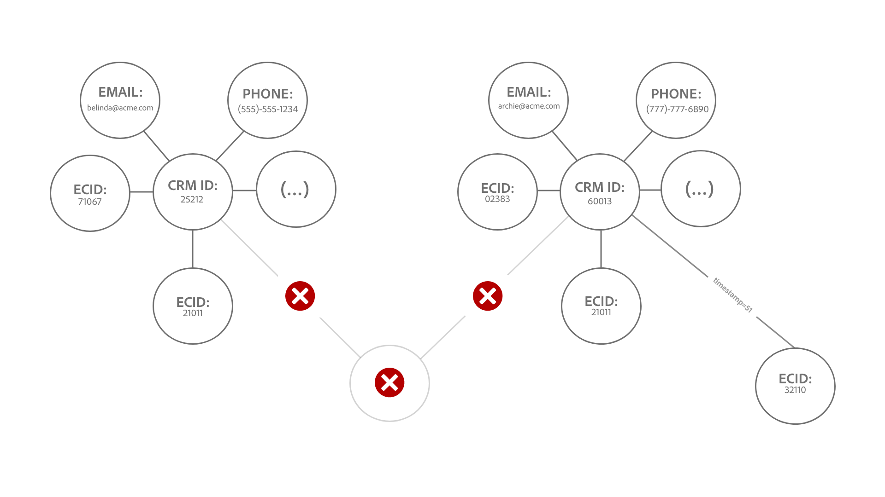
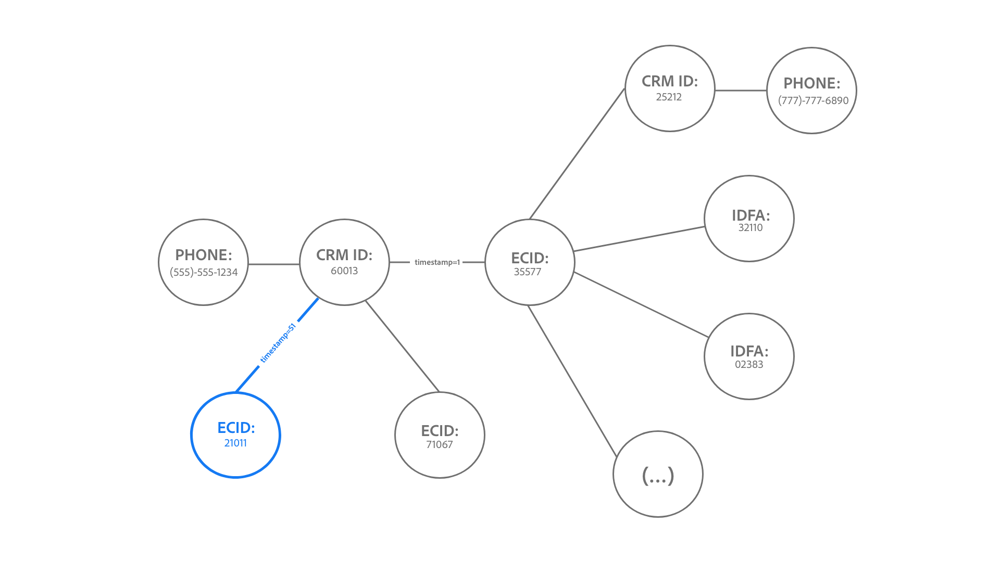
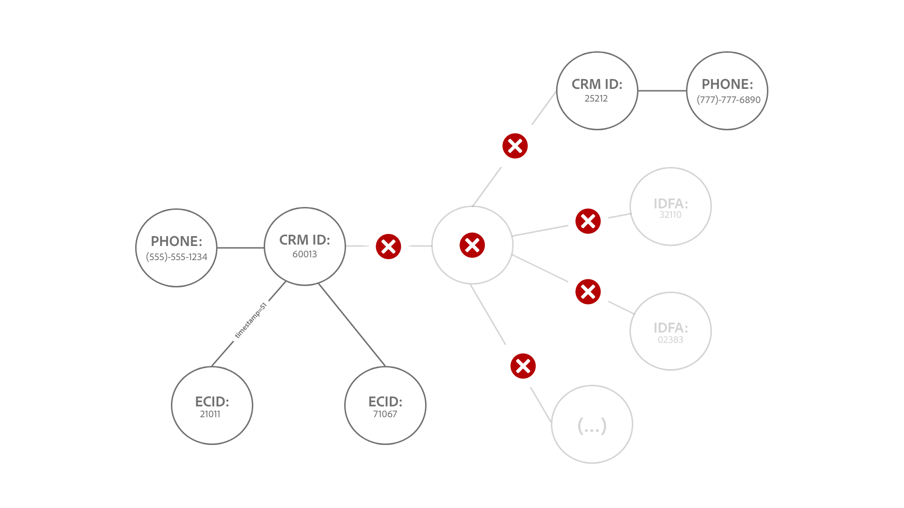

# [!DNL Identity Service] データのガードレール

このドキュメントでは、ID グラフの使用を最適化するのに役立つ [!DNL Identity Service] データの使用とレート制限について説明します。次のガードレールを確認する際は、データが正しくモデル化されていることが前提になっています。データのモデル化方法に関するご質問は、カスタマーサービス担当者にお問い合わせください。

>[!IMPORTANT]
>
>このガードレール ページに加えて、販売注文と対応する [ 製品説明 ](https://helpx.adobe.com/jp/legal/product-descriptions.html) でライセンスの使用権限を確認してください。

## 基本を学ぶ

ID データのモデリングには、次の Experience Platform サービスが関係しています。

* [ID](home.md):Bridgeに取り込まれる際の、異なるデータソースからのExperience Platform ID。
* [[!DNL Real-Time Customer Profile]](../profile/home.md)：複数のソースのデータを使用して、統合された消費者プロファイルを作成します。

## データモデルの上限

静的上限のガードレールと、ID 名前空間で考慮すべき検証ルールに関するガイダンスを次の表に示します。

### 静的上限

ID データに適用される静的上限の概要を次の表に示します。

| ガードレール | 上限 | メモ |
| --- | --- | --- |
| グラフ内の ID 数 | 50 | 50 個のリンクされた ID を含むグラフが更新されると、ID サービスは「先入れ先出し」メカニズムを適用し、最も古い ID を削除して、このグラフの最新の ID 用のスペースを作成します（**メモ**：リアルタイム顧客プロファイルは影響を受けません）。 削除は、ID タイプとタイムスタンプに基づいて行われます。上限は、サンドボックスレベルで適用されます。詳しくは、[ 削除ロジックについて ](#deletion-logic) の節を参照してください。 |
| 単一のバッチ取り込みの ID へのリンク数 | 50 | 1 つのバッチに、不要なグラフ結合を引き起こす異常な ID が含まれている場合があります。 これを防ぐために、ID サービスは、既に 50 以上の ID にリンクされている ID を取り込みません。 |
| XDM レコード内の ID 数 | 20 | 最低限必要な XDM レコード数は 2 です。 |
| カスタム名前空間の数 | なし | 作成できるカスタム名前空間の数に制限はありません。 |
| 名前空間の表示名または ID 記号の文字数 | なし | 名前空間の表示名または ID 記号の文字数に制限はありません。 |

{style="table-layout:auto"}

### ID 値の検証

ID 値の検証を成功させるために従う必要がある既存のルールの概要を次の表に示します。

| 名前空間 | 検証ルール | ルール違反時のシステムの動作 |
| --- | --- | --- |
| ECID | <ul><li>ECID の ID 値はちょうど 38 文字にする必要があります。</li><li>ECID の ID 値は、数字のみで構成する必要があります。</li></ul> | <ul><li>ECID の ID 値がちょうど 38 文字でない場合、そのレコードはスキップされます。</li><li>ECID の ID 値に数字以外の文字が含まれている場合、そのレコードはスキップされます。</li></ul> |
| ECID 以外 | <ul><li>ID 値は 1024 文字を超えることはできません。</li><li>ID 値には、&quot;null&quot;、&quot;anonymous&quot;、&quot;invalid&quot;や、空の文字列（&quot;&quot;、&quot;&quot;、&quot;など）を指定することはできません。</li></ul> | <ul><li>ID 値が 1024 文字を超える場合、そのレコードはスキップされます。</li><li>ID は取り込みからブロックされます。</li></ul> |

{style="table-layout:auto"}

### ID 名前空間の取り込み

2023年3月31日（PT）以降、ID サービスは、新規のお客様について Adobe Analytics ID (AAID) の取り込みをブロックします。この ID は、通常、[Adobe Analytics ソース](../sources/connectors/adobe-applications/analytics.md)と [Adobe Audience Manager ソース](../sources//connectors/adobe-applications/audience-manager.md)を通じて取り込まれ、ECID が同じ web ブラウザーを表すため冗長です。このデフォルト設定を変更する場合は、Adobe アカウントチームにお問い合わせください。

## パフォーマンスガードレール {#performance-guardrails}

ID サービスは、受信データを継続的に監視して、大規模で高いパフォーマンスと信頼性を確保します。 ただし、短期間にエクスペリエンスイベントデータが流入すると、パフォーマンスが低下し、待ち時間が発生する可能性があります。 Adobeは、このようなパフォーマンス低下に対する責任を負いません。

## 処理能力の ID グラフが更新される際の削除ロジックについて {#deletion-logic}

完全な ID グラフが更新されると、ID サービスは、最新の ID を追加する前に、グラフ内の最も古い ID を削除します。これは、ID データの正確性と関連性を維持するためです。この削除プロセスは、次の 2 つの主なルールに従います。

### ルール #1：削除は、名前空間の ID タイプに基づいて優先付けされる

削除の優先順位は次のとおりです。

1. Cookie ID
2. デバイス ID
3. クロスデバイス ID、メール、電話

### ルール #2：削除は、ID に保存されたタイムスタンプに基づいて行われる

グラフにリンクされた各 ID には、対応する独自のタイムスタンプがあります。完全なグラフが更新されると、ID サービスは最も古いタイムスタンプを持つ ID を削除します。

完全なグラフが新しい ID で更新されると、これら 2 つのルールが連携して、削除する古い ID が指定されます。ID サービスは、まず最も古い Cookie ID、次に最も古いデバイス ID、最後に最も古いクロスデバイス IDやメール、電話の順に削除します。

>[!NOTE]
>
>削除するように指定された ID がグラフ内で他の複数の ID にリンクしている場合、その ID を接続するリンクも削除されます。

### 実装への影響

以下の節では、削除ロジックが ID サービス、リアルタイム顧客プロファイルおよび Web SDK に及ぼす影響について説明します。

#### ID サービス：カスタム名前空間 ID タイプの変更

実稼動サンドボックスに次の ID が含まれている場合は、Adobe アカウントチームに連絡して、ID タイプの変更をリクエストしてください。

* ユーザー識別子（CRMID など）が cookie/デバイス ID タイプとして設定されるカスタム名前空間。
* Cookie とデバイスの識別子がクロスデバイス ID タイプとして設定されるカスタム名前空間。

この機能が使用可能になると、50 個の ID の制限を超えているグラフが最大 50 個の ID に縮小されます。 Real-Time CDP B2C Editionの場合、以前はプロファイルがセグメント化とアクティベーションで無視されていたので、これにより、オーディエンスに適格なプロファイルの数が最小限に増加する可能性があります。

#### リアルタイム顧客プロファイル：アドレス可能なオーディエンスへの影響

削除は ID サービスのデータにのみ発生し、リアルタイム顧客プロファイルには発生しません。

* この動作により、単一の ECID を持つプロファイルがより多く作成される可能性があります。これは、ECID が ID グラフに含まれなくなったためです。
* アドレス可能なオーディエンスの使用権限番号の範囲内に収まるようにするには、[ 偽名プロファイルデータの有効期限 ](../profile/pseudonymous-profiles.md) を有効にして、古いプロファイルを削除することをお勧めします。

#### リアルタイムプライマリプロファイルと WebSDK：顧客 ID 削除

CRMID に対して認証済みイベントを保持する場合は、プライマリ ID を ECID から CRMID に変更することをお勧めします。 この変更を実装する手順については、次のドキュメントを参照してください。

* [Experience Platform タグ用に ID マップを設定します ](../tags/extensions/client/web-sdk/data-element-types.md#identity-map)。
* [Experience Platform Web SDKの ID データ](../web-sdk/identity/overview.md#using-identitymap)

### サンプルシナリオ

#### 例 1：典型的な大きなグラフ

*図注：*

* `t` = タイムスタンプ。
* タイムスタンプの値は、特定の ID の最新性に対応します。 例えば、`t1` は最初にリンクされた ID （最も古い）を表し、`t51` は最新のリンク ID を表します。

この例では、左側のグラフを新しい ID で更新する前に、ID サービスはまず、最も古いタイムスタンプを持つ既存の ID を削除します。 ただし、最も古い ID はデバイス ID なので、ID サービスは、削除の優先順位リストの上位のタイプの名前空間（この場合は `ecid-3`）に到達するまで、その ID をスキップします。削除の優先順位が上位のタイプの最も古い ID が削除されると、グラフは新しいリンク `ecid-51` で更新されます。

* 同じタイムスタンプと ID タイプを持つ 2 つの ID がある場合、まれに、ID サービスは [XID](./api/list-native-id.md) に基づいて ID を並べ替え、削除を実行します。

#### 例 2:「グラフ分割」

>[!BEGINTABS]

>[!TAB  受信イベント ]

*図注：*

* 次の図では、`timestamp=50` 時点で 50 個の ID が ID グラフに存在すると想定しています。
* `(...)` は、グラフ内で既にリンクされている他の ID を示します。

この例では、ECID:32110 が取り込まれ、`timestamp=51` で大きなグラフにリンクされるので、50 個の ID の制限を超えています。

>[!TAB  削除プロセス ]

その結果、ID サービスは、タイムスタンプと ID タイプに基づいて最も古い ID を削除します。 この場合、ECID:35577 は、ID グラフからのみ削除されます。

>[!TAB  グラフ出力 ]

ECID:35577 を削除した結果、削除された ECID:35577 で CRMID:60013 および CRMID:25212 をリンクしていたエッジも削除されます。 この削除プロセスにより、グラフが 2 つの小さなグラフに分割されます。

>[!ENDTABS]

#### 例 3:「ハブアンドスポーク」

>[!BEGINTABS]

>[!TAB  受信イベント ]

*図注：*

* 次の図では、`timestamp=50` 時点で 50 個の ID が ID グラフに存在すると想定しています。
* `(...)` は、グラフ内で既にリンクされている他の ID を示します。

削除ロジックにより、一部の「ハブ」 ID も削除される可能性があります。 これらのハブ ID は、複数の個々の ID にリンクされたノードを指します。これらの ID をリンクしていない場合は、リンクが解除されます。

以下の例では、ECID:21011 が取り込まれ、`timestamp=51` でグラフにリンクされるので、50 個の ID の制限を超えています。

>[!TAB  削除プロセス ]

その結果、ID サービスは ID グラフ（この場合は ECID:35577）からのみ最も古い ID を削除します。 ECID:35577 を削除すると、次も削除されます。

* CRMID:60013 と削除済みの ECID:35577 の間のリンクなので、グラフ分割シナリオが発生します。
* IDFA:32110、IDFA:02383 および `(...)` で表される残りの ID。 これらの ID は、個別にリンクされていないので削除され、他の ID にリンクされないので、グラフで表すことができません。

>[!TAB  グラフ出力 ]

最後に、削除プロセスによって 2 つの小さなグラフが生成されます。

>[!ENDTABS]

## 次の手順

[!DNL Identity Service] について詳しくは、次のドキュメントを参照してください。

* [[!DNL Identity Service] の概要](home.md)
* [ID グラフビューア](features/identity-graph-viewer.md)

他のExperience Platform サービスのガードレール、エンドツーエンドの待ち時間の情報およびReal-Time CDP Product Description のドキュメントからのライセンス情報について詳しくは、次のドキュメントを参照してください。

* [Real-Time CDP ガードレール](/help/rtcdp/guardrails/overview.md)
* 様々なExperience Platform サービス用の [ エンドツーエンドの待ち時間の図 ](https://experienceleague.adobe.com/docs/blueprints-learn/architecture/architecture-overview/deployment/guardrails.html?lang=ja#end-to-end-latency-diagrams)。
* [Real-Time Customer Data Platform（B2C Edition - PrimeおよびUltimate パッケージ） ](https://helpx.adobe.com/jp/legal/product-descriptions/real-time-customer-data-platform-b2c-edition-prime-and-ultimate-packages.html)
* [Real-Time Customer Data Platform（B2P - PrimeおよびUltimate パッケージ） ](https://helpx.adobe.com/jp/legal/product-descriptions/real-time-customer-data-platform-b2p-edition-prime-and-ultimate-packages.html)
* [Real-Time Customer Data Platform（B2B - PrimeおよびUltimate パッケージ） ](https://helpx.adobe.com/jp/legal/product-descriptions/real-time-customer-data-platform-b2b-edition-prime-and-ultimate-packages.html)
