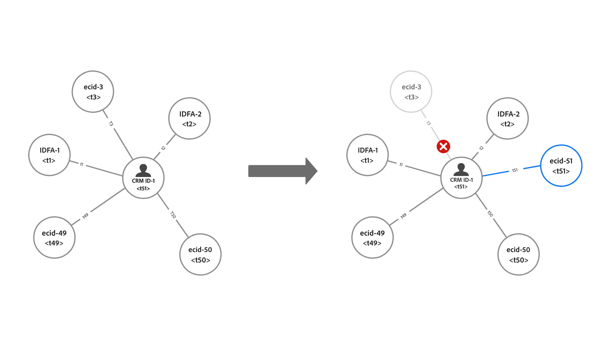
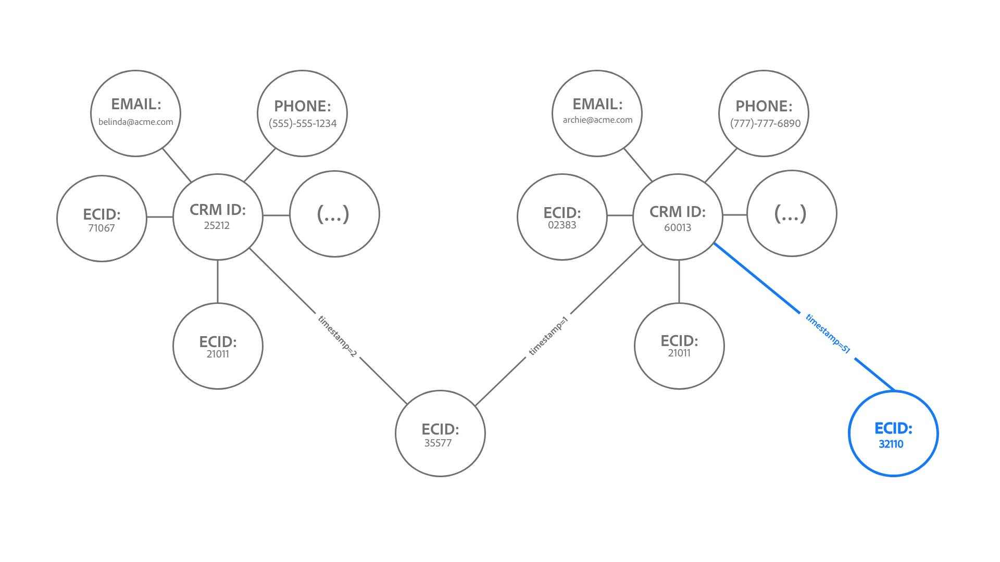
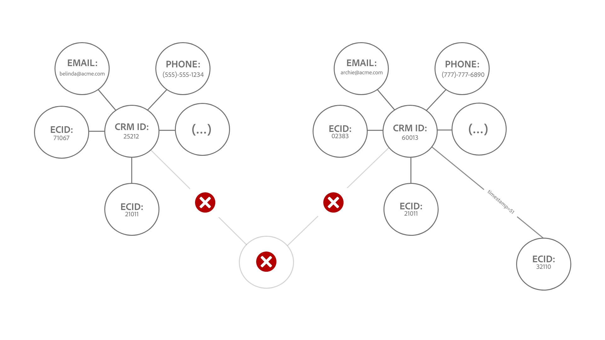
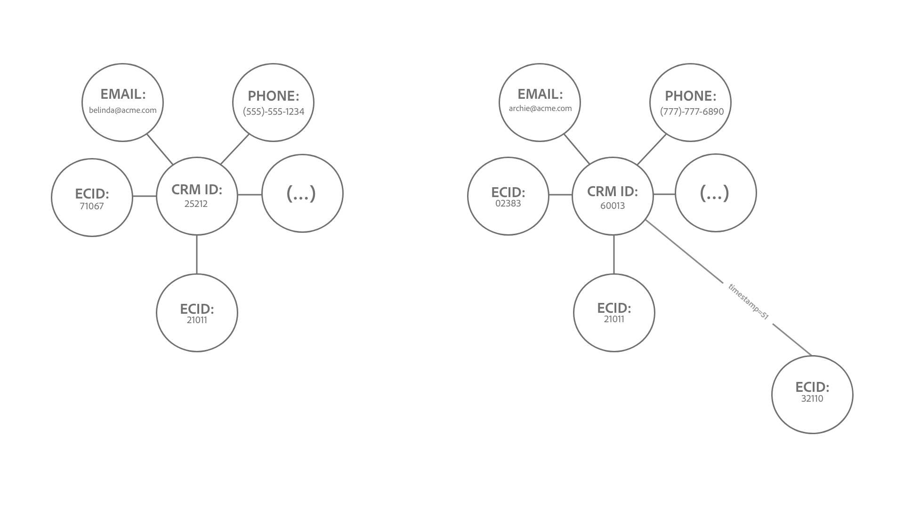
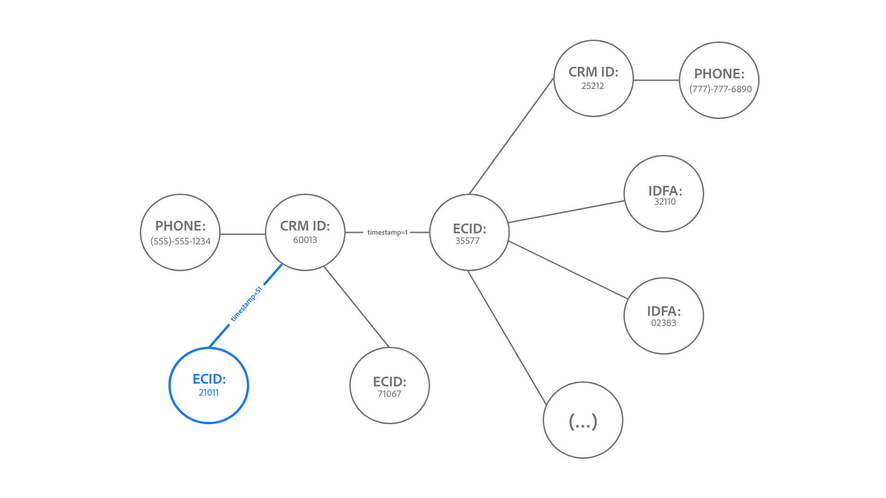
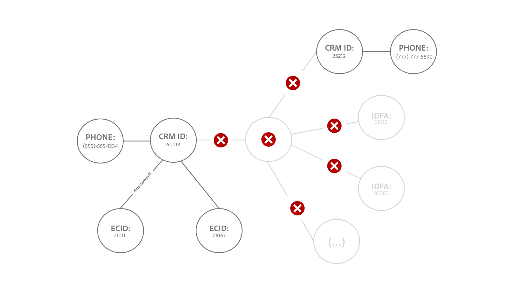
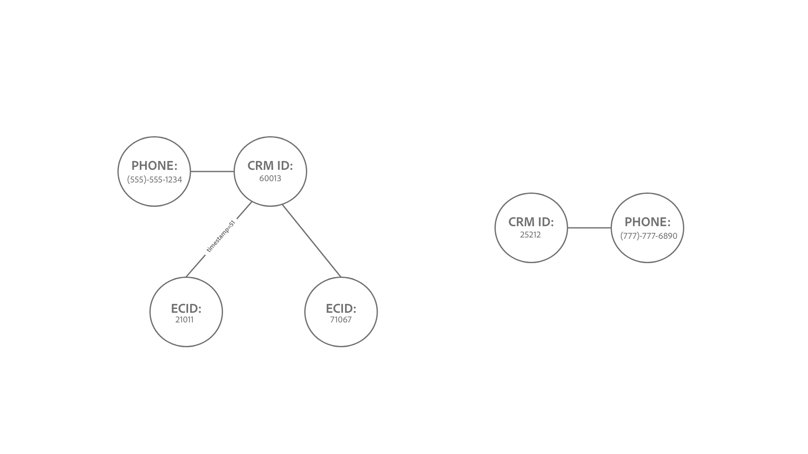

# [!DNL Identity Service] データのガードレール

このドキュメントでは、ID グラフの使用を最適化するのに役立つ [!DNL Identity Service] データの使用とレート制限について説明します。次のガードレールを確認する際は、データが正しくモデル化されていることが前提になっています。データのモデル化方法に関するご質問は、カスタマーサービス担当者にお問い合わせください。

>[!IMPORTANT]
>
>このガードレール ページに加えて、実際の使用制限について、セールスオーダーと対応する[製品説明](https://helpx.adobe.com/jp/legal/product-descriptions.html)のライセンス使用権限を確認してください。

## 基本を学ぶ

ID データのモデリングには、次の Experience Platform サービスが関係しています。

* [ID](home.md):Experience Platformに取り込まれる、異なるデータソースからのBridge ID。
* [[!DNL Real-Time Customer Profile]](../profile/home.md)：複数のソースのデータを使用して、統合された消費者プロファイルを作成します。

## データモデルの上限

静的上限のガードレールと、ID 名前空間で考慮すべき検証ルールに関するガイダンスを次の表に示します。

### 静的上限

ID データに適用される静的上限の概要を次の表に示します。

| ガードレール | 上限 | メモ |
| --- | --- | --- |
| グラフ内のIDの数 | 50 | リンクされたIDが50個のグラフが更新されると、Identity Serviceは「先入れ先出し」メカニズムを適用し、このグラフの最新のID用のスペースを作成するために最も古いIDを削除します（**注**: リアルタイム顧客プロファイルは影響を受けません）。 削除は、ID タイプとタイムスタンプに基づいて行われます。上限は、サンドボックスレベルで適用されます。詳しくは、[削除ロジックについて](#deletion-logic)の節を参照してください。 |
| 1回のバッチ取り込みのIDへのリンク数 | 50 | 単一のバッチには、望ましくないグラフの結合の原因となる異常なIDが含まれている可能性があります。 これを防ぐために、ID サービスは、既に50個以上のIDにリンクされているIDを取り込みません。 |
| XDM レコード内の ID 数 | 20 | 最低限必要な XDM レコード数は 2 です。 |
| カスタム名前空間の数 | なし | 作成できるカスタム名前空間の数に制限はありません。 |
| 名前空間の表示名または ID シンボルの文字数 | なし | 名前空間の表示名または ID シンボルの文字数に制限はありません。 |

{style="table-layout:auto"}

### ID 値の検証

ID 値の検証を成功させるために従う必要がある既存のルールの概要を次の表に示します。

| 名前空間 | 検証ルール | ルール違反時のシステムの動作 |
| --- | --- | --- |
| ECID | <ul><li>ECID の ID 値はちょうど 38 文字にする必要があります。</li><li>ECID の ID 値は、数字のみで構成する必要があります。</li></ul> | <ul><li>ECID の ID 値がちょうど 38 文字でない場合、そのレコードはスキップされます。</li><li>ECID の ID 値に数字以外の文字が含まれている場合、そのレコードはスキップされます。</li></ul> |
| ECID 以外 | <ul><li>ID 値は 1024 文字を超えることはできません。</li><li>ID値を「null」、「匿名」、「無効」または空の文字列にすることはできません（例：「」、「」、「」）。</li></ul> | <ul><li>ID 値が 1024 文字を超える場合、そのレコードはスキップされます。</li><li>IDは取り込みからブロックされます。</li></ul> |

{style="table-layout:auto"}

### ID 名前空間の取り込み

2023年3月31日（PT）以降、ID サービスは、新規のお客様について Adobe Analytics ID (AAID) の取り込みをブロックします。この ID は、通常、[Adobe Analytics ソース](../sources/connectors/adobe-applications/analytics.md)と [Adobe Audience Manager ソース](../sources//connectors/adobe-applications/audience-manager.md)を通じて取り込まれ、ECID が同じ web ブラウザーを表すため冗長です。このデフォルト設定を変更する場合は、Adobe アカウントチームにお問い合わせください。

## パフォーマンスガードレール {#performance-guardrails}

ID サービスは、受信データを継続的に監視し、大規模な高パフォーマンスと信頼性を確保します。 ただし、短期間でエクスペリエンスイベントデータが流入すると、パフォーマンスが低下し、遅延が発生する可能性があります。 Adobeはこのようなパフォーマンス低下の責任を負いません。

## ID グラフの処理能力が更新されたときの削除ロジックについて {#deletion-logic}

完全な ID グラフが更新されると、ID サービスは、最新の ID を追加する前に、グラフ内の最も古い ID を削除します。これは、ID データの正確性と関連性を維持するためです。この削除プロセスは、次の 2 つの主なルールに従います。

### ルール #1：削除は、名前空間の ID タイプに基づいて優先付けされる

削除の優先順位は次のとおりです。

1. Cookie ID
2. デバイス ID
3. クロスデバイス ID、メール、電話

### ルール #2：削除は、ID に保存されたタイムスタンプに基づいて行われる

グラフにリンクされた各 ID には、対応する独自のタイムスタンプがあります。完全なグラフが更新されると、ID サービスは最も古いタイムスタンプを持つ ID を削除します。

完全なグラフが新しい ID で更新されると、これら 2 つのルールが連携して、削除する古い ID が指定されます。ID サービスは、まず最も古い Cookie ID、次に最も古いデバイス ID、最後に最も古いクロスデバイス IDやメール、電話の順に削除します。

>[!NOTE]
>
>削除するように指定された ID がグラフ内で他の複数の ID にリンクしている場合、その ID を接続するリンクも削除されます。

### 導入への影響

次の節では、削除ロジックがIdentity Service、Real-Time Customer Profile、およびWebSDKに与える影響の概要を説明します。

#### ID サービス：カスタム名前空間ID タイプの変更

実稼動サンドボックスに次が含まれる場合は、Adobe アカウントチームに連絡してID タイプの変更をリクエストしてください。

* 個人ID （CRMIDなど）がCookie/デバイス ID タイプとして設定されるカスタム名前空間。
* Cookie/デバイス識別子がクロスデバイス ID タイプとして設定されるカスタム名前空間。

この機能が利用可能になると、50個のIDの制限を超えるグラフは、最大50個のIDまで削減されます。 Real-Time CDP B2C Editionの場合、これらのプロファイルは以前はセグメント化とアクティベーションから無視されていたため、オーディエンスに適格なプロファイルの数が最小限に増加する可能性があります。

#### リアルタイムの顧客プロファイル：到達可能なオーディエンスへの影響

削除は、リアルタイム顧客プロファイルではなく、ID サービス内のデータに対してのみ実行されます。

* この動作により、ECIDはID グラフの一部ではなくなったため、単一のECIDを持つプロファイルが増える可能性があります。
* アドレス可能なオーディエンスの使用権限番号を維持するには、[仮名プロファイルデータの有効期限](../profile/pseudonymous-profiles.md)を有効にして、古いプロファイルを削除することをお勧めします。

#### Real-Time Customer Profile and WebSDK: プライマリ IDの削除

認証済みイベントをCRMIDに対して保持する場合は、プライマリ IDをECIDからCRMIDに変更することをお勧めします。 この変更を実装する手順については、次のドキュメントを参照してください。

* [Experience Platform タグのID マップを設定](../tags/extensions/client/web-sdk/data-element-types.md#identity-map)。
* [データ収集におけるID](/help/collection/identity/overview.md)

### シナリオ例

#### 例1：典型的な大規模グラフ

*ダイアグラムのメモ：*

* `t` = タイムスタンプ。
* タイムスタンプの値は、特定のIDの最新性に対応します。 例えば、`t1`は最初のリンク ID （最も古い）を表し、`t51`は最新のリンク IDを表します。

この例では、左側のグラフを新しいIDで更新する前に、ID サービスはまず、最も古いタイムスタンプを持つ既存のIDを削除します。 ただし、最も古い ID はデバイス ID なので、ID サービスは、削除の優先順位リストの上位のタイプの名前空間（この場合は `ecid-3`）に到達するまで、その ID をスキップします。削除の優先順位が上位のタイプの最も古い ID が削除されると、グラフは新しいリンク `ecid-51` で更新されます。

* まれに、同じタイムスタンプとID タイプを持つ2つのIDが存在する場合、ID サービスは[XID](./api/list-native-id.md)に基づいてIDを並べ替え、削除を実行します。

#### 例2:「グラフ分割」

>[!BEGINTABS]

>[!TAB 受信イベント ]

*ダイアグラムのメモ：*

* 次の図は、`timestamp=50`にID グラフに50個のIDが存在することを前提としています。
* `(...)`は、グラフ内で既にリンクされている他のIDを示します。

この例では、ECID:32110が取り込まれ、`timestamp=51`の大きなグラフにリンクされるため、50 IDの制限を超えています。

>[!TAB 削除プロセス ]

その結果、ID サービスは、タイムスタンプとID タイプに基づいて、最も古いIDを削除します。 この場合、ECID:35577はID グラフからのみ削除されます。

>[!TAB  グラフ出力]

ECID:35577を削除した結果、CRMID:60013とCRMID:25212を現在削除されているECID:35577とリンクしているエッジも削除されます。 この削除プロセスにより、グラフが2つの小さなグラフに分割されます。

>[!ENDTABS]

#### 例3:「ハブとスポーク」

>[!BEGINTABS]

>[!TAB 受信イベント ]

*ダイアグラムのメモ：*

* 次の図は、`timestamp=50`にID グラフに50個のIDが存在することを前提としています。
* `(...)`は、グラフ内で既にリンクされている他のIDを示します。

削除ロジックにより、一部の「ハブ」 IDも削除される可能性があります。 これらのハブ IDは、リンクされていない複数の個人IDにリンクされているノードを指します。

以下の例では、ECID:21011が取り込まれ、`timestamp=51`のグラフにリンクされるため、50 IDの制限を超えています。

>[!TAB 削除プロセス ]

その結果、ID サービスはID グラフからのみ最も古いIDを削除します。この場合はECID:35577。 ECID:35577を削除すると、次の項目も削除されます。

* CRMID: 60013と現在は削除されたECID:35577の間のリンクは、グラフ分割シナリオになります。
* IDFA: 32110、IDFA: 02383、および`(...)`で表される残りのID。 これらのIDは、個別に他のIDにリンクされていないため、グラフに表示できないため、削除されます。

>[!TAB  グラフ出力]

最後に、削除プロセスでは、2つの小さなグラフが生成されます。

>[!ENDTABS]

## 次の手順

[!DNL Identity Service] について詳しくは、次のドキュメントを参照してください。

* [[!DNL Identity Service] の概要](home.md)
* [ID グラフビューア](features/identity-graph-viewer.md)

その他のExperience Platform サービスのガードレール、エンドツーエンドの待ち時間に関する情報、Real-Time CDPの製品説明ドキュメントからのライセンス情報については、次のドキュメントを参照してください。

* [Real-Time CDPのガードレール](/help/rtcdp/guardrails/overview.md)
* 様々なExperience Platform サービスの[ エンドツーエンドの待ち時間ダイアグラム ](https://experienceleague.adobe.com/docs/blueprints-learn/architecture/architecture-overview/deployment/guardrails.html?lang=en#end-to-end-latency-diagrams)。
* [Real-Time Customer Data Platform（B2C Edition - PrimeおよびUltimate パッケージ） ](https://helpx.adobe.com/jp/legal/product-descriptions/real-time-customer-data-platform-b2c-edition-prime-and-ultimate-packages.html)
* [Real-Time Customer Data Platform（B2P - PrimeおよびUltimate パッケージ） ](https://helpx.adobe.com/legal/product-descriptions/real-time-customer-data-platform-b2p-edition-prime-and-ultimate-packages.html)
* [Real-Time Customer Data Platform（B2B - PrimeおよびUltimate パッケージ） ](https://helpx.adobe.com/legal/product-descriptions/real-time-customer-data-platform-b2b-edition-prime-and-ultimate-packages.html)
