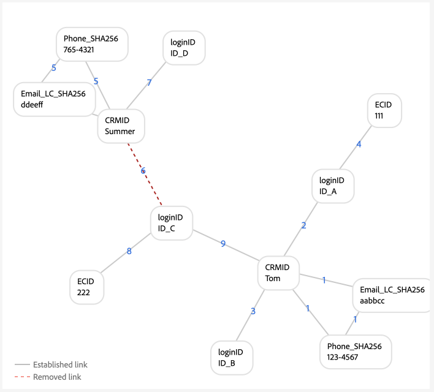
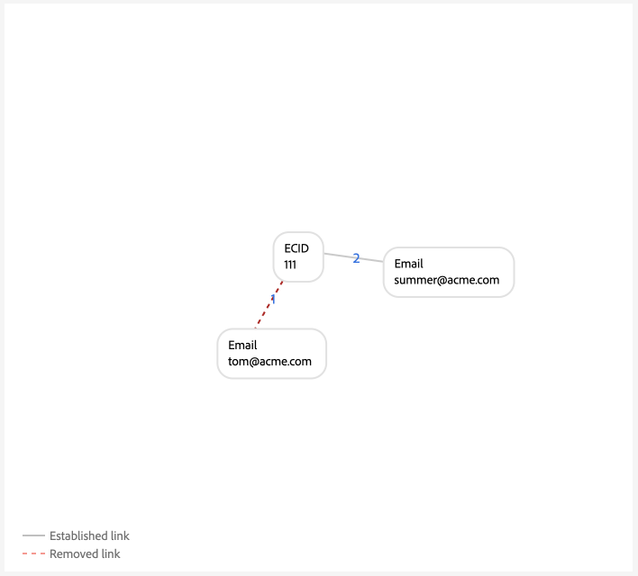

# グラフ設定の例 {#examples-of-graph-configurations}

>[!CONTEXTUALHELP]
>id="platform_identities_algorithmconfiguration"
>title="アルゴリズム設定"
>abstract="取り込んだ ID に合わせて、一意の名前空間と名前空間の優先度を設定します。"
>additional-url="https://experienceleague.adobe.com/en/docs/experience-platform/identity/features/identity-graph-linking-rules/example-configurations" text="詳細情報"

>[!AVAILABILITY]
>
>ID グラフリンクルールは現在、限定提供（LA）です。 開発用サンドボックスでこの機能にアクセスする方法については、Adobeアカウントチームにお問い合わせください。

>[!NOTE]
>
>* 「CRMID」と「loginID」は、カスタム名前空間です。 このドキュメントでは、「CRMID」はユーザー識別子で、「loginID」は特定のユーザーに関連付けられたログイン識別子です。
>* このドキュメントで概要を説明するグラフシナリオの例をシミュレートするには、まず 2 つのカスタム名前空間を作成する必要があります。1 つは ID シンボル「CRMID」、もう 1 つは ID シンボル「loginID」です。 ID 記号では大文字と小文字が区別されます。

このドキュメントでは、ID グラフリンクルールと ID データを使用する際に発生する可能性のある、一般的なシナリオのグラフ設定例について説明します。

## CRMID のみ

これは、オンラインイベント（CRMID および ECID）が取り込まれ、オフラインイベント（プロファイルレコード）が CRMID に対してのみ保存される、シンプルな実装シナリオの例です。

**実装：**

| 使用されている名前空間 | Web 行動収集方法 |
| --- | --- |
| CRMID、ECID | Web SDK |

**イベント：**

次のイベントをテキストモードにコピーすると、グラフシミュレーションでこのシナリオを作成できます。

```shell
CRMID: Tom, ECID: 111
```

**アルゴリズム設定：**

アルゴリズム設定に次の設定を行うことで、グラフシミュレーションでこのシナリオを作成できます。

| 優先度 | 表示名 | ID タイプ | グラフごとに一意 |
| ---| --- | --- | --- |
| 1 | CRMID | CROSS_DEVICE | ○ |
| 2 | ECID | COOKIE | × |

**リアルタイムプライマリプロファイル用の顧客 ID の選択：**

この設定のコンテキスト内で、プライマリ ID は次のように定義されます。

| 認証ステータス | イベントの名前空間 | プライマリ ID |
| --- | --- | --- |
| Authenticated | CRMID、ECID | CRMID |
| 未認証 | ECID | ECID |

**グラフの例**

>[!BEGINTABS]

>[!TAB  理想的な一人称グラフ ]

以下は、CRMID が一意で最も優先度が高い、理想的な単一人物グラフの例です。


>[!TAB  複数人グラフ ]

次に、複数人グラフの例を示します。 この例では、「共有デバイス」シナリオが表示されます。このシナリオでは、2 つの CRMID があり、古い確立済みリンクを持つ CRMID が削除されます。


**グラフシミュレーションイベント入力**

```shell
CRMID: Tom, ECID: 111
CRMID: Summer, ECID: 111
```

>[!ENDTABS]

## ハッシュ化されたメールを使用した CRMID

このシナリオでは、CRMID が取り込まれ、オンライン（エクスペリエンスイベント）とオフライン（プロファイルレコード）の両方のデータを表します。 このシナリオでは、ハッシュ化されたメールの取り込みも必要となります。これは、CRM レコードデータセット内で CRMID と共に送信される別の名前空間を表しています。

>[!IMPORTANT]
>
>**CRMID が常にすべてのユーザーに送信されることが重要です**。 これを怠ると、ログイン ID が「ダングリング」するシナリオが発生する可能性があります。このシナリオでは、1 人のユーザーエンティティが他のユーザーとデバイスを共有していると見なされます。

**実装：**

| 使用されている名前空間 | Web 行動収集方法 |
| --- | --- |
| CRMID、Email_LC_SHA256、ECID | Web SDK |

**イベント：**

次のイベントをテキストモードにコピーすると、グラフシミュレーションでこのシナリオを作成できます。

```shell
CRMID: Tom, Email_LC_SHA256: tom<span>@acme.com
CRMID: Tom, ECID: 111
CRMID: Summer, Email_LC_SHA256: summer<span>@acme.com
CRMID: Summer, ECID: 222
```

**アルゴリズム設定：**

アルゴリズム設定に次の設定を行うことで、グラフシミュレーションでこのシナリオを作成できます。

| 優先度 | 表示名 | ID タイプ | グラフごとに一意 |
| ---| --- | --- | --- |
| 1 | CRMID | CROSS_DEVICE | ○ |
| 2 | メール（SHA256、小文字） | メール | × |
| 3 | ECID | COOKIE | × |

**プロファイル** のプライマリ ID の選択

この設定のコンテキスト内で、プライマリ ID は次のように定義されます。

| 認証ステータス | イベントの名前空間 | プライマリ ID |
| --- | --- | --- |
| Authenticated | CRMID、ECID | CRMID |
| 未認証 | ECID | ECID |

**グラフの例**

>[!BEGINTABS]

>[!TAB  理想的な一人称グラフ ]

以下は、理想的な 1 人の人物のグラフのペアの例です。ここでは、各 CRMID が、ハッシュ化された電子メール名前空間と ECID にそれぞれ関連付けられています。


>[!TAB  複数人グラフ：共有デバイス ]

次に、デバイスが 2 人のユーザーで共有される、複数担当者グラフのシナリオの例を示します。


**グラフシミュレーションイベント入力**

```shell
CRMID: Tom, Email_LC_SHA256: aabbcc
CRMID: Tom, ECID: 111
CRMID: Summer, Email_LC_SHA256: ddeeff
CRMID: Summer, ECID: 222
CRMID: Summer, ECID: 111
```

>[!TAB  複数人グラフ：一意でないメール ]

次に、メールが一意ではなく、2 つの異なる CRMID に関連付けられている複数人グラフシナリオの例を示します。


**グラフシミュレーションイベント入力**

```shell
CRMID: Tom, Email_LC_SHA256: aabbcc
CRMID: Tom, ECID: 111
CRMID: Summer, Email_LC_SHA256: ddeeff
CRMID: Summer, ECID: 222
CRMID: Summer, Email_LC_SHA256: aabbcc
```

>[!ENDTABS]

## ハッシュ化されたメール、ハッシュ化された電話、GAID および IDFA を使用した CRMID

このシナリオは前のシナリオと似ています。 ただし、このシナリオでは、ハッシュ化されたメールと電話は、[[!DNL Segment Match]](../../segmentation/ui/segment-match/overview.md) で利用する ID としてマークされます。

>[!IMPORTANT]
>
>**CRMID が常にすべてのユーザーに送信されることが重要です**。 これを怠ると、ログイン ID が「ダングリング」するシナリオが発生する可能性があります。このシナリオでは、1 人のユーザーエンティティが他のユーザーとデバイスを共有していると見なされます。

**実装：**

| 使用されている名前空間 | Web 行動収集方法 |
| --- | --- |
| CRMID, Email_LC_SHA256, Phone_SHA256, GAID, IDFA, ECID | Web SDK |

**イベント：**

次のイベントをテキストモードにコピーすると、グラフシミュレーションでこのシナリオを作成できます。

```shell
CRMID: Tom, Email_LC_SHA256: aabbcc, Phone_SHA256: 123-4567
CRMID: Tom, ECID: 111
CRMID: Tom, ECID: 222, IDFA: A-A-A
CRMID: Summer, Email_LC_SHA256: ddeeff, Phone_SHA256: 765-4321
CRMID: Summer, ECID: 333
CRMID: Summer, ECID: 444, GAID:B-B-B
```

**アルゴリズム設定：**

アルゴリズム設定に次の設定を行うことで、グラフシミュレーションでこのシナリオを作成できます。

| 優先度 | 表示名 | ID タイプ | グラフごとに一意 |
| ---| --- | --- | --- |
| 1 | CRMID | CROSS_DEVICE | ○ |
| 2 | メール（SHA256、小文字） | メール | × |
| 3 | 電話（SHA256） | Phone | × |
| 4 | Google広告 ID （GAID） | デバイス | × |
| 5 | Apple IDFA （Appleの ID） | デバイス | × |
| 6 | ECID | COOKIE | × |

**プロファイル** のプライマリ ID の選択

この設定のコンテキスト内で、プライマリ ID は次のように定義されます。

| 認証ステータス | イベントの名前空間 | プライマリ ID |
| --- | --- | --- |
| Authenticated | CRMID、IDFA、ECID | CRMID |
| Authenticated | CRMID、GAID、ECID | CRMID |
| Authenticated | CRMID、ECID | CRMID |
| 未認証 | GAID、ECID | GAID |
| 未認証 | IDFA、ECID | IDFA |
| 未認証 | ECID | ECID |

**グラフの例**

>[!BEGINTABS]

>[!TAB  理想的な一人称グラフ ]

次に、ハッシュ化されたメールとハッシュ化された電話が [!DNL Segment Match] で使用する ID としてマークされる、理想的な一人称グラフシナリオを示します。 このシナリオでは、グラフは 2 つに分割され、異なる人物エンティティを表します。


>[!TAB  複数人グラフ：共有デバイス、共有コンピューター ]

次に、デバイス（コンピューター）が 2 人で共有される複数人のグラフシナリオを示します。 このシナリオでは、共有コンピューターは `{ECID: 111}` によって表され、`{CRMID: Summer}` にリンクされます。これは、そのリンクが最も新しく確立されたリンクであるためです。 `{CRMID: Tom}` と `{ECID: 111}` の間のリンクが古く、CRMID がこの設定で指定された一意の名前空間であるため、`{CRMID: Tom}` が削除されました。


**グラフシミュレーションイベント入力**

```shell
CRMID: Tom, Email_LC_SHA256: aabbcc, Phone_SHA256: 123-4567
CRMID: Tom, ECID: 111
CRMID: Tom, ECID: 222, IDFA: A-A-A
CRMID: Summer, Email_LC_SHA256: ddeeff, Phone_SHA256: 765-4321
CRMID: Summer, ECID: 333
CRMID: Summer, ECID: 444, GAID:B-B-B
CRMID: Summer, ECID: 111
```

>[!TAB  複数人グラフ：共有デバイス、Android モバイルデバイス ]

次に、Android デバイスが 2 人で共有される複数人のグラフシナリオを示します。 このシナリオでは、CRMID は一意の名前空間として設定されるので、`{CRMID: Tom, GAID: B-B-B, ECID:444}` の新しいリンクが古いリンクに置き換わ `{CRMID: Summer, GAID: B-B-B, ECID:444}` ます。


**グラフシミュレーションイベント入力**

```shell
CRMID: Tom, Email_LC_SHA256: aabbcc, Phone_SHA256: 123-4567
CRMID: Tom, ECID: 111
CRMID: Tom, ECID: 222, IDFA: A-A-A
CRMID: Summer, Email_LC_SHA256: ddeeff, Phone_SHA256: 765-4321
CRMID: Summer, ECID: 333
CRMID: Summer, ECID: 444, GAID: B-B-B
CRMID: Tom, ECID: 444, GAID: B-B-B
```

>[!TAB  複数人グラフ：共有デバイス、apple モバイルデバイス、ECID のリセットなし ]

次に、Apple デバイスが 2 人のユーザーで共有される複数人のグラフのシナリオを示します。 このシナリオでは、IDFA は共有されますが、ECID はリセットされません。


**グラフシミュレーションイベント入力**

```shell
CRMID: Tom, Email_LC_SHA256: aabbcc, Phone_SHA256: 123-4567
CRMID: Tom, ECID: 111
CRMID: Tom, ECID: 222, IDFA: A-A-A
CRMID: Summer, Email_LC_SHA256: ddeeff, Phone_SHA256: 765-4321
CRMID: Summer, ECID: 333
CRMID: Summer, ECID: 444, GAID: B-B-B
CRMID: Summer, ECID: 222, IDFA: A-A-A
```

>[!TAB  複数人グラフ：共有デバイス、apple、ECID のリセット ]

次に、Apple デバイスが 2 人のユーザーで共有される複数人のグラフのシナリオを示します。 このシナリオでは、ECID はリセットされますが、IDFA は同じままです。


**グラフシミュレーションイベント入力**

```shell
CRMID: Tom, Email_LC_SHA256: aabbcc, Phone_SHA256: 123-4567
CRMID: Tom, ECID: 111
CRMID: Tom, ECID: 222, IDFA: A-A-A
CRMID: Summer, Email_LC_SHA256: ddeeff, Phone_SHA256: 765-4321
CRMID: Summer, ECID: 333
CRMID: Summer, ECID: 444, GAID: B-B-B
CRMID: Summer, ECID: 555, IDFA: A-A-A
```

>[!TAB  複数人グラフ：一意でない電話 ]

次に、同じ電話番号が 2 人の人物によって共有されている、複数の人物のグラフのシナリオを示します。


**グラフシミュレーションイベント入力**

```shell
CRMID: Tom, Email_LC_SHA256: aabbcc, Phone_SHA256: 123-4567
CRMID: Tom, ECID: 111
CRMID: Tom, ECID: 222, IDFA: A-A-A
CRMID: Summer, Email_LC_SHA256: ddeeff, Phone_SHA256: 765-4321
CRMID: Summer, ECID: 333
CRMID: Summer, ECID: 444, GAID: B-B-B
CRMID: Summer, Phone_SHA256: 123-4567
```

この例では、`{Phone_SHA256}` も一意の名前空間としてマークされます。 したがって、1 つのグラフに `{Phone_SHA256}` 名前空間を持つ複数の ID を含めることはできません。 このシナリオでは、`{Phone_SHA256: 765-4321}` は古いリンクであるため、`{CRMID: Summer}` および `{Email_LC_SHA256: ddeeff}` からリンク解除されます。


>[!TAB  複数人グラフ：一意でないメール ]

次に、メールが 2 人で共有される複数人のグラフシナリオを示します。


**グラフシミュレーションイベント入力**

```shell
CRMID: Tom, Email_LC_SHA256: aabbcc, Phone_SHA256: 123-4567
CRMID: Tom, ECID: 111
CRMID: Tom, ECID: 222, IDFA: A-A-A
CRMID: Summer, Email_LC_SHA256: ddeeff, Phone_SHA256: 765-4321
CRMID: Summer, ECID: 333
CRMID: Summer, ECID: 444, GAID: B-B-B
CRMID: Summer, Email_LC_SHA256: aabbcc
```

>[!ENDTABS]

## 複数のログイン ID を持つ単一の CRMID （シンプルバージョン）

このシナリオでは、人物エンティティを表す CRMID が 1 つあります。 ただし、1 つの個人エンティティに複数のログイン識別子を設定できます。

* 特定の人物エンティティは、異なるアカウントアカウントタイプを持つことができます（個人とビジネス、州によるアカウント、ブランドによるアカウントなど）。
* 特定のユーザーエンティティは、任意の数のアカウントに対して異なるメールアドレスを使用できます。

>[!IMPORTANT]
>
>**CRMID が常にすべてのユーザーに送信されることが重要です**。 これを怠ると、ログイン ID が「ダングリング」するシナリオが発生する可能性があります。このシナリオでは、1 人のユーザーエンティティが他のユーザーとデバイスを共有していると見なされます。

**実装：**

| 使用されている名前空間 | Web 行動収集方法 |
| --- | --- |
| CRMID、loginID、ECID | Web SDK |

**イベント：**

次のイベントをテキストモードにコピーすると、グラフシミュレーションでこのシナリオを作成できます。

```shell
CRMID: Tom, loginID: ID_A
CRMID: Tom, loginID: ID_B
loginID: ID_A, ECID: 111
CRMID: Summer, loginID: ID_C
CRMID: Summer, loginID: ID_D
loginID: ID_C, ECID: 222
```

**アルゴリズム設定：**

アルゴリズム設定に次の設定を行うことで、グラフシミュレーションでこのシナリオを作成できます。

| 優先度 | 表示名 | ID タイプ | グラフごとに一意 |
| ---| --- | --- | --- |
| 1 | CRMID | CROSS_DEVICE | ○ |
| 2 | loginID | CROSS_DEVICE | × |
| 3 | ECID | COOKIE | × |

**プロファイル** のプライマリ ID の選択

この設定のコンテキスト内で、プライマリ ID は次のように定義されます。

| 認証ステータス | イベントの名前空間 | プライマリ ID |
| --- | --- | --- |
| Authenticated | loginID, ECID | loginID |
| Authenticated | loginID, ECID | loginID |
| Authenticated | CRMID、loginID、ECID | CRMID |
| Authenticated | CRMID、ECID | CRMID |
| 未認証 | ECID | ECID |

**グラフの例**

>[!BEGINTABS]

>[!TAB  理想的なシングルユーザーのシナリオ ]

次に、1 つの CRMID と複数の loginID を持つ 1 人の人物グラフシナリオを示します。


>[!TAB  複数人グラフシナリオ：共有デバイス ]

次に、デバイスが 2 人で共有される複数担当者グラフのシナリオを示します。 このシナリオでは、`{ECID:111}` は `{loginID:ID_A}` と `{loginID:ID_C}` の両方にリンクされ、`{ECID:111, loginID:ID_A}` の古い確立済みリンクは削除されます。


**グラフシミュレーションイベント入力**

```shell
CRMID: Tom, loginID: ID_A
CRMID: Tom, loginID: ID_B
loginID: ID_A, ECID: 111
CRMID: Summer, loginID: ID_C
CRMID: Summer, loginID: ID_D
loginID: ID_C, ECID: 222
loginID: ID_C, ECID: 111
```

>[!TAB  複数ユーザーのグラフシナリオ：無効なデータ ]

次に、不正なデータを含む複数人のグラフシナリオを示します。 このシナリオでは、`{loginID:ID_D}` は 2 人の異なるユーザーに誤ってリンクされ、より新しく確立されたリンクを優先して、古いタイムスタンプのリンクが削除されます。


**グラフシミュレーションイベント入力**

```shell
CRMID: Tom, loginID: ID_A
CRMID: Tom, loginID: ID_B
loginID: ID_A, ECID: 111
CRMID: Summer, loginID: ID_C
CRMID: Summer, loginID: ID_D
loginID: ID_C, ECID: 222
CRMID: Tom, loginID: ID_D
```

>[!TAB &#39;ダングリング&#39; loginID]

次のグラフは、「ぶら下がっている」 loginID シナリオをシミュレートします。 この例では、2 つの異なる loginID が同じ ECID にバインドされています。 ただし、`{loginID:ID_C}` は CRMID にリンクされていません。 したがって、ID サービスが、これら 2 つの loginID が 2 つの異なるエンティティを表していることを検出する方法はありません。


**グラフシミュレーションイベント入力**

```shell
CRMID: Tom, loginID: ID_A
CRMID: Tom, loginID: ID_B
loginID: ID_A, ECID: 111
loginID: ID_C, ECID: 111
```

>[!ENDTABS]

## 複数のログイン ID を持つ単一の CRMID （複雑なバージョン）

このシナリオでは、人物エンティティを表す CRMID が 1 つあります。 ただし、1 つの個人エンティティに複数のログイン識別子を設定できます。

* 特定の人物エンティティは、異なるアカウントアカウントタイプを持つことができます（個人とビジネス、州によるアカウント、ブランドによるアカウントなど）。
* 特定のユーザーエンティティは、任意の数のアカウントに対して異なるメールアドレスを使用できます。

>[!IMPORTANT]
>
>**CRMID が常にすべてのユーザーに送信されることが重要です**。 これを怠ると、ログイン ID が「ダングリング」するシナリオが発生する可能性があります。このシナリオでは、1 人のユーザーエンティティが他のユーザーとデバイスを共有していると見なされます。

**実装：**

| 使用されている名前空間 | Web 行動収集方法 |
| --- | --- |
| CRMID, Email_LC_SHA256, Phone_SHA256, loginID, ECID | Adobe Analytics ソースコネクタ。<br> **メモ：** デフォルトでは、AAID は ID サービスでブロックされるので、Analytics ソースを使用する場合は、AAID よりも ECID を優先する必要があります。 詳しくは、[ 実装ガイド ](./implementation-guide.md#ingest-your-data) を参照してください。</br> |

**イベント：**

次のイベントをテキストモードにコピーすると、グラフシミュレーションでこのシナリオを作成できます。

```shell
CRMID: Tom, Email_LC_SHA256: aabbcc, Phone_SHA256: 123-4567
CRMID: Tom, loginID: ID_A
CRMID: Tom, loginID: ID_B
loginID: ID_A, ECID: 111
CRMID: Summer, Email_LC_SHA256: ddeeff, Phone_SHA256: 765-4321
CRMID: Summer, loginID: ID_C
CRMID: Summer, loginID: ID_D
loginID: ID_C, ECID: 222
```

**アルゴリズム設定：**

アルゴリズム設定に次の設定を行うことで、グラフシミュレーションでこのシナリオを作成できます。

| 優先度 | 表示名 | ID タイプ | グラフごとに一意 |
| ---| --- | --- | --- | 
| 1 | CRMID | CROSS_DEVICE | ○ |
| 2 | Email_LC_SHA256 | メール | × |
| 3 | Phone_SHA256 | Phone | × |
| 4 | loginID | CROSS_DEVICE | × |
| 5 | ECID | COOKIE | × |
| 6 | AAID | COOKIE | × |

**プロファイル** のプライマリ ID の選択

この設定のコンテキスト内で、プライマリ ID は次のように定義されます。

| 認証ステータス | イベントの名前空間 | プライマリ ID |
| --- | --- | --- |
| Authenticated | loginID, ECID | loginID |
| Authenticated | loginID, ECID | loginID |
| Authenticated | CRMID、loginID、ECID | CRMID |
| Authenticated | CRMID、ECID | CRMID |
| 未認証 | ECID | ECID |

**グラフの例**

>[!BEGINTABS]

>[!TAB  理想的な一人称グラフ ]

以下は、それぞれが 1 つの CRMID と複数の loginID を持つ 2 つの 1 人の人物グラフの例です。


>[!TAB  複数人グラフ：共有デバイス 1]

次に、`{ECID:111}` が `{loginID:ID_A}` と `{loginID:ID_C}` の両方にリンクされている、複数人の共有デバイスのシナリオを示します。 この場合、古いリンクは削除され、新しいリンクが優先されます。


**グラフシミュレーションイベント入力**

```shell
CRMID: Tom, Email_LC_SHA256: aabbcc, Phone_SHA256: 123-4567
CRMID: Tom, loginID: ID_A
CRMID: Tom, loginID: ID_B
loginID: ID_A, ECID: 111
CRMID: Summer, Email_LC_SHA256: ddeeff, Phone_SHA256: 765-4321
CRMID: Summer, loginID: ID_C
CRMID: Summer, loginID: ID_D
loginID: ID_C, ECID: 222
loginID: ID_C, ECID: 111
```

>[!TAB  複数人グラフ：共有デバイス 2]

このシナリオでは、loginID のみを送信するのではなく、loginID と CRMID の両方がエクスペリエンスイベントとして送信されます。


**グラフシミュレーションイベント入力**

```shell
CRMID: Tom, Email_LC_SHA256: aabbcc, Phone_SHA256: 123-4567
CRMID: Tom, loginID: ID_A
CRMID: Tom, loginID: ID_B
loginID: ID_A, ECID: 111
CRMID: Summer, Email_LC_SHA256: ddeeff, Phone_SHA256: 765-4321
CRMID: Summer, loginID: ID_C
CRMID: Summer, loginID: ID_D
loginID: ID_C, ECID: 222
CRMID: Summer, loginID: ID_C, ECID: 111
loginID: ID_A, ECID: 111
```

>[!TAB  複数人グラフ：無効な loginID データ ]

このシナリオでは、`{loginID:ID_C}` は `{CRMID:Tom}` と `{CRMID:Summer}` の両方にリンクされているので、不正なデータと見なされます。これは、理想的なグラフシナリオでは、同じ loginID を 2 つの異なるユーザーにリンクしてはならないからです。 この場合、古いリンクは削除され、新しく設定されたリンクが優先されます。



**グラフシミュレーションイベント入力**

```shell
CRMID: Tom, Email_LC_SHA256: aabbcc, Phone_SHA256: 123-4567
CRMID: Tom, loginID: ID_A
CRMID: Tom, loginID: ID_B
loginID: ID_A, ECID: 111
CRMID: Summer, Email_LC_SHA256: ddeeff, Phone_SHA256: 765-4321
CRMID: Summer, loginID: ID_C
CRMID: Summer, loginID: ID_D
loginID: ID_C, ECID: 222
CRMID: Tom, loginID: ID_C
```

>[!TAB  複数人グラフ：一意でないメール ]

このシナリオでは、一意でないメールが 2 つの異なる CRMID にリンクされているので、古いリンクから新しく確立されたリンクに置き換わります。


**グラフシミュレーションイベント入力**

```shell
CRMID: Tom, Email_LC_SHA256: aabbcc, Phone_SHA256: 123-4567
CRMID: Tom, loginID: ID_A
CRMID: Tom, loginID: ID_B
loginID: ID_A, ECID: 111
CRMID: Summer, Email_LC_SHA256: ddeeff, Phone_SHA256: 765-4321
CRMID: Summer, loginID: ID_C
CRMID: Summer, loginID: ID_D
loginID: ID_C, ECID: 222
CRMID: Summer, Email_LC_SHA256: aabbcc
```

>[!TAB  複数人グラフ：一意でない電話 ]

このシナリオでは、一意でない電話番号が 2 つの異なる CRMID にリンクされており、古い確立済みリンクが削除され、より最近確立済みのリンクが優先されます。


**グラフシミュレーションイベント入力**

```shell
CRMID: Tom, Email_LC_SHA256: aabbcc, Phone_SHA256: 123-4567
CRMID: Tom, loginID: ID_A
CRMID: Tom, loginID: ID_B
loginID: ID_A, ECID: 111
CRMID: Summer, Email_LC_SHA256: ddeeff, Phone_SHA256: 765-4321
CRMID: Summer, loginID: ID_C
CRMID: Summer, loginID: ID_D
loginID: ID_C, ECID: 222
CRMID: Tom, Phone_SHA256: 111-1111
CRMID: Summer, Phone_SHA256: 111-1111
```

>[!ENDTABS]

## その他のAdobe Commerceでの使用

この節のグラフ設定例では、Adobe Commerceのユースケースの概要を説明します。 以下の例は、2 つのユーザータイプを持つ小売顧客に焦点を当てています。

* 登録済みユーザー（アカウントを作成したユーザー）
* ゲストユーザー（メールアドレスのみを持つユーザー）

>[!IMPORTANT]
>
>**CRMID が常にすべてのユーザーに送信されることが重要です**。 これを怠ると、ログイン ID が「ダングリング」するシナリオが発生する可能性があります。このシナリオでは、1 人のユーザーエンティティが他のユーザーとデバイスを共有していると見なされます。

**実装：**

| 使用されている名前空間 | Web 行動収集方法 |
| --- | --- |
| CRMID、メール、ECID | Web SDK |

**イベント：**

次のイベントをテキストモードにコピーすると、グラフシミュレーションでこのシナリオを作成できます。

```shell
CRMID: Tom, Email: tom@acme.com
CRMID: Tom, ECID: 111
```

**アルゴリズム設定：**

アルゴリズム設定に次の設定を行うことで、グラフシミュレーションでこのシナリオを作成できます。

| 優先度 | 表示名 | ID タイプ | グラフごとに一意 |
| ---| --- | --- | --- | 
| 1 | CRMID | CROSS_DEVICE | ○ |
| 2 | 電子メール | 電子メール | ○ |
| 5 | ECID | COOKIE | × |

**プロファイル** のプライマリ ID の選択

この設定のコンテキスト内で、プライマリ ID は次のように定義されます。

| ユーザーアクティビティ | イベントの名前空間 | プライマリ ID |
| --- | --- | --- |
| 認証済みブラウジング | CRMID、ECID | CRMID |
| ゲストのチェックアウト | メール、ECID | メール |
| 未認証の参照 | ECID | ECID |

>[!WARNING]
>
>次のグラフシナリオを機能させるには、登録ユーザーがプロファイルで CRMID とメールの両方を使用する必要があります。

**グラフの例**

>[!BEGINTABS]

>[!TAB  理想的な一人称グラフ ]

次に、理想的な単一人物グラフの例を示します。


>[!TAB  複数人グラフ ]

次に、2 人の登録ユーザーが同じデバイスを使用してブラウジングしている複数人物グラフの例を示します。


**グラフシミュレーションイベント入力**

```shell
CRMID: Tom, Email: tom@acme.com
CRMID: Summer, Email: summer@acme.com
CRMID: Tom, ECID: 111
CRMID: Summer, ECID: 111
```

このシナリオでは、登録ユーザーとゲストユーザーが同じデバイスを共有します。


**グラフシミュレーションイベント入力**

```shell
CRMID: Tom, Email: tom@acme.com
CRMID: Tom, ECID: 111
Email: summer@acme.com, ECID: 111
```

このシナリオでは、登録ユーザーとゲストユーザーがデバイスを共有します。 ただし、CRMID に対応するメール名前空間が含まれていないので、実装エラーが発生します。 このシナリオでは、Tom は登録ユーザーで、Summer はゲストユーザーです。 前のシナリオとは異なり、2 つの人物エンティティ間で共通のメール名前空間がないため、2 つのエンティティが結合されます。


**グラフシミュレーションイベント入力**

```shell
CRMID: Tom, ECID: 111
Email: summer@acme.com, ECID: 111
```

このシナリオでは、2 人のゲストユーザーが同じデバイスを共有します。



**グラフシミュレーションイベント入力**

```shell
Email: tom@acme.com, ECID: 111
Email: summer@acme.com, ECID: 111
```

このシナリオでは、ゲストユーザーは項目をチェックアウトし、同じデバイスを使用して登録します。


**グラフシミュレーションイベント入力**

```shell
Email: tom@acme.com, ECID: 111
Email: tom@acme.com, CRMID: Tom
CRMID: Tom, ECID: 111
```

>[!ENDTABS]

## 次の手順

ID グラフリンクルールについて詳しくは、次のドキュメントを参照してください。

* [ID グラフリンクルールの概要](./overview.md)
* [ID 最適化アルゴリズム](./identity-optimization-algorithm.md)
* [実装ガイド](./implementation-guide.md)
* [トラブルシューティングと FAQ](./troubleshooting.md)
* [名前空間の優先度](./namespace-priority.md)
* [グラフシミュレーション UI](./graph-simulation.md)
* [ID 設定 UI](./identity-settings-ui.md)