# [!DNL Identity Graph Linking Rules] 設定ガイド {#configurations-guide}

>[!CONTEXTUALHELP]
>id="platform_identities_algorithmconfiguration"
>title="アルゴリズムの設定"
>abstract="取り込んだ ID に合わせて、一意の名前空間と、名前空間の優先度を設定します。"

このドキュメントでは、[!DNL Identity Graph Linking Rules]を使用して設定できるさまざまな実装タイプについて説明します。

顧客グラフのシナリオは、3つのカテゴリーに分類できます。

* **基本**: [基本実装](#basic-implementations)には、最も頻繁に単純な実装が含まれるグラフが含まれています。 これらの実装は、単一のクロスデバイス名前空間（CRMIDなど）を中心に展開される傾向があります。 基本的な実装はかなり簡単ですが、グラフの折りたたみは引き続き発生する可能性があります。多くの場合、**共有デバイス**&#x200B;のシナリオが原因です。
* **中間実装**: [中間実装](#intermediate-implementations)には、**複数のクロスデバイス名前空間**、**一意でないID**、**複数の一意の名前空間**&#x200B;など、複数の変数が含まれます。
* **高度な**: [高度な実装](#advanced-implementations)には、複雑で多層のグラフシナリオが含まれます。 高度な実装では、適切なリンクが削除され、グラフの折りたたみが防止されるように、正しい名前空間の優先順位付けを確立することが不可欠です。

## 基本を学ぶ

次のドキュメントに取り組む前に、ID サービスと[!DNL Identity Graph Linking Rules]に関するいくつかの重要な概念を理解していることを確認してください。

* [ID サービスの概要](../home.md)
* [[!DNL Identity Graph Linking Rules] の概要](../identity-graph-linking-rules/namespace-priority.md)
* [名前空間の優先度](namespace-priority.md)
* [一意の名前空間](overview.md#unique-namespace)
* [グラフシミュレーション](graph-simulation.md)

## 基本実装 {#basic-implementations}

>[!NOTE]
>
>以下の実装を完了するには、次のID記号（大文字と小文字を区別）を持つカスタム名前空間を作成する必要があります：`CRMID`。

[!DNL Identity Graph Linking Rules]の基本的な実装については、この節を参照してください。

### ユースケース：単一のクロスデバイス名前空間を使用するシンプルな実装

一般的に、Adobeをご利用のお客様は、web、モバイル、アプリケーションなど、あらゆるプロパティで使用される単一のクロスデバイス名前空間を利用できます。 小売、通信、金融サービスの顧客がこのタイプの実装を利用するため、このシステムは業界にも地理的にも依存しません。

通常、エンドユーザーはクロスデバイス名前空間（多くの場合CRMID）で表されるため、CRMIDは一意の名前空間として分類する必要があります。 コンピューターと[!DNL iPhone]を所有し、デバイスを共有していないエンドユーザーは、次のようなID グラフを持つことができます。

**ACME**&#x200B;というe コマース企業のデータ アーキテクトを想像します。 ジョンとジェーンは君の顧客だ。 カリフォルニア州サンノゼに住むエンドユーザーです。 デスクトップコンピューターを共有し、このコンピューターを使用してweb サイトを閲覧します。 同様に、JohnとJaneも[!DNL iPad]を共有し、時折この[!DNL iPad]を使用してWeb サイトを含むインターネットを閲覧します。

**テキストモード**

```json
CRMID: John, ECID: 123
CRMID: John, ECID: 999, IDFA: a-b-c
```

**アルゴリズム設定（ID設定）**

グラフをシミュレートする前に、グラフシミュレーションインターフェイスで次の設定を行います。

| 表示名 | ID 記号 | ID タイプ | グラフごとに一意 | 名前空間の優先度 |
| --- | --- | --- | --- | --- |
| CRMID | CRMID | CROSS_DEVICE | ✔️ | 1 |
| ECID | ECID | COOKIE | | 2 |
| IDFA | IDFA | デバイス | | 3 |

**シミュレートされたグラフ**

このグラフでは、John （エンドユーザー）はCRMIDで表されます。 `{ECID: 123}`は、Johnが自身のパソコンでe コマースプラットフォームにアクセスするために使用したweb ブラウザーを表します。 `{ECID: 999}`は[!DNL iPhone]で使用したブラウザーを表し、`{IDFA: a-b-c}`は[!DNL iPhone]を表します。

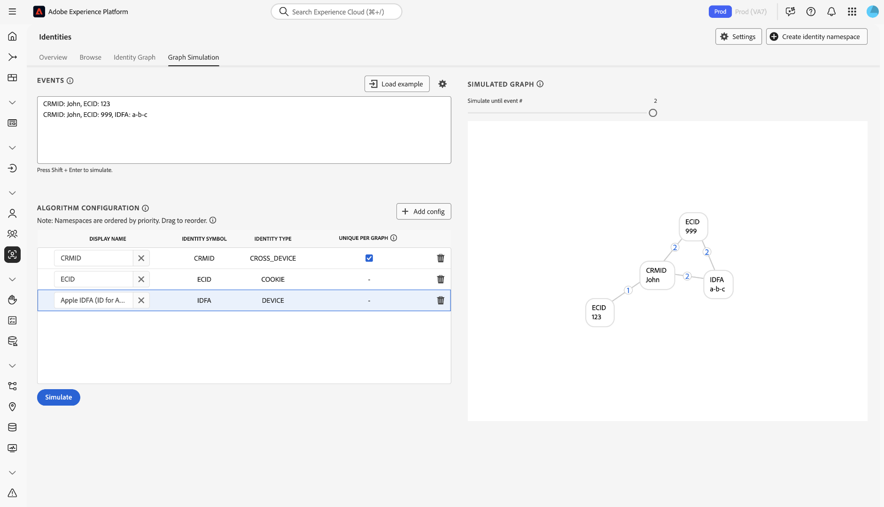

**演習**

Graph Simulationで次の設定をシミュレーションします。 独自のイベントを作成するか、テキストモードを使用してコピー&amp;ペーストできます。

>[!BEGINTABS]

>[!TAB 共有デバイス （PC） ]

**共有デバイス （PC）**

**テキストモード**

```json
CRMID: John, ECID: 111
CRMID: Jane, ECID: 111
```

**シミュレートされたグラフ**

このグラフでは、JohnとJaneはそれぞれのCRMIDで表されています。

* `{CRMID: John}`
* `{CRMID: Jane}`

両方がe コマースプラットフォームにアクセスするために使用するデスクトップコンピューター上のブラウザーは、`{ECID: 111}`で表されます。 このグラフのシナリオでは、Janeが最後に認証されたエンドユーザーであるため、`{ECID: 111}`と`{CRMID: John}`の間のリンクは削除されます。

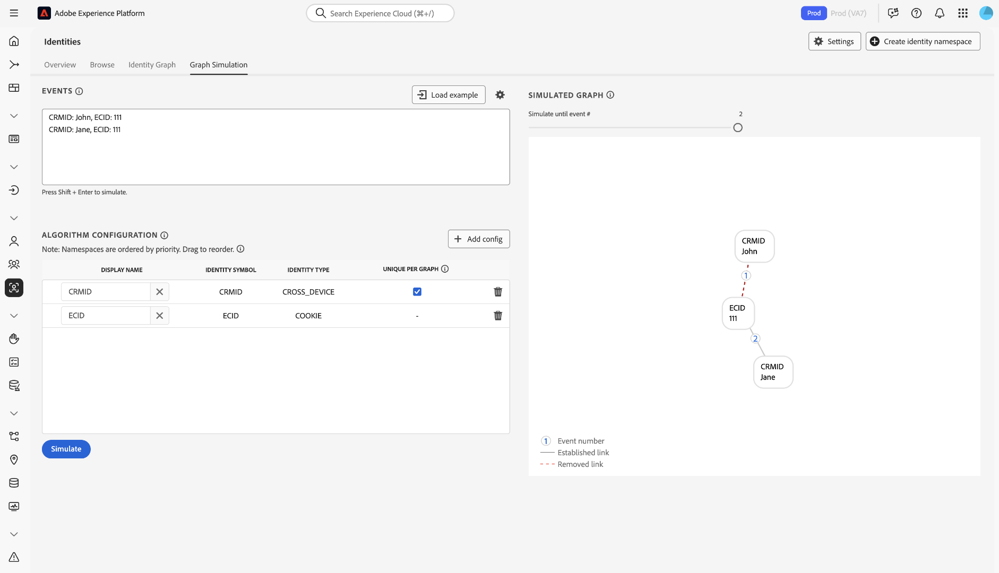

>[!TAB 共有デバイス （モバイル） ]

**共有デバイス （モバイル）**

**テキストモード**

```json
CRMID: John, ECID: 111, IDFA: a-b-c
CRMID: Jane, ECID: 111, IDFA: a-b-c
```

**シミュレートされたグラフ**

このグラフでは、JohnとJaneはそれぞれのCRMIDで表されています。 使用しているブラウザーは`{ECID: 111}`で表され、共有している[!DNL iPad]は`{IDFA: a-b-c}`で表されます。 このグラフのシナリオでは、Janeが最後に認証されたエンドユーザーであるため、`{ECID: 111}`および`{IDFA: a-b-c}`から`{CRMID: John}`までのリンクは削除されます。

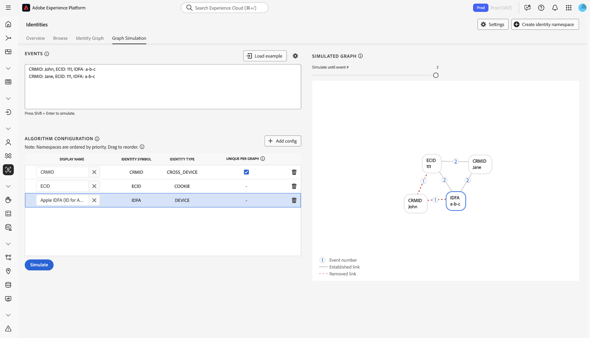

>[!ENDTABS]

## 中間実装 {#intermediate-implementations}

>[!TIP]
>
>**一意でないID**&#x200B;は、一意でない名前空間に関連付けられたIDです。

[!DNL Identity Graph Linking Rules]の中間実装については、この節を参照してください。

### ユースケース：データに一意でないIDが含まれている

>[!NOTE]
>
>以下の実装を完了するには、次のID記号（大文字と小文字を区別）を使用して次のカスタム名前空間を作成する必要があります。
>
>* `CRMID`
>* `CChash` （これは、ハッシュ化されたクレジットカード番号を表すカスタム名前空間です）

例えば、クレジットカードを発行する商業銀行で働くデータアーキテクトが、 マーケティング部門が、過去のクレジットカードの取引履歴をプロファイルに含めたいと回答しています。 このID グラフは次のようになります。

**テキストモード**

```json
CRMID: John, CChash: 1111-2222 
CRMID: John, CChash: 3333-4444 
CRMID: John, ECID: 123 
CRMID: John, ECID: 999, IDFA: a-b-c
```

**アルゴリズム設定（ID設定）**

グラフをシミュレートする前に、グラフシミュレーションインターフェイスで次の設定を行います。

| 表示名 | ID 記号 | ID タイプ | グラフごとに一意 | 名前空間の優先度 |
| --- | --- | --- | --- | --- |
| CRMID | CRMID | CROSS_DEVICE | ✔️ | 1 |
| ハッシュ | ハッシュ | CROSS_DEVICE | | 2 |
| ECID | ECID | COOKIE | | 3 |
| IDFA | IDFA | デバイス | | 4 |

**シミュレートされたグラフ**

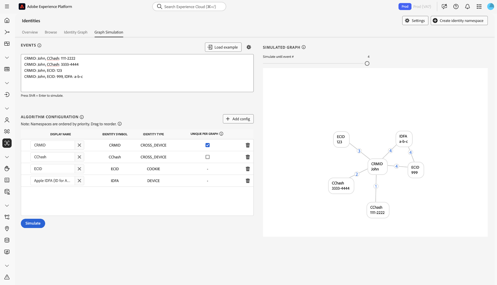

これらのクレジットカード番号やその他の一意でない名前空間が、常に1人のエンドユーザーに関連付けられる保証はありません。 2人のエンドユーザーが同じクレジットカードで登録する場合がありますが、誤って取り込まれた一意でないプレースホルダー値が存在する場合があります。 簡単に言えば、一意でない名前空間がグラフの折りたたみを引き起こさない保証はありません。

この問題を解決するために、ID サービスは最も古いリンクを削除し、最新のリンクを保持します。 これにより、グラフ内に1つのCRMIDだけが存在し、グラフの折りたたみを防ぐことができます。

**演習**

Graph Simulationで次の設定をシミュレーションします。 独自のイベントを作成するか、テキストモードを使用してコピー&amp;ペーストできます。

>[!BEGINTABS]

>[!TAB 共有デバイス ]

**テキストモード**

```json
CRMID: John, CChash: 1111-2222
CRMID: Jane, CChash: 3333-4444
CRMID: John, ECID: 123
CRMID: Jane, ECID:123
```

**シミュレートされたグラフ**

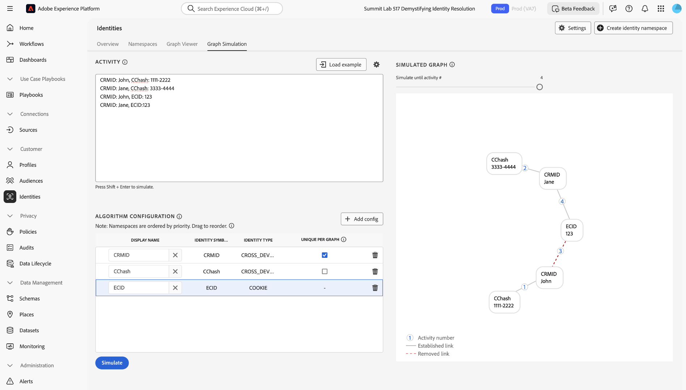

>[!TAB 同じクレジットカードを持つ2人のエンドユーザー]

同じクレジットカードで、2人の異なるエンドユーザーがe コマースサイトに登録します。 マーケティング部門は、クレジットカードがたった1つのプロファイルに関連付けられるようにすることで、グラフが折りたたまれるのを防ぎたいと考えています。

**テキストモード**

```json
CRMID: John, CChash: 1111-2222
CRMID: Jane, CChash: 1111-2222
CRMID: John, ECID: 123
CRMID: Jane, ECID:456
```

**シミュレートされたグラフ**

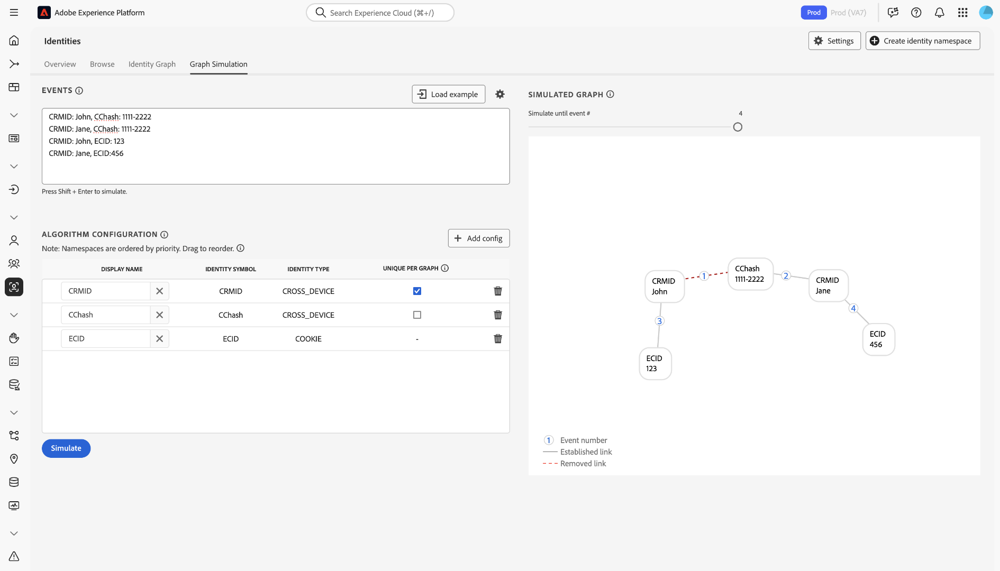

>[!TAB 無効なクレジットカード番号]

データがクリーンではないため、無効なクレジットカード番号がExperience Platformに取り込まれます。

**テキストモード**

```json
CRMID: John, CChash: undefined
CRMID: Jane, CChash: undefined
CRMID: Jack, CChash: undefined
CRMID: Jill, CChash: undefined
```

**シミュレートされたグラフ**

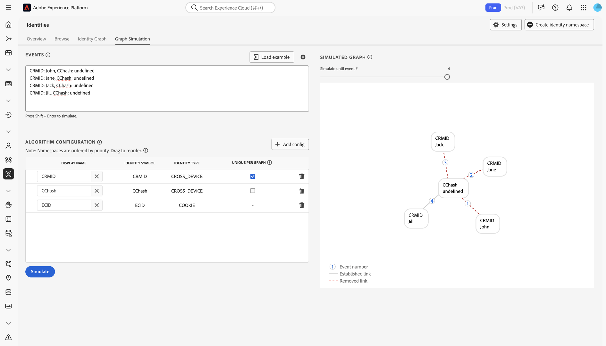

>[!ENDTABS]

### ユースケース：データには、ハッシュ化されたCRMIDとハッシュ化されていないCRMIDの両方が含まれます

>[!NOTE]
>
>以下の実装を完了するには、次のID記号（大文字と小文字を区別）を使用してカスタム名前空間を作成する必要があります。
>
>* `CRMID`
>* `CRMIDhash`

ハッシュ化されていない（オフライン） CRMIDとハッシュ化された（オンライン） CRMIDの両方を取り込みます。 ハッシュ化されていないCRMIDとハッシュ化されたCRMIDの両方に直接的な関係があることが期待されます。 エンドユーザーが認証済みアカウントで閲覧すると、ハッシュ化されたCRMIDがデバイス ID （ID サービスでECIDとして表されます）と共に送信されます。

**アルゴリズム設定（ID設定）**

グラフをシミュレートする前に、グラフシミュレーションインターフェイスで次の設定を行います。

| 表示名 | ID 記号 | ID タイプ | グラフごとに一意 | 名前空間の優先度 |
| --- | --- | --- | --- | --- |
| CRMID | CRMID | CROSS_DEVICE | ✔️ | 1 |
| CRMIDhash | CRMIDhash | CROSS_DEVICE | ✔️ | 2 |
| ECID | ECID | COOKIE | | 3 |


**演習**

Graph Simulationで次の設定をシミュレーションします。 独自のイベントを作成するか、テキストモードを使用してコピー&amp;ペーストできます。

>[!BEGINTABS]

>[!TAB 共有デバイス ]

JohnとJaneはデバイスを共有しています。

**テキストモード**

```json
CRMID: John, CRMIDhash: John
CRMID: Jane, CRMIDhash: Jane
CRMIDhash: John, ECID: 111 
CRMIDhash: Jane, ECID: 111
```

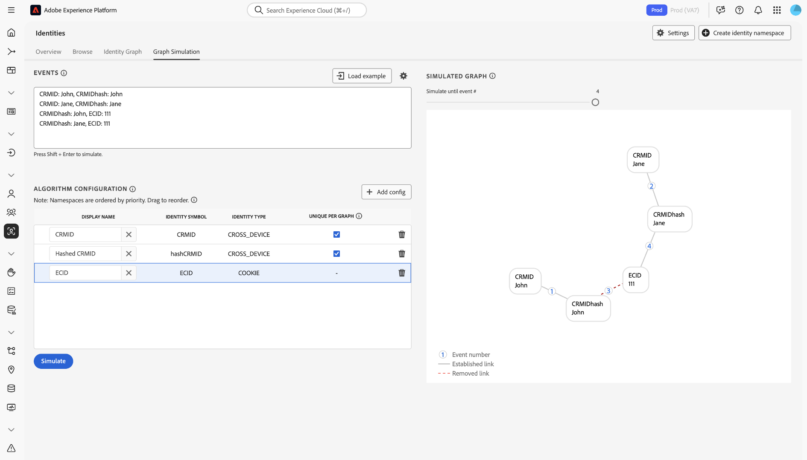を含む共有デバイスグラフ

>[!TAB 不正なデータ ]

ハッシュプロセスのエラーにより、一意でないハッシュ化されたCRMIDが生成され、ID サービスに送信されます。

**テキストモード**

```json
CRMID: John, CRMIDhash: aaaa
CRMID: Jane, CRMIDhash: aaaa
```

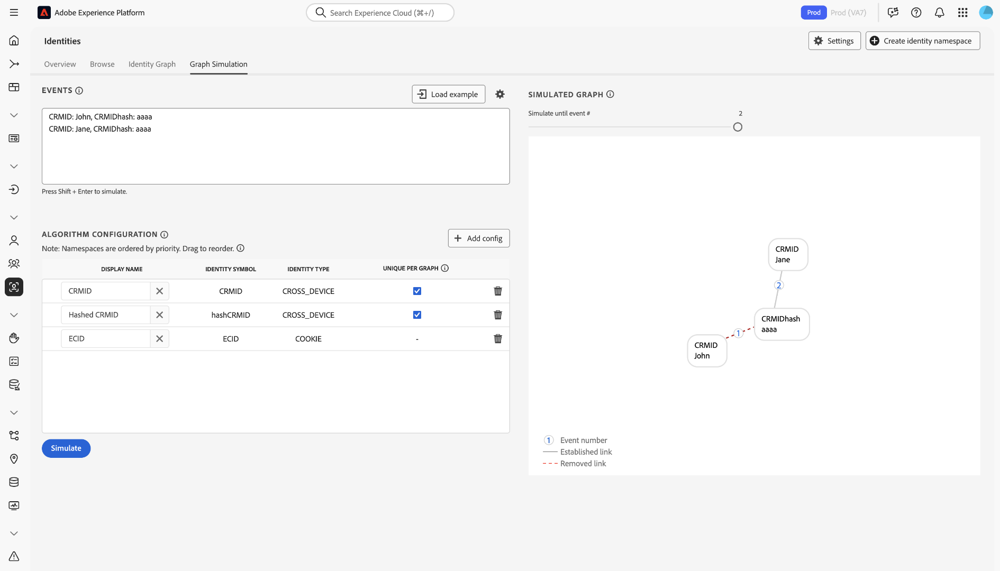

>[!ENDTABS]

<!-- 
### Use case: You are using Real-Time CDP and Adobe Commerce

You have two types of end-users:

* **Members**: An end-user who is assigned a CRMID and has an email account registered to your system.
* **Guests**: An end-user who is not a member. They do not have an assigned CRMID and their email accounts are not registered to your system.

In this scenario, your customers are sending data from Adobe Commerce to Real-Time CDP.

**Exercise**

Simulate the following configurations in the graph simulation tool. You can either create your own events, or copy and paste using text mode.

>[!BEGINTABS]

>[!TAB Shared device between two members]

In this scenario, two members share the same device to browse an e-commerce website.

**Text mode**

```json
CRMID: John, Email: john@g
CRMID: Jane, Email: jane@g
CRMID: John, ECID: 111
CRMID: Jane, ECID: 111
```

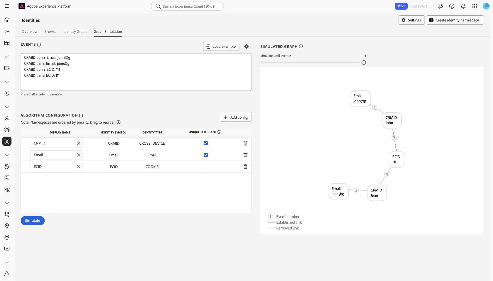

>[!TAB Shared device between two guests]

In this scenario, two guests share the same device to browse an e-commerce website.

**Text mode**

```json
Email: john@g, ECID: 111
Email: jane@g, ECID: 111
```

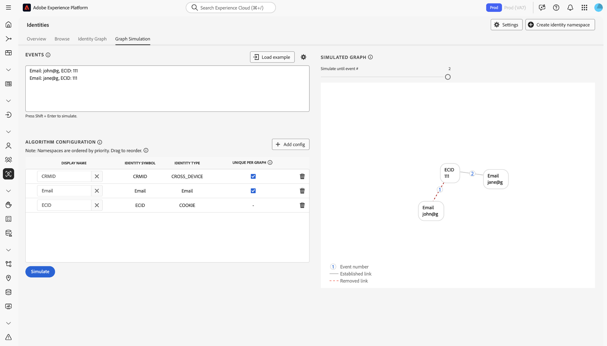

>[!TAB Shared device between a member and a guest]

In this scenario, a member and a guest share the same device to browse an e-commerce website.

**Text mode**

```json
CRMID: John, Email: john@g
CRMID: John, ECID: 111
Email: jane@g, ECID: 111
```

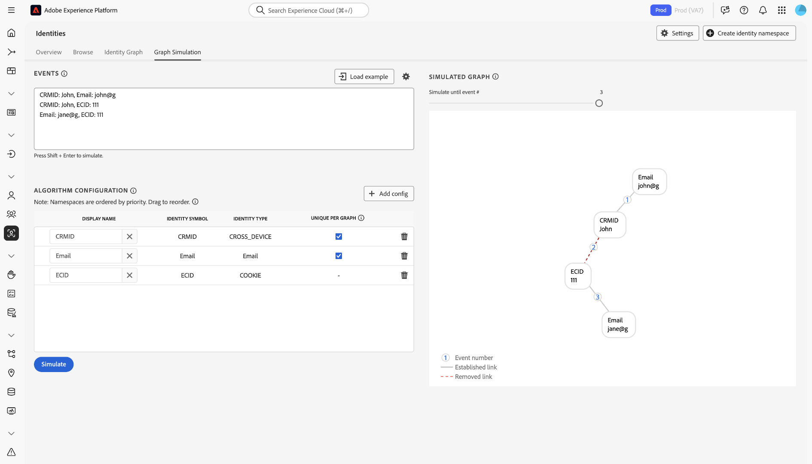

>[!ENDTABS] 
-->

### ユースケース：データには3つの一意の名前空間が含まれています

>[!NOTE]
>
>以下の実装を完了するには、次のID記号（大文字と小文字を区別）を持つカスタム名前空間を作成する必要があります：`CRMID`。

お客様は、単一の人物エンティティを次のように定義します。

* 割り当てられたCRMIDを持つエンドユーザー
* ハッシュ化された電子メールアドレスに関連付けられているエンドユーザー。これにより、ハッシュ化された電子メールをサポートする宛先（例：[!DNL Facebook]）にプロファイルをアクティブ化できます。
* メールアドレスに関連付けられたエンドユーザー。これにより、サポート担当者は、そのメールアドレスを使用してReal-Time CDPでプロファイルを検索できます。

| 表示名 | ID 記号 | ID タイプ | グラフごとに一意 | 名前空間の優先度 |
| --- | --- | --- | --- | --- |
| CRMID | CRMID | CROSS_DEVICE | ✔️ | 1 |
| メール | メール | メール | ✔️ | 2 |
| Email_LC_SHA256 | Email_LC_SHA256 | メール | ✔️ | 3 |
| ECID | ECID | COOKIE | | 4 |

グラフシミュレーションツールで次の設定をシミュレーションします。 独自のイベントを作成するか、テキストモードを使用してコピー&amp;ペーストできます。

>[!BEGINTABS]

>[!TAB 共有デバイス ]

このシナリオでは、JohnとJaneの両方がe コマースサイトにログインします。

**テキストモード**

```json
CRMID: John, Email: john@g, Email_LC_SHA256: john_hash 
CRMID: Jane, Email: jane@g, Email_LC_SHA256: jane_hash 
CRMID: John, ECID: 111 
CRMID: Jane, ECID: 111
```

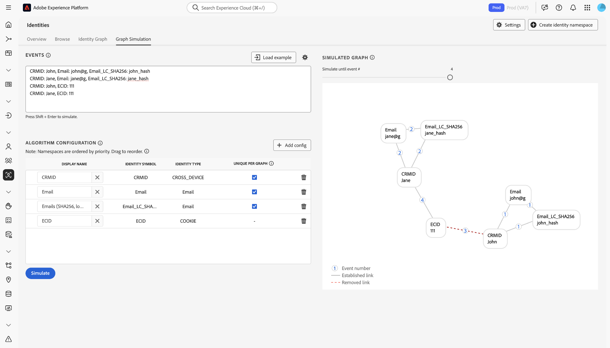

>[!TAB  エンドユーザーが電子メールを変更]

**テキストモード**

```json
CRMID: John, Email: john@g, Email_LC_SHA256: john_hash
CRMID: John, Email: john@y, Email_LC_SHA256: john_y_hash
```

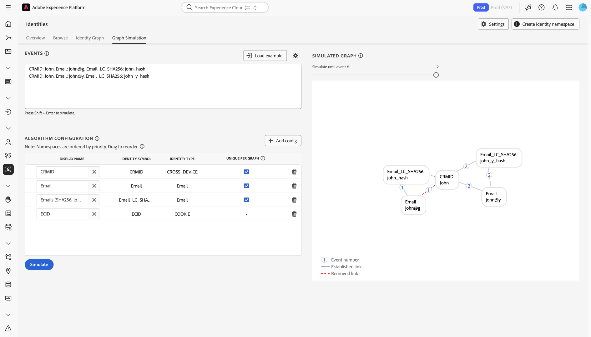

>[!ENDTABS]

## 高度な実装 {#advanced-implementations}

高度な実装では、複雑で多層のグラフシナリオが必要です。 これらの実装では、グラフの折りたたみを防ぐために削除する必要がある正しいリンクを特定するために、**名前空間優先度**&#x200B;を使用します。

**名前空間の優先度**&#x200B;は、名前空間を重要度でランク付けするメタデータです。 グラフに2つのIDが含まれ、それぞれに異なる一意の名前空間がある場合、Identity Serviceは名前空間の優先度を使用して、削除するリンクを決定します。 詳しくは、名前空間の優先度[に関する](../identity-graph-linking-rules/namespace-priority.md) ドキュメントを参照してください。

名前空間の優先度は、複雑なグラフのシナリオにおいて重要な役割を果たします。 グラフには複数のレイヤーを含めることができます。エンドユーザーは複数のログイン IDに関連付けることができ、これらのログイン IDはハッシュ化することができます。 さらに、異なるECIDを異なるログイン IDにリンクすることもできます。 適切なリンクを適切なレイヤーで削除するには、名前空間の優先度設定が正しい必要があります。

[!DNL Identity Graph Linking Rules]の高度な実装については、この節を参照してください。

### ユースケース：複数の事業部門へのサポートが必要

>[!NOTE]
>
>以下の実装を完了するには、次のID記号（大文字と小文字を区別）を使用してカスタム名前空間を作成する必要があります。
>
>* `CRMID`
>* `loginID`

エンドユーザーには、個人アカウントとビジネスアカウントの2つの異なるアカウントがあります。 各アカウントは異なるIDで識別されます。 このシナリオでは、一般的なグラフは次のようになります。

**テキストモード**

```json
CRMID: John, loginID: JohnPersonal
CRMID: John, loginID: JohnBusiness
loginID: JohnPersonal, ECID: 111
loginID: JohnPersonal, ECID: 222
loginID: JohnBusiness, ECID: 222
```

**アルゴリズム設定（ID設定）**

グラフをシミュレートする前に、グラフシミュレーションインターフェイスで次の設定を行います。

| 表示名 | ID 記号 | ID タイプ | グラフごとに一意 | 名前空間の優先度 |
| --- | --- | --- | --- | --- |
| CRMID | CRMID | CROSS_DEVICE | ✔️ | 1 |
| loginID | loginID | CROSS_DEVICE | | 2 |
| ECID | ECID | COOKIE | | 3 |

**シミュレートされたグラフ**

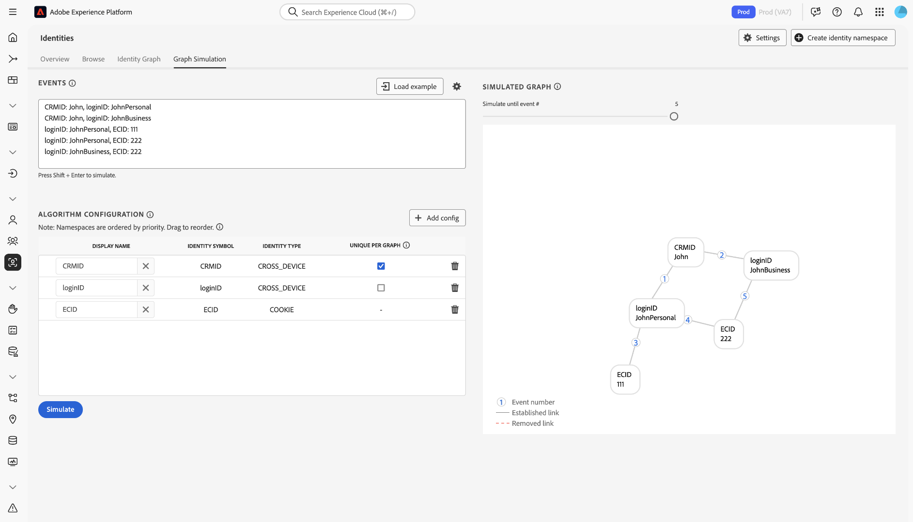

**演習**

Graph Simulationで次の設定をシミュレーションします。 独自のイベントを作成するか、テキストモードを使用してコピー&amp;ペーストできます。

>[!BEGINTABS]

>[!TAB 共有デバイス ]

**テキストモード**

```json
CRMID: John, loginID: JohnPersonal
CRMID: John, loginID: JohnBusiness
CRMID: Jane, loginID: JanePersonal
CRMID: Jane, loginID: JaneBusiness
loginID: JohnPersonal, ECID: 111
loginID: JanePersonal, ECID: 111
```

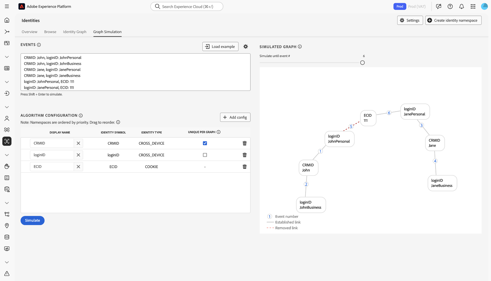

>[!TAB 不正なデータがReal-Time CDPに送信されました]

**テキストモード**

```json
CRMID: John, loginID: JohnPersonal
CRMID: John, loginID: error
CRMID: Jane, loginID: JanePersonal
CRMID: Jane, loginID: error
loginID: JohnPersonal, ECID: 111
loginID: JanePersonal, ECID: 222
```

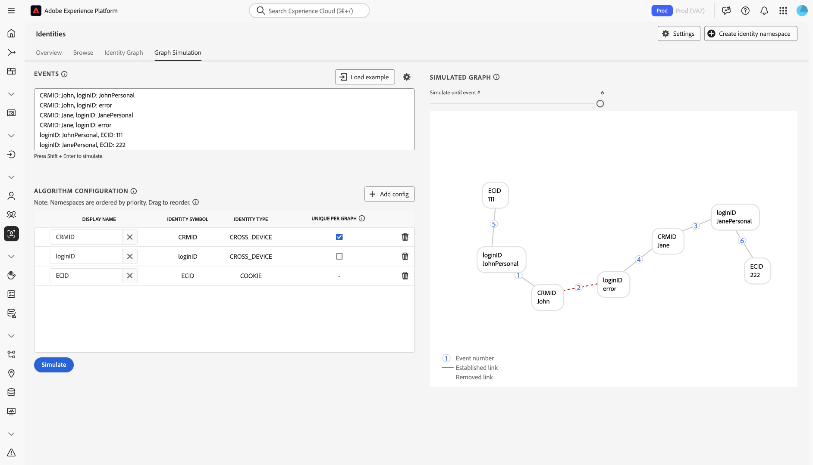

>[!ENDTABS]

### ユースケース：複数の名前空間を必要とする複雑な実装があります

>[!NOTE]
>
>以下の実装を完了するには、次のID記号（大文字と小文字を区別）を使用してカスタム名前空間を作成する必要があります。
>
>* `CRMID`
>* `loyaltyID`
>* `thirdPartyID`
>* `orderID`

あなたはメディア&amp;エンターテインメント企業であり、エンドユーザーは次の情報を持っています。

* CRMID
* ロイヤルティ ID

さらに、エンドユーザーはe コマースサイトで購入することができ、このデータはメールアドレスに関連付けられています。 ユーザーデータは、サードパーティのデータベースプロバイダーによっても強化され、Experience Platformに一括送信されます。

**テキストモード**

```json
CRMID: John, loyaltyID: John, Email: john@g
Email: john@g, orderID: aaa
CRMID: John, thirdPartyID: xyz
CRMID: John, ECID: 111
```

**アルゴリズム設定（ID設定）**

グラフをシミュレートする前に、グラフシミュレーションインターフェイスで次の設定を行います。

| 表示名 | ID 記号 | ID タイプ | グラフごとに一意 | 名前空間の優先度 |
| --- | --- | --- | --- | --- |
| CRMID | CRMID | CROSS_DEVICE | ✔️ | 1 |
| loyaltyID | loyaltyID | CROSS_DEVICE | ✔️ | 2 |
| メール | メール | メール | ✔️ | 3 |
| thirdPartyID | thirdPartyID | CROSS_DEVICE | | 4 |
| orderID | orderID | CROSS_DEVICE | | 5 |
| ECID | ECID | COOKIE | | 6 |

**演習**

Graph Simulationで次の設定をシミュレーションします。 独自のイベントを作成するか、テキストモードを使用してコピー&amp;ペーストできます。

>[!BEGINTABS]

>[!TAB 共有デバイス ]

**テキストモード**

```json
CRMID: John, loyaltyID: John, Email: john@g
CRMID: Jane, loyaltyID: Jane, Email: jane@g
Email: john@g, orderID: aaa 
CRMID: John, thirdPartyID: xyz 
CRMID: John, ECID: 111
CRMID: Jane, ECID: 111
```

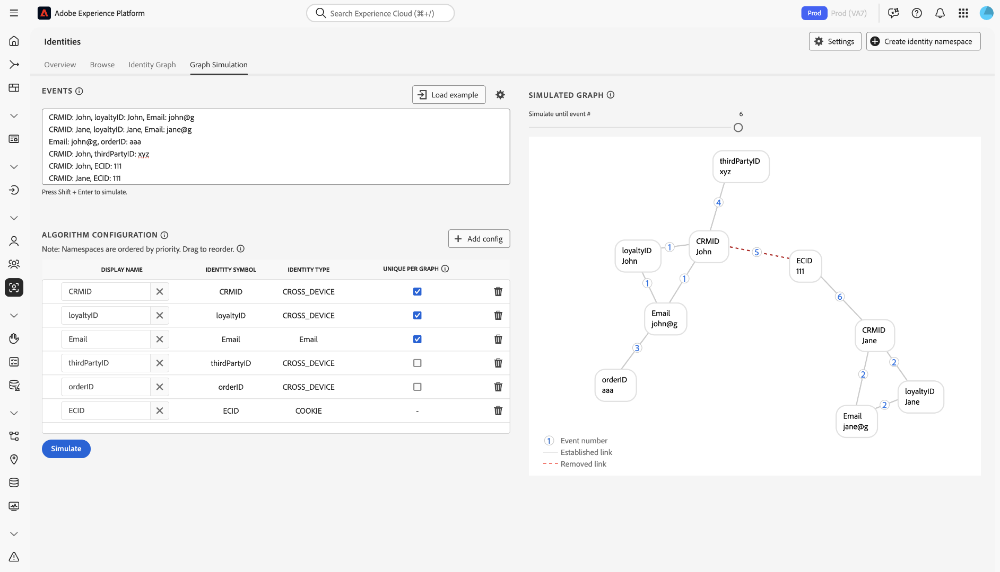

>[!TAB  エンドユーザーがメールアドレスを変更]

**テキストモード**

```json
CRMID: John, loyaltyID: John, Email: john@g
CRMID: John, loyaltyID: John, Email: john@y
```

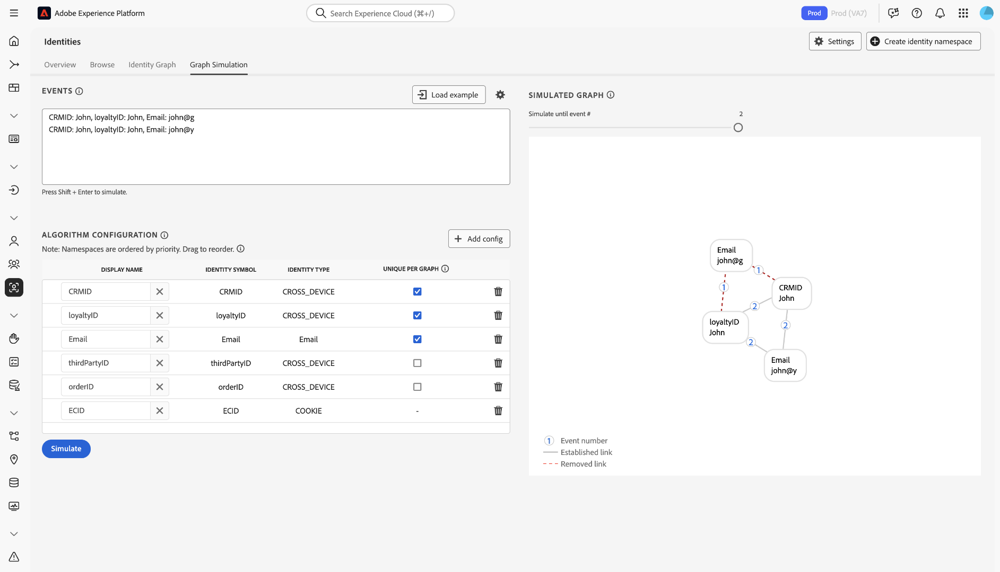

>[!TAB  サードパーティ IDの関連付けが変更されます]

**テキストモード**

```json
CRMID: John, loyaltyID: John, Email: john@g
CRMID: Jane, loyaltyID: Jane, Email: jane@g
CRMID: John, thirdPartyID: xyz
CRMID: Jane, thirdPartyID: xyz
```

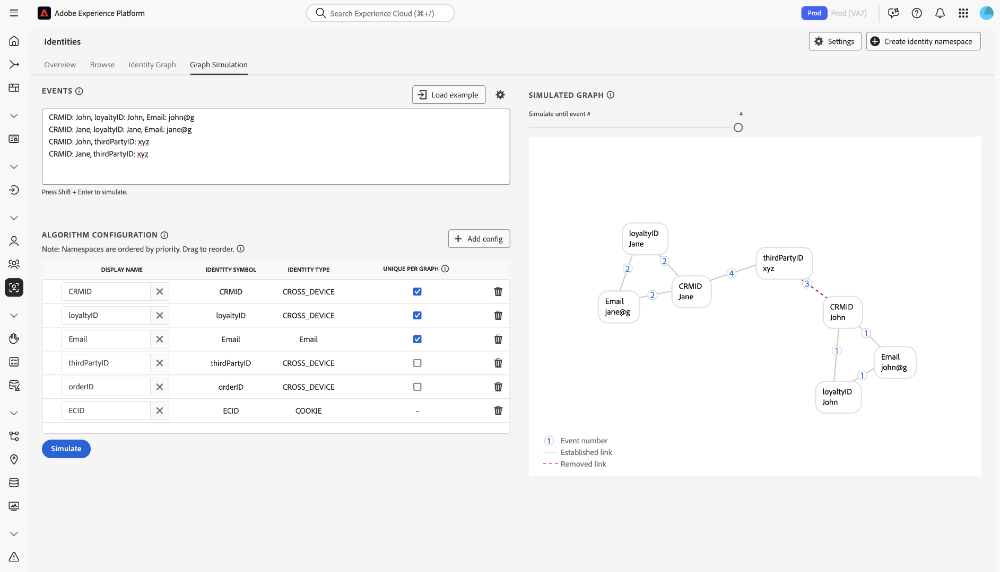

>[!TAB 一意でないorderID]

**テキストモード**

```json
CRMID: John, loyaltyID: John, Email: john@g
CRMID: Jane, loyaltyID: Jane, Email: jane@g
Email: john@g, orderID: aaa
Email: jane@g, orderID: aaa
```

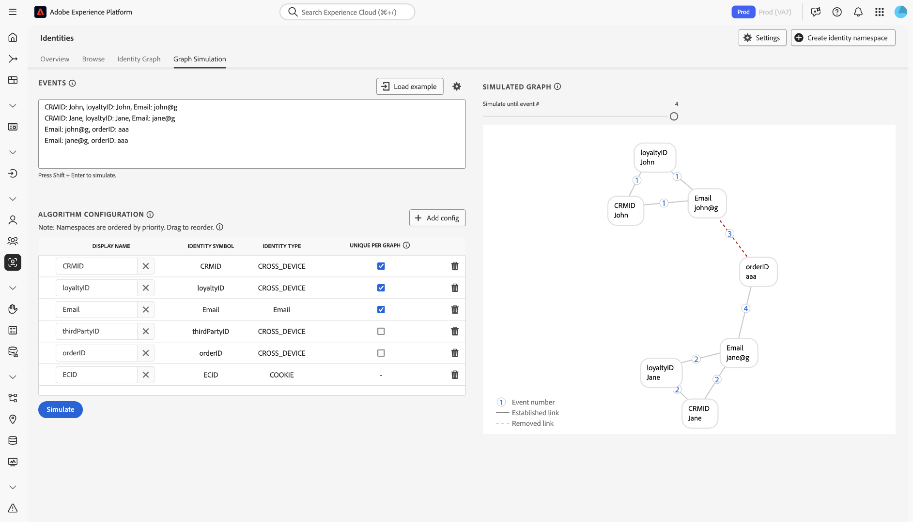

>[!TAB 間違ったロイヤルティ ID]

**テキストモード**

```json
CRMID: John, loyaltyID: aaa, Email: john@g
CRMID: Jane, loyaltyID: aaa, Email: jane@g
```

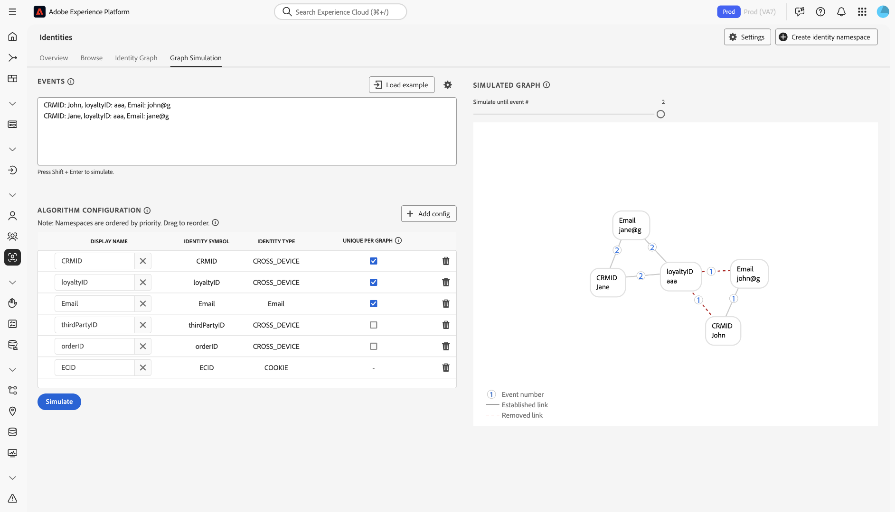

>[!ENDTABS]

## 次の手順

[!DNL Identity Graph Linking Rules]について詳しくは、次のドキュメントを参照してください。

* [[!DNL Identity Graph Linking Rules] の概要](./overview.md)
* [ID 最適化アルゴリズム](./identity-optimization-algorithm.md)
* [実装ガイド](./implementation-guide.md)
* [トラブルシューティングとFAQ](./troubleshooting.md)
* [名前空間の優先度](./namespace-priority.md)
* [グラフシミュレーション UI](./graph-simulation.md)
* [ID設定UI](./identity-settings-ui.md)